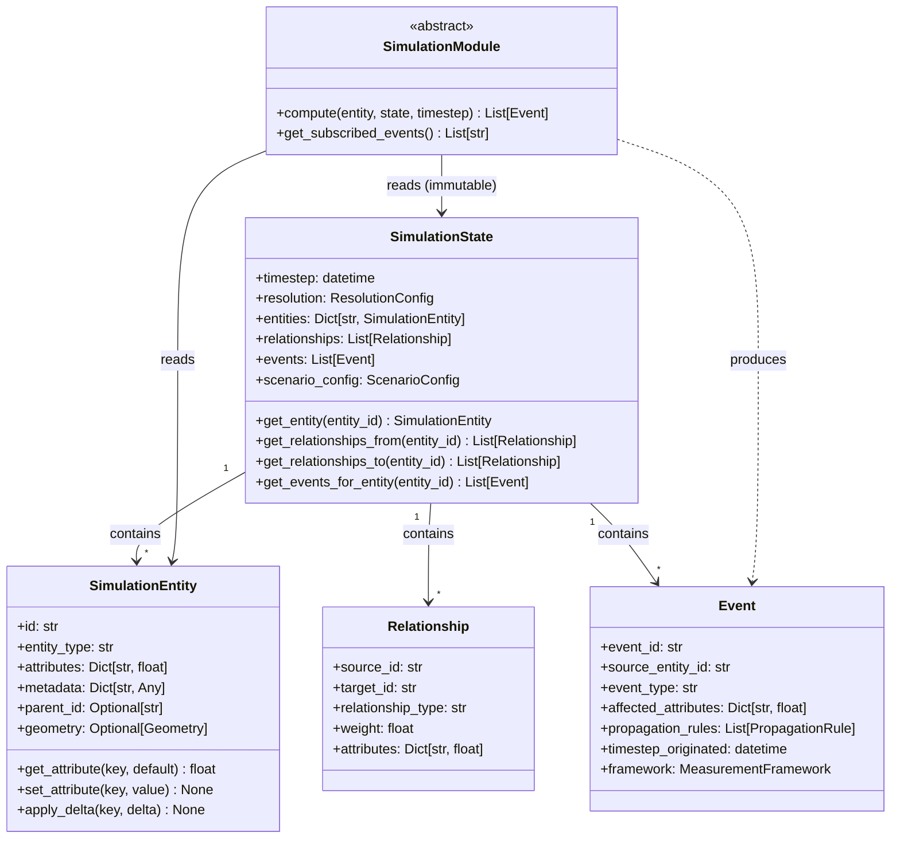

# WorldSim Coding Standards

These standards exist because WorldSim connects physical quantities, economic
variables, institutional indicators, and human welfare outcomes across dozens
of source conventions, in scenarios affecting decisions with generational
consequences. A unit error, a silent exception, or an accumulation of float
rounding across ten thousand simulation steps produces a plausible-looking
wrong output that survives code review and misleads a finance minister.

Read every section as operational contract, not style preference.

---

## Python Code Style

### Linting and Formatting: Ruff

All Python code is linted and formatted with [Ruff](https://docs.astral.sh/ruff/).
No exceptions, no per-file disables without a comment explaining why.

Add the following to `backend/pyproject.toml` (create if absent):

```toml
[tool.ruff]
target-version = "py312"
line-length = 100

[tool.ruff.lint]
select = [
    "E",    # pycodestyle errors
    "W",    # pycodestyle warnings
    "F",    # Pyflakes
    "I",    # isort
    "B",    # flake8-bugbear
    "C4",   # flake8-comprehensions
    "UP",   # pyupgrade
    "ANN",  # flake8-annotations (type hints)
    "S",    # flake8-bandit (security)
    "RET",  # flake8-return
    "SIM",  # flake8-simplify
    "TCH",  # flake8-type-checking
]
ignore = [
    "ANN101",  # missing type for self
    "ANN102",  # missing type for cls
]

[tool.ruff.lint.per-file-ignores]
"tests/**/*.py" = ["S101"]  # allow assert in tests

[tool.ruff.format]
quote-style = "double"
indent-style = "space"
```

Run before every commit:

```bash
ruff check backend/
ruff format backend/
```

CI enforces both. A lint failure is a build failure.

### Type Hints

Type hints are mandatory on every function signature and every class attribute.
No exceptions.

```python
# Correct
def compute_debt_service_ratio(
    total_debt: Decimal,
    annual_export_revenue: Decimal,
) -> Decimal:
    ...

# Forbidden — no return type, no parameter types
def compute_debt_service_ratio(total_debt, annual_export_revenue):
    ...
```

`Optional[T]` must be written explicitly — do not rely on default `None` to
imply optionality. As of Python 3.10, prefer `T | None` syntax.

`Any` requires a comment explaining why the type cannot be narrowed.

Generics must be fully specified: `Dict[str, float]` not `dict`, `List[Event]`
not `list`.

Run `mypy backend/app/` in CI. Type errors are build failures.

### Docstrings: Google Style

Every public module, class, and function has a docstring. The docstring answers
three questions: what this does, what the parameters mean, and what it returns.
It does not restate what the code obviously does.

```python
def apply_fiscal_multiplier(
    spending_delta: Decimal,
    multiplier: Decimal,
    regime: FiscalRegime,
) -> Decimal:
    """Apply a regime-dependent fiscal multiplier to a spending change.

    The multiplier inverts sign in depressed demand regimes — austerity
    can reduce output more than it reduces debt. This is the backside of
    the power curve in fiscal policy. Regime selection is the caller's
    responsibility; this function applies the multiplier as given.

    Args:
        spending_delta: Change in government spending in canonical units
            (constant 2015 USD). Positive is expansion, negative is
            contraction.
        multiplier: The regime-appropriate multiplier. Must be computed
            by the FiscalModule, not hardcoded by callers.
        regime: Current fiscal regime classification affecting multiplier sign.

    Returns:
        Change in GDP in canonical units (constant 2015 USD).
    """
    ...
```

Private functions (prefixed `_`) should have docstrings where the logic is
non-obvious. Trivial private helpers do not require them.

### Exception Handling

No bare `except` clauses. No `except Exception` without re-raising or explicit
logging. Silent exception swallowing is the hypoxia of debugging — the code
continues executing as if nothing happened, producing wrong outputs without
any signal that something went wrong.

```python
# Forbidden — silently swallows all errors
try:
    rate = exchange_rate_service.get_rate(source, target, date)
except:
    rate = 1.0

# Forbidden — catches everything, produces meaningless log
try:
    rate = exchange_rate_service.get_rate(source, target, date)
except Exception:
    logger.error("Exchange rate lookup failed")
    rate = 1.0

# Correct — specific exception, explicit handling, logged with context
try:
    rate = exchange_rate_service.get_rate(source, target, date)
except ExchangeRateNotFoundError as exc:
    logger.warning(
        "Exchange rate unavailable for %s/%s on %s, using fallback",
        source, target, date, exc_info=exc
    )
    rate = exchange_rate_service.get_fallback_rate(source, target, date)
```

Custom exception types live in `backend/app/exceptions.py`. Every module that
can produce distinct failure modes defines its own exception subclass.

### Monetary Arithmetic: `Decimal`, Never `float`

All monetary arithmetic uses Python's `decimal.Decimal`. Never `float`.

**Rationale.** Float arithmetic is approximate by design. `0.1 + 0.2` in
float is `0.30000000000000004`. In a single calculation this error is
negligible. In a simulation that compounds interest, applies multipliers,
converts currencies, aggregates across cohorts, and runs for fifty annual
timesteps, float rounding errors accumulate across thousands of operations
and produce outputs that look plausible but are wrong. The error is invisible —
there is no flag, no warning, no signal — only a result that differs from the
correct answer by an amount too small to trigger alarm but large enough to
matter in a fiscal sustainability assessment.

The Mars Climate Orbiter was lost because of an imperial/metric unit error
that produced plausible-looking wrong values. WorldSim simulations may inform
decisions about whether a country should accept an IMF program. The bar for
correctness is the same.

```python
from decimal import Decimal, getcontext

# Set precision globally at application startup
getcontext().prec = 28

# Correct
debt_gdp_ratio = Decimal("1.46")
interest_payment = principal * Decimal("0.025")

# Forbidden — float monetary arithmetic
debt_gdp_ratio = 1.46
interest_payment = principal * 0.025
```

The `MonetaryValue` and `Quantity` types defined in `DATA_STANDARDS.md` enforce
this at the type level. Do not bypass them with raw `Decimal` arithmetic except
inside those types' own implementations.

---

## Naming Conventions

### Files

- Python modules: `snake_case.py`
- Test files: `test_<module_name>.py` mirroring the module structure
- ADRs: `ADR-NNN-short-descriptive-title.md`
- Diagrams: `ADR-NNN-diagram-type.mmd` (e.g., `ADR-001-class-diagram.mmd`)
- Configuration files: `snake_case.toml` or `snake_case.yaml`

### Classes

`PascalCase`. Name classes after what they represent, not what they do:
`SimulationEntity` not `EntityManager`. `FiscalMultiplier` not
`FiscalMultiplierCalculator`.

Abstract base classes are prefixed with nothing — do not use `Abstract` or
`Base` prefixes. The `ABC` inheritance and abstract methods make the nature
clear.

### Functions and Methods

`snake_case`. Verb phrases for functions that do something:
`compute_debt_service_ratio`, `apply_fiscal_multiplier`, `get_exchange_rate`.

Boolean-returning functions use `is_`, `has_`, or `can_` prefix:
`is_in_crisis`, `has_sufficient_reserves`, `can_service_debt`.

### Variables

`snake_case`. Names must be descriptive. Single-letter variables are forbidden
outside comprehensions and mathematical proofs where convention is established.

```python
# Forbidden
d = Decimal("1.46")
r = get_rate("USD", "GHS", date)

# Correct
debt_gdp_ratio = Decimal("1.46")
usd_to_ghs_rate = get_exchange_rate("USD", "GHS", date)
```

### Constants

`SCREAMING_SNAKE_CASE` at module level:

```python
CANONICAL_CURRENCY = "USD"
CANONICAL_BASE_YEAR = 2015
MINIMUM_RESERVE_THRESHOLD_MONTHS = Decimal("3")
```

### Test Functions

Test functions follow the pattern `test_[what it does]_[under what condition]`.
This makes the test suite readable as documentation.

```python
# Correct — readable as a sentence describing expected behavior
def test_apply_delta_initialises_missing_key_at_zero():
def test_get_exchange_rate_raises_when_date_before_series_start():
def test_fiscal_multiplier_inverts_sign_in_depressed_demand_regime():
def test_human_cost_ledger_produces_nonzero_values_for_austerity_shock():

# Forbidden — opaque identifiers
def test_apply_delta_1():
def test_exchange_rate():
def test_fiscal():
```

---

## Testing Requirements

A feature is not done until:
1. All tests pass
2. The backtesting suite still passes
3. Human cost ledger outputs are verified for the affected code path

### Unit Tests (`tests/unit/`)

**Scope:** Test one unit of logic in isolation. No database. No network.
No filesystem. No subprocess. No sleep.

**Speed:** The entire unit test suite must complete in under 30 seconds.
Slow unit tests are a sign that a unit test is doing integration work.

**Requirements per public method:**
- At least one test for the happy path
- At least one test for each distinct error condition
- At least one test for boundary values
- No internal implementation details tested — test the contract, not the wiring

**Fixtures:** Use `conftest.py` for shared fixtures. Fixtures should be minimal
— construct only the state the test actually needs.

**Mocking:** Mock only at the boundary of the unit under test. Do not mock
internal collaborators — if you are mocking internals, the unit is too large
or the architecture needs rethinking.

### Integration Tests (`tests/integration/`)

**Scope:** Test interactions between modules, between the application layer
and the database, or between the API and the simulation engine.

**Requirements:**
- Each integration test documents which modules it exercises in a module-level
  docstring
- Database integration tests use a dedicated test schema, not the development
  database
- Network calls are permitted only to local services (test database, local
  Redis)
- External API calls are always mocked at the integration boundary with
  responses recorded from real calls

### Backtesting Tests (`tests/backtesting/`)

**Scope:** Run the simulation forward from a historical baseline, inject known
events, and compare outputs against the historical record.

**Requirements per backtesting case:**
- Data source cited with version and access date — not just "World Bank" but
  which dataset, which release
- Fidelity threshold specified — not "outputs should match history" but
  "GDP growth rate within ±1.5 percentage points, debt-to-GDP ratio within
  ±3 percentage points for each year of the scenario"
- Failure mode documented — which of the five aviation failure modes
  (Spin, Coffin Corner, Hypoxia, Backside of power curve, Get-there-itis)
  this case tests, and the historical manifestation
- Vintage dating verified — only data published before the scenario start date
  may be used as seed data
- A backtesting regression is treated as a build failure — a change that makes
  historical cases less accurate must be justified and documented, not quietly
  accepted

Backtesting cases currently planned: Greece 2010-2015 (Coffin Corner),
Thailand 1997 (Coffin Corner), Lebanon 2019-2021 (Spin), Argentina
2001-2002 (Spin + currency crisis). Each will be added as a separate
GitHub Issue using the backtesting issue template.

### Human Cost Ledger Testing

Any code path that affects simulation outputs must include explicit tests
that the human cost ledger produces meaningful values — not just that the
fields exist and are non-null, but that they respond correctly to the
inputs that drive them.

```python
# Insufficient — only tests existence
def test_austerity_shock_produces_human_cost_output():
    result = run_scenario(austerity_shock)
    assert result.human_cost is not None

# Required — tests that the output is meaningful
def test_austerity_shock_increases_poverty_headcount():
    baseline = run_scenario(baseline_scenario)
    austerity = run_scenario(austerity_shock)
    assert austerity.human_cost.poverty_headcount > baseline.human_cost.poverty_headcount

def test_austerity_shock_human_cost_scales_with_shock_magnitude():
    small_cut = run_scenario(spending_cut_5pct)
    large_cut = run_scenario(spending_cut_20pct)
    assert large_cut.human_cost.poverty_headcount > small_cut.human_cost.poverty_headcount
```

The human cost ledger is never a footnote. Its test coverage reflects this.

---

## Diagram Standards

### Format: Mermaid

All architecture diagrams use [Mermaid](https://mermaid.js.org/). Mermaid is:
- Text-based: version-controlled alongside code, diffs are readable
- GitHub-native: renders automatically in GitHub markdown, no external tools
- Reviewable: diagram changes go through pull request review like code

Do not use draw.io, Lucidchart, PNG screenshots, or any binary diagram format.
A diagram that cannot be reviewed in a pull request is not a diagram — it is
an undocumented assertion.

### Location

Diagrams live in `docs/architecture/`. File naming:

```
docs/architecture/ADR-NNN-diagram-type.mmd
```

Examples:
```
docs/architecture/ADR-001-class-diagram.mmd
docs/architecture/ADR-002-schema-diagram.mmd
docs/architecture/ADR-003-sequence-event-propagation.mmd
```

### Every ADR Gets at Least One Diagram

An ADR without a diagram has not fully explained the decision. The diagram
forces precision — if you cannot draw the structure, you have not yet fully
understood it.

### Diagram Type by Use Case

| Subject | Diagram Type |
|---|---|
| Data models and class relationships | `classDiagram` |
| Request/event flows and module interactions | `sequenceDiagram` |
| Failure modes and regime transitions | `stateDiagram-v2` |
| System component relationships | `graph TD` or `graph LR` |
| Process flows and decision points | `flowchart TD` |

### Diagram Update Requirement

When a module interface changes, its diagram must be updated in the same
commit. A pull request that changes a class signature without updating the
diagram will not be merged. Diagrams are not optional documentation added
after the fact — they are part of the specification.

Example for ADR-001 class diagram (`docs/architecture/ADR-001-class-diagram.mmd`):



---

## Commit Message Format

WorldSim uses [Conventional Commits](https://www.conventionalcommits.org/).
Every commit message follows this format:

```
type(scope): short description in imperative mood

Optional body explaining why, not what. The diff shows what.
The commit message explains the reasoning.

Co-Authored-By: Claude Sonnet 4.6 <noreply@anthropic.com>  # if AI-assisted
```

### Types

| Type | When to Use |
|---|---|
| `feat` | New simulation capability, new API endpoint, new UI feature |
| `fix` | Bug fix — something was wrong and now it is right |
| `docs` | Documentation only — ADRs, standards, diagrams, comments |
| `test` | Adding or fixing tests with no production code change |
| `refactor` | Code change that neither fixes a bug nor adds a feature |
| `perf` | Performance improvement with no behavior change |
| `chore` | Dependency updates, CI configuration, tooling changes |

### Scope

Scope is the module or area affected: `engine`, `macroeconomic`, `api`,
`frontend`, `ci`, `data`, `adr`.

### Examples

```
feat(engine): implement annual timestep propagation loop

fix(macroeconomic): correct fiscal multiplier sign inversion in depressed regime

The multiplier was not inverting in the DEPRESSED_DEMAND regime because
the regime comparison used string equality on the enum value rather than
the enum member. Under austerity in a depressed economy, the simulation
was reporting GDP increases instead of the contraction the historical
record shows.

docs(adr): add ADR-002 PostGIS spatial data model

test(engine): add backtesting case for Greece 2010-2012 Coffin Corner

refactor(data): extract CalendarService from FiscalYearRegistry

perf(engine): pre-compute relationship adjacency lists at state initialization

chore(ci): pin Python to 3.12.x and add mypy strict mode
```

### Rationale

Conventional commits make the history readable as a project narrative. `git log
--oneline` tells the story of the codebase. They also enable automated
changelog generation and semantic version bumping when WorldSim reaches
release status.

---

## ADR Requirements

### When a New ADR Is Required

A new Architecture Decision Record is required when:

1. A new simulation module is introduced
2. A significant interface contract changes
3. A technology is added to the stack (new database, new library, new service)
4. A design alternative was seriously considered and rejected
5. A significant data model changes

If you are unsure whether an ADR is required, it is. Write it. The cost of
an unnecessary ADR is an hour of writing. The cost of building a significant
feature without architectural alignment is weeks of rework.

### Required Sections

```markdown
# ADR-NNN: Title

## Status
Proposed | Accepted | Deprecated | Superseded by ADR-NNN

## Date
YYYY-MM-DD

## Context
What problem are we solving? What constraints exist? Why is this decision
necessary now? Include relevant external context (economic, political, technical).

## Decision
What did we decide? State it precisely. Enough detail that an implementation
agent can build to this spec without asking clarifying questions.

## Alternatives Considered

### Alternative 1: [name]
Description. Why it was rejected. What it would have cost or risked.

### Alternative 2: [name]
...

## Consequences

### Positive
What does this decision enable or improve?

### Negative
What does this decision constrain or cost? What technical debt does it create?
Be honest. An ADR that lists no negative consequences is not honest.

## Diagram
Reference to the Mermaid diagram in docs/architecture/.
```

### The Rejected Alternatives Section Is Mandatory

The rejected alternatives section answers the question every new contributor
eventually asks: "Why didn't you just use X?" Without it, the team relitigates
rejected decisions. With it, the reasoning is durable across maintainer
changes, session boundaries, and the passage of time.

---

## Agent Team Workflow Standards

WorldSim uses a multi-agent Claude Code workflow. Each agent has a defined
role and specific obligations.

### What Every Agent Reads Before Starting

1. `CLAUDE.md` — project mission, principles, and architecture overview
2. The relevant ADR(s) for the feature being implemented
3. `CODING_STANDARDS.md` — this document
4. `DATA_STANDARDS.md` — if the session involves data handling

No significant feature implementation begins without these having been read.

### Architect Agent

**Reads:** CLAUDE.md, all existing ADRs, relevant external references.

**Produces:**
- Architecture Decision Records in `docs/adr/`
- API contracts and interface specifications
- Mermaid diagrams in `docs/architecture/`
- Data model designs
- Module interface definitions

**Does not produce:** Implementation code. The Architect Agent designs.
Implementation Agents build to the design.

### Implementation Agents

**Reads:** CLAUDE.md, the ADR(s) for the current task, CODING_STANDARDS.md,
DATA_STANDARDS.md.

**Produces:**
- Feature implementation code matching the ADR specification exactly
- Unit and integration tests alongside the feature code (same commit, not later)
- Updated `__init__.py` exports

**Constraint:** Implementation agents do not deviate from the ADR spec without
flagging the deviation and creating a follow-up ADR or ADR amendment.

### QA Agent

**Reads:** CLAUDE.md, the relevant ADR, CODING_STANDARDS.md.

**Produces:**
- Backtesting test cases in `tests/backtesting/`
- Test coverage reports
- Identified gaps in the test suite
- Backtesting validation reports comparing simulation output to historical record

**Constraint:** A backtesting regression discovered by the QA agent is treated
as a blocker, not a warning.

### Security and Review Agent

**Reads:** CLAUDE.md (especially the Defense Not Offense principle),
CODING_STANDARDS.md, DATA_STANDARDS.md.

**Produces:**
- Security audit reports for any feature touching sensitive country data
- Dual-use assessments for Financial Warfare Module features
- Dependency vulnerability reports

**Specific mandate:** Every feature that could identify exploitable
vulnerabilities in specific actors, rather than building defensive awareness
for vulnerable actors, must be reviewed by this agent before merge.

### DevOps Agent

**Reads:** CLAUDE.md, the CI/CD configuration, relevant infrastructure ADRs.

**Produces:**
- GitHub Actions pipeline configuration
- AWS CDK infrastructure code
- Environment configuration
- Container definitions (Dockerfile, docker-compose)

### Socratic Agent

The Socratic Agent is an architecture teacher and comprehension validator.
Its role is to ensure that the Engineering Lead maintains genuine understanding
of the architecture as it is built and evolves. It guards against autopilot
delegation — where work gets done but judgment does not develop.

**Operating Modes:**

`TEACH`: After a build session, the Socratic Agent explains what was just built.
Coverage: what problem it solves, why this design over the alternatives
considered in the ADR, what contracts it enforces, what would break if a
constraint were removed. Depth is calibrated to the Engineering Lead's current
level of understanding. One check question at the end confirms comprehension.

`TEST`: Before a build session or on request, the Socratic Agent probes
comprehension of existing architecture. One conceptual question at a time.
Wait for the answer. Respond to what the answer reveals. Correct misconceptions
directly. Affirm correct understanding. Never advance to the next question
until the current one is genuinely understood.

**Tone:** Socratic, not didactic. Ask before explaining. Surface the existing
mental model before correcting it. The goal is understanding that persists and
compounds — not information transfer.

**Activation:** `Socratic Agent: [TEACH|TEST] — [topic or recent session]`

The Socratic Agent exists because a codebase that grows without the lead
engineer genuinely understanding its architecture becomes ungovernable. The
simulation decisions made here affect sovereign policy analysis. The engineering
judgment required to make good decisions about that codebase cannot be
outsourced to agents.
