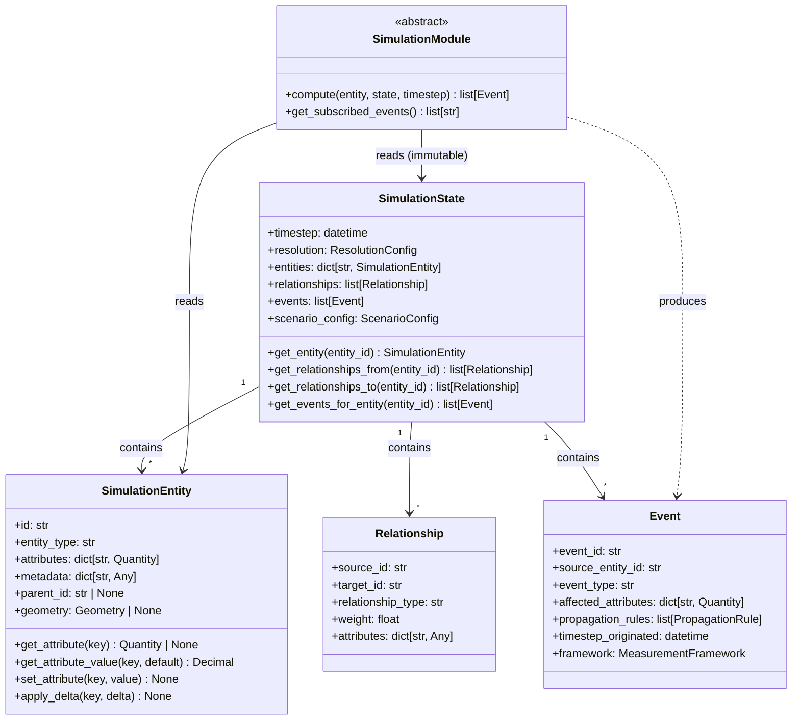

# WorldSim Coding Standards

These standards exist because WorldSim connects physical quantities, economic
variables, institutional indicators, and human welfare outcomes across dozens
of source conventions, in scenarios affecting decisions with generational
consequences. A unit error, a silent exception, or an accumulation of float
rounding across ten thousand simulation steps produces a plausible-looking
wrong output that survives code review and misleads a finance minister.

Read every section as operational contract, not style preference.

---

## Python Code Style

### Linting and Formatting: Ruff

All Python code is linted and formatted with [Ruff](https://docs.astral.sh/ruff/).
No exceptions, no per-file disables without a comment explaining why.

Add the following to `backend/pyproject.toml` (create if absent):

```toml
[tool.ruff]
target-version = "py312"
line-length = 100

[tool.ruff.lint]
select = [
    "E",    # pycodestyle errors
    "W",    # pycodestyle warnings
    "F",    # Pyflakes
    "I",    # isort
    "B",    # flake8-bugbear
    "C4",   # flake8-comprehensions
    "UP",   # pyupgrade
    "ANN",  # flake8-annotations (type hints)
    "S",    # flake8-bandit (security)
    "RET",  # flake8-return
    "SIM",  # flake8-simplify
    "TCH",  # flake8-type-checking
]
ignore = [
    "ANN101",  # missing type for self
    "ANN102",  # missing type for cls
]

[tool.ruff.lint.per-file-ignores]
"tests/**/*.py" = ["S101"]  # allow assert in tests

[tool.ruff.format]
quote-style = "double"
indent-style = "space"
```

Run before every commit:

```bash
ruff check backend/
ruff format backend/
```

CI enforces both. A lint failure is a build failure.

### Type Hints

Type hints are mandatory on every function signature and every class attribute.
No exceptions.

```python
# Correct
def compute_debt_service_ratio(
    total_debt: Decimal,
    annual_export_revenue: Decimal,
) -> Decimal:
    ...

# Forbidden — no return type, no parameter types
def compute_debt_service_ratio(total_debt, annual_export_revenue):
    ...
```

`Optional[T]` must be written explicitly — do not rely on default `None` to
imply optionality. As of Python 3.10, prefer `T | None` syntax.

`Any` requires a comment explaining why the type cannot be narrowed.

Generics must be fully specified: `Dict[str, float]` not `dict`, `List[Event]`
not `list`.

Run `mypy backend/app/` in CI. Type errors are build failures.

### Docstrings: Google Style

Every public module, class, and function has a docstring. The docstring answers
three questions: what this does, what the parameters mean, and what it returns.
It does not restate what the code obviously does.

```python
def apply_fiscal_multiplier(
    spending_delta: Decimal,
    multiplier: Decimal,
    regime: FiscalRegime,
) -> Decimal:
    """Apply a regime-dependent fiscal multiplier to a spending change.

    The multiplier inverts sign in depressed demand regimes — austerity
    can reduce output more than it reduces debt. This is the backside of
    the power curve in fiscal policy. Regime selection is the caller's
    responsibility; this function applies the multiplier as given.

    Args:
        spending_delta: Change in government spending in canonical units
            (constant 2015 USD). Positive is expansion, negative is
            contraction.
        multiplier: The regime-appropriate multiplier. Must be computed
            by the FiscalModule, not hardcoded by callers.
        regime: Current fiscal regime classification affecting multiplier sign.

    Returns:
        Change in GDP in canonical units (constant 2015 USD).
    """
    ...
```

Private functions (prefixed `_`) should have docstrings where the logic is
non-obvious. Trivial private helpers do not require them.

### Exception Handling

No bare `except` clauses. No `except Exception` without re-raising or explicit
logging. Silent exception swallowing is the hypoxia of debugging — the code
continues executing as if nothing happened, producing wrong outputs without
any signal that something went wrong.

```python
# Forbidden — silently swallows all errors
try:
    rate = exchange_rate_service.get_rate(source, target, date)
except:
    rate = 1.0

# Forbidden — catches everything, produces meaningless log
try:
    rate = exchange_rate_service.get_rate(source, target, date)
except Exception:
    logger.error("Exchange rate lookup failed")
    rate = 1.0

# Correct — specific exception, explicit handling, logged with context
try:
    rate = exchange_rate_service.get_rate(source, target, date)
except ExchangeRateNotFoundError as exc:
    logger.warning(
        "Exchange rate unavailable for %s/%s on %s, using fallback",
        source, target, date, exc_info=exc
    )
    rate = exchange_rate_service.get_fallback_rate(source, target, date)
```

Custom exception types live in `backend/app/exceptions.py`. Every module that
can produce distinct failure modes defines its own exception subclass.

### Defensive Programming

The simulation engine processes untrusted inputs (exogenous events, relationship
graph traversals, module outputs) that may arrive in unexpected combinations.
Silent failures at collection points — drops, skips, or zero-effect returns with
no observable signal — are the primary cause of debugging blind spots.

**Rule 1 — Silent drops are never acceptable without a WARNING log.**
Any code path that discards input (entity not found in state, no matching
events, duplicate key, out-of-scope entity) must emit a `logger.warning()` with
enough context to reconstruct what was dropped and why. The caller decides
whether the condition is tolerable; the code's job is to report it.

```python
# Forbidden — silently loses the delta with no observable signal
if entity_id not in state.entities:
    continue  # drop

# Correct — caller can filter on [SIM-INTEGRITY] prefix; delta is not lost
if entity_id not in state.entities:
    _log.warning(
        "[SIM-INTEGRITY] Accumulated delta for entity_id=%r not in state.entities "
        "— delta dropped. Check relationship scope configuration.",
        entity_id,
    )
    continue
```

**Rule 2 — Early returns from `compute()` are not all equivalent.**
A module returning `[]` may mean "no events this step" (expected) or
"a structural dependency is missing" (unexpected). These have different
operational significance:

- `entity.entity_type` filter — **(a) correctly silent.** Non-country entities
  are out of scope by design. No log required.
- `prior_events` empty on a given step — **(b) log at DEBUG.** Expected when
  no policy was applied this step, but useful signal for per-step trace.
- Structural dependency absent (e.g., MacroeconomicModule never ran, so
  `gdp_growth_change` never fires) — **(b) log at WARNING.** The module is
  active but its upstream driver is absent. This is a configuration error, not
  normal operation. See Issue #211 for enforcement.
- Zero-net-effect after computing (e.g., spend and tax cancel) — **(a) correctly
  silent.** The computation ran; the result is legitimately zero.

```python
# (b) — structural absence: WARNING
if not prior_events and MacroeconomicModule not in active_modules:
    _log.warning(
        "[SIM-INTEGRITY] %s: no prior gdp_growth_change events for entity=%r "
        "— MacroeconomicModule may be absent from active modules.",
        type(self).__name__, entity.id,
    )
    return []

# (b) — per-step absence: DEBUG
if not prior_events:
    _log.debug("%s: no subscribed events for entity=%r at step=%r", ...)
    return []
```

**Rule 3 — Collection points check invariants before passing to the next stage.**
The runner's `all_events` list, the propagation accumulator, and the snapshot
repository are collection points. Each must check for conditions that would
produce incorrect downstream behavior and warn before proceeding — not after.
Invariants to check at each stage:

| Collection point | Invariant | Action on violation |
|---|---|---|
| `runner.advance_timestep()` | Duplicate `event_id`s | `WARNING` before `propagate()` |
| `propagation._build_next_state()` | Entity in accumulator absent from state | `WARNING` before drop |
| `propagation._accumulate()` | Two STOCK events for same attribute | `WARNING` before summing |
| Snapshot repository | Null `state_data` key | `WARNING` before persisting |

**Rule 4 — Use the `[SIM-INTEGRITY]` prefix for simulation invariant violations.**
Warning messages that indicate simulation integrity concerns use the stable prefix
`[SIM-INTEGRITY]` so that log monitoring can filter on a single pattern:

```python
_log.warning("[SIM-INTEGRITY] <specific condition> — <what was dropped/skipped and why>")
```

Use `[SIM-INTEGRITY]` only for conditions that represent unexpected state
in the simulation's own data flow (dropped deltas, missing entities, duplicate
IDs, STOCK conflicts). Do not use it for external input validation errors or
API-layer concerns.

#### Warning Path Testing Requirement

Every `[SIM-INTEGRITY]` warning path must have a test that:
1. Sets up the specific condition that triggers the warning.
2. Asserts the warning was emitted using pytest's `caplog` fixture.
3. Asserts the simulation did not raise an exception (warning-level paths
   must not halt execution).

```python
def test_dropped_delta_warning_fires(caplog: pytest.LogCaptureFixture) -> None:
    # Set up: accumulator has delta for entity_id absent from state.entities
    ...
    with caplog.at_level(logging.WARNING, logger="app.simulation.engine.propagation"):
        propagate(state, events)

    assert any("[SIM-INTEGRITY]" in r.message for r in caplog.records)
    # Simulation did not raise — verify by reaching this assertion
```

### Monetary and Quantity Standards

#### Why `Quantity`, Not Raw Numbers

Every physical and economic measurement in the simulation is a `Quantity`
(defined in `DATA_STANDARDS.md §Units and Measurements`). Never raw `float`,
never raw `Decimal` without a unit. This applies to entity attributes, event
deltas, module outputs, and ingestion pipeline outputs.

**Rationale.** Float arithmetic accumulates error silently. A raw `Decimal`
carries a number but discards the unit, the provenance, the observation date,
and the confidence tier that give the number meaning. A `Quantity` makes unit
errors loud and immediate (conversion raises `UnitError` when dimensions are
incompatible), carries every value back to a registered source, and propagates
confidence through every derived computation. A finance minister whose scenario
analysis rests on a silent unit error deserves better than we can deliver with
raw numbers.

The Mars Climate Orbiter was lost to an imperial/metric unit mismatch that
produced plausible-looking wrong values for nine months. WorldSim simulations
may inform decisions about whether a country should accept an IMF program.
The bar for correctness is the same.

#### Attribute Store: `dict[str, Quantity]`

`SimulationEntity.attributes` holds `Quantity` values, not floats:

```python
# Correct
attributes: dict[str, Quantity] = {
    "gdp": Quantity(
        value=Decimal("44e9"),
        unit="USD_2015",
        observation_date=date(2023, 1, 1),
        source_id="WB_WDI_GDP_2024",
        confidence_tier=1,
        variable_type=VariableType.FLOW,
    ),
    "debt_gdp_ratio": Quantity(
        value=Decimal("1.46"),
        unit="dimensionless",
        observation_date=date(2023, 1, 1),
        source_id="IMF_WEO_2024",
        confidence_tier=1,
        variable_type=VariableType.RATIO,
    ),
}

# Forbidden — loses units, provenance, confidence, and variable type
attributes: dict[str, float] = {"gdp": 44e9, "debt_gdp_ratio": 1.46}
```

Event `affected_attributes` follows the same rule: `dict[str, Quantity]`, not
`dict[str, float]`. The delta carried by an Event is a `Quantity` — it has
units, a confidence tier, and a variable type that the propagation engine
uses to apply the delta correctly.

#### The `variable_type` Field

Every `Quantity` carries a `variable_type`. The propagation engine uses this
to determine how the value behaves across timesteps:

```python
class VariableType(Enum):
    STOCK = "stock"
    # Measures a level at a point in time.
    # Examples: foreign exchange reserves, debt outstanding, population.
    # Propagation behavior: inherits previous period value if no event changes it.

    FLOW = "flow"
    # Measures change or activity over a period.
    # Examples: GDP, exports, fiscal deficit, tax revenue.
    # Propagation behavior: resets each period; must be produced by a module or input.

    RATIO = "ratio"
    # Dimensionless fraction derived from other quantities.
    # Examples: debt/GDP, reserve coverage months, inflation rate.
    # Propagation behavior: recomputed from inputs each period; not stored independently.

    DIMENSIONLESS = "dimensionless"
    # Index or score with no natural unit — not a ratio of two quantities.
    # Examples: HDI, Freedom House score, V-Dem indicators, capability indexes.
    # Propagation behavior: update rule defined by the module that owns the variable.
```

Misclassifying a FLOW as a STOCK causes it to accumulate across periods
where it should reset. Misclassifying a STOCK as a FLOW loses the carried
balance between periods. These are simulation correctness failures, not
warnings.

**Classification reference:**

| Variable | Correct type | Common error and consequence |
|---|---|---|
| GDP | FLOW | STOCK — accumulates, producing nonsense multi-period totals |
| Exports | FLOW | STOCK |
| Fiscal deficit | FLOW | STOCK |
| Foreign exchange reserves | STOCK | FLOW — reserve level lost between periods |
| Debt outstanding | STOCK | FLOW |
| Population | STOCK | FLOW |
| Debt/GDP ratio | RATIO | STOCK — recomputing is not stored; storing creates staleness |
| Inflation rate | RATIO | FLOW |
| Reserve coverage (months of imports) | RATIO | STOCK |
| HDI | DIMENSIONLESS | RATIO — HDI is not a fraction of two commensurable quantities |
| Freedom House score | DIMENSIONLESS | RATIO |
| V-Dem indicators | DIMENSIONLESS | RATIO |
| Capability indexes (HCL outputs) | DIMENSIONLESS | RATIO |

#### Monetary Arithmetic: `Decimal`, Never `float`

All monetary arithmetic uses Python's `decimal.Decimal`. Never `float`.

```python
from decimal import Decimal, getcontext

# Set precision globally at application startup
getcontext().prec = 28

# Correct
interest_payment = principal * Decimal("0.025")

# Forbidden — float monetary arithmetic
interest_payment = principal * 0.025
```

`float` is prohibited in `backend/app/`. The CI compliance scan enforces this.
The one permitted exception is intermediate mathematical computation in NumPy
operations on dimensionless propagation weights (e.g., relationship weight
matrices). These must be explicitly commented and must not touch `Quantity`
or `MonetaryValue` values directly.

#### `MonetaryValue` as a `Quantity` Subclass

`MonetaryValue` (defined in `DATA_STANDARDS.md §Currency and Monetary Value
Standards`) is a `Quantity` subclass. All `Quantity` rules — including
`variable_type`, `confidence_tier`, and `source_id` requirements —
apply to monetary values.

```python
# Correct — MonetaryValue is a Quantity, inherits all required fields
export_revenue = MonetaryValue(
    value=Decimal("1.2e9"),     # 'value' is the inherited Quantity field
    unit="USD_2015",            # canonical internal unit
    currency_code="GHS",        # source currency at ingestion (converted on write)
    price_basis="constant",
    exchange_rate_type="ppp",
    observation_date=date(2023, 1, 1),
    source_id="WB_WDI_BX_2024",
    confidence_tier=1,
    variable_type=VariableType.FLOW,  # export revenue is a period flow
)

# Forbidden — bypassing MonetaryValue with raw Decimal
export_revenue = Decimal("1.2e9")
```

Do not bypass `MonetaryValue` with raw `Decimal` arithmetic except inside the
`Quantity` and `MonetaryValue` types' own implementations.

#### `confidence_tier` Propagation

When a calculation derives a new `Quantity` from two or more `Quantity` inputs,
the output `confidence_tier` is the **maximum** of all input tier numbers (higher
tier number = lower confidence quality; the output inherits the worst-quality
input's tier).

```python
# Correct — lower-of-two rule applied (max tier = worst confidence wins)
def compute_debt_service_ratio(
    total_debt: Quantity,
    export_revenue: Quantity,
) -> Quantity:
    return Quantity(
        value=total_debt.value / export_revenue.value,
        unit="dimensionless",
        variable_type=VariableType.RATIO,
        confidence_tier=max(total_debt.confidence_tier, export_revenue.confidence_tier),
    )

# Forbidden — tier not propagated, output silently appears as Tier 1
def compute_debt_service_ratio(debt: Decimal, revenue: Decimal) -> Decimal:
    return debt / revenue
```

**Rationale.** A derived output is never more trustworthy than its least
trustworthy input. The lower-of-two rule is a deliberately conservative policy
approximation, not a statistical formula. It systematically overstates
uncertainty when inputs are independent and mutually corroborating — this is the
intended failure mode for sovereign policy tools.

**Known Limitation (IA-1):** This rule does not account for projection horizon.
A 30-year forward projection derived from a Tier 1 historical observation
retains Tier 1 confidence under this rule, which overstates reliability for
long-horizon projections. Time-horizon confidence degradation is Milestone 3
scope. Until then, modules producing forward projections must include in their
output metadata the note: *"Confidence tier does not account for projection
horizon."*

#### `measurement_framework` Tagging (M4+ Requirement)

Every `Quantity` produced by a domain module at Milestone 4 and later must
carry an explicit `measurement_framework` tag from the `MeasurementFramework`
enum. This rule is mandated by ADR-005 Decision 2 and enforced by the CI
compliance scan (Issue #171, SR3-I-01).

```python
from app.simulation.engine.models import MeasurementFramework

# Correct — M4+ module output carries explicit framework tag
life_expectancy = Quantity(
    value=Decimal("74.3"),
    unit="years",
    variable_type=VariableType.STOCK,
    confidence_tier=2,
    observation_date=date(2023, 1, 1),
    source_id="WHO_GHO_LE_2023",
    measurement_framework=MeasurementFramework.HUMAN_DEVELOPMENT,
)

# Forbidden — omitting measurement_framework in new M4+ module code
life_expectancy = Quantity(
    value=Decimal("74.3"),
    unit="years",
    variable_type=VariableType.STOCK,
    confidence_tier=2,
    observation_date=date(2023, 1, 1),
    source_id="WHO_GHO_LE_2023",
    # measurement_framework omitted — forbidden in new module code
)
```

**The four framework values and their scope:**

| Framework | `MeasurementFramework` value | Owned by |
|---|---|---|
| Financial accounts | `FINANCIAL` | Macroeconomic Module, Trade Module, Capital Flow Module |
| Human development | `HUMAN_DEVELOPMENT` | Demographic Module, Health Module (Sen capability approach) |
| Ecological accounts | `ECOLOGICAL` | Climate Module, Natural Capital Module |
| Governance quality | `GOVERNANCE` | Institutional Cognition Module, Geopolitical Module |

**Backward-compatibility rule:** Attributes produced by M1–M3 code that
predate this requirement are permitted to carry `measurement_framework=None`.
The `MultiFrameworkOutput` aggregation layer (ADR-005 Decision 2) classifies
untagged attributes as `FINANCIAL` at query time. This default exists solely
to avoid migrating M1–M3 historical attribute data — it must not be relied on
for any new code written at M4 or later.

**Compliance scan enforcement:** The CI compliance scan must flag any
`Quantity(...)` or `Quantity(` construction in `backend/app/simulation/modules/`
and `backend/app/simulation/engine/` where `measurement_framework` is absent
from the call or explicitly set to `None`. Ingestion seeders
(`backend/app/simulation/loaders/`) and test fixtures
(`backend/tests/fixtures/`) are exempt — they may carry `measurement_framework=None`
for historical seed data that predates this requirement.

#### Ingestion Pipeline Requirements

Every value entering the simulation through an ingestion pipeline must, at
the ingestion boundary:

1. Have a registered `source_id` in the `SourceRegistry` before the pipeline
   writes any data
2. Carry an explicit `confidence_tier` assigned from the Data Quality Tier
   System in `DATA_STANDARDS.md` — no defaulting permitted
3. Carry an explicit `variable_type` — no defaulting to `DIMENSIONLESS`
4. Be wrapped in a `Quantity` (or `MonetaryValue`) — no raw numbers after
   the ingestion boundary
5. Carry an explicit `measurement_framework` if the value will be consumed by
   M4+ module code — seeders backfilling historical data may use `None`

The ingestion boundary is the single point at which raw source data becomes
a `Quantity`. After that boundary, no code in `backend/app/` introduces bare
floats or bare `Decimal` values as attribute values.

#### Usage Table

| Context | Correct | Forbidden |
|---|---|---|
| Entity attribute store | `dict[str, Quantity]` | `dict[str, float]`, `dict[str, Decimal]` |
| Monetary attribute | `MonetaryValue` (Quantity subclass) | `Decimal`, `float` |
| Dimensionless rate/ratio | `Quantity(variable_type=RATIO)` | bare `Decimal` as attribute |
| Capability/index | `Quantity(variable_type=DIMENSIONLESS)` | bare `float` or `Decimal` |
| Intermediate arithmetic | `Decimal` (temporary, in-function) | `float` (anywhere in backend/app/) |
| NumPy propagation weight | `float` (with explicit comment) | `Decimal` (NumPy incompatible) |
| Confidence propagation | `max(tier_a, tier_b)` | Assigning a fixed tier to derived output |
| Module output (M4+) | `Quantity` with explicit `measurement_framework` | `Quantity` with `measurement_framework=None` |
| Module output | `list[Event]` with `Quantity` deltas | `list[Event]` with float deltas |
| Event delta | `Quantity` with matching `variable_type` | `float` delta |

#### Distribution Output Standards (M5+)

##### Rule 1 — No distribution fields in the propagation envelope

Distribution fields (`ci_lower`, `ci_upper`, `ci_coverage`, `is_pre_calibration`,
`clipped_lower`, `clipped_upper`) must NOT be added to the `Quantity` type or
to `quantity_to_jsonb` / `quantity_from_jsonb`. These fields are computed at
query time by the `BandingEngine` and are absent from all stored snapshots.

```python
# Forbidden — distribution fields in the snapshot envelope
def quantity_to_jsonb(q: Quantity) -> dict:
    return {
        "_envelope_version": "1",
        "value": str(q.value),
        "ci_lower": str(q.ci_lower),   # FORBIDDEN: distribution in snapshot
        "ci_upper": str(q.ci_upper),   # FORBIDDEN
        ...
    }

# Correct — snapshot envelope carries only point-estimate fields
def quantity_to_jsonb(q: Quantity) -> dict:
    return {
        "_envelope_version": "1",
        "value": str(q.value),
        "unit": q.unit,
        "confidence_tier": q.confidence_tier,
        ...  # no ci_lower, ci_upper, ci_coverage here
    }
```

The `_envelope_version` field on stored Quantity objects advances from `"1"`
to `"2"` only for the `QuantitySchema` output type returned by
`get_measurement_output` — never for the stored snapshot format.

##### Rule 2 — `BAND_SCHEDULE` and `TIER_MULTIPLIERS` as declared constants

Band widths are contractual parameters. Declare them as named module-level
`SCREAMING_SNAKE_CASE` constants in `banding_engine.py`:

```python
# Correct — contractual parameters as named constants
BAND_SCHEDULE: dict[int, Decimal] = {
    1:   Decimal("0.10"),   # 1-year horizon: ±10%
    2:   Decimal("0.20"),   # 2-year horizon: ±20%
    5:   Decimal("0.35"),   # 3–5 year horizon: ±35%
    999: Decimal("0.50"),   # >5 year horizon: ±50%
}

TIER_MULTIPLIERS: dict[int, Decimal] = {
    1: Decimal("1.0"),
    2: Decimal("1.2"),
    3: Decimal("1.5"),
    4: Decimal("2.0"),
    5: Decimal("3.0"),
}

# Forbidden — magic-number band widths inline
half_width = abs(point_estimate) * Decimal("0.35") * Decimal("1.5")  # FORBIDDEN
```

If a band width changes, it must change in `BAND_SCHEDULE` or
`TIER_MULTIPLIERS` — one place, visible to reviewers. See
`DATA_STANDARDS.md §Epistemic Band Labeling Standards` for the canonical
values.

##### Rule 3 — BandingEngine is the single source of band computation

All epistemic band computation must go through `BandingEngine.compute_band()`.
Inline band arithmetic elsewhere in `backend/app/` is forbidden, even if the
formula appears equivalent. The `BandingEngine` enforces boundary clipping,
tier multiplier application, and the `is_pre_calibration` label as a unit —
bypassing any one of these produces an incorrectly labeled output.

```python
# Correct — all band computation through BandingEngine
banded = banding_engine.compute_band(
    point_estimate=q.value,
    confidence_tier=q.confidence_tier,
    horizon_steps=horizon,
    lower_bound=Decimal("0"),
    upper_bound=Decimal("1"),
)

# Forbidden — band computation outside BandingEngine
ci_lower = q.value * Decimal("0.65")   # FORBIDDEN: bypasses clipping and multipliers
ci_upper = q.value * Decimal("1.35")   # FORBIDDEN
```

---

## Naming Conventions

### Files

- Python modules: `snake_case.py`
- Test files: `test_<module_name>.py` mirroring the module structure
- ADRs: `ADR-NNN-short-descriptive-title.md`
- Diagrams: `ADR-NNN-diagram-type.mmd` (e.g., `ADR-001-class-diagram.mmd`)
- Configuration files: `snake_case.toml` or `snake_case.yaml`

### Classes

`PascalCase`. Name classes after what they represent, not what they do:
`SimulationEntity` not `EntityManager`. `FiscalMultiplier` not
`FiscalMultiplierCalculator`.

Abstract base classes are prefixed with nothing — do not use `Abstract` or
`Base` prefixes. The `ABC` inheritance and abstract methods make the nature
clear.

### Functions and Methods

`snake_case`. Verb phrases for functions that do something:
`compute_debt_service_ratio`, `apply_fiscal_multiplier`, `get_exchange_rate`.

Boolean-returning functions use `is_`, `has_`, or `can_` prefix:
`is_in_crisis`, `has_sufficient_reserves`, `can_service_debt`.

### Variables

`snake_case`. Names must be descriptive. Single-letter variables are forbidden
outside comprehensions and mathematical proofs where convention is established.

```python
# Forbidden
d = Decimal("1.46")
r = get_rate("USD", "GHS", date)

# Correct
debt_gdp_ratio = Decimal("1.46")
usd_to_ghs_rate = get_exchange_rate("USD", "GHS", date)
```

### Constants

`SCREAMING_SNAKE_CASE` at module level:

```python
CANONICAL_CURRENCY = "USD"
CANONICAL_BASE_YEAR = 2015
MINIMUM_RESERVE_THRESHOLD_MONTHS = Decimal("3")
```

### Test Functions

Test functions follow the pattern `test_[what it does]_[under what condition]`.
This makes the test suite readable as documentation.

```python
# Correct — readable as a sentence describing expected behavior
def test_apply_delta_initialises_missing_key_at_zero():
def test_get_exchange_rate_raises_when_date_before_series_start():
def test_fiscal_multiplier_inverts_sign_in_depressed_demand_regime():
def test_human_cost_ledger_produces_nonzero_values_for_austerity_shock():

# Forbidden — opaque identifiers
def test_apply_delta_1():
def test_exchange_rate():
def test_fiscal():
```

---

## Testing Requirements

A feature is not done until:
1. All tests pass
2. The backtesting suite still passes
3. Human cost ledger outputs are verified for the affected code path

### Unit Tests (`tests/unit/`)

**Scope:** Test one unit of logic in isolation. No database. No network.
No filesystem. No subprocess. No sleep.

**Speed:** The entire unit test suite must complete in under 30 seconds.
Slow unit tests are a sign that a unit test is doing integration work.

**Requirements per public method:**
- At least one test for the happy path
- At least one test for each distinct error condition
- At least one test for boundary values
- No internal implementation details tested — test the contract, not the wiring

**Fixtures:** Use `conftest.py` for shared fixtures. Fixtures should be minimal
— construct only the state the test actually needs.

**Mocking:** Mock only at the boundary of the unit under test. Do not mock
internal collaborators — if you are mocking internals, the unit is too large
or the architecture needs rethinking.

### Integration Tests (`tests/integration/`)

**Scope:** Test interactions between modules, between the application layer
and the database, or between the API and the simulation engine.

**Requirements:**
- Each integration test documents which modules it exercises in a module-level
  docstring
- Database integration tests use a dedicated test schema, not the development
  database
- Network calls are permitted only to local services (test database, local
  Redis)
- External API calls are always mocked at the integration boundary with
  responses recorded from real calls

### Backtesting Tests (`tests/backtesting/`)

**Scope:** Run the simulation forward from a historical baseline, inject known
events, and compare outputs against the historical record.

**Requirements per backtesting case:**
- Data source cited with version and access date — not just "World Bank" but
  which dataset, which release
- Fidelity threshold specified — not "outputs should match history" but
  "GDP growth rate within ±1.5 percentage points, debt-to-GDP ratio within
  ±3 percentage points for each year of the scenario"
- Failure mode documented — which of the five aviation failure modes
  (Spin, Coffin Corner, Hypoxia, Backside of power curve, Get-there-itis)
  this case tests, and the historical manifestation
- Vintage dating verified — only data published before the scenario start date
  may be used as seed data
- A backtesting regression is treated as a build failure — a change that makes
  historical cases less accurate must be justified and documented, not quietly
  accepted

Backtesting cases currently planned: Greece 2010-2015 (Coffin Corner),
Thailand 1997 (Coffin Corner), Lebanon 2019-2021 (Spin), Argentina
2001-2002 (Spin + currency crisis). Each will be added as a separate
GitHub Issue using the backtesting issue template.

### What "Passing Backtesting" Means — DIRECTION_ONLY Limitations

**DIRECTION_ONLY thresholds are sign checks, not model validation (Issue #88).**

A DIRECTION_ONLY threshold passes when `simulated_value[step] < simulated_value[step-1]`
(for a "declining" indicator) or `> simulated_value[step-1]` (for a "rising" indicator).
A model that produces GDP growth of −0.0001% passes identically to one that produces
−8.9% (the Greece 2010 historical outturn). The magnitude is not evaluated.

**Statistical power statement (required in all fidelity reports):**

A DIRECTION_ONLY threshold with two data points (steps 1 and 2) has a 25% probability
of passing under a null (uncalibrated) model — the model has a 50% chance of getting
each sign right independently. A case with N steps has a 1-in-2^N chance of passing
all DIRECTION_ONLY thresholds by chance. A Greece 2010–2012 3-step case has a 1-in-8
(12.5%) null-model pass rate. **A DIRECTION_ONLY pass is a necessary but not sufficient
condition for model confidence.** It asserts directional plausibility; it does not
validate the model's quantitative accuracy.

Every fidelity report must include the following block verbatim (with template
variables filled in) in its Known Limitations section (Issue #160). The
`format_fidelity_report()` function includes this via the
`parameter_calibration_disclosure` argument — do not remove or abbreviate it:

```
Statistical power statement:
- Threshold type: DIRECTION_ONLY (sign check — not magnitude validation)
- Checks performed: {N} ({indicators} × {steps} steps)
- False positive rate under null model: {rate:.1%}
- What PASS validates: The simulation produces the correct sign (direction) for specified indicators
- What PASS does NOT validate: Quantitative accuracy, magnitude, distributional fit, or endogenous dynamics
```

Where `{N}` = total number of sign checks, `{rate}` = `(0.5 ** N)` expressed as a
percentage. For a 6-check case (2 indicators × 3 steps): N=6, rate=1.6%.
For a 2-check case: N=2, rate=25.0%.

This block must appear in both the printed fidelity report and the JSON artifact
(Issue #154). A fidelity report that omits it is architecturally incomplete.

**The three-tier threshold hierarchy:**

| Tier | Name | What it checks | When to use |
|---|---|---|---|
| 1 | `DIRECTION_ONLY` | Sign of change (up/down) | Early cases; untuned model; < Tier B calibration |
| 2 | `MAGNITUDE_WITHIN_PCT` | Value within ±N% of historical outturn | After parameter calibration Tier A/B (Issue #44) |
| 3 | `DISTRIBUTION_COMBINED` | Simulated distribution overlaps with historical distribution | After uncertainty quantification is validated |

**Rules for backtesting case authors:**

1. Every fidelity report must include the statistical power statement above in its
   Known Limitations section. `format_fidelity_report()` includes it automatically via
   the `parameter_calibration_disclosure` argument — do not remove it.
2. DIRECTION_ONLY thresholds on fewer than 3 steps must include a comment explaining
   the 1-in-2^N null-model pass probability for that specific case.
3. A threshold that cannot be enforced because the relevant module is not yet
   implemented must be declared as `deferred_thresholds` in `format_fidelity_report()`
   — not silently omitted. Omission implies coverage that does not exist.
4. A DIRECTION_ONLY threshold may be promoted to MAGNITUDE once the model has been
   calibrated to Tier A or B for that indicator (Issue #44). The promotion must update
   both the fixture and the fidelity report format — not just the assert.
5. Human cost indicators (unemployment rate, health expenditure, food insecurity rate)
   are required backtesting thresholds alongside financial indicators. A backtesting
   case that passes on GDP contraction while producing no human development output is
   architecturally incomplete (ARCH-REVIEW-002 BI2-I-02, Issue #87).

### Module Output Tagging

Every event generated by a simulation module must carry a non-null
`MeasurementFramework` tag. This is a **must** requirement, not a style preference.

The `framework` field on `Event` has no default value — omitting it is a
`TypeError` at instantiation. This is the enforcement mechanism. There is no
silent fallback.

**Rules:**

1. Every `Event` constructed anywhere in `backend/app/` must pass an explicit
   `framework=MeasurementFramework.<VALUE>` argument.

2. Unit tests for every module must include:
   ```python
   assert all(e.framework is not None for e in events)
   ```

3. Modules affecting welfare attributes must generate ≥1 event tagged
   `MeasurementFramework.HUMAN_DEVELOPMENT`.

4. Modules affecting ecological attributes must generate ≥1 event tagged
   `MeasurementFramework.ECOLOGICAL`.

**Framework assignment guide:**

| Module | Correct framework |
|---|---|
| MacroeconomicModule | `FINANCIAL` |
| DemographicModule | `HUMAN_DEVELOPMENT` |
| EcologicalModule | `ECOLOGICAL` |
| GovernanceModule | `GOVERNANCE` |
| Input orchestration (FiscalPolicyInput, MonetaryRateInput, etc.) | `FINANCIAL` |
| EmergencyPolicyInput, StructuralPolicyInput | `GOVERNANCE` |

Test helpers and fixtures that construct `Event` objects for non-module purposes
(e.g., injecting a shock event in a propagation test) must also pass an explicit
`framework` — `FINANCIAL` is the conventional choice when framework routing is
not the subject under test.

**Source:** Issue #42, STD-REVIEW-001 SA-01.

### Governance Alert Event Type

`GOVERNANCE_ALERT` is the named event type for governance indicator threshold
breaches. It is produced by the `MDAChecker` (ADR-005 Decision 3) when a
`GovernanceModule`-emitted indicator crosses a threshold registered in the
`mda_thresholds` table — not by the module itself. This keeps alert detection
in the existing MDA architecture.

Requirements for events carrying governance alert semantics:

- `event_type`: `"mda_breach"` (standard MDA breach type; `"governance_alert"`
  appears in `metadata["mda_id"]` to identify the specific governance threshold)
- `framework`: `MeasurementFramework.GOVERNANCE`
- `affected_attributes`: contains the breaching indicator as a `Quantity`
- `metadata`: includes `"mda_id"`, `"indicator_key"`, `"threshold_value"`, and
  `"severity"` keys

Governance alert thresholds and their calibration basis are defined in
`DATA_STANDARDS.md §Governance Framework Indicator Standards §Governance Alert
Thresholds`. Do not hardcode threshold values in the module — read from the
`mda_thresholds` table at runtime.

**Source:** Issue #48, DATA_STANDARDS.md §Governance Framework Indicator Standards.

### Human Cost Ledger Testing

Any code path that affects simulation outputs must include explicit tests
that the human cost ledger produces meaningful values — not just that the
fields exist and are non-null, but that they respond correctly to the
inputs that drive them.

```python
# Insufficient — only tests existence
def test_austerity_shock_produces_human_cost_output():
    result = run_scenario(austerity_shock)
    assert result.human_cost is not None

# Required — tests that the output is meaningful
def test_austerity_shock_increases_poverty_headcount():
    baseline = run_scenario(baseline_scenario)
    austerity = run_scenario(austerity_shock)
    assert austerity.human_cost.poverty_headcount > baseline.human_cost.poverty_headcount

def test_austerity_shock_human_cost_scales_with_shock_magnitude():
    small_cut = run_scenario(spending_cut_5pct)
    large_cut = run_scenario(spending_cut_20pct)
    assert large_cut.human_cost.poverty_headcount > small_cut.human_cost.poverty_headcount
```

The human cost ledger is never a footnote. Its test coverage reflects this.

### E2E Pre-implementation Test Categorization

When implementation is decomposed into multiple Task Issues (one component per
PR), E2E acceptance criteria must be categorized before QA authors any spec.
Bundling both types into a single file against a multi-component feature creates
an unsatisfiable intermediate state — no test can pass until every component
exists — forcing a blanket skip that silences all ACs simultaneously. That is a
CI blind spot, not a pre-implementation gate. (Near-miss NM-017.)

**Type 1 — Component-level AC.** Testable the moment one component ships,
independent of all others. Example: "TrajectoryView renders with minimum width
480px." Lives in the implementation task's PR scope — the implementing agent
writes it alongside the component. The test exists and passes on the day the
component merges.

**Type 2 — Integration-level AC.** Only satisfiable when multiple components
coexist simultaneously. Example: "All four Zone 1 instruments visible without
scroll at 1024×768." Lives in a dedicated integration spec file, separate from
any component spec, with an explicit header naming its component dependencies.

**Pre-authorship checklist (QA Lead and implementing agents):**

1. For each AC, ask: can this pass if only one component from this feature
   exists in the DOM? If yes → Type 1. If no → Type 2.
2. Type 1 ACs are removed from the shared spec and handed to the implementing
   agent for that component. They are not pre-written in a skipped file.
3. Type 2 ACs live in a file named `<feature>-integration.spec.ts` with a
   header comment of the form:
   ```
   // Integration gate — requires: Issue #NNN (ComponentA),
   //                              Issue #NNN (ComponentB),
   //                              Issue #NNN (ComponentC)
   ```
4. `test.skip(true, ...)` at file scope is a process violation for any spec
   that contains Type 1 ACs. Type 1 ACs must never be suppressed — they must
   be written in the scope where they are immediately satisfiable.

---

## User-Facing Alert Text Standards

### MDA Alert Language: Declarative Finding, Not Warning Alarm

The canonical user cites MDA alerts as evidence in a negotiation. The alert
is a finding she presents — not a warning about her own proposed path. Alert
text must reflect this.

```python
# Correct — declarative finding language
f"{indicator_name} crosses {severity} threshold at step {step_index}."
f"{indicator_name} is at {current_value} against a floor of {floor_value} "
f"at step {step_index} — {severity} threshold crossed."

# Forbidden — warning-alarm framing
f"WARNING: {indicator_name} is approaching a dangerous level."
f"ALERT: {indicator_name} may breach its floor."
f"CRITICAL: {indicator_name} is at risk."
```

The severity enum value (`WARNING` / `CRITICAL` / `TERMINAL`) is for triage
color-coding and visual weight. It must not appear as a prose prefix in
human-readable alert text. Alert prose states what happened and when.

Any function, method, or template that generates MDA alert display text
must be reviewed against this standard before merging. Backend alert
generation (Python) and frontend rendering (TypeScript/React) are both
in scope.

**Source:** `docs/ux/north-star.md §Resolved Design Question 3 — Professional
Framing of the Human Cost Ledger`. Any revision to the framing in that
document must be reflected here in the same commit.

---

## Document Referencing Convention

Living documents (documents subject to in-place updates) are revised without creating new
files. When a document is revised, existing references to that document silently point at
a changed artifact. Three conventions prevent silent reference staleness. (Issue #398)

### Convention 1 — Revision Header on Living Documents

Every living document that is subject to in-place updates must carry a revision header
immediately below the document title:

```markdown
> Last significant revision: YYYY-MM-DD
> Updated against: [Decision record or ADR reference]
> Previous version context: [Brief description of what changed and from what]
```

**Living documents subject to this requirement:** `docs/ux/north-star.md`,
`docs/ux/information-hierarchy.md`, `docs/ux/user-journeys.md`, `CLAUDE.md`,
`docs/process/agents.md`, `docs/architecture/simulation-framework.md`, and any
document designated living when created. The designation must be added at creation time.

Cost: one minute per document update. Benefit: every future reader knows which era of
the document a reference was written against.

### Convention 2 — ADRs as Stable Reference Points

When any document needs to reference a design decision that must survive future
living-document updates, it references the ADR, not the living document.

- **Living document:** Always current, revised in place, references may go stale
- **ADR:** Immutable once accepted, amended rather than overwritten, safe to reference

Example: if `agents.md` needs to reference the viewport architecture decision, it
references ADR-008 (immutable) — not `information-hierarchy.md` (mutable).

### Convention 3 — PR Cross-References Section

PRs that update living documents must include a **Cross-references** section listing
which other documents contain references to the updated file. The PR author decides
whether those references need updating in the same PR.

This is a required PR template field, not an advisory checklist item. An update to a
living document without a cross-references section has not followed the document
referencing convention.

---

## Diagram Standards

### Format: Mermaid

All architecture diagrams use [Mermaid](https://mermaid.js.org/). Mermaid is:
- Text-based: version-controlled alongside code, diffs are readable
- GitHub-native: renders automatically in GitHub markdown, no external tools
- Reviewable: diagram changes go through pull request review like code

Do not use draw.io, Lucidchart, PNG screenshots, or any binary diagram format.
A diagram that cannot be reviewed in a pull request is not a diagram — it is
an undocumented assertion.

### Location

Diagrams live in `docs/architecture/`. File naming:

```
docs/architecture/ADR-NNN-diagram-type.mmd
```

Examples:
```
docs/architecture/ADR-001-class-diagram.mmd
docs/architecture/ADR-002-schema-diagram.mmd
docs/architecture/ADR-003-sequence-event-propagation.mmd
```

### Every ADR Gets at Least One Diagram

An ADR without a diagram has not fully explained the decision. The diagram
forces precision — if you cannot draw the structure, you have not yet fully
understood it.

### Diagram Type by Use Case

| Subject | Diagram Type |
|---|---|
| Data models and class relationships | `classDiagram` |
| Request/event flows and module interactions | `sequenceDiagram` |
| Failure modes and regime transitions | `stateDiagram-v2` |
| System component relationships | `graph TD` or `graph LR` |
| Process flows and decision points | `flowchart TD` |

### Diagram Update Requirement

When a module interface changes, its diagram must be updated in the same
commit. A pull request that changes a class signature without updating the
diagram will not be merged. Diagrams are not optional documentation added
after the fact — they are part of the specification.

Example for ADR-001 class diagram (`docs/architecture/ADR-001-class-diagram.mmd`):



---

## Commit Message Format

WorldSim uses [Conventional Commits](https://www.conventionalcommits.org/).
Every commit message follows this format:

```
type(scope): short description in imperative mood

Optional body explaining why, not what. The diff shows what.
The commit message explains the reasoning.

Co-Authored-By: Claude Sonnet 4.6 <noreply@anthropic.com>  # if AI-assisted
```

### Types

| Type | When to Use |
|---|---|
| `feat` | New simulation capability, new API endpoint, new UI feature |
| `fix` | Bug fix — something was wrong and now it is right |
| `docs` | Documentation only — ADRs, standards, diagrams, comments |
| `test` | Adding or fixing tests with no production code change |
| `refactor` | Code change that neither fixes a bug nor adds a feature |
| `perf` | Performance improvement with no behavior change |
| `chore` | Dependency updates, CI configuration, tooling changes |

### Scope

Scope is the module or area affected: `engine`, `macroeconomic`, `api`,
`frontend`, `ci`, `data`, `adr`.

### Examples

```
feat(engine): implement annual timestep propagation loop

fix(macroeconomic): correct fiscal multiplier sign inversion in depressed regime

The multiplier was not inverting in the DEPRESSED_DEMAND regime because
the regime comparison used string equality on the enum value rather than
the enum member. Under austerity in a depressed economy, the simulation
was reporting GDP increases instead of the contraction the historical
record shows.

docs(adr): add ADR-002 PostGIS spatial data model

test(engine): add backtesting case for Greece 2010-2012 Coffin Corner

refactor(data): extract CalendarService from FiscalYearRegistry

perf(engine): pre-compute relationship adjacency lists at state initialization

chore(ci): pin Python to 3.12.x and add mypy strict mode
```

### Rationale

Conventional commits make the history readable as a project narrative. `git log
--oneline` tells the story of the codebase. They also enable automated
changelog generation and semantic version bumping when WorldSim reaches
release status.

---

## ADR Requirements

### When a New ADR Is Required

A new Architecture Decision Record is required when:

1. A new simulation module is introduced
2. A significant interface contract changes
3. A technology is added to the stack (new database, new library, new service)
4. A design alternative was seriously considered and rejected
5. A significant data model changes

**ADR threshold criteria** — use this table when uncertain:

| Change type | ADR required? |
|---|---|
| New simulation module or measurement framework | New ADR |
| New public API endpoint | New ADR |
| New composite score methodology | New ADR |
| New database table or schema type | New ADR |
| New interaction mode or primary viewport behavior | New ADR |
| Change to a class interface defined by an existing ADR | ADR amendment in same commit |
| Frontend visual change within existing ADR spec | No ADR required |
| Bug fix that does not change externally-observable behavior | No ADR required |
| Documentation or process change | No ADR required |

When a case is ambiguous, PM Agent and Architect Agent jointly own the call. Neither
agent escalates to EL without first consulting each other. When in doubt, write the ADR —
the cost of an unnecessary one is an hour; the cost of missing one is weeks of rework.

### Module Behavioral Contract Renewal Trigger (Issue #544)

Any change to a class interface defined by an ADR — including its public methods,
subscribed events, ABC contract, event emission list, or serialization format — requires
an ADR amendment committed **in the same PR** as the code change. This is not optional
and does not require a new ADR number; amendments are appended to the existing ADR.

Affected class types include, but are not limited to:
- `SimulationModule` subclasses (ADR-001 interface contract)
- `ControlInput` subclasses (ADR-002 ABC contract)
- `ScenarioRunner.advance_timestep()` and related engine methods (ADR-004)
- `BandingEngine` interface (ADR-007)
- Any class whose interface is explicitly specified in an ADR Decision section

This rule generalizes the ADR-005 Amendment 2 precedent (the `DemographicModule._SUBSCRIBED_EVENTS`
incident). That amendment was filed retroactively when the pattern was first recognized.
All ADR-defined interfaces carry the same obligation going forward — a developer who reads
only the implementing ADR for `ControlInput` (ADR-002) must encounter this rule without
needing to read ADR-005. This section is that notice.

**How to recognize a behavioral contract change:** if adding, removing, or renaming a method,
event, or serialization field would break a caller that is written correctly against the current
ADR spec, it is a behavioral contract change and requires an ADR amendment.

### Required Sections

```markdown
# ADR-NNN: Title

## Status
Proposed | Accepted | Deprecated | Superseded by ADR-NNN

## Date
YYYY-MM-DD

## Context
What problem are we solving? What constraints exist? Why is this decision
necessary now? Include relevant external context (economic, political, technical).

## Decision
What did we decide? State it precisely. Enough detail that an implementation
agent can build to this spec without asking clarifying questions.

## Alternatives Considered

### Alternative 1: [name]
Description. Why it was rejected. What it would have cost or risked.

### Alternative 2: [name]
...

## Consequences

### Positive
What does this decision enable or improve?

### Negative
What does this decision constrain or cost? What technical debt does it create?
Be honest. An ADR that lists no negative consequences is not honest.

## Diagram
Reference to the Mermaid diagram in docs/architecture/.
```

### Backtesting Validation Anchor Required for New Composite Scores (Issue #547)

For any ADR introducing a new composite score, composite indicator, or novel measurement
methodology, the Consequences section must include a named backtesting validation anchor:

```markdown
## Backtesting Validation Anchor
Historical case: [Country, time period, documented transition or event]
Why this case: [Why this case tests the directional behavior of this score]
Data availability: [Tier N, source, known gaps]
```

If no case can be named, the ADR must include a Chief Methodologist assessment (signed)
explaining why no historical case exists and what substitute validation approach will be
used. An ADR that cannot name a validation anchor and cannot provide a CM-signed substitute
is not ready for acceptance.

**Rationale:** The backtesting obligation in ADR-005 Decision 5 requires a 4-file case
registration. That obligation is meaningless if the historical case is selected after
implementation begins. The case must be identified and validated at design time — in the
ADR itself — not at test-writing time. Discovery at implementation time is the most expensive
point to find an absence of valid validation data.

### The Rejected Alternatives Section Is Mandatory

The rejected alternatives section answers the question every new contributor
eventually asks: "Why didn't you just use X?" Without it, the team relitigates
rejected decisions. With it, the reasoning is durable across maintainer
changes, session boundaries, and the passage of time.

### Panel Review Is Mandatory for ADRs with a Named Panel

Every ADR that names a review panel in its Validity Context must produce an
ADR Panel Review document before the Engineering Lead accepts the ADR. The
panel review is the formal record of the acceptance process.

**Process:**

1. **Architect Agent authors the ADR.** Status: Proposed. Panel named in
   Validity Context. PR opened.

2. **Each panel member reviews the ADR in the same session.** Reviewers are
   activated per their working agreement (`docs/process/agents.md`). Each
   reviewer produces findings classified by severity and ADR-change requirement.

3. **Panel review document created** at `docs/adr/reviews/ADR-NNN-panel-review.md`.
   The document captures: all findings, a disposition table, Architect Agent
   disposition recommendations, FA Agent concurrence (if applicable), any
   joint EL+UX rulings required, and an Engineering Lead decision block.

4. **Architect Agent incorporates approved changes** into the ADR. The panel
   review document's revision summary governs what changes. Findings
   classified BRIEF are deferred to the implementing agent's brief — they do
   not block ADR acceptance.

5. **Engineering Lead accepts the ADR.** Status changes from Proposed →
   Accepted. PR merged. Panel review document updated with EL decision record.

**Panel Review Document Required Sections:**

```markdown
# ADR-NNN Panel Review

## Panel
Table: reviewer, role, sign-off status.

## Findings Register
Table: ID, source, severity, ADR change required?, status.

## Full Finding Texts
One subsection per reviewer. Finding text sufficient to stand alone
without the session transcript.

## Architect Agent Disposition Recommendations
Disposition table (INCORPORATE / BRIEF / DEFER / LOG) with rationale
per finding. Revision summary listing exact ADR changes if approved.

## [Implementing Agent] Concurrence
FA concurrence on findings relevant to implementation feasibility.

## Pending Joint EL + UX Decisions
Any binary rulings required from EL + UX Designer before FA brief begins.

## Engineering Lead Decision Record
Approval checkboxes per INCORPORATE item. EL sign-off line.
```

**Disposition categories:**

| Category | Meaning |
|---|---|
| INCORPORATE | Change ADR text before EL acceptance |
| BRIEF | Defer to implementing agent's brief; no ADR change needed |
| DEFER | Defer to a named future ADR or document |
| LOG | No action; finding recorded for institutional memory |

The panel review document is a supplement to the ADR — it is not part of
the ADR file itself. The ADR file records decisions; the panel review records
the process by which those decisions were validated. Both are permanent
artifacts. Do not merge the two.

### Panel Composition Algorithm (Issue #546)

CLAUDE.md §Architecture states "derive the panel composition from `docs/process/agent-raci.md`."
This algorithm makes that derivation explicit and auditable:

1. **Identify all decision types this ADR touches** — from the 9 decision types in
   `agent-raci.md §RACI Matrix` (Architectural, UX frame, UX component, Data/schema,
   Domain/measurement, Process/milestone, Compliance, Demo/stakeholder, Agent activation).
   An ADR may touch multiple decision types simultaneously.

2. **The panel is the union of all C-holders across all identified decision types.**
   Take every agent marked C on every applicable decision-type row. The union of those
   agents is the minimum required panel.

3. **The implementing agent is always added if not already in the union.** The agent
   who will build against this ADR must have the opportunity to raise feasibility concerns
   before acceptance.

4. **EL always holds A — invariant.** EL is not a panel member for review purposes;
   EL accepts the ADR after the panel has reviewed.

5. **When in doubt whether a decision type applies, include rather than exclude.**
   A panel member who has nothing to contribute passes in one sentence. A missing panel
   member's concern cannot be retroactively incorporated without a new review cycle.

**Conflict resolution:** When two decision types produce conflicting R assignments in the
same ADR (e.g., Architect and Data Architect both hold R on different decisions), EL
resolves the conflict at acceptance. Both agents participate in the panel.

**Pre-panel-review-era note (Issue #542):** ADR-001 through ADR-006 were accepted before
the formal panel review artifact process was established (adopted at ADR-008 acceptance,
2026-05-22). These ADRs have no `docs/adr/reviews/ADR-NNN-panel-review.md` artifacts.
This is a retrospective gap — the decisions are settled. When any of ADR-001 through
ADR-006 undergoes license renewal, the renewal artifact must include the following
acknowledgment:

> *"This ADR was accepted in the pre-panel-review era (before ADR-008 established the
> panel review artifact requirement). This renewal review performs the equivalent of
> the panel review retrospectively for decisions not yet independently validated under
> the current process."*

The renewal panel is derived from `agent-raci.md` per the algorithm above.

---

## Agent Team Workflow Standards

WorldSim uses a multi-agent Claude Code workflow. Each agent has a defined
role and specific obligations.

### What Every Agent Reads Before Starting

1. `CLAUDE.md` — project mission, principles, and architecture overview
2. The relevant ADR(s) for the feature being implemented
3. `CODING_STANDARDS.md` — this document
4. `DATA_STANDARDS.md` — if the session involves data handling

No significant feature implementation begins without these having been read.

### Architect Agent

**Reads:** CLAUDE.md, all existing ADRs, relevant external references.

**Produces:**
- Architecture Decision Records in `docs/adr/`
- API contracts and interface specifications
- Mermaid diagrams in `docs/architecture/`
- Data model designs
- Module interface definitions

**Does not produce:** Implementation code. The Architect Agent designs.
Implementation Agents build to the design.

### Implementation Agents

**Reads:** CLAUDE.md, the ADR(s) for the current task, CODING_STANDARDS.md,
DATA_STANDARDS.md.

**Produces:**
- Feature implementation code matching the ADR specification exactly
- Unit and integration tests alongside the feature code (same commit, not later)
- Updated `__init__.py` exports

**Constraint:** Implementation agents do not deviate from the ADR spec without
flagging the deviation and creating a follow-up ADR or ADR amendment.

### QA Agent

**Reads:** CLAUDE.md, the relevant ADR, CODING_STANDARDS.md.

**Produces:**
- Backtesting test cases in `tests/backtesting/`
- Test coverage reports
- Identified gaps in the test suite
- Backtesting validation reports comparing simulation output to historical record

**Constraint:** A backtesting regression discovered by the QA agent is treated
as a blocker, not a warning.

### Security and Review Agent

**Reads:** CLAUDE.md (especially the Defense Not Offense principle),
CODING_STANDARDS.md, DATA_STANDARDS.md.

**Produces:**
- Security audit reports for any feature touching sensitive country data
- Dual-use assessments for Financial Warfare Module features
- Dependency vulnerability reports

**Specific mandate:** Every feature that could identify exploitable
vulnerabilities in specific actors, rather than building defensive awareness
for vulnerable actors, must be reviewed by this agent before merge.

### DevOps Agent

**Reads:** CLAUDE.md, the CI/CD configuration, relevant infrastructure ADRs.

**Produces:**
- GitHub Actions pipeline configuration
- AWS CDK infrastructure code
- Environment configuration
- Container definitions (Dockerfile, docker-compose)

### Socratic Agent

The Socratic Agent is an architecture teacher and comprehension validator.
Its role is to ensure that the Engineering Lead maintains genuine understanding
of the architecture as it is built and evolves. It guards against autopilot
delegation — where work gets done but judgment does not develop.

**Operating Modes:**

`TEACH`: After a build session, the Socratic Agent explains what was just built.
Coverage: what problem it solves, why this design over the alternatives
considered in the ADR, what contracts it enforces, what would break if a
constraint were removed. Depth is calibrated to the Engineering Lead's current
level of understanding. One check question at the end confirms comprehension.

`TEST`: Before a build session or on request, the Socratic Agent probes
comprehension of existing architecture. One conceptual question at a time.
Wait for the answer. Respond to what the answer reveals. Correct misconceptions
directly. Affirm correct understanding. Never advance to the next question
until the current one is genuinely understood.

**Tone:** Socratic, not didactic. Ask before explaining. Surface the existing
mental model before correcting it. The goal is understanding that persists and
compounds — not information transfer.

**Activation:** `Socratic Agent: [TEACH|TEST] — [topic or recent session]`

The Socratic Agent exists because a codebase that grows without the lead
engineer genuinely understanding its architecture becomes ungovernable. The
simulation decisions made here affect sovereign policy analysis. The engineering
judgment required to make good decisions about that codebase cannot be
outsourced to agents.

---

## Legibility North Star

**The principle:**

> Code in this codebase must be modifiable by an intermediate developer who
> did not write it, without requiring access to the author's context. This is
> the legibility standard. Every specific rule in this document is a mechanism
> in service of this principle. When a proposed implementation satisfies a rule
> but violates this principle, the principle takes precedence.

**What this means in practice:**

An intermediate developer is someone competent in Python and familiar with
the domain (simulation, economics, geospatial data) but who has not been part
of this project's development. They have access to the code, the ADRs, and
the standards documents — but not to the conversations, sessions, or
institutional memory that produced the code.

If a function requires knowing why a design decision was made in order to
modify it safely, that function fails the legibility standard regardless of
whether it is technically correct. The constraint lives in the function, not
in the reader's head.

**The test:**

For any non-trivial function, ask: could a competent developer who has never
seen this codebase (a) understand what it does from reading it, (b) identify
where a bug could hide, and (c) make a targeted change without accidentally
breaking something else — all from the code alone? If the answer to any of
these is "only with help," the function needs improvement.

**Enforcement mechanisms:**

- **Issue #257** — Blind code legibility audit: recurring at each milestone
  exit. A fresh Claude instance with no WorldSim session history reviews
  five nominated functions and scores them on the seven-question legibility
  rubric (docs/process/blind-code-audit-prompt.md). Results logged at
  docs/process/blind-audit-YYYY-MM-DD.md.
- **Issue #258** — Intent blocks: a convention for annotating the non-obvious
  *why* inside complex functions without polluting the code with implementation
  narration.
- **Issue #259** — Legibility dashboard: quantitative metrics (radon cc scores,
  silent-failure surface, test-to-implementation ratio) surfaced in CI output
  at each milestone exit, tracked against the M7 baseline in
  docs/standards/legibility-baseline-m7.md.

**Why this is a mission requirement, not a housekeeping rule:**

WorldSim is designed to be used by finance ministries in countries that may
not have the technical staff depth of the institutions they are negotiating
against. If the codebase is only legible to its authors, it cannot be audited,
challenged, or improved by the domain experts and independent reviewers whose
trust the tool depends on. Legibility is not a code quality preference — it is
a prerequisite for the tool's credibility.

---

## Intent Blocks

### Purpose

An intent block is a structured comment block placed immediately above a non-trivial
function. It documents what the function is *supposed to do* — written before reading
the implementation — rather than describing what the code *does*. Divergences between
the intent block and the implementation are findings, not errors to resolve by updating
the intent block to match the code.

This is the ratified format for Issue #258 (mandatory intent blocks) and the primary
input to the spec-to-test gap check (Issue #286). Intent blocks not following this
format are not parseable by the gap check script and do not satisfy the enforcement
requirement. The first retrofit cohort is Issue #287 (five M7 blind audit functions).

### Format

```python
# INTENT: [one sentence — what this function is supposed to do, written
#          before reading the implementation]
# PRECONDITIONS: [what must be true before this runs — caller guarantees,
#                 state requirements, invariants assumed not verified]
# POSTCONDITIONS: [what is guaranteed to be true after — outputs produced,
#                  state changes made]
# ERROR CASES: [inputs or states that produce incorrect, empty, or silent
#               output — not exceptions, but wrong answers]
# KNOWN LIMITATIONS: [what this function explicitly does not handle —
#                     documented scope boundaries]
def the_function(...):
```

The five field names are fixed. The delimiter is `: ` (colon + space). Continuation
lines use `#` with leading spaces to align with the field text.

### Field Definitions

**INTENT** — One sentence. Written from the function signature, docstring, and test
file — not from the implementation body. Answers: "What is this function contracted
to produce for its caller?" Not "How does it produce it?"

**PRECONDITIONS** — What the caller must guarantee before calling this function.
State requirements, type invariants, ordering constraints, and assumptions that the
function does not verify internally. A precondition violation produces undefined
behavior — it is the caller's responsibility, not this function's.

**POSTCONDITIONS** — What is guaranteed to be true when the function returns normally.
Outputs produced, state mutations made, side effects with a defined contract. These
are the properties a test can assert on.

**ERROR CASES** — Inputs or states that produce incorrect, empty, or silent output
without raising an exception. Not exception conditions — those belong in the docstring.
ERROR CASES are the silent failure modes: the input that makes the function return `[]`
when it should return results, the state that makes it return a stale value, the
combination that causes a `[SIM-INTEGRITY]` WARNING and a data drop. These are the
primary targets for the spec-to-test gap check (Issue #286).

**KNOWN LIMITATIONS** — Explicit scope boundaries: what this function does not handle,
does not validate, and does not claim to cover. A known limitation is not a bug — it is
a documented boundary. A developer reading this field knows where the function's
contract ends and the caller's responsibility begins.

### Which Functions Require an Intent Block

A function is **non-trivial** and requires an intent block if it meets any of:

- More than one code path (any `if` branch, `for` loop, `try/except`)
- Produces simulation outputs (returns `list[Event]`, modifies state, writes to DB)
- Accesses external state (reads entity attributes, queries DB, calls a service)

Trivial pure-transformation helpers with one code path do not require intent blocks.
When in doubt, write one.

### Independence Requirement

Intent blocks authored as **retrofit** on existing functions must be written from:

1. The function signature
2. The existing docstring, if present
3. The test file for that function

The implementation body must **not** be read before the intent block is written.
Confirm this in the PR description with the phrase: *"intent blocks authored without
reading implementation body."*

The independence requirement is not process theater. A developer who reads the
implementation before writing the intent block describes what the code does rather
than what it should do — and misses the divergences that are the primary output of
the exercise. The divergence between intent and implementation is the signal worth
finding. When a divergence is found, file it as an issue rather than correcting the
intent block to match the code.

For new functions, write the intent block before writing the implementation body.

### Machine-Parseability

The five field names (`INTENT`, `PRECONDITIONS`, `POSTCONDITIONS`, `ERROR CASES`,
`KNOWN LIMITATIONS`) are fixed and must not be altered or abbreviated. The format
`# FIELD_NAME: ` with a space after the colon is required for the gap check parser.

The spec-to-test gap check (Issue #286) parses `PRECONDITIONS` and `ERROR CASES`
fields across `backend/app/` and matches each claim against the test file for the
enclosing module. A claim with no corresponding test is a gap entry in CI output.

### Enforcement

**New M8 PRs:** Intent blocks required on all new or modified non-trivial functions
at PR submission. Reviewers must reject PRs that add non-trivial functions without
intent blocks.

**Retrofit scope:** Issue #287 is the first retrofit cohort — the five functions
identified in the M7 blind code audit. Phasing for subsequent cohorts is tracked
in Issue #258.

**CI (Issue #286):** Spec-to-test gap check runs after the unit test suite.
M8: warning only; gap count and coverage rate reported per module. M9: failure
gate at a threshold set when the first cohort retrofit completes.

**Legibility audit (Issue #257):** Intent blocks are reviewed during the recurring
blind code audit. An intent block that describes what the code does rather than what
it should do is a legibility finding, not a passing annotation.

**Segregation of duties (Issue #299):** Intent blocks for existing functions must not
be authored by the same agent who wrote or most recently modified the implementation.
The authoring agent must not read the implementation body before writing the intent
block — the independent perspective on what the function *should* do is the primary
value of the exercise. For new functions, the implementation author writes the intent
block before writing the body (write-before-implement). For retrofit cohorts, the
Intent Block Author Agent (see `docs/process/agents.md §Intent Block Author Agent`)
holds the authorship obligation. A PR in which the implementation author also authors
the intent block as retrofit violates this rule and must be refactored before merge.

---

## Framework Promotion Protocol

### What Framework Promotion Is

`_UNIMPLEMENTED_FRAMEWORKS` in `app/api/scenarios.py` is the mechanism by which
incomplete modules are shielded from the API surface. When a module is promoted
from "initial" to "complete," removing its framework string from this set exposes
all previously hidden outputs — a material API surface change.

Without a documented promotion protocol, two failure modes are possible:
- **Premature promotion:** Module outputs are exposed before validation is complete,
  before the composite score normalization methodology is decided, and before the
  ADR-005 amendment is accepted.
- **Indefinite deferral:** Completed work is never surfaced because no one declared
  what "complete" means.

### Promotion Criteria

A framework string may be removed from `_UNIMPLEMENTED_FRAMEWORKS` only when ALL
of the following criteria are simultaneously met:

1. **Backtesting threshold:** At least one historical backtesting case passes
   `DIRECTION_ONLY` thresholds for at least one indicator from this framework.

2. **ADR amendment accepted:** The composite score normalization methodology is
   documented in an accepted ADR amendment (not a draft, not a comment — an
   accepted ADR in `docs/adr/`).

3. **Source field registry draft-certified:** `source_field_registry` entries for
   all indicators surfaced by this framework are at minimum draft-certified with
   Engineering Lead acknowledgment (see `DATA_STANDARDS.md §Field-Level Data
   Certification`).

4. **`[SIM-INTEGRITY]` WARNING on unexpected null:** A `[SIM-INTEGRITY]` WARNING
   is emitted when the module produces `composite_score=None` for a reason other
   than single-entity scenario (see `§Simulation Integrity Monitoring` above).

5. **Integration test passes:** At minimum one integration test asserts that
   framework outputs are present and non-null in the API response when the module
   is active with a known fixture. This test must exist and pass before promotion
   is permitted.

### ADR Amendment Trigger

Promotion must be a named deliverable in the relevant ADR amendment — not an
implementation-time judgment call by the implementing agent. The ADR amendment
creates a second review gate on the promotion decision (Engineering Lead who
accepts the amendment) separate from the implementing agent.

### CI Enforcement

A test in `tests/unit/test_measurement_output.py` asserts that governance composite
scores are `None` when `"governance"` is in `_UNIMPLEMENTED_FRAMEWORKS`. The act of
satisfying promotion criterion 5 (the companion integration test) is the explicit,
testable precondition for the API surface change.

Promotion is not a documentation event — it is the act of making the companion
integration test pass after all other criteria are met.

### Compliance Scan Requirement

The compliance scan entry at the milestone that promotes a framework must:
1. Record the promotion event explicitly
2. Confirm all five promotion criteria were met (with evidence for each)
3. Reference the accepted ADR amendment that named this deliverable

### Reversion Protocol

If post-promotion validation reveals a failure, the string may be re-added to
`_UNIMPLEMENTED_FRAMEWORKS` as a documented rollback. The compliance scan must
record the rollback event and root cause. The Engineering Lead must add a comment
to the relevant ADR documenting the reversion and the condition required before
the next promotion attempt.

---

## Simulation Integrity Monitoring

### Contract Definition

Any log message reporting a simulation integrity anomaly — unexpected state,
contract violation, data conflict, or structural warning that operators may need
to investigate — must be prefixed with `[SIM-INTEGRITY]` followed by a single
space. This is the complete monitoring contract.

```python
_log.warning("[SIM-INTEGRITY] <specific condition> — <what was dropped/skipped and why>")
```

Use `[SIM-INTEGRITY]` only for conditions that represent unexpected state in the
simulation's own data flow: dropped deltas, missing entities, duplicate IDs, STOCK
conflicts, data structure violations. Do not use it for external input validation
errors or API-layer concerns.

### Log Level

`[SIM-INTEGRITY]` messages use `logging.WARNING`.

- `ERROR` is reserved for exceptions that halt the simulation.
- `DEBUG` is for diagnostic output.
- `WARNING` + `[SIM-INTEGRITY]` is the band for anomalies that are observable,
  continuable, and operator-relevant.

### Monitoring Grep Pattern

```bash
grep '\[SIM-INTEGRITY\]' <log_output>
```

This is the canonical pattern for extracting all simulation integrity anomalies
from a simulation run. Any alert pipeline or CI log check scanning for simulation
anomalies must use this pattern. The monitoring contract's value depends entirely
on the prefix being used consistently — one untagged anomaly breaks the pattern
for that module.

### Canonical Examples

The three established hooks serve as canonical usage examples:

1. **`propagation.py` — dropped delta for unknown entity_id:**
   ```python
   _log.warning(
       "[SIM-INTEGRITY] Accumulated delta for entity_id=%r not in state.entities "
       "— delta dropped. Check relationship scope configuration.",
       entity_id,
   )
   ```

2. **`propagation.py` — STOCK attribute conflict (two STOCK events for same attribute):**
   ```python
   _log.warning(
       "[SIM-INTEGRITY] STOCK attribute %r has multiple events for entity_id=%r "
       "— both deltas will be applied; check module output deduplication.",
       attr_key, entity_id,
   )
   ```

3. **`runner.py` — duplicate event_id before propagation:**
   ```python
   _log.warning(
       "[SIM-INTEGRITY] Duplicate event_id detected before propagation: %s "
       "(source_entity=%s, event_type=%s) — delta will be double-applied",
       event.event_id, event.source_entity_id, event.event_type,
   )
   ```
   Note: runner.py was brought into compliance with this contract in the Gap 6
   commit (STD-REVIEW-004 — the original warning lacked the `[SIM-INTEGRITY]`
   prefix).

### New Anomaly Checklist (PR Review Requirement)

Before merging any new module or propagation change, the implementing agent must
answer for each early-return path and each silent-drop path in `compute()`:

> "Is this path either (a) correct by design — entity type filter, non-country
> entity — and documented as such? Or (b) annotated with a `[SIM-INTEGRITY]`
> WARNING?"

This checklist is a mandatory PR review item for all simulation engine and module
changes. It is not a suggestion.

### Canonical Unit Registry Cross-reference

The runtime enforcement gate for canonical unit compliance (`DATA_STANDARDS.md
§Canonical Unit Registry`) lives at `Quantity` construction time, not only in the
compliance scan. A compliance-scan-only gate catches the violation at review time;
a constructor-level guard or module-level validator catches it at the point of
`Quantity` instantiation.

The compliance scan is a secondary enforcement layer, not the primary one. The
primary gate lives in `Quantity.__init__` or a module-level validator that checks
the unit string against the canonical vocabulary before the `Quantity` is
constructed.

---

## Simulation Lifecycle State Machine (SA-04)

**Source:** STD-REVIEW-002 T1-F4 / T2-F2 — convergent finding. Issue #119.

Every scenario has a lifecycle status field. Valid statuses and valid transitions are
defined here and must not be implemented ad hoc in individual modules.

### Valid Statuses

| Status | Meaning |
|---|---|
| `pending` | Created, not yet executed |
| `running` | Execution in progress |
| `completed` | Execution finished without error |
| `failed` | Execution raised an unhandled exception or pre-execution validation failed |

### Valid Transitions

- `pending → running` — execution begins
- `running → completed` — execution finishes without error
- `running → failed` — execution raises an unhandled exception
- `pending → failed` — pre-execution validation fails at runtime

Any transition not in this list is invalid and must raise a `StateTransitionError`.

### Immutability Rule

Scenario configuration (entities, n_steps, timestep_label, initial_attributes,
scheduled_inputs) is frozen when status transitions from `pending` to `running`.
Any PATCH that attempts to modify configuration fields when status is not `pending`
must return HTTP 422.

### Required Tests

```python
def test_scenario_create_starts_as_pending() -> None: ...
def test_scenario_run_transitions_to_running() -> None: ...
def test_scenario_complete_transitions_to_completed() -> None: ...
def test_scenario_patch_rejected_when_running() -> None: ...
def test_scenario_pending_to_failed_on_runtime_validation() -> None: ...
```

These five tests are required for any implementation of the scenario execution path.
They gate Issue #111 (WebScenarioRunner) and any future execution engine changes.

---

## Human Cost Indicator Backtesting Requirement (SA-07)

**Source:** STD-REVIEW-002 T1-F7. Issue #122. Extends `§Backtesting Tests` rule 5.

Every backtesting case must include at least one human development indicator with
a defined DIRECTION_ONLY or MAGNITUDE threshold. A backtesting suite that validates
only macroeconomic indicators (GDP, inflation, exchange rate) without any human
cost indicator is incomplete and must not be marked as passing.

### Required Human Cost Indicators by Case

**Greece 2010–2015:**
- Life expectancy at birth — direction: negative expected over 2010–2012
- Unemployment rate — direction: positive expected
- At least one distributional indicator (Gini coefficient or income quintile share) — direction: worsening expected

**Argentina 2001–2004:**
- Unemployment rate — direction: positive expected through 2002 crisis peak
- Poverty headcount ratio — direction: positive expected 2001–2002
- Child mortality rate — direction: negative expected (worsening) 2001–2002

DIRECTION_ONLY is acceptable for initial backtesting runs. MAGNITUDE thresholds are
required when historical data with sub-annual resolution is available.

A case that passes GDP contraction thresholds but carries zero human cost thresholds
is architecturally incomplete (ARCH-REVIEW-002 BI2-I-02, Issue #87). Human cost
indicators are not optional validation surface — they are the primary purpose of the tool.

---

## Snapshot Serialization Standard (SA-12)

**Source:** STD-REVIEW-002 T2-F7. Issue #127.

Every `Quantity` stored as JSONB in a `scenario_state_snapshots.state_data` record
must round-trip without data loss through the following chain:

```
Quantity (Python) → json.dumps() → JSONB column → json.loads() → Quantity (Python)
```

### Required Round-Trip Test

The following test is required for any implementation of the snapshot persistence path:

```python
def test_quantity_snapshot_round_trip() -> None:
    original = Quantity(
        value=Decimal("12345.67"),
        unit="USD_2015",
        variable_type="stock",
        confidence_tier=3,
    )
    envelope = quantity_to_jsonb_envelope(original)
    serialized = json.dumps(envelope)
    deserialized = json.loads(serialized)
    restored = quantity_from_jsonb(deserialized)
    assert restored.value == original.value
    assert restored.unit == original.unit
    assert restored.confidence_tier == original.confidence_tier
    assert restored.observation_date == original.observation_date
```

### Failure Modes This Test Must Catch

- `observation_date` type: stored as ISO string, must restore as `date` object (not string)
- `value` type: must restore as `Decimal` (not float, not string coercion artifact)
- `variable_type`: must restore as the correct enum member, not raw string

Any snapshot persistence implementation that does not include this test is non-compliant.

---

## JSONB Migration Validation Rule (SA-13)

**Source:** STD-REVIEW-002 T2-F10. Issue #128.

Migrations that modify JSONB column content — including `simulation_entities.attributes`,
`scenario.configuration`, and `scenario_state_snapshots.state_data` — must include a
validation step confirming all affected rows parse correctly after the migration.

### Minimum Validation

```sql
SELECT COUNT(*) FROM <table> WHERE <jsonb_column> IS NOT NULL;
```

This must return the expected row count after the migration, confirming no rows were
silently dropped or corrupted.

### Structural Modification Validation

For migrations that modify JSONB structure (field renames, type changes), the validation
step must additionally confirm that the modified fields are present and correctly typed
in a sample of rows:

```python
# Post-migration validation sample (required in migration test)
rows = await conn.fetch("SELECT attributes FROM simulation_entities LIMIT 100")
for row in rows:
    attrs = row["attributes"]
    assert isinstance(attrs, dict), f"attributes is not a dict: {type(attrs)}"
    # Assert expected key structure here
```

### Entity Reference Integrity

JSONB configuration columns that contain entity references must not be modified via
direct SQL outside of the application layer. Migrations that modify JSONB entity
references must include a validation step confirming all entity_id values in the
modified column resolve to existing records in `simulation_entities`.

This standard cannot prevent direct database access, but establishes a clear rule for
migration authors. A migration that skips this validation is non-compliant regardless
of whether the migration succeeds in testing.

---

## Parameter Calibration Tier System — SA-03 (Issue #44)

**Source:** STD-REVIEW-001 SA-03 (CONVERGENT T1-F18 × T2-F2). Chief Methodologist +
QA Agent.

"Calibrated" in CODING_STANDARDS.md previously had no operational definition. This
section defines the four-tier calibration system that makes "calibrated" testable and
auditable.

### Calibration Tiers

**Tier A — Empirically Calibrated**

Parameter estimated from historical data using documented methodology.
Cross-validated against a held-out period. Residuals analyzed. Fit statistic
reported (R², RMSE, or equivalent).

Required documentation per parameter:
- Estimation dataset and vintage date
- Estimation period and held-out validation period
- Fit statistic with value
- Residual analysis summary (heteroskedasticity, autocorrelation checks)

**Tier B — Literature-Grounded**

Parameter value taken from peer-reviewed empirical literature. Citation required.

Required documentation per parameter:
- Full citation (author, year, DOI)
- Value used and the literature's reported range
- Justification for the specific value chosen within the range

**Tier C — Expert Prior**

Parameter set by domain expert judgment where empirical estimation is infeasible.

Required documentation per parameter:
- Expert basis and domain (which type of expert judgment this reflects)
- Plausible range (pessimistic, central, optimistic)
- Sensitivity analysis showing output impact across the plausible range

**Tier D — Placeholder**

Parameter is a directional placeholder pending calibration. Tier D parameters
represent acknowledged debt and must not appear in production backtesting runs.

Required documentation per parameter:
- Target calibration tier (A, B, or C)
- Calibration plan (what data or expertise is required)
- Milestone by which upgrade is required

### Docstring Annotation Standard

Every module parameter (not local variable) must carry a calibration tier annotation
in its docstring:

```python
FISCAL_MULTIPLIER: Decimal = Decimal("0.5")
# Calibration: Tier B — IMF WP/12/190 (Blanchard & Leigh 2012), p. 17.
# Literature range: 0.0–1.5. Justification: 0.5 is the central IMF estimate
# for austerity episodes in advanced economies with high debt-to-GDP ratios.
```

### CI Test Requirement

A test must verify that no Tier D parameter exists in any module designated for
production backtesting runs. Tier D parameters are distinguished by the annotation
string `"Calibration: Tier D"` in the source.

```python
def test_no_tier_d_parameters_in_production_modules() -> None:
    """No Tier D placeholder parameters may exist in backtesting-designated modules."""
    for module_path in BACKTESTING_MODULE_PATHS:
        src = module_path.read_text()
        assert "Calibration: Tier D" not in src, (
            f"Tier D parameter found in {module_path} — upgrade before backtesting use"
        )
```

### Cross-Reference

DATA_STANDARDS.md §Backtesting Fidelity Threshold Registry requires MAGNITUDE
thresholds to cite the parameter calibration tier. If a MAGNITUDE threshold is used
on an indicator whose driving parameter is Tier C or D, the fidelity report must
document this explicitly and justify why MAGNITUDE validation is still meaningful.

---

## Monte Carlo and Uncertainty Quantification Standards — SA-17 (Issue #49)

**Source:** STD-REVIEW-001 SA-17 (T2-F3 — QA Agent). COMPATIBLE finding.

CLAUDE.md states outputs are "distributions, not point estimates" and requires
uncertainty quantification. Without a sample-size standard, a 10-sample run and
a 10,000-sample run are indistinguishable to any test.

### Minimum Sample Size Requirements

| Context | Minimum Samples | Rationale |
|---|---|---|
| Development / unit tests | 100 | Sufficient for directional validation |
| Integration tests | 500 | Sufficient for distribution shape verification |
| Backtesting validation | 1,000 | Required for confidence interval reporting |
| Production scenario output | 5,000 | Required for tail risk assessment (95th/99th percentile) |
| Publication-quality results | 10,000 | Standard for academic-grade inference |

A test that only checks whether a distribution object exists — without verifying
the sample count — does not satisfy this standard.

```python
# Non-compliant — checks existence, not sample count
assert scenario_output.distribution is not None

# Compliant
assert len(scenario_output.distribution.samples) >= 1_000  # backtesting context
```

### Required Distribution Documentation

Every module that produces distributional outputs must document in its docstring:

1. **Distribution family assumed**: Normal, log-normal, fat-tailed (Student-t with df),
   non-parametric bootstrap
2. **Justification**: Why this family is appropriate for this indicator
3. **Validation requirement**: What historical data supports the distribution assumption

### Convergence Test Requirement

Monte Carlo runs in backtesting and production must include a convergence check: run
the simulation at 50% of the sample target, then at 100%. If the 95th percentile of
the output distribution changes by more than 5% between the 50% and 100% run, double
the sample size and re-run. Document the convergence check result in the output metadata.

### Bootstrap Resampling Alternative

Where Monte Carlo is computationally infeasible, bootstrap resampling over the
historical dataset is an acceptable alternative, with a minimum of 1,000 bootstrap
samples for backtesting validation. The bootstrap method must be documented with
the same distribution family and validation criteria as Monte Carlo.

---

## Sensitive Source CI Test Requirement — SA-05 (Issue #46)

**Source:** STD-REVIEW-001 SA-05 (CONVERGENT T1-F19 × T2-F10). See DATA_STANDARDS.md
§DataClassification Enum for the full classification system.

A CI test must verify that no `SENSITIVE`-classified source has a non-None
`permanent_url` committed to the repository. A committed permanent_url for a
SENSITIVE source is a security violation — it exposes the access path for operational
intelligence data in a public repository.

```python
def test_no_sensitive_source_has_committed_url() -> None:
    """SENSITIVE sources must never have a permanent_url in committed code."""
    for registration in get_all_source_registrations():
        if registration.classification == DataClassification.SENSITIVE:
            assert registration.permanent_url is None, (
                f"SENSITIVE source {registration.source_id!r} has a committed "
                f"permanent_url — remove it and use secrets manager at runtime"
            )
```

This test runs in CI after every commit that touches the source registry.

---

## Human Development Indicator Standards

Every module that emits a Human Cost Ledger (HCL) output must include these
five fields on each record:

| Field | Type | Description |
|-------|------|-------------|
| `indicator_key` | `str` | Unique indicator identifier (e.g. `"hdi"`, `"gini"`) |
| `value` | `Decimal` | Computed value |
| `unit` | `str` | Unit string (e.g. `"index"`, `"ratio"`, `"years"`) |
| `cohort_id` | `str \| None` | Demographic cohort this indicator applies to; `None` = aggregate |
| `confidence_tier` | `int` | 1–5 per the Confidence Tier System |

### Effect Size Thresholds

HCL outputs must report effect size relative to baseline. A change is
**material** when the absolute delta exceeds these thresholds:

| Indicator class | Materiality threshold |
|---|---|
| Index indicators (HDI, GINI) | ≥ 0.02 (2 index points) |
| Ratio indicators (mortality rate, literacy rate) | ≥ 0.005 (0.5 percentage points) |
| Year-based indicators (life expectancy, schooling) | ≥ 0.1 years |
| Population counts | ≥ 1 % of reference population |

### HCL Test Requirements

Every module that writes HCL outputs must have tests that verify:

1. All five required fields are present on every HCL record.
2. `confidence_tier` matches the source tier of the input data.
3. At least one cohort-disaggregated record is produced when cohort data is available.
4. Effect size thresholds are correctly computed (delta vs. baseline step).
