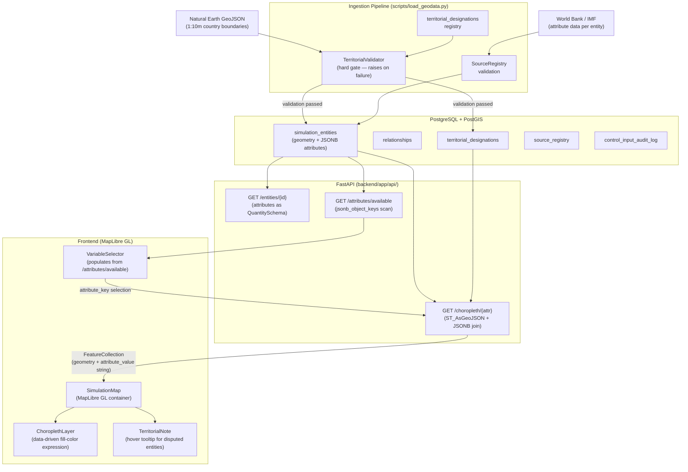

# ADR-003: Geospatial Foundation — PostGIS, FastAPI, MapLibre

## Status
DRAFT

## Validity Context

**Standards Version:** 2026-04-20
**Valid Until:** Milestone 3 completion
**License Status:** DRAFT — not yet active

**Renewal Triggers** — any of the following fires the CURRENT → UNDER-REVIEW
transition:
- `Quantity` serialization contract changes in `DATA_STANDARDS.md` or ADR-001
  that affect the wire format (e.g., new required fields on the Quantity JSON
  envelope)
- Territorial framework (`TerritorialDesignation`, `DisputeStatus`) modified in
  `DATA_STANDARDS.md` in ways that require schema migration
- `SimulationEntity` geometry field type changes in ADR-001 (e.g., multi-geometry
  or 3D geometry support added)
- FastAPI authentication model introduced (currently deferred to Milestone 3);
  any authenticated endpoint added to this layer triggers renewal
- Tile serving approach changes from GeoJSON-over-REST to MVT (requires
  endpoint contract revision)

## Date
2026-04-20

## Context

Milestone 1 established the simulation engine: `SimulationEntity` with
`dict[str, Quantity]` attributes, the event propagation graph, the input
orchestration layer, and 210 passing tests. The engine runs and produces
correct output but has no persistence layer, no API, and no visualisation.

Milestone 2 introduces three new architectural components that were referenced
but not implemented in Milestone 1:

1. **PostGIS database** — persistent storage for entity state, geometry,
   relationships, audit logs, and source registry
2. **FastAPI layer** — REST API serving entity data and choropleth variable
   data to the frontend
3. **MapLibre GL frontend** — map-first UI rendering one country-level variable
   as a choropleth

ADR-001 deferred the database schema, noting `geometry: Optional[Geometry]`
on `SimulationEntity` as a "PostGIS spatial reference." ADR-002 deferred
persistent `AuditLog` storage to Milestone 2. Both debts are paid here.

The dominant constraint across all four decisions in this ADR is the
`dict[str, Quantity]` attribute store introduced in ADR-001 Amendment 1.
Every decision about schema, serialization, and API contract must preserve
the full `Quantity` envelope — `value`, `unit`, `variable_type`,
`confidence_tier`, `observation_date`, `source_registry_id` — without
lossy conversion. A `float` on the wire is an architectural regression.

The secondary constraint is the territorial position framework from
`DATA_STANDARDS.md §Political and Territorial Nomenclature Standards`. Five
high-risk cases (TWN, PSE, XKX, ESH, Crimea) have declared handling
requirements that must be enforced before any entity record reaches the
database. Silent territorial assertion is a methodological and ethical
failure; the architecture must make it impossible.

---

## Decision 1: PostGIS Database Schema

### Approach: JSONB Attribute Store with PostGIS Geometry Column

`SimulationEntity.attributes` is `dict[str, Quantity]` — a variable-keyed
map of typed, unit-carrying values. The attribute set grows with each new
module. A fixed-column relational schema requires schema migration for every
new attribute; an EAV (Entity-Attribute-Value) table normalizes correctly but
makes spatial-join queries against attribute values slow.

**Decision:** Store `attributes` as a single `JSONB` column. PostgreSQL's
JSONB supports GIN indexing, path-operator queries, and efficient partial
updates. The full `Quantity` struct is serialized into each JSON value,
preserving the complete envelope. Geometry is stored in a native PostGIS
`GEOGRAPHY(MultiPolygon, 4326)` column, enabling correct great-circle
distance and area calculations.

### Schema

```sql
-- Core entity table
CREATE TABLE simulation_entities (
    entity_id        TEXT PRIMARY KEY,        -- ISO 3166-1 alpha-3 (or alpha-3+modifier)
    entity_type      TEXT NOT NULL,           -- 'country' | 'region' | 'institution'
    parent_id        TEXT REFERENCES simulation_entities(entity_id),
    geometry         GEOGRAPHY(MultiPolygon, 4326),
    attributes       JSONB NOT NULL DEFAULT '{}',
    metadata         JSONB NOT NULL DEFAULT '{}',
    created_at       TIMESTAMPTZ NOT NULL DEFAULT NOW(),
    updated_at       TIMESTAMPTZ NOT NULL DEFAULT NOW()
);

-- Bilateral relationship edges
CREATE TABLE relationships (
    relationship_id  TEXT PRIMARY KEY,
    source_id        TEXT NOT NULL REFERENCES simulation_entities(entity_id),
    target_id        TEXT NOT NULL REFERENCES simulation_entities(entity_id),
    relationship_type TEXT NOT NULL,          -- 'trade' | 'debt' | 'alliance' | 'currency'
    weight           NUMERIC NOT NULL,        -- propagation strength; NUMERIC not float
    attributes       JSONB NOT NULL DEFAULT '{}',
    created_at       TIMESTAMPTZ NOT NULL DEFAULT NOW()
);

-- Territorial designation registry (DATA_STANDARDS.md §Disputed Territory)
CREATE TABLE territorial_designations (
    entity_id        TEXT NOT NULL REFERENCES simulation_entities(entity_id),
    de_facto_admin   TEXT NOT NULL,           -- ISO alpha-3 of administering entity
    de_jure_claimants TEXT[] NOT NULL,        -- ISO alpha-3 array
    dispute_status   TEXT NOT NULL,           -- DisputeStatus enum value
    effective_date   DATE NOT NULL,
    source           TEXT NOT NULL,
    display_note     TEXT NOT NULL,
    created_at       TIMESTAMPTZ NOT NULL DEFAULT NOW(),
    PRIMARY KEY (entity_id, effective_date)
);

-- Source registry (DATA_STANDARDS.md §Data Provenance Requirements)
CREATE TABLE source_registry (
    source_id        TEXT PRIMARY KEY,
    name             TEXT NOT NULL,
    provider         TEXT NOT NULL,
    dataset_name     TEXT NOT NULL,
    version          TEXT NOT NULL,
    permanent_url    TEXT NOT NULL,
    access_date      DATE NOT NULL,
    license          TEXT NOT NULL,
    coverage_start   DATE NOT NULL,
    coverage_end     DATE,
    coverage_countries TEXT[] NOT NULL DEFAULT '{}',
    quality_tier     INTEGER NOT NULL CHECK (quality_tier BETWEEN 1 AND 5),
    simulation_variables TEXT[] NOT NULL DEFAULT '{}',
    known_limitations TEXT NOT NULL DEFAULT '',
    created_at       TIMESTAMPTZ NOT NULL DEFAULT NOW()
);

-- Persistent audit log (ADR-002 §ControlInputAuditRecord — deferred from M1)
CREATE TABLE control_input_audit_log (
    record_id        TEXT PRIMARY KEY,
    scenario_id      TEXT NOT NULL,
    session_id       TEXT NOT NULL,
    timestep         TIMESTAMPTZ NOT NULL,
    input_type       TEXT NOT NULL,
    source           TEXT NOT NULL,           -- InputSource enum value
    actor_id         TEXT NOT NULL,
    actor_role       TEXT NOT NULL,
    justification    TEXT NOT NULL,
    raw_input        JSONB NOT NULL,
    translated_events TEXT[] NOT NULL,
    wall_clock_time  TIMESTAMPTZ NOT NULL DEFAULT NOW()
);
```

### Quantity JSONB Envelope

Each key in `attributes` JSONB maps to a serialized `Quantity`. The envelope
preserves the full type contract from ADR-001 Amendment 1:

```json
{
  "gdp": {
    "value": "44000000000",
    "unit": "USD_2015",
    "variable_type": "flow",
    "confidence_tier": 1,
    "observation_date": "2023-01-01",
    "source_registry_id": "WB_WDI_GDP_2024",
    "measurement_framework": "financial"
  },
  "debt_gdp_ratio": {
    "value": "1.46",
    "unit": "dimensionless",
    "variable_type": "ratio",
    "confidence_tier": 1,
    "observation_date": "2023-01-01",
    "source_registry_id": "IMF_WEO_2024",
    "measurement_framework": "financial"
  }
}
```

`value` is serialized as a **string**, not a JSON number. JSON numbers are
IEEE 754 doubles — storing `"44000000000"` as a JSON number loses precision
for large monetary values. The API layer deserializes to `Decimal` on read.
This is a non-negotiable consequence of the float prohibition in
`DATA_STANDARDS.md §Prohibition on Float for Monetary Values`.

### Required Indexes

```sql
-- Spatial query support (PostGIS GiST index — required for ST_Intersects,
-- ST_DWithin, spatial joins in choropleth endpoint)
CREATE INDEX idx_entities_geometry
    ON simulation_entities USING GIST (geometry);

-- Hierarchy traversal (parent→children lookups)
CREATE INDEX idx_entities_parent_id
    ON simulation_entities (parent_id)
    WHERE parent_id IS NOT NULL;

-- Entity type filter (common query pattern: "all countries")
CREATE INDEX idx_entities_type
    ON simulation_entities (entity_type);

-- JSONB attribute key access (GIN enables @>, ?, ?| operators)
-- Supports queries like: attributes @> '{"gdp": {}}'
CREATE INDEX idx_entities_attributes_gin
    ON simulation_entities USING GIN (attributes);

-- Relationship edge traversal (both directions)
CREATE INDEX idx_relationships_source ON relationships (source_id);
CREATE INDEX idx_relationships_target ON relationships (target_id);
CREATE INDEX idx_relationships_type   ON relationships (relationship_type);

-- Audit log scenario replay
CREATE INDEX idx_audit_scenario ON control_input_audit_log (scenario_id, timestep);
```

### Why Not EAV

An EAV table (`entity_id, attribute_key, value_json`) normalizes cleanly but
requires a `JOIN` or `GROUP BY` to reconstruct an entity's attribute map.
A choropleth query (`SELECT entities.geometry, attrs.value FROM entities JOIN
attrs ON ... WHERE attrs.key = 'gdp'`) requires an EAV join per attribute
requested. With JSONB, the same query is a direct column access with a path
operator — a single table scan with GIN index acceleration.

The simulation's primary access pattern is always: "give me entity geometry
plus one (or a few) attribute values." JSONB serves this pattern directly.

---

## Decision 2: FastAPI Layer Contract

### Endpoints Required for Milestone 2

**Base path:** `/api/v1`

**Authentication:** None for Milestone 2. All M2 endpoints are read-only
and unauthenticated. Authentication is Milestone 3 scope (required before
user-defined scenario injection is exposed via API). No security is worse
than false security — a placeholder auth scheme that isn't enforced creates
a misleading sense of protection. M2 is explicitly a local development and
demo environment.

#### Endpoint Definitions

```
GET /api/v1/health
```
Returns `{"status": "ok", "milestone": "2"}`. Required by CI health checks.

```
GET /api/v1/entities
```
Returns paginated list of entity summaries (no geometry, no attributes).
Query parameters: `entity_type` (filter), `limit` (default 50), `offset`.

```
GET /api/v1/entities/{entity_id}
```
Returns a single entity with full `attributes` JSONB deserialized to
`Dict[str, QuantitySchema]`. Geometry is excluded — use the GeoJSON endpoint
for geometry. This separation prevents accidentally loading a 2MB geometry
payload when only attributes are needed.

```
GET /api/v1/entities/{entity_id}/geometry
```
Returns the entity's geometry as a GeoJSON Feature with `properties.entity_id`
and `properties.entity_type`. No attributes.

```
GET /api/v1/choropleth/{attribute_key}
```
The primary frontend endpoint. Returns a GeoJSON `FeatureCollection` where
each Feature is a country boundary geometry with the requested attribute
value serialized into `properties`. This is the single round-trip that
gives MapLibre everything it needs to render a choropleth.

Response format per feature:
```json
{
  "type": "Feature",
  "geometry": { ... },
  "properties": {
    "entity_id": "GRC",
    "entity_type": "country",
    "attribute_key": "gdp",
    "attribute_value": "44000000000",
    "attribute_unit": "USD_2015",
    "variable_type": "flow",
    "confidence_tier": 1,
    "observation_date": "2023-01-01",
    "has_territorial_note": false,
    "territorial_note": null
  }
}
```

`attribute_value` is a string (Decimal serialization — see Decision 1).
MapLibre receives it as a string and the frontend converts to a float for
the color scale only at the rendering boundary. The simulation layer never
receives a float.

`has_territorial_note` and `territorial_note` are populated from the
`territorial_designations` table for disputed entities. MapLibre renders
an info icon on flagged features; the `display_note` text from
`DATA_STANDARDS.md` is surfaced to the user on hover.

```
GET /api/v1/attributes/available
```
Returns the set of attribute keys that exist across all country-type entities,
with their unit and variable_type. Used by the frontend to populate the
variable selector. Sourced from a `DISTINCT jsonb_object_keys(attributes)`
query.

### Quantity Serialization Schema

The Pydantic response model for `Quantity` values:

```python
class QuantitySchema(BaseModel):
    value: str                    # Decimal as string — preserves precision
    unit: str
    variable_type: str            # VariableType enum value
    confidence_tier: int          # 1–5
    observation_date: date
    source_registry_id: str
    measurement_framework: str | None = None

    model_config = ConfigDict(
        json_encoders={Decimal: str}  # belt-and-suspenders: Decimal → str
    )
```

`value` is `str` in the schema, not `float` and not `Decimal`. Pydantic
serializes `Decimal` to float by default — this default is explicitly
overridden. Any Pydantic upgrade that changes this default is a renewal
trigger for this ADR.

### Implementation Notes

- FastAPI `lifespan` context manager manages the asyncpg connection pool.
  No connection per request — one pool shared across the application.
- `asyncpg` for async PostgreSQL access. SQLAlchemy ORM is not used in M2;
  the query patterns are straightforward enough that raw SQL with asyncpg is
  simpler and faster.
- The choropleth endpoint uses a single `ST_AsGeoJSON` + JSONB query:

```sql
SELECT
    ST_AsGeoJSON(e.geometry) AS geometry_json,
    e.entity_id,
    e.entity_type,
    e.attributes->$1 AS attribute_json,
    td.display_note AS territorial_note
FROM simulation_entities e
LEFT JOIN territorial_designations td
    ON td.entity_id = e.entity_id
    AND td.effective_date = (
        SELECT MAX(effective_date) FROM territorial_designations
        WHERE entity_id = e.entity_id
    )
WHERE e.entity_type = 'country'
  AND e.attributes ? $1
```

The geometry-attribute join is done in the database, not in application code.
Pulling geometry and attributes separately and joining in Python doubles
data transfer and loses the opportunity for the query planner to use the
GiST index.

---

## Decision 3: MapLibre GL Integration

### Approach: GeoJSON-over-REST, Single Endpoint, Data-Driven Style

Two approaches were considered:

**GeoJSON-over-REST:** The frontend fetches a single `FeatureCollection` from
`/api/v1/choropleth/{attribute_key}`. ~250 country polygons at 1:10m
resolution is approximately 2MB compressed JSON. MapLibre loads this as a
GeoJSON source and applies a data-driven paint expression for choropleth
coloring.

**MVT (Mapbox Vector Tiles):** PostGIS `ST_AsMVT` tiles served from a
`/tiles/{z}/{x}/{y}` endpoint. Better for large datasets and real-time
scenario streaming. Significantly more complex: requires a tile cache layer
(Redis or file system), tile invalidation on data update, and a MapLibre
`vector` source with separate attribute data fetch.

**Decision: GeoJSON-over-REST for Milestone 2.** 250 polygons at 2MB is
within MapLibre's comfortable handling range for a single GeoJSON source.
MVT adds substantial infrastructure complexity for a dataset of this size.
The architecture does not foreclose MVT — switching from a `geojson` source
to a `vector` source in MapLibre is a frontend-only change. MVT is
Milestone 3+ scope when real-time scenario output updates require efficient
partial tile invalidation.

### Frontend Architecture

```
frontend/
  src/
    components/
      SimulationMap.tsx     — MapLibre map container
      ChoroplethLayer.tsx   — Layer + paint expression for choropleth
      VariableSelector.tsx  — Dropdown populated from /attributes/available
      TerritorialNote.tsx   — Hover tooltip for disputed entities
    hooks/
      useChoroplethData.ts  — Fetch and cache FeatureCollection
      useAvailableAttributes.ts
    api/
      client.ts             — Typed fetch wrapper for /api/v1/
    types/
      quantity.ts           — TypeScript QuantitySchema type
      geojson.ts            — Typed FeatureCollection with WorldSim properties
```

### Variable Request Flow

1. On mount, `useAvailableAttributes` fetches `GET /api/v1/attributes/available`
   and populates the `VariableSelector` dropdown.
2. User selects an attribute (or default `gdp` on first load).
3. `useChoroplethData` fetches `GET /api/v1/choropleth/{attribute_key}`.
4. MapLibre source is set to the returned `FeatureCollection`.
5. `ChoroplethLayer` applies a `fill-color` paint expression:

```typescript
// MapLibre data-driven paint expression
// attribute_value is a string (Decimal) — convert to number at render boundary
const fillColor: maplibregl.FillPaint = {
  "fill-color": [
    "interpolate",
    ["linear"],
    ["to-number", ["get", "attribute_value"]],
    0,        "#f7fbff",
    percentile25,  "#6baed6",
    percentile50,  "#2171b5",
    percentile75,  "#08306b",
  ],
  "fill-opacity": 0.8,
};
```

Color scale breakpoints are computed from the distribution of
`attribute_value` across the returned features. The conversion from string
to number happens in the MapLibre paint expression (`["to-number", ...]`),
not in application code — the string value never becomes a JavaScript float
before the rendering layer.

6. On hover, if `has_territorial_note` is `true`, `TerritorialNote` displays
   the `territorial_note` string in a tooltip.

### Variable Switching

Switching variables does not reload the page. `useChoroplethData` is
re-invoked with the new `attribute_key`. The prior `FeatureCollection` is
replaced in the MapLibre source. The paint expression breakpoints are
recomputed from the new distribution. This is a pure frontend state update
with one HTTP request.

---

## Decision 4: Territorial Position Validation

### Approach: Hard-Gate Pipeline Validator at Ingestion Boundary

Territorial validation runs as a mandatory pipeline stage between raw
GeoJSON ingestion (Natural Earth source data) and the first PostgreSQL
`INSERT`. It is a hard gate — a validation failure raises
`TerritorialValidationError` and halts the pipeline. No disputed entity
record may enter the database without a corresponding entry in
`territorial_designations`.

**Why a hard gate, not a warning.** A warning produces a database that
silently contains undeclared territorial positions. A system that loads
Taiwan as a country record without the required `display_note` has
implicitly taken a political position without declaring it. The failure mode
of a hard gate is a visible pipeline error. The failure mode of a warning is
an invisible methodological error that reaches users. The hard gate is
correct.

### TerritorialValidator

```python
class TerritorialValidator:
    """Validates ingested entity records against territorial policy before DB write.

    All five high-risk cases from DATA_STANDARDS.md must have an entry in the
    provided designation registry. The validator also checks that any Natural
    Earth feature with a disputed marker has a corresponding designation.
    """

    REQUIRED_DESIGNATIONS: ClassVar[set[str]] = {"TWN", "PSE", "XKX", "ESH"}
    CRIMEA_ADMIN_ENTITY: ClassVar[str] = "UKR"

    def __init__(self, designation_registry: Sequence[TerritorialDesignation]) -> None:
        self._registry: dict[str, TerritorialDesignation] = {
            d.entity_id: d for d in designation_registry
        }

    def validate_entity(self, entity_id: str, natural_earth_properties: dict) -> None:
        """Raise TerritorialValidationError if entity lacks required designation.

        Args:
            entity_id: ISO 3166-1 alpha-3 (or alpha-3+modifier) of the entity.
            natural_earth_properties: Raw properties dict from the Natural Earth
                GeoJSON feature. Must include 'disputed' flag if present in source.

        Raises:
            TerritorialValidationError: If entity requires a designation that
                is absent from the registry.
        """
        if entity_id in self.REQUIRED_DESIGNATIONS:
            if entity_id not in self._registry:
                raise TerritorialValidationError(
                    f"Entity {entity_id!r} is a required high-risk designation "
                    f"case (DATA_STANDARDS.md §High-Risk Specific Cases) but has "
                    f"no entry in the territorial designation registry. "
                    f"Pipeline halted. Register a TerritorialDesignation before "
                    f"loading this entity."
                )

        disputed_flag = natural_earth_properties.get("disputed", "F")
        if disputed_flag == "T" and entity_id not in self._registry:
            raise TerritorialValidationError(
                f"Entity {entity_id!r} is marked as disputed in Natural Earth "
                f"source data but has no entry in the territorial designation "
                f"registry. Pipeline halted."
            )

    def validate_all(
        self,
        entities: Sequence[tuple[str, dict]],  # (entity_id, natural_earth_properties)
    ) -> None:
        """Validate a batch of entities. Collects all errors before raising.

        Collects all validation errors rather than failing on the first to
        allow the operator to fix all missing designations in one pass.
        """
        errors: list[str] = []
        for entity_id, props in entities:
            try:
                self.validate_entity(entity_id, props)
            except TerritorialValidationError as exc:
                errors.append(str(exc))
        if errors:
            raise TerritorialValidationError(
                f"{len(errors)} territorial validation error(s):\n"
                + "\n".join(f"  - {e}" for e in errors)
            )
```

### Pipeline Integration

```python
def load_natural_earth_boundaries(
    geojson_path: Path,
    designation_registry: Sequence[TerritorialDesignation],
    db_conn: asyncpg.Connection,
) -> None:
    """Load Natural Earth country boundaries into PostGIS.

    Territorial validation runs before any INSERT. If validation fails,
    no records are written.
    """
    with geojson_path.open(encoding="utf-8") as f:
        feature_collection = json.load(f)

    validator = TerritorialValidator(designation_registry)

    # Collect entities for batch validation — fail fast before any DB writes
    entities = [
        (feature["properties"]["ISO_A3"], feature["properties"])
        for feature in feature_collection["features"]
    ]
    validator.validate_all(entities)  # raises TerritorialValidationError if any fail

    # Validation passed — proceed with INSERT
    async with db_conn.transaction():
        for feature in feature_collection["features"]:
            entity_id = feature["properties"]["ISO_A3"]
            await db_conn.execute(
                """
                INSERT INTO simulation_entities (entity_id, entity_type, geometry, metadata)
                VALUES ($1, 'country', ST_GeomFromGeoJSON($2), $3)
                ON CONFLICT (entity_id) DO UPDATE
                    SET geometry = EXCLUDED.geometry,
                        metadata = EXCLUDED.metadata,
                        updated_at = NOW()
                """,
                entity_id,
                json.dumps(feature["geometry"]),
                json.dumps({
                    "name_en": feature["properties"].get("NAME", ""),
                    "name_key": f"country.{entity_id}.name",
                    "iso_a3": entity_id,
                }),
            )
```

### CI Enforcement (Issue #50)

The territorial validation test suite:
1. **Fixture test**: a test fixture containing the five required high-risk
   entities with correct designation records passes validation.
2. **Missing designation test**: a fixture missing `TWN` raises
   `TerritorialValidationError` with the correct message.
3. **Disputed-without-designation test**: a Natural Earth feature with
   `disputed: "T"` and no registry entry raises `TerritorialValidationError`.
4. **Crimea handling test**: `UA-43` (ISO 3166-2) appears in subnational
   entities with correct `dispute_status = CONTESTED_ADMIN` and
   `display_note` per `DATA_STANDARDS.md`.

These tests run in CI as part of the data pipeline test suite. A territorial
validation failure is a CI failure.

---

## Data Flow Diagram



---

## Alternatives Considered

### Alternative 1: SQLAlchemy ORM instead of raw asyncpg

SQLAlchemy 2.x with async support would give an ORM layer over the
JSONB attribute store. Rejected for M2: the choropleth query is a
spatial join that benefits from writing the `ST_AsGeoJSON` expression
directly; an ORM abstraction would obscure it without adding safety.
The query surface for M2 is small and stable. SQLAlchemy is reconsidered
at M3 when scenario runs produce multiple state snapshots and the query
surface grows.

### Alternative 2: MVT tile serving for MapLibre

`ST_AsMVT` + Redis tile cache would handle large datasets and real-time
scenario updates efficiently. Rejected for M2: 250 country polygons at
2MB is within GeoJSON handling range. The added infrastructure (tile
cache, invalidation logic, `vector` source protocol in MapLibre) adds
weeks of work for a dataset that doesn't need it. MVT is the right
approach at M3 when scenario output changes require sub-second map
updates.

### Alternative 3: Separate geometry and attribute fetches

Frontend fetches boundaries once and caches, then fetches attribute values
separately and joins in JavaScript. Rejected: this pushes a spatial join
into the browser, doubles HTTP round trips on initial load, and requires
the frontend to implement join logic that is more efficiently done in
PostGIS. The single choropleth endpoint is the correct boundary.

### Alternative 4: Flat table schema for attributes

One column per simulation attribute (`gdp NUMERIC`, `inflation_rate NUMERIC`,
etc.). Rejected: schema migration required for every new module attribute.
A module that adds 15 new attributes requires an `ALTER TABLE`. With JSONB,
new attributes are written without schema changes. The query performance
difference is acceptable for M2 read patterns (GIN-indexed JSONB path
queries are fast for the attribute key access pattern used in the choropleth
endpoint).

---

## Consequences

### Positive
- `Quantity` envelope is preserved through the full stack: PostGIS JSONB →
  FastAPI `QuantitySchema` → MapLibre feature properties. No float coercion
  occurs until the MapLibre rendering expression, which is the correct boundary.
- Territorial positions are enforced architecturally — no runtime check or
  documentation convention can be bypassed; the pipeline fails loudly.
- GeoJSON choropleth endpoint collapses geometry + attribute into a single
  round trip, minimising frontend complexity for M2.
- Schema-less JSONB attributes accommodate module growth without migrations.
- ADR-002's deferred `AuditLog` persistence is paid in full with the
  `control_input_audit_log` table.

### Negative
- JSONB attribute storage makes cross-entity attribute aggregation
  (`SELECT AVG((attributes->>'gdp')::numeric) FROM simulation_entities`)
  more verbose than a column-per-attribute schema. Acceptable for M2
  read patterns; revisit if reporting queries become a performance concern.
- Decimal-as-string in the API wire format requires explicit `to-number`
  coercion in MapLibre paint expressions and TypeScript client code.
  This is a necessary cost of the float prohibition — documenting it
  explicitly prevents future attempts to "simplify" by switching to JSON
  numbers.
- No authentication in M2 means the API must not be exposed to a public
  network. M2 is a localhost/development environment. This constraint must
  be removed before any production or institutional deployment.

## Diagrams

Mermaid data flow diagram is embedded in this ADR above.

Component diagrams to be added at implementation:
- `docs/architecture/ADR-003-schema-erd.mmd` — entity-relationship diagram
  for the four PostGIS tables
- `docs/architecture/ADR-003-api-sequence.mmd` — sequence diagram for the
  choropleth fetch cycle

## Next ADR

ADR-004 (Uncertainty Quantification Architecture) is deferred pending
STD-REVIEW-001 (issue #38). It will address how the simulation engine
produces output distributions rather than point estimates for the scenario
engine in Milestone 3.
