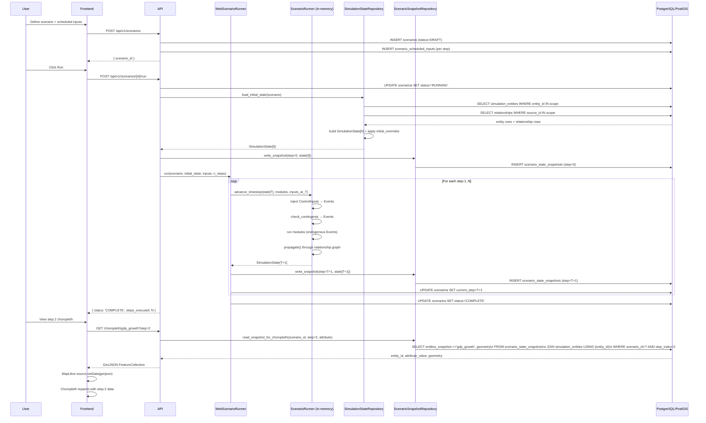

# ADR-004: Scenario Engine — Configuration, Execution, Backtesting, Time Controls, Comparative Output

## Status
Accepted

## Validity Context

**Standards Version:** 2026-04-21
**Valid Until:** Milestone 6 completion
**License Status:** CURRENT

**Engineering Lead accepted 2026-04-21.** Architecture decisions reviewed and
approved. Implementation may proceed.

**Last Reviewed:** 2026-05-03 — Milestone 5 exit review. **Renewal trigger
fired** — threshold_type enum extended (Issue #194). The M5 `backtesting_thresholds`
table (migration `b5d3f7a2c8e1`) introduces `threshold_type CHECK IN
('DIRECTION_ONLY', 'MAGNITUDE', 'DISTRIBUTION_COMBINED')` — the threshold_type
enum anticipated by ADR-004 Decision 4 has been formally instantiated in the
database with the three types the decision described. Review confirms all
ADR-004 decisions remain sound: the new threshold types implement the
evaluation logic that Decision 4 specified as required for historical
calibration; no scenario replay format, advance protocol, or snapshot
contract was altered. DIRECTION_ONLY and DISTRIBUTION_COMBINED infrastructure
confirmed operational; MAGNITUDE threshold calibration deferred per
PARAMETER_CALIBRATION_DISCLOSURE. engine_version gap (Issue #139) remains a
documented known limitation. License renewed for Milestone 6. Next scheduled
review at Milestone 6 completion.

**Previously reviewed:** 2026-04-26 — Milestone 4 exit review. No renewal triggers
fired during Milestone 4. License Status confirmed CURRENT. The `modules_config`
field on `ScenarioConfigSchema` (ADR-004 Decision 2 extension for DemographicModule
activation) is a backward-compatible additive change — existing snapshot format,
advance protocol, and backtesting contracts are unaffected. The `events_snapshot`
JSONB column added to `scenario_state_snapshots` (MDA threshold system) is additive
— snapshot v2 envelope format from SCAN-015 accommodates it. engine_version gap
(Issue #139) remains a documented known limitation; verifiable pointer mechanism
deferred to Milestone 5. License renewed for Milestone 5.

**Previously reviewed:** 2026-04-24 — Milestone 3 exit review. No renewal triggers
fired during Milestone 3. License Status confirmed CURRENT. All five decisions
implemented and verified by SCAN-013 (comparative scenario output, 0
violations) and SCAN-014 (M3 exit gate, 59 files, 0 violations). engine_version
gap tracked in Issue #139 as documented known limitation.

**Renewal Triggers** — any of the following fires the CURRENT → UNDER-REVIEW
transition:
- Scenario storage format changed (JSONB ControlInput serialisation format
  revised in a way that breaks existing scenario replay)
- Backtesting fidelity threshold contract changed (MAGNITUDE thresholds added
  under Issue #44 parameter calibration tier standards, altering the
  threshold_type enum or calibration_tier semantics)
- Streaming execution model introduced (SSE or WebSocket for step-by-step
  real-time updates replaces the request-response time controls decided here)
- Comparative scenario API contract changed (endpoint paths, response shape,
  or delta computation method revised)
- SimulationState snapshot format changed (breaks step-by-step replay or
  comparative queries)
- `ia1_disclosure` enforcement mechanism changed (currently non-nullable
  column; if moved to application layer, the guarantee must be re-examined)

## Date
2026-04-21

## Context

Milestone 2 delivered the geospatial foundation (ADR-003):
- 177 country entities with Level 1 attributes in PostGIS
- FastAPI layer serving GeoJSON choropleth by attribute
- MapLibre GL frontend rendering one variable as choropleth

The simulation engine itself (ADR-001, ADR-002) was delivered in Milestone 1:
event propagation, `ScenarioRunner`, `ControlInput` types, in-memory `AuditLog`.
But the engine operates exclusively on in-memory Python objects. It has no
connection to the database.

The gap between Milestone 1's in-memory simulation and Milestone 2's PostGIS-
backed map is the core architectural problem this ADR solves.

**Milestone 3 exit criteria** (Issue #61):
1. User-defined scenario configuration
2. Time acceleration controls
3. Comparative scenario output (two scenarios side-by-side or as delta)
4. First backtesting run against Greece 2010–2012, fidelity thresholds
   CI-enforced

Meeting these criteria requires five architectural decisions:

1. How scenarios are configured, stored, and versioned
2. How the simulation engine connects to the database and how state is
   persisted between steps
3. How backtesting runs compare simulation output against historical actuals,
   and how fidelity thresholds become CI failures
4. How the frontend requests simulation step advances and how the API serves
   choropleth data per step
5. How two scenarios are compared and how the comparison is rendered

These five decisions are independent enough to describe separately but cohesive
enough to require a single ADR — they share database tables, API contracts,
and frontend component contracts.

**Open dependencies at the time of writing:**

- **Issue #44** (parameter calibration tier system, SA-03) — Milestone 3 exit
  blocker. MAGNITUDE backtesting thresholds require calibrated parameters. M3
  ships DIRECTION_ONLY thresholds. MAGNITUDE thresholds are unlocked when
  Issue #44 standards are resolved.
- **Issue #69** (IA-1: confidence_tier time-horizon degradation) — Milestone 3
  exit blocker. All backtesting output must carry an explicit IA-1 disclosure.
  This ADR enforces it at the database level.

---

## Decision

### Decision 1: Scenario Configuration

#### Amendment — CONFLICT C-1 Disposition (2026-04-23)

**STD-REVIEW-002 CONFLICT C-1** raised by the Security Agent: `DELETE /scenarios/{id}`
CASCADE-deletes `scenario_scheduled_inputs` and `scenario_state_snapshots`, which the
Security Agent characterised as audit trail destruction. The QA Agent proposed a soft
delete pattern with a `DELETED` status transition. The Architect Agent noted that soft
delete requires an ADR amendment to this decision.

**Engineering Lead ruling:** Export-before-delete is excluded. Archiving must be a
separate explicit user action (`POST /scenarios/{id}/archive`). DELETE must only delete.

**Disposition: Option B — hard DELETE preserved with pre-delete log requirement.**

Rationale:

1. `scenario_scheduled_inputs` is *configuration data*, not execution audit data.
   The authoritative execution audit trail is `control_input_audit_log` (ADR-002),
   which records every `ControlInput` that actually fired. This table uses a plain-text
   `scenario_id` reference (no FK), so it survives scenario deletion intact. A scenario
   can be deleted without destroying the execution record of what it did.

2. Before the CASCADE executes, the `DELETE /scenarios/{id}` endpoint must write a
   deletion record to an audit store capturing: `scenario_id`, `name`, full
   `configuration` JSONB, full `scheduled_inputs` JSONB array (all rows from
   `scenario_scheduled_inputs` serialised in step order), `engine_version` (the
   WorldSim API version string at time of deletion), `created_at` (original scenario
   creation timestamp), `deleted_at`, and `deleted_by`. This preserves a complete
   tombstone even after all child rows are cascade-deleted. The deletion record must
   be written in the same transaction as the DELETE — if the transaction rolls back,
   the tombstone write is also rolled back.

   Because SA-11 (Issue #126) requires that every scenario implementation is
   deterministic — same configuration, same initial state, same engine version
   produces identical output — state snapshots are *derived data*. They can be
   regenerated from configuration plus scheduled inputs plus source entity data.
   The tombstone therefore contains everything needed for full reconstruction: load
   source entity data at `base_date` from `simulation_entities`, read tombstone
   `configuration` and `scheduled_inputs`, run through the `engine_version` recorded
   in the tombstone, and identical output is produced. State snapshots are a
   performance cache of this derivation, not the primary record. Deleting them does
   not destroy information that cannot be recovered.

3. `POLICY.md §Scenario Data Retention` (SA-06, Issue #121) must declare:
   `scenario_scheduled_inputs` is scenario configuration data. It is retained for the
   lifetime of the scenario and deleted with it. `control_input_audit_log` is the
   authoritative execution record and is not cascade-deleted.

4. `POST /scenarios/{id}/archive` (soft delete marker, 30-day retention) is deferred
   to **Milestone 4**. It is not a Milestone 3 requirement. When it is added, it will
   amend this decision at that time.

**No change to the cascade schema.** The `ON DELETE CASCADE` constraints on
`scenario_scheduled_inputs` and `scenario_state_snapshots` are correct and remain.
The audit store requirement is an application-layer addition to the DELETE endpoint.

**CONFLICT C-1 is resolved.** No further Engineering Lead action required on this conflict.

#### Known Limitation — engine_version is a Declaration, Not a Verifiable Pointer (2026-04-24)

The reconstruction guarantee in the tombstone design rests on SA-11 determinism: same
configuration + same scheduled inputs + same engine version → identical output. This
guarantee has a boundary condition that is not yet enforced.

**The gap:** `engine_version` is currently stored as a semantic version string
(`"0.3.0"`) hardcoded in `app/api/scenarios.py`. This is a *declaration* — it records
what version was claimed at deletion time, but provides no mechanism to:

1. Verify that the string corresponds to a specific, retrievable engine artifact.
2. Instantiate that engine version at reconstruction time if it differs from the
   current deployed version.
3. Block or flag a reconstruction attempt when the tombstone version and the live
   engine version do not match.

**Why this matters at Milestone 4:** M4 will recalibrate propagation coefficients and
add new simulation modules (Human Cost Ledger). A tombstone written under M3
(`engine_version = "0.3.0"`) reconstructed against the M4 engine will produce
different outputs than the user originally saw. The reconstruction guarantee silently
fails — no error is raised, but the outputs are not reproducible.

**The conservative control posture:** Block reconstruction unconditionally when tombstone
`engine_version` does not match the live engine version. Do not warn and proceed — the
system has no visibility into how reconstructed outputs are used downstream, so a
permissive response cannot be made safe by intent declaration. A logged exception
override mechanism should exist for explicit audit use cases, but the default must be
a hard block.

**The two-layer fix required (tracked in Issue #[TBD]):**

1. Replace the semantic version string with a git commit hash (or store both). A commit
   hash is a precise, retrievable pointer that unambiguously identifies the engine state.
   A semantic version string requires an external convention to resolve to a specific
   artifact.

2. Build the artifact convention: version-tagged Docker images or a git-pinned
   deployment mechanism that allows a specific engine version to be instantiated on
   demand for reconstruction. The tombstone already has the right shape; the resolution
   mechanism does not yet exist.

**Status:** Open architectural gap. Tracked in Issue #139.
The tombstone remains sound as an audit record; the reconstruction guarantee is
accurate for same-version use and undeclared for cross-version use.

---

#### Database Schema

A scenario is a first-class database record. Three new tables are introduced
via a new Alembic migration:

**`scenarios`** — scenario configuration record:

```sql
scenario_id       UUID PRIMARY KEY DEFAULT gen_random_uuid()
name              TEXT NOT NULL
description       TEXT NOT NULL
scenario_type     TEXT NOT NULL
  -- FORWARD_PROJECTION | BACKTEST | COMPARATIVE
base_date         TIMESTAMPTZ NOT NULL   -- initial simulation timestep
n_steps           INTEGER NOT NULL
timestep_unit     TEXT NOT NULL DEFAULT 'annual'
  -- annual | monthly | custom
timestep_seconds  INTEGER               -- custom only; NULL for annual/monthly
entities_scope    JSONB NOT NULL DEFAULT '{"all": true}'
  -- {"all": true} OR {"entity_ids": ["GRC", "DEU", ...]}
modules_config    JSONB NOT NULL DEFAULT '{}'
  -- {"macroeconomic": false, "trade": false, ...}
initial_overrides JSONB NOT NULL DEFAULT '{}'
  -- {entity_id: {attr_key: Quantity-as-dict}} — overrides at step 0
status            TEXT NOT NULL DEFAULT 'DRAFT'
  -- DRAFT | READY | RUNNING | COMPLETE | FAILED | PARTIAL
current_step      INTEGER NOT NULL DEFAULT 0
created_at        TIMESTAMPTZ NOT NULL DEFAULT NOW()
updated_at        TIMESTAMPTZ NOT NULL DEFAULT NOW()
version           INTEGER NOT NULL DEFAULT 1
```

**`scenario_scheduled_inputs`** — ControlInput records bound to a scenario:

```sql
input_record_id   UUID PRIMARY KEY DEFAULT gen_random_uuid()
scenario_id       UUID NOT NULL REFERENCES scenarios(scenario_id) ON DELETE CASCADE
step_index        INTEGER NOT NULL
input_type        TEXT NOT NULL   -- class name of ControlInput subclass
input_data        JSONB NOT NULL
  -- full serialised ControlInput (same format as control_input_audit_log.raw_input)
created_at        TIMESTAMPTZ NOT NULL DEFAULT NOW()

INDEX idx_ssi_scenario_step (scenario_id, step_index)
```

**`scenario_state_snapshots`** — simulation state at each step:

```sql
snapshot_id       UUID PRIMARY KEY DEFAULT gen_random_uuid()
scenario_id       UUID NOT NULL REFERENCES scenarios(scenario_id) ON DELETE CASCADE
step_index        INTEGER NOT NULL
timestep          TIMESTAMPTZ NOT NULL
entities_snapshot JSONB NOT NULL
  -- Dict[entity_id → Dict[attr_key → Quantity-as-dict]]
  -- Quantity value is str(Decimal) — float prohibition preserved end-to-end
events_snapshot   JSONB NOT NULL
  -- List[Event-as-dict] that fired during this step
created_at        TIMESTAMPTZ NOT NULL DEFAULT NOW()

UNIQUE (scenario_id, step_index)
INDEX idx_sss_scenario_step (scenario_id, step_index)
```

The `entities_snapshot` uses the identical Quantity JSONB envelope format as
`simulation_entities.attributes` (ADR-003 Decision 1). Snapshot values are
stored as `str(Decimal)` — the float prohibition from `DATA_STANDARDS.md`
is preserved end-to-end from initial DB load through snapshot write.

#### Scenario Validation

Validation runs at two points:

**At `POST /api/v1/scenarios`** (creation): structural validation only —
required fields present, `n_steps > 0`, `scenario_type` is a known value,
`entities_scope` is well-formed.

**At `POST /api/v1/scenarios/{id}/run`** (execution): semantic validation —
entity IDs referenced in `initial_overrides` exist in `simulation_entities`;
each `scenario_scheduled_inputs` JSONB deserialises to a valid `ControlInput`
subclass; no two inputs at the same `step_index` declare conflicting instrument
types on the same entity. Semantic validation failure returns HTTP 422 with a
structured body listing each failure by `step_index` and entity ID.

#### Scenario Versioning

`version` is incremented on every PATCH to the scenario configuration (before
run). Once a scenario transitions to RUNNING, its configuration is immutable —
the `version` is frozen and no further edits are accepted. This preserves
reproducibility: a scenario's output is always traceable to a specific
configuration version via `(scenario_id, version)`.

#### API Endpoints

```
POST   /api/v1/scenarios
       — create scenario (status: DRAFT)
GET    /api/v1/scenarios/{scenario_id}
       — get scenario configuration and current status
PATCH  /api/v1/scenarios/{scenario_id}
       — update configuration (only allowed in DRAFT status)
POST   /api/v1/scenarios/{scenario_id}/run
       — execute scenario to completion (DRAFT|READY → RUNNING → COMPLETE|FAILED)
POST   /api/v1/scenarios/{scenario_id}/advance
       — execute exactly one step (READY|PARTIAL → PARTIAL)
GET    /api/v1/scenarios/{scenario_id}/states
       — list all step snapshots: [{step_index, timestep, snapshot_id}]
GET    /api/v1/scenarios/{scenario_id}/choropleth/{attribute}?step={N}
       — GeoJSON choropleth for attribute at step N
```

Scenario creation and execution are separate calls. The separation allows
scenario configurations to be reviewed and edited before they run, and
supports the step-by-step advance pattern used by time acceleration controls.

---

### Decision 2: Scenario Execution Engine

#### The Gap: In-Memory Engine → Database-Backed Engine

The existing `ScenarioRunner` (ADR-002) accepts a fully-specified in-memory
`SimulationState`. For Milestone 3, the initial state must be loaded from
`simulation_entities` + `relationships` tables, and state snapshots must be
written after each step.

This is achieved through two new repository classes in
`backend/app/simulation/repositories/`:

**`SimulationStateRepository`** — loads initial SimulationState from the DB:

```python
class SimulationStateRepository:
    async def load_initial_state(
        self,
        conn: asyncpg.Connection,
        scenario: ScenarioRecord,
    ) -> SimulationState:
        """Load entities + relationships from DB, apply initial_overrides."""
```

The loader:
1. Reads entities from `simulation_entities` (all, or filtered by `entities_scope`)
2. Reads directed edges from `relationships`
3. Converts each JSONB attribute envelope to a `Quantity` object (inverse of the
   envelope format defined in ADR-003 Decision 1)
4. Applies `initial_overrides` from the scenario config on top of the DB state
   (step-0 overrides allow scenarios to start from non-current entity state
   without modifying the live `simulation_entities` table)
5. Constructs and returns a `SimulationState` with `timestep = base_date`

**`ScenarioSnapshotRepository`** — writes and reads state snapshots:

```python
class ScenarioSnapshotRepository:
    async def write_snapshot(
        self,
        conn: asyncpg.Connection,
        scenario_id: str,
        step_index: int,
        state: SimulationState,
        events: list[Event],
    ) -> None:
        """Persist SimulationState as a snapshot for this step."""

    async def read_snapshot_entities(
        self,
        conn: asyncpg.Connection,
        scenario_id: str,
        step_index: int,
    ) -> dict[str, dict[str, Any]]:
        """Return entities_snapshot JSONB for a specific step."""

    async def read_snapshot_for_choropleth(
        self,
        conn: asyncpg.Connection,
        scenario_id: str,
        step_index: int,
        attribute: str,
    ) -> list[dict[str, Any]]:
        """Return GeoJSON features with attribute_value from snapshot.

        Joins snapshot entity values with simulation_entities geometry.
        """
```

#### The ScenarioRunner Is Not Modified

The `ScenarioRunner` class (ADR-002) remains unchanged. It operates on
in-memory Python objects. The repositories handle the database boundary —
they translate between the DB representation and the Python object model.
This preserves the full testability of the simulation logic independent of
database infrastructure. All 210+ existing tests continue to pass without
modification.

#### WebScenarioRunner

The `WebScenarioRunner` in `backend/app/simulation/orchestration/web_runner.py`
wraps the existing `ScenarioRunner` with database I/O:

```python
class WebScenarioRunner:
    async def run(
        self,
        conn: asyncpg.Connection,
        scenario_id: str,
    ) -> None:
        """Load scenario from DB, execute all steps, persist snapshots."""

    async def advance_one_step(
        self,
        conn: asyncpg.Connection,
        scenario_id: str,
    ) -> SimulationState:
        """Execute one step from current_step, persist snapshot, return state."""
```

Execution flow:
1. Load `ScenarioRecord` from `scenarios` table
2. Reconstruct `ControlInput` objects from `scenario_scheduled_inputs` JSONB
3. Load `SimulationState[0]` via `SimulationStateRepository`
4. Write step-0 snapshot
5. Set `scenarios.status = RUNNING`
6. For each step 1..n_steps: call `ScenarioRunner.advance_timestep()`, write
   snapshot, update `scenarios.current_step`
7. Set `scenarios.status = COMPLETE` (or FAILED on exception)

#### M3 Execution Model: Synchronous Within the Request

For M3, scenario execution is synchronous within the API request. `POST /run`
blocks until all `n_steps` are complete and all snapshots are written, then
returns. This is acceptable for M3 scenarios (Greece 2010–2012 is 2 annual
steps; USA tariff escalation is ≤ 10 steps).

A 60-second request timeout applies. Scenarios requiring more time must use
`POST /advance` iteratively. Background task-queue execution (Celery or
similar) is deferred to Milestone 4 when scenarios may run 50–100 steps.

---

### Decision 3: Backtesting Infrastructure

#### Greece 2010–2012: The First Backtesting Case

The first backtesting case uses the Greek sovereign debt crisis 2010–2012.
Selection criteria: the IMF/EU program has unambiguous documented ControlInput
sequence (IMF program acceptance May 2010, two austerity packages); before/
after values are in IMF WEO vintages that are publicly archived; and the case
is the archetype of the sovereign debt crisis dynamics this tool exists to
analyze — the finance minister on the wrong side of an IMF negotiating table.

**Entities:** GRC (Greece)  
**Initial state date:** 2010-01-01 (`base_date`)  
**n_steps:** 2 (annual — covers 2010→2011 and 2011→2012)  
**Data source for initial state:** IMF World Economic Outlook April 2010  
**Data source for historical actuals:** IMF WEO October 2013 (outturn data)

**Historical ControlInput sequence:**

| Step | Input type | Instrument | Basis |
|---|---|---|---|
| 1 (2010) | EmergencyPolicyInput | IMF_PROGRAM_ACCEPTANCE | €110bn ESM/IMF program, May 2010 |
| 1 (2010) | FiscalPolicyInput | SPENDING_CHANGE | Primary spending cuts, 2010 Memorandum |
| 1 (2010) | FiscalPolicyInput | TAX_RATE_CHANGE | VAT increase from 21% to 23%; top income tax raise |
| 2 (2011) | FiscalPolicyInput | SPENDING_CHANGE | Second austerity package, June 2011 |
| 2 (2011) | FiscalPolicyInput | DEFICIT_TARGET | Medium-Term Fiscal Strategy 2011–2015 |

**Key attributes under test:**

| Attribute | Variable type | Historical direction |
|---|---|---|
| `gdp_growth` | RATIO | DOWN both years: -5.4% (2010→2011), -8.9% (2011→2012) |
| `debt_gdp_ratio` | RATIO | UP both years: 127% (2010) → 148% (2012) |
| `primary_balance_gdp` | RATIO | UP (improving primary balance was the stated objective) |

Initial attribute values are loaded from the Greece 2010 fixture file
(`tests/fixtures/backtesting/greece_2010_initial_state.json`) seeded from
IMF WEO April 2010 data, registered as source `IMF_WEO_APR2010` in
`source_registry`.

#### Fidelity Threshold Design

Two threshold types:

**DIRECTION_ONLY** — asserts that the simulated delta matches the historical
direction of change (DOWN / UP / STABLE, where STABLE means |delta| < 0.001).
No magnitude requirement. M3 ships exclusively DIRECTION_ONLY thresholds.

**MAGNITUDE** — asserts that the simulated value is within ±`tolerance_pct`
of the historical actual. Reserved for variables with parameters at
Calibration Tier A or B (per Issue #44 standards amendment, which is a
Milestone 3 exit blocker). No MAGNITUDE thresholds are introduced to CI
until Issue #44 is resolved.

**M3 thresholds for Greece 2010–2012 (all DIRECTION_ONLY):**

| Entity | Attribute | Step | Expected direction | Historical source |
|---|---|---|---|---|
| GRC | gdp_growth | 1 | DOWN | IMF WEO Oct 2013: actual 2011 GDP growth -8.9% vs 2010 |
| GRC | gdp_growth | 2 | DOWN | IMF WEO Oct 2013: actual 2012 GDP growth -6.6% |
| GRC | debt_gdp_ratio | 1 | UP | IMF WEO Oct 2013: 127% (2010) → 172% (2011) |
| GRC | debt_gdp_ratio | 2 | UP | IMF WEO Oct 2013: 172% (2011) → 159% (2012, post-PSI) |

Note: the post-PSI (Private Sector Involvement) debt reduction in 2012 means
`debt_gdp_ratio` at step 2 is directionally ambiguous after the March 2012
restructuring. The M3 threshold omits `debt_gdp_ratio` at step 2; this gap
is documented in the backtesting case definition's `known_limitations` field.

A DIRECTION_ONLY threshold passes when:
- `DOWN`: `simulated_value[step] < simulated_value[step - 1]`
- `UP`: `simulated_value[step] > simulated_value[step - 1]`
- `STABLE`: `abs(simulated_value[step] - simulated_value[step - 1]) < 0.001`

#### Backtesting Database Tables

**`backtesting_cases`**:

```sql
case_id            TEXT PRIMARY KEY
name               TEXT NOT NULL
description        TEXT NOT NULL
scenario_id        UUID NOT NULL REFERENCES scenarios(scenario_id)
base_date          TIMESTAMPTZ NOT NULL
n_steps            INTEGER NOT NULL
historical_source  TEXT NOT NULL REFERENCES source_registry(source_id)
known_limitations  TEXT NOT NULL DEFAULT ''
created_at         TIMESTAMPTZ NOT NULL DEFAULT NOW()
```

**`backtesting_thresholds`**:

```sql
threshold_id       UUID PRIMARY KEY DEFAULT gen_random_uuid()
case_id            TEXT NOT NULL REFERENCES backtesting_cases(case_id)
entity_id          TEXT NOT NULL
attribute_key      TEXT NOT NULL
step_index         INTEGER NOT NULL
threshold_type     TEXT NOT NULL   -- DIRECTION_ONLY | MAGNITUDE
expected_direction TEXT            -- DOWN | UP | STABLE (DIRECTION_ONLY only)
expected_value     NUMERIC         -- MAGNITUDE only, nullable
tolerance_pct      NUMERIC         -- MAGNITUDE only, nullable
calibration_tier   TEXT            -- A | B | C | D per Issue #44; nullable in M3
historical_source  TEXT NOT NULL REFERENCES source_registry(source_id)

INDEX idx_bt_thresholds_case (case_id)
```

**`backtesting_runs`**:

```sql
run_id             UUID PRIMARY KEY DEFAULT gen_random_uuid()
case_id            TEXT NOT NULL REFERENCES backtesting_cases(case_id)
scenario_id        UUID NOT NULL REFERENCES scenarios(scenario_id)
run_date           TIMESTAMPTZ NOT NULL
thresholds_checked INTEGER NOT NULL
thresholds_passed  INTEGER NOT NULL
thresholds_failed  INTEGER NOT NULL
overall_status     TEXT NOT NULL   -- PASS | FAIL | PARTIAL
details            JSONB NOT NULL  -- [{threshold_id, passed, actual_value, ...}]
ia1_disclosure     TEXT NOT NULL
  -- Must contain the IA-1 Known Limitation text from DATA_STANDARDS.md.
  -- Non-nullable. A run record without this field cannot be inserted.
  -- Enforces Issue #69 decision: backtesting output must document that
  -- confidence tiers on projected attributes are inherited from historical
  -- input tiers without time-horizon degradation.
created_at         TIMESTAMPTZ NOT NULL DEFAULT NOW()
```

The `ia1_disclosure` column is non-nullable and has no default. Every
backtesting run record must carry the IA-1 limitation text from
`DATA_STANDARDS.md`. This is a database-level enforcement of the Issue #69
decision: the constraint cannot be bypassed by application code — a run
record without this field is rejected at the DB boundary.

#### CI Integration

`tests/integration/test_backtesting.py` implements the Greece 2010–2012
case as a pytest integration test:

1. Skip if `DATABASE_URL` is not set (same pattern as all integration tests)
2. Seed Greece initial state from `tests/fixtures/backtesting/greece_2010_initial_state.json`
3. Register `IMF_WEO_APR2010` in `source_registry` (fixture provides the record)
4. Create the scenario via `WebScenarioRunner`
5. Run the scenario
6. Evaluate all DIRECTION_ONLY thresholds against `scenario_state_snapshots`
7. Assert `overall_status == "PASS"`
8. Write run record to `backtesting_runs` (documenting CI execution for audit)

A backtesting test failure is treated as a build failure in the CI
`integration-test` job, identical to a unit test failure. The first time
the Greece case passes in CI is the milestone exit gate for this criterion.

---

### Decision 4: Time Acceleration Controls

#### API Contract: Step-by-Step Execution

The frontend controls simulation time via two complementary patterns:

**Pattern A — Run to completion**
`POST /api/v1/scenarios/{scenario_id}/run`

Executes all remaining steps from `current_step` to `n_steps`. Blocks until
complete (60-second timeout). Returns:
```json
{ "status": "COMPLETE", "steps_executed": 2, "current_step": 2 }
```

**Pattern B — Single-step advance**
`POST /api/v1/scenarios/{scenario_id}/advance`

Executes exactly one step from `current_step`. Transitions scenario to
PARTIAL status (PARTIAL = run started but not yet at `n_steps`). Returns:
```json
{ "step_index": 1, "timestep": "2011-01-01T00:00:00Z", "current_step": 1 }
```

Both patterns require the scenario to be in DRAFT, READY, or PARTIAL status.
COMPLETE scenarios cannot be advanced further.

**Step navigation (no execution):**
`GET /api/v1/scenarios/{scenario_id}/choropleth/{attribute}?step={N}`

Returns GeoJSON FeatureCollection from the snapshot at step N. Geometry is
joined from `simulation_entities` (country boundaries do not change between
steps — only attribute values change). Navigation to any step 0..`current_step`
is possible once snapshots exist.

The step-0 choropleth is served from the `simulation_entities` table directly
(no snapshot required for the initial state display), or from the step-0
snapshot if `initial_overrides` were applied.

#### Frontend `ScenarioControls` Component

New component in `frontend/src/components/ScenarioControls.tsx`:

- Step counter: "Step 2 / 10 (2012-01-01)"
- Navigation buttons: ⏮ (step 0), ◀ (−1), ▶ (+1), ⏭ (run to end)
- Play button: auto-advance at a configurable interval (default: 2 seconds
  between steps)

On step advance: call `POST /advance`, await response, then call
`GET /choropleth/{attr}?step=N` to refresh the map data. Use MapLibre's
`source.setData()` to repaint without remounting the map. The step counter
and timestep label update to reflect the new step.

Streaming (SSE / WebSocket) for real-time per-event updates within a
single step is deferred to Milestone 4+. Request-response is sufficient
for M3's 2-step Greece case and short forward projection scenarios.

#### Step Index Semantics

Step 0 is always the initial state. `POST /advance` from step 0 produces
step 1. This is consistent with the existing `ScenarioRunner` convention
(`scheduled_inputs` at `step_index=1` fire before the first advance).

The `current_step` field in `scenarios` tracks the highest step for which a
snapshot exists. It is the authoritative source for which steps are navigable.

---

### Decision 5: Comparative Scenario Output

#### API Contract: Comparison Endpoint

```
GET /api/v1/scenarios/compare
    ?scenario_a={id_a}
    &scenario_b={id_b}
    &attribute={attr}
    &step={N}
```

Both scenarios must be in COMPLETE or PARTIAL status with a snapshot at step N.

Response — GeoJSON FeatureCollection:
```json
{
  "type": "FeatureCollection",
  "features": [
    {
      "type": "Feature",
      "geometry": { "type": "MultiPolygon", "coordinates": [...] },
      "properties": {
        "entity_id": "GRC",
        "name_en": "Greece",
        "value_a": "0.028",
        "value_b": "-0.054",
        "delta": "-0.082",
        "direction": "DOWN",
        "has_territorial_note": false,
        "territorial_note": null
      }
    }
  ]
}
```

`delta = Decimal(value_b) - Decimal(value_a)`. Decimal arithmetic — no float.
`direction`: DOWN if delta < -0.001, UP if delta > 0.001, STABLE otherwise.

Entities present in one scenario but absent in the other are included with
`null` for the absent value and `delta = null`. The comparison endpoint does
not require both scenarios to share an initial state — the delta is the
difference in attribute values at step N, regardless of trajectory.

#### Frontend Comparative Rendering

A `CompareMode` toggle in the header activates comparative view. In compare
mode:
- Two scenario selectors appear (Scenario A, Scenario B)
- A step slider allows navigation across steps available in both scenarios
- The choropleth renders in delta mode: diverging color scale
  - Blue: `value_b > value_a` (scenario B improved or grew more)
  - Red: `value_b < value_a` (scenario B worsened or grew less)
  - White: no change (|delta| ≤ 0.001)
- The hover popup shows `value_a`, `value_b`, and `delta`

For M3, single-map delta rendering is the target. Side-by-side dual-map
rendering (two synchronized MapLibre instances) is deferred to Milestone 4 —
it requires viewport synchronization code and doubles the geometry payload.

#### Scenario Pairing: No Explicit Parent Relationship

Comparative scenarios are independent database records — there is no `parent_id`
or `baseline_scenario_id` foreign key between them. Any two COMPLETE scenarios
can be compared via the comparison endpoint regardless of whether they share an
initial state. Scenario names are the primary identification mechanism in the UI.

A "Scenario Family" concept (a baseline + N policy variants sharing an initial
state, designed for comparison) is out of M3 scope.

---

## Diagrams

### Scenario Execution Flow



---

## Alternatives Considered

### Alternative 1: Execute scenarios entirely in-memory, no snapshot tables

Store only the final state (or no state at all). The frontend re-runs the
scenario from the beginning on every step navigation request.

**Rejected because:**
- Step-by-step navigation (M3 exit criterion) requires accessing arbitrary
  historical steps. Re-running from step 0 each time is prohibitively expensive
  for longer scenarios and breaks the "browse history" UX that is fundamental
  to scenario analysis.
- Comparative output requires executing both scenarios before comparison. Without
  snapshots, comparison is a double synchronous run on each request.
- Audit integrity: state snapshots are the simulation's output audit trail,
  parallel to the ControlInput audit trail in ADR-002. ADR-002's reproducibility
  principle extends to output — a scenario that cannot be replayed step-by-step
  without re-executing is not reproducible in the audit sense.

### Alternative 2: Stream execution via Server-Sent Events or WebSocket

The frontend opens a persistent connection. The API streams each state update
as it is computed — no snapshot table needed, steps arrive in real time.

**Rejected for M3 (deferred, not abandoned):**
- SSE and WebSocket add connection management complexity (reconnect logic,
  heartbeat, event IDs, proxy configuration) that is disproportionate for
  2-step backtesting scenarios.
- The request-response pattern (`POST /advance` then `GET /choropleth?step=N`)
  achieves the same user-visible result for annual-resolution scenarios with
  negligible additional latency.
- Streaming is the correct design for Milestone 4+ when scenarios run 50–100
  steps and the user expects live progress feedback. This ADR's time control
  design was written to be replaceable by SSE without changing the snapshot
  table structure — the choropleth endpoint is unchanged regardless of
  execution delivery mechanism.

### Alternative 3: Store snapshot deltas only (not full state per step)

Each snapshot stores only the attribute values that changed from the prior step.
Reconstruct step N by replaying all deltas 0..N.

**Rejected because:**
- Choropleth for step N requires assembling state from all prior deltas — O(N)
  reconstruction that grows linearly. Full snapshots allow O(1) step access
  via a single indexed SELECT.
- At M3 scale (177 entities × ~10 attributes = ~1,770 Quantity objects per
  snapshot), full snapshots are approximately 2MB of JSONB per step. At 10
  steps, ~20MB per scenario. PostgreSQL handles this without strain.
- Delta storage is a premature optimisation at M3 scale. It becomes relevant
  at Milestone 5+ when 100-step scenarios accumulate several hundred MB.

### Alternative 4: Side-by-side dual-map comparative rendering in M3

Two synchronized MapLibre instances, one per scenario, sharing viewport state.

**Rejected for M3:**
- Doubles the GeoJSON payload (two 2MB feature collections instead of one delta
  collection of ~600KB).
- Viewport synchronisation requires suppressing MapLibre's event re-entry
  — the `moveend` handler on map A must update map B without triggering map
  B's `moveend` handler, which is finicky and browser-dependent.
- The single-map delta rendering conveys the same core analytical information
  (where did scenarios diverge?) more compactly and with a clearer color
  encoding. Dual-map is a valid M4 enhancement when absolute value comparison
  matters, not just the delta.

### Alternative 5: Backtesting fidelity thresholds as Python constants only

Define thresholds as Python literals in the test file rather than as database
records in `backtesting_thresholds`.

**Rejected because:**
- Code constants cannot be queried against `backtesting_runs` to build a trend
  report. The "is model fidelity improving or deteriorating across milestones?"
  question — central to CLAUDE.md's "Backtesting as Epistemic Discipline"
  principle — requires both thresholds and run results to be queryable.
- Future threshold upgrades (DIRECTION_ONLY → MAGNITUDE as parameters are
  calibrated under Issue #44) are visible in the audit trail as database updates
  with timestamps, not as opaque code changes requiring git blame.
- The test still asserts against the database: the threshold contract lives in
  the database; the assertion logic lives in the test.

---

## Consequences

### Positive

- The simulation engine (`ScenarioRunner`, propagation, `ControlInput` types)
  is unchanged. All 210+ existing tests pass without modification.
- Full state snapshots enable O(1) access to any historical step — step-by-step
  navigation and comparative output are both indexed SELECT queries after
  execution.
- The backtesting CI gate makes model fidelity a build property. Fidelity
  regressions are immediately visible when model changes are merged, not months
  later when a human reviews outputs.
- `ia1_disclosure` as a non-nullable column with no default enforces the
  Issue #69 decision at the database level. No application code path can bypass
  it — a run record without the IA-1 limitation text is rejected by the DB.
- Separating scenario creation from execution (`POST /scenarios` then
  `POST /run`) allows scenario configurations to be reviewed, versioned, and
  shared before they run. A scenario at version N is reproducible forever.
- The delta comparison endpoint (~600KB) is one-third the payload of a full
  choropleth response (~2MB). Comparative rendering does not double API cost.

### Negative

- Full snapshot storage scales linearly: 177 entities × 10 attributes ≈ 2MB
  per step. A 100-step scenario produces ~200MB of snapshot JSONB. Delta
  storage or snapshot pruning becomes a Milestone 5 concern.
- Synchronous `POST /run` blocks for the full execution duration. The 60-second
  timeout means scenarios of more than ~60 timesteps at current engine speed
  must be advanced step-by-step or await background task execution (Milestone 4+).
- The Greece 2010–2012 fixture (`tests/fixtures/backtesting/greece_2010_initial_state.json`)
  is a maintenance obligation. Schema changes to the Quantity envelope format
  must be reflected in the fixture or the integration test breaks.
- DIRECTION_ONLY thresholds for M3 test only directional correctness, not
  magnitude. A model that gets the sign right but produces implausibly large
  deltas passes the M3 thresholds. The `ia1_disclosure` field surfaces part of
  this limitation, but the directional-only constraint is a calibration gap that
  Issue #44 must address before CI tests become fidelity tests in the full sense.

---

## Dependency Map

| Depends On | Why |
|---|---|
| ADR-001 (Simulation Core Data Model) | `SimulationEntity`, `Event`, `SimulationState`, `SimulationModule` interfaces — used without modification |
| ADR-002 (Input Orchestration Layer) | `ScenarioRunner`, `ControlInput` subclasses, `AuditLog` — execution engine used without modification; `ControlInput` JSONB serialisation format (same as `raw_input` in audit log) used for `scenario_scheduled_inputs.input_data` |
| ADR-003 (Geospatial Foundation) | `simulation_entities` + `relationships` as initial state source; PostGIS geometry joined in choropleth + comparison endpoints; FastAPI + asyncpg request patterns for new endpoints; Quantity JSONB envelope format reused for snapshot storage |
| Issue #44 (Parameter Calibration Tier System) | MAGNITUDE backtesting thresholds cannot be defined until calibration tiers A–D are established in `CODING_STANDARDS.md`. DIRECTION_ONLY thresholds are independent and ship in M3. |
| Issue #69 (IA-1: confidence_tier time-horizon degradation) | `backtesting_runs.ia1_disclosure` (non-nullable) enforces the Issue #69 decision at the DB level. IA-1 resolution must complete before Milestone 3 closes. |

---

## Diagrams

- Class diagram: `docs/architecture/ADR-004-class-scenario-repositories.mmd`
- Sequence diagram: inline above (scenario execution flow)

## Next ADR

ADR-005 will address the Macroeconomic Module — the first domain simulation
module built against the scenario engine infrastructure established here. The
Greece 2010–2012 DIRECTION_ONLY thresholds become MAGNITUDE-testable once the
Macroeconomic Module provides calibrated fiscal multiplier and debt dynamics.
