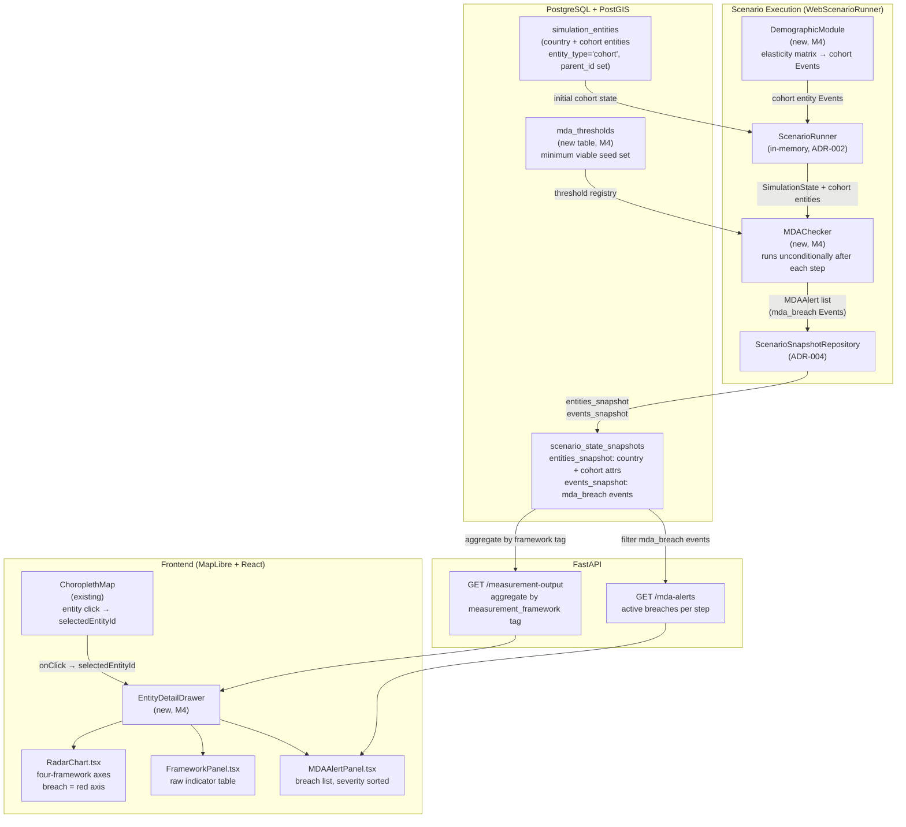
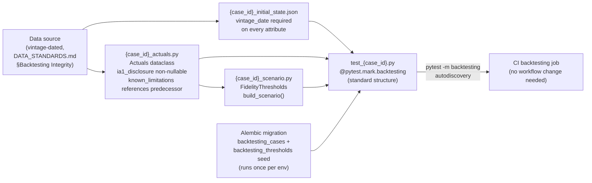

# ADR-005: Human Cost Ledger — Cohort Data Model, Multi-Framework Output, MDA Thresholds, Radar Dashboard, Backtesting Integration

## Status
Accepted

## Validity Context

**Standards Version:** 2026-04-15 (date standards documents were established)
**Valid Until:** Milestone 9 — Standards Foundation
**License Status:** CURRENT

**Amendment 3 applied:** 2026-05-17 — M8 Ecological Framework Completion.
Six decisions (M8-1 through M8-6): boundary proximity normalization replacing
percentile rank for ecological composite score (Decision M8-1); `is_single_entity`
guard exemption for ecological framework (Decision M8-2); `_compute_composite_score()`
strategy dispatch pattern with `_PERCENTILE_RANK_VALIDATED_FRAMEWORKS` frozenset
and explicit `[SIM-INTEGRITY]` WARNING path for unregistered frameworks (Decision M8-3);
GovernanceModule promotion deferred to M9 with mandatory per-indicator
absolute-threshold audit obligation before confirming percentile rank (Decision M8-4);
null governance axis rendering — dashed outline, `"—"` score, `"Governance — in
validation"` label, TypeScript `number | null` type obligation (Decision M8-5);
EcologicalModule indicator expansion with corrected dimensional semantics (no
double-normalization for `land_use_pressure_index`), stock-not-delta computation
path, and `confidence_tier` Alembic migration (Decision M8-6). Closes Issue #218.
Four-agent panel review (PR #303) informed all six decisions. See Amendment 3
section at end of document.

**Last Reviewed:** 2026-05-17 — Amendment 3 acceptance. Renewal trigger fired:
"Radar chart normalization methodology changed from percentile-based cross-entity
ranking to an alternative" (Validity Context §Renewal Triggers). ADR transitioned
ACCEPTED → UNDER-REVIEW on trigger fire; Engineering Lead acceptance of Amendment 3
returns License Status to CURRENT. Four-agent panel review (PR #303 — Data Architect,
QA Lead, Ecological Economist DIC, Chief Methodologist DIC) informed all six decisions.
Next scheduled review at Milestone 9 — Standards Foundation completion.

**Decision 6 applied:** 2026-05-06 — GovernanceModule behavioral contract defined.
Subscription list, indicator keys with confidence tier defaults, output event
contract, and implicit MacroeconomicModule dependency documented. Renewal trigger
added. See Decision 6 section at end of document.

**Amendment 2 applied:** 2026-05-04 — DemographicModule subscription contract
corrected. `fiscal_spending_change` and `fiscal_tax_change` removed from
subscribed events (M5, commit 495d1ee, ADR-006 constraint E1); elasticity
registry recalibrated to GDP units. Decision 1 body updated in-place.
See Amendment 2 section at end of document.

**Amendment 1 applied:** 2026-05-03 — Ecological Module M6 implementation
scope. Data sources for planetary boundary indicators added to
`docs/data-sources/approved-sources.md`. Ecological composite score scoped to
percentile rank with mandatory API note for M6; boundary-normalized scoring
deferred to M8. See Amendment 1 section at end of document.

**Previously reviewed:** 2026-05-10 — Milestone 7 exit review. No renewal triggers
fired during Milestone 7. License Status confirmed CURRENT. M7 delivered no
changes to `MeasurementFramework` taxonomy, `CohortSpec` segmentation axes,
`MDASeverity` enum, or radar chart normalization methodology. DEBUG logs added
to `DemographicModule`, `MacroeconomicModule`, `EcologicalModule`, and
`GovernanceModule` `compute()` methods (Issues #244, #245) are engine-internal
additions that do not alter module output contracts, subscription lists, or
Quantity-delta Event structure. Defensive Programming section in
`CODING_STANDARDS.md` (Issue #224) is a standards addition with no effect on
HCL framework taxonomy. License renewed for Milestone 8. Next scheduled
review at Milestone 8 — Ecological and Governance Frameworks completion.

**Previously reviewed:** 2026-05-10 — Milestone 7 amendment (Issue #236). Decision 3
Validity Context updated: `comparison_operator` column added to `mda_thresholds`
table (migration b3c9f2d1a7e5). Three of five registered thresholds were silently
broken — MDAChecker treated all thresholds as lower bounds, causing `MDA-FIN-DEBT-GDP`,
`MDA-HD-POVERTY-Q1`, and `MDA-HD-FOOD` to never fire. The `comparison_operator` field
("lte" | "gte") resolves this. `MDASeverity` enum unchanged; breach-detection consecutive-
step logic unchanged. License renewed for remainder of Milestone 7.

**Previously reviewed:** 2026-05-07 — Milestone 6 exit review. Decision 6
(GovernanceModule) and Amendment 1 (EcologicalModule) were added to this ADR
during M6 and implemented. Both modules operate within the existing
`MeasurementFramework` taxonomy (ECOLOGICAL and GOVERNANCE are existing enum
values) and produce outputs via the existing Quantity-delta Event contract.
No framework taxonomy changes, no `CohortSpec` segmentation axis changes, no
`MDASeverity` enum changes. The ADR remains sound as extended. License renewed
for Milestone 7. Next scheduled review at Milestone 7 — Technical Foundation
completion.

**Previously reviewed:** 2026-05-03 — Milestone 5 exit review. No renewal triggers
fired during Milestone 5. License Status confirmed CURRENT. `MeasurementFramework`
taxonomy unchanged; `CohortSpec` segmentation axes unchanged; `MDASeverity` enum
unchanged. The `single_entity_warning: bool = False` field added to
`MultiFrameworkOutput` (Issue #193) is an additive, backward-compatible change
that surfaces a pre-existing invariant (composite_score is null when only one
entity is present) — no framework taxonomy or normalization methodology was
altered. The Argentina 2001-2002 backtesting case uses the ARG entity with
`financial` and `human_development` frameworks, confirming the existing
measurement framework is entity-neutral. License renewed for Milestone 6.

**Previously reviewed:** 2026-04-26 — Milestone 4 exit review. All four ADR-005
decisions implemented and verified: Decision 1 (DemographicModule, PR #183),
Decision 2 (MultiFrameworkOutput API, PR #177), Decision 3 (MDA threshold
system, PR #181), Decision 4 (radar chart dashboard, PR #185). No renewal
triggers fired during implementation. `MeasurementFramework` taxonomy unchanged;
`CohortSpec` segmentation axes unchanged (three axes: IncomeQuintile ×5,
AgeBand ×5, EmploymentSector ×4 = 100 cohorts); `MDASeverity` enum unchanged.
API smoke test 30/30 PASS. Manual smoke test passed. License renewed for
Milestone 5. The M5 extension points flagged in this ADR (additional cohort
axes, backtesting integration for HCL outputs, snapshot performance at scale,
viewport synchronization) remain as documented deferred items.

**Previously reviewed:** 2026-04-24 — Engineering Lead accepted at M4 boundary.
ADR-005 reviewed alongside ARCH-REVIEW-003. All five decisions defined as new
architecture; no renewal triggers fired at acceptance. License Status set to
CURRENT. ARCH-REVIEW-003 findings BI3-I-01 and BI3-I-02 addressed structurally
by Decision 1 and Decision 2.

**Renewal Triggers** — any of the following fires the ACCEPTED → UNDER-REVIEW transition when Accepted:
- `MeasurementFramework` taxonomy modified in any standards document or ADR amendment (adds, removes, or renames a framework value)
- `CohortSpec` segmentation axes changed — `IncomeQuintile` count, `AgeBand` boundary definitions, or `EmploymentSector` values modified
- `MDASeverity` enum values modified or breach-detection consecutive-step logic changed
- Radar chart normalization methodology changed from percentile-based cross-entity ranking to an alternative
- Case registration protocol file structure changed (fixture naming convention, required dataclasses, or `@pytest.mark.backtesting` marking changed)
- `Quantity.measurement_framework` contract changed from optional to mandatory (forces migration of all historical attribute data in `simulation_entities.attributes`)
- `DemographicModule._SUBSCRIBED_EVENTS` changed — any addition or removal from the subscribed events list requires this ADR to be updated in the same commit (see Amendment 2 for why this trigger was absent at M5 and the drift it caused)
- `GovernanceModule._SUBSCRIBED_EVENTS` changed — any addition or removal requires Decision 6 to be updated in the same commit; the same drift risk that produced Amendment 2 applies here
- Elasticity registry unit basis changed — if elasticity entries shift from GDP units to fiscal units or any other unit basis, Decision 1 body and the elasticity description must be updated in the same commit

**General principle for module behavioral contracts:** Any module whose
behavioral contract (subscription list, output event types, elasticity unit
basis) is specified in this ADR must have explicit renewal triggers covering
those contracts. Changes to a module's subscription list or output contract
require a same-commit ADR update — not a follow-up. The ADR-005 Amendment 2
root cause (fiscal subscription removal in M5 not reflected in ADR until M6
Socratic TEST) is the canonical example of what this principle prevents.

## Date
2026-04-24

## Context

ADR-001 through ADR-004 established the simulation infrastructure: the entity data
model with `Quantity` attributes (ADR-001), the input orchestration layer (ADR-002),
the PostGIS geospatial foundation (ADR-003), and the scenario engine with backtesting
infrastructure (ADR-004).

What these four ADRs collectively do not address is the simulation's primary output
contract: the **Human Cost Ledger**. `MeasurementFramework` is defined in ADR-001
(`FINANCIAL`, `HUMAN_DEVELOPMENT`, `ECOLOGICAL`, `GOVERNANCE`) and
`ResolutionLevel.DEMOGRAPHIC_COHORT` is enumerated at Level 4 — but no module
produces human development outputs, no cohort entities exist in the database, no
threshold system detects when indicators cross irreversibility floors, no API endpoint
aggregates all four frameworks into a single response, and no frontend component
visualizes them simultaneously.

ADR-004 anticipated this ADR would address the Macroeconomic Module. Milestone 4's
scope determination prioritizes the Human Cost Ledger instead: the five capabilities
addressed here complete the mission-critical output layer before adding endogenous
module dynamics. A simulation that quantifies GDP dynamics but cannot surface the
human consequences of those dynamics does not serve the finance minister this tool
exists for. The quinoa farmer's government needs the capability ledger as much as the
debt ledger.

**Milestone 4 exit criteria (CLAUDE.md):**
1. Cohort-level demographic module
2. Multi-currency measurement output (multi-framework in the architecture's terms)
3. Minimum Descent Altitude threshold system
4. Radar chart dashboard displaying all dimensions simultaneously

**Open dependencies at the time of writing:**
- **Issue #142** (Greece 2010–2015 extension) — extends the existing backtesting fixture
  to cover the unemployment peak (~27%, 2013) and capital controls episode (2015), both
  required for human cost indicator validation against a documented historical case.
  Predecessor to all HCL fidelity threshold work.
- **Issue #141** (Thailand 1997–2000) — the second backtesting case and first to follow
  a formal case registration protocol that Decision 5 of this ADR defines. Issue #141
  may not be implemented until Decision 5 is accepted.

**Relevant architectural preconditions confirmed before writing:**
- `SimulationEntity.parent_id: Optional[str]` already supports hierarchical entity
  relationships (ADR-001). Cohort entities use this without modification.
- `ResolutionLevel.DEMOGRAPHIC_COHORT = 4` is already enumerated (ADR-001).
- `MeasurementFramework` enum is already defined with four values (ADR-001,
  `backend/app/simulation/engine/models.py:31`).
- `Quantity.measurement_framework: str | None` is already an optional field
  (ADR-001 Amendment 1; `QuantitySchema` in ADR-003).
- `simulation_entities` JSONB attribute store accommodates any entity type — cohort
  entities require no new database table (ADR-003 Decision 1).
- `scenario_state_snapshots.entities_snapshot` already persists all entities per step;
  cohort entities enter this snapshot naturally once they are `SimulationEntity`
  instances (ADR-004 Decision 2).

---

## Decision 1: Cohort-Level Demographic Data Model

### Cohorts as child SimulationEntities — no new table

Population cohorts are represented as `SimulationEntity` instances with
`entity_type='cohort'` and `parent_id` pointing to their parent country entity. The
five-table PostGIS schema from ADR-003 accommodates cohort entities in
`simulation_entities` without modification. No new table is introduced.

Three constraints motivate this design:

1. The propagation engine operates uniformly on all `SimulationEntity` instances.
   Cohort entities receive Events and produce state transitions through the same
   mechanism as countries. No parallel propagation path.

2. The JSONB attribute store handles heterogeneous attribute sets naturally. Cohort
   attributes are a different set of keys from country attributes, not a different
   schema requiring separate columns or tables.

3. Hierarchical resolution is first-class in the model via `parent_id` and
   `ResolutionConfig`. Activating cohort resolution is a configuration decision, not
   an architectural extension.

### CohortSpec: the segmentation axes

Cohort segmentation at Milestone 4 uses three axes. Additional axes (gender,
urbanization, education attainment as a segment rather than an indicator) are
explicitly deferred to Milestone 5.

```python
class IncomeQuintile(int, Enum):
    Q1 = 1  # bottom 20%
    Q2 = 2
    Q3 = 3
    Q4 = 4
    Q5 = 5  # top 20%


class AgeBand(str, Enum):
    AGE_0_14    = "0-14"
    AGE_15_24   = "15-24"
    AGE_25_54   = "25-54"
    AGE_55_64   = "55-64"
    AGE_65_PLUS = "65+"


class EmploymentSector(str, Enum):
    FORMAL      = "FORMAL"
    INFORMAL    = "INFORMAL"
    AGRICULTURE = "AGRICULTURE"
    UNEMPLOYED  = "UNEMPLOYED"


@dataclass(frozen=True)
class CohortSpec:
    income_quintile: IncomeQuintile
    age_band: AgeBand
    employment_sector: EmploymentSector

    def entity_id(self, country_iso3: str) -> str:
        """Canonical cohort entity ID.

        Format: {ISO3}:CHT:{quintile}-{age_band}-{sector}
        Example: GRC:CHT:1-25-54-FORMAL
        """
        return (
            f"{country_iso3}:CHT:"
            f"{self.income_quintile.value}"
            f"-{self.age_band.value}"
            f"-{self.employment_sector.value}"
        )
```

At `ResolutionLevel.DEMOGRAPHIC_COHORT`, the scenario engine instantiates all
`IncomeQuintile × AgeBand × EmploymentSector` combinations as child entities under the
country. This yields 5 × 5 × 4 = 100 cohort entities per country. Full global cohort
resolution (177 countries × 100 = 17,700 cohort entities) is architecturally
supportable but computationally expensive at snapshot write time. Cohort resolution
is not activated globally by default — see "How cohort resolution activates per
scenario" below.

### Cohort attributes: what cohorts carry that countries do not

Country entities carry macroeconomic aggregates (`gdp`, `debt_gdp_ratio`,
`reserve_coverage_months`). Cohort entities carry distributional outcomes. The two
attribute sets are distinct — a cohort entity never carries `gdp` (a country
aggregate); a country entity never carries `capability_index` (a cohort-specific
Sen-capability composite).

**Required cohort attributes at Milestone 4:**

| Attribute key | `variable_type` | `measurement_framework` | Description |
|---|---|---|---|
| `population_share` | RATIO | HUMAN_DEVELOPMENT | Fraction of country population in this cohort |
| `income_per_capita_ppp` | FLOW | HUMAN_DEVELOPMENT | PPP-adjusted annual income per capita (`MonetaryValue`, PriceBasis.PPP) |
| `capability_index` | DIMENSIONLESS | HUMAN_DEVELOPMENT | Sen capability composite (0–1); see methodology note |
| `health_index` | DIMENSIONLESS | HUMAN_DEVELOPMENT | Composite: life expectancy, child mortality, DALYs (0–1) |
| `education_attainment_years` | DIMENSIONLESS | HUMAN_DEVELOPMENT | Mean years of schooling completed |
| `employment_rate` | RATIO | HUMAN_DEVELOPMENT | Employment-to-cohort-population ratio |
| `poverty_headcount_ratio` | RATIO | HUMAN_DEVELOPMENT | Share below $2.15/day PPP (World Bank poverty line) |
| `food_insecurity_rate` | RATIO | HUMAN_DEVELOPMENT | Share experiencing moderate or severe food insecurity (FAO FIES) |

All monetary cohort attributes use `PriceBasis.PPP` and `ExchangeRateType.PPP` per
`DATA_STANDARDS.md §PPP vs. Market Rate Assignment`: human cost ledger outputs measure
real purchasing power and living standards, not financial flows. Using market rates for
poverty comparisons is a methodological error that this attribute type contract prevents.

**Note on `capability_index` methodology:** The capability index follows Amartya Sen's
capability approach and UNDP HDI methodology, combining education attainment, health
outcomes, and income sufficiency into a 0–1 composite. The exact weighting and
sub-indicator selection is documented in `docs/methodology/demographic-module-elasticities.md`
and reviewed by the Domain Intelligence Council before M4 closes. The composite is
Tier 3 confidence (derived from Tier 1 sources via documented methodology) until
backtesting calibration upgrades it.

### DemographicModule: how cohort attributes are produced each timestep

The `DemographicModule` is a `SimulationModule` (ADR-001 interface) that:

1. **Subscribes to** events of type `gdp_growth_change`, `imf_program_acceptance`,
   `capital_controls_imposition`, and `emergency_declaration`. Direct fiscal event
   subscriptions (`fiscal_spending_change`, `fiscal_tax_change`) were removed in M5 —
   see Amendment 2. All fiscal policy effects now reach cohorts exclusively through
   the GDP channel: `FiscalPolicyInput` → `MacroeconomicModule` → `gdp_growth_change`
   → `DemographicModule`.

2. **Each timestep**, applies an elasticity matrix to translate country-level event
   deltas into cohort-level attribute changes. The elasticity encodes the empirical
   relationship: "when GDP falls by 1% in Greece, the Q1 cohort's
   `poverty_headcount_ratio` rises by approximately X percentage points."

3. **Returns** `Event` objects targeting cohort entities with `affected_attributes`
   specifying the Quantity delta per affected cohort attribute, carrying the same
   `confidence_tier` as the underlying elasticity estimate (Tier 3 minimum until
   calibrated).

**Module dependency (enforced from M7):** `DemographicModule` requires
`MacroeconomicModule` to be active whenever cohort resolution is enabled. A
scenario that activates cohort resolution without `MacroeconomicModule` will
produce silently empty cohort outputs from fiscal policy — no exception, no
warning, no change in the Human Cost Ledger. Issue #211 (M7 Technical
Foundation) tracks adding a `SimulationConfigurationError` at startup to
enforce this dependency explicitly.

**Elasticity matrix structure:**

```python
@dataclass(frozen=True)
class CohortElasticity:
    """One row of the elasticity matrix.

    Encodes: when event_type fires on the parent country entity, this cohort's
    attribute_key changes by (event_magnitude * elasticity).
    """
    event_type: str           # e.g., "gdp_growth_change"
    cohort_spec: CohortSpec   # which cohort
    attribute_key: str        # which cohort attribute changes
    elasticity: Decimal       # delta per unit of country-level event magnitude
    source: str               # literature citation — must be a registered SourceRegistration
    source_registry_id: str   # must exist in source_registry table
    confidence_tier: int      # tier of the underlying empirical evidence (1–5)
```

The elasticity registry lives at
`backend/app/simulation/modules/demographic/elasticities.py`. Each entry must have
a `source_registry_id` pointing to a registered data source in `source_registry` —
the prohibition on unregistered data sources from `DATA_STANDARDS.md §Data Provenance
Requirements` applies to elasticity parameters as it does to entity attribute data.

The module lives at `backend/app/simulation/modules/demographic/module.py`, following
the package pattern established by the existing `modules/` directory.

### How cohort resolution activates per scenario

`ScenarioConfig.modules_config` (ADR-004 Decision 1) is already a JSONB field that
accepts per-module configuration. The `DemographicModule` reads:

```json
{
  "demographic": {
    "enabled": true,
    "cohort_resolution_entity_ids": ["GRC"],
    "age_bands": ["0-14", "25-54"],
    "income_quintiles": [1, 2, 3],
    "employment_sectors": ["FORMAL", "INFORMAL", "UNEMPLOYED"]
  }
}
```

Only the specified `cohort_resolution_entity_ids` activate cohort entities. All other
entities continue at Level 1 resolution. This preserves the "variable resolution
simulation" principle from CLAUDE.md: cohort resolution for Saudi Arabia, Level 1
for the rest of the world.

The Greece 2010–2015 fixture (Issue #142) uses `cohort_resolution_entity_ids: ["GRC"]`
with all quintiles, age bands, and sectors — the canonical validation case.

---

## Decision 2: Multi-Framework Measurement Output

### How all four frameworks are produced simultaneously

Each `Quantity` attribute already carries an optional `measurement_framework` tag.
The `DemographicModule` ensures all cohort attributes carry explicit
`HUMAN_DEVELOPMENT` tags. Existing country-level attributes (`gdp`, `debt_gdp_ratio`,
`reserve_coverage_months`) carry `FINANCIAL`. Future modules (Climate, Institutional
Cognition) will tag their outputs `ECOLOGICAL` and `GOVERNANCE` respectively.

**Classification rule for untagged attributes:** Attributes without a
`measurement_framework` tag are classified as `FINANCIAL` by the aggregation layer.
This is a backward-compatibility assumption for the M1–M3 attribute data. All
attributes produced by new modules at M4 and later must carry an explicit tag — this
is a CODING_STANDARDS.md requirement that the compliance scan must enforce.

### MultiFrameworkOutput: the aggregation structure

The API layer aggregates a `scenario_state_snapshots.entities_snapshot` into a
`MultiFrameworkOutput` by grouping each entity's attributes by `measurement_framework`
tag. This aggregation runs at query time — it is not pre-computed. See "Alternatives
Considered §2" for why pre-computation was rejected.

```python
@dataclass
class MDAAlert:
    """A single Minimum Descent Altitude threshold breach or approach."""
    mda_id: str
    entity_id: str
    indicator_key: str
    severity: MDASeverity
    floor_value: Decimal
    current_value: Decimal
    approach_pct_remaining: Decimal  # negative when breached
    consecutive_breach_steps: int    # 0 if CRITICAL, ≥2 if TERMINAL


@dataclass
class FrameworkOutput:
    framework: MeasurementFramework
    entity_id: str
    timestep: datetime
    indicators: dict[str, Quantity]      # all attributes tagged to this framework
    composite_score: Decimal | None      # 0.0–1.0 normalized; None if framework unimplemented
    mda_alerts: list[MDAAlert]           # active MDA breaches in this framework
    has_below_floor_indicator: bool      # True if any indicator is below its MDA floor
    note: str | None                     # set when composite_score is None


@dataclass
class MultiFrameworkOutput:
    entity_id: str
    entity_name: str
    timestep: datetime
    scenario_id: str
    step_index: int
    outputs: dict[str, FrameworkOutput]  # key: MeasurementFramework.value
    ia1_disclosure: str                  # non-nullable; carries IA-1 limitation text always
```

`ia1_disclosure` is a required constructor argument with no default. It must carry
the IA-1 text from `DATA_STANDARDS.md §Known Limitation (IA-1)`. This extends the
Issue #69 enforcement pattern from `backtesting_runs.ia1_disclosure` (ADR-004 Decision
3) to all HCL outputs. No code path may produce a `MultiFrameworkOutput` without it.

### Composite score normalization

The composite score for each framework is the **mean percentile rank** of that
entity's framework indicators across all country-type entities in the current
simulation state at step N.

**Why percentile-based:** Absolute thresholds for composite scores require knowing
what "good" means for heterogeneous indicator scales (HDI, years of schooling,
capability index 0–1). Percentile ranking makes no claim about absolute levels — only
relative position. A 0.2 composite score means the entity is in the bottom 20% of the
simulation's current entity distribution on that framework.

**Known limitation (documented, not hidden):** If all entities are deteriorating
simultaneously (e.g., a global shock scenario), percentile scores remain stable while
all absolute values decline. The `mda_alerts` list corrects for this: it fires when
any indicator crosses an absolute floor, regardless of percentile position. The two
outputs are deliberately complementary — composite score for relative comparison,
MDA alerts for absolute deterioration. This limitation is stated in the API response
in the `ia1_disclosure` field.

### Unimplemented frameworks

At M4 entry, ECOLOGICAL and GOVERNANCE indicators are absent — the Climate Module and
Institutional Cognition Module are not yet implemented. The API response for these
frameworks returns:
- `composite_score: null`
- `indicators: {}` (empty)
- `mda_alerts: []` (empty)
- `note: "Ecological module not yet implemented — tracked in module-capability-registry.md"`

The API does not fabricate values for absent modules. An empty framework output is
honest output.

### New API endpoint

```
GET /api/v1/scenarios/{scenario_id}/measurement-output
    ?step={N}&entity_id={ISO3}
```

Returns `MultiFrameworkOutput` as JSON. All four frameworks are present in the
response; unimplemented frameworks have `composite_score: null` and a `note` field.
If cohort resolution is enabled for the entity, cohort-level indicators appear nested
under `human_development.indicators` keyed by full cohort entity ID.

**Response wire format (partial example — Greece step 2, 2012):**

```json
{
  "entity_id": "GRC",
  "entity_name": "Greece",
  "timestep": "2012-01-01T00:00:00Z",
  "scenario_id": "...",
  "step_index": 2,
  "ia1_disclosure": "Confidence tier does not account for projection horizon. A projection extending 2 years from the 2010 observation date retains the tier of its historical input. See DATA_STANDARDS.md §Known Limitation (IA-1).",
  "outputs": {
    "financial": {
      "framework": "financial",
      "composite_score": "0.31",
      "indicators": {
        "gdp_growth": { "value": "-0.089", "unit": "dimensionless", "variable_type": "ratio", "confidence_tier": 1 },
        "debt_gdp_ratio": { "value": "1.72", "unit": "dimensionless", "variable_type": "ratio", "confidence_tier": 1 }
      },
      "mda_alerts": [],
      "has_below_floor_indicator": false,
      "note": null
    },
    "human_development": {
      "framework": "human_development",
      "composite_score": "0.18",
      "indicators": {
        "GRC:CHT:1-25-54-UNEMPLOYED": {
          "employment_rate":        { "value": "0.27", "unit": "dimensionless", "variable_type": "ratio", "confidence_tier": 3 },
          "poverty_headcount_ratio": { "value": "0.31", "unit": "dimensionless", "variable_type": "ratio", "confidence_tier": 3 }
        }
      },
      "mda_alerts": [
        {
          "mda_id": "MDA-HD-POVERTY-Q1",
          "entity_id": "GRC:CHT:1-25-54-UNEMPLOYED",
          "indicator_key": "poverty_headcount_ratio",
          "severity": "CRITICAL",
          "floor_value": "0.25",
          "current_value": "0.31",
          "approach_pct_remaining": "-0.24",
          "consecutive_breach_steps": 1
        }
      ],
      "has_below_floor_indicator": true,
      "note": null
    },
    "ecological": {
      "framework": "ecological",
      "composite_score": null,
      "indicators": {},
      "mda_alerts": [],
      "has_below_floor_indicator": false,
      "note": "Ecological module not yet implemented — tracked in module-capability-registry.md"
    },
    "governance": {
      "framework": "governance",
      "composite_score": null,
      "indicators": {},
      "mda_alerts": [],
      "has_below_floor_indicator": false,
      "note": "Governance module not yet implemented — tracked in module-capability-registry.md"
    }
  }
}
```

`composite_score` values are serialized as strings (Decimal → str), consistent with
the float prohibition applied throughout the API layer (ADR-003 Decision 2).

---

## Decision 3: Minimum Descent Altitude Threshold System

### How MDA thresholds are defined

MDA thresholds are stored in a new database table, not in code constants. Database
storage allows thresholds to be queried for trend analysis, updated as empirical
evidence evolves, and reviewed in the audit trail without code changes. The same
rationale that motivated storing backtesting thresholds in `backtesting_thresholds`
(ADR-004 Decision 3, Alternative 5) applies here.

**New table: `mda_thresholds`**

```sql
CREATE TABLE mda_thresholds (
    mda_id                TEXT PRIMARY KEY,
    indicator_key         TEXT NOT NULL,
    entity_scope          TEXT NOT NULL DEFAULT 'all',
        -- 'all' | ISO 3166-1 alpha-3 | glob pattern (e.g. 'GRC:CHT:1-*-UNEMPLOYED')
        -- MDAChecker uses fnmatch-style glob matching against entity_id values
    measurement_framework TEXT NOT NULL,
        -- MeasurementFramework enum value
    floor_value           NUMERIC NOT NULL,
    floor_unit            TEXT NOT NULL,
    approach_pct          NUMERIC NOT NULL DEFAULT 0.10,
        -- WARNING fires when current value is within approach_pct of floor
        -- e.g. 0.10 = warning fires when within 10% of the floor value
    comparison_operator   TEXT NOT NULL DEFAULT 'lte',
        -- 'lte': breach when current ≤ floor_value (lower-bound; reserve coverage, health index)
        -- 'gte': breach when current ≥ floor_value (upper-bound; debt/GDP, poverty rate, food insecurity)
        -- Added by migration b3c9f2d1a7e5 (Issue #236)
    severity_at_breach    TEXT NOT NULL,
        -- MDASeverity: WARNING | CRITICAL | TERMINAL
    description           TEXT NOT NULL,
    historical_basis      TEXT NOT NULL,
        -- documented historical case(s) that calibrate this floor
    recovery_horizon_years INTEGER,
        -- estimated years to recover once this floor is crossed; NULL if unknown
    irreversibility_note  TEXT NOT NULL,
        -- what capability loss becomes irreversible below this floor
    created_at            TIMESTAMPTZ NOT NULL DEFAULT NOW(),
    updated_at            TIMESTAMPTZ NOT NULL DEFAULT NOW()
);

CREATE INDEX idx_mda_indicator ON mda_thresholds (indicator_key);
CREATE INDEX idx_mda_framework ON mda_thresholds (measurement_framework);
```

**`MDASeverity` enum:**

```python
class MDASeverity(str, Enum):
    WARNING  = "warning"
    # Approaching floor: current value is within approach_pct of floor_value.
    # Does not constitute a breach — signals deterioration trajectory.

    CRITICAL = "critical"
    # At or below floor_value for exactly one consecutive step.
    # The floor has been crossed. Intervention window is open.

    TERMINAL = "terminal"
    # Below floor_value for 2 or more consecutive simulation steps.
    # The simulation flags this explicitly: the recovery envelope may be closing.
```

**Minimum viable MDA seed set for M4 entry (seeded via Alembic data migration):**

`comparison_operator` column added by migration b3c9f2d1a7e5 (Issue #236 — M7).

| MDA ID | Indicator key | Entity scope | Floor | Op | Approach | Historical basis |
|---|---|---|---|---|---|---|
| `MDA-HD-POVERTY-Q1` | `poverty_headcount_ratio` | `*:CHT:1-*-*` | 0.40 | gte | 15% | UNDP poverty trap literature; Stuckler/Basu on austerity |
| `MDA-HD-HEALTH-CHILD` | `health_index` | `*:CHT:*-0-14-*` | 0.30 | lte | 10% | WHO child mortality threshold; MDG/SDG floor definitions |
| `MDA-FIN-RESERVES` | `reserve_coverage_months` | all | 2.5 | lte | 20% | IMF Article IV conventional 3-month floor; Thailand 1997 |
| `MDA-FIN-DEBT-GDP` | `debt_gdp_ratio` | all | 1.20 | gte | 10% | IMF debt distress threshold literature; Greece 2010–2015 |
| `MDA-HD-FOOD` | `food_insecurity_rate` | all | 0.35 | gte | 15% | FAO food crisis threshold; WFP IPC Phase 3+ classification |

These thresholds are Tier 3 confidence (calibrated from research literature, not yet
against backtesting runs). When backtesting cases provide enough historical breach
evidence, specific thresholds will be upgraded to Tier 2 and documented in
`docs/methodology/mda-calibration.md`.

### How the simulation detects threshold breaches

`MDAChecker` runs in `WebScenarioRunner` after each timestep advance, before the
snapshot is written. This ordering ensures MDA breach events appear in the same step's
`events_snapshot` where the breaching attribute value is recorded.

```python
class MDAChecker:
    """Evaluates all registered MDA thresholds against current simulation state.

    Runs unconditionally after every timestep. No configuration option disables it.
    This implements the CLAUDE.md architectural requirement: threshold alerts fire
    regardless of user weighting when any dimension crosses below a critical floor.
    """

    def check(
        self,
        state: SimulationState,
        prior_state: SimulationState | None,
        thresholds: list[MDAThresholdRecord],
    ) -> list[MDAAlert]:
        """Evaluate all thresholds against current state.

        Args:
            state: Current timestep SimulationState.
            prior_state: Previous timestep state (used to count consecutive breach
                steps for TERMINAL severity classification). None at step 0.
            thresholds: All registered MDA threshold records from mda_thresholds table.

        Returns:
            MDAAlert list — one per (entity, threshold) pair that meets
            WARNING, CRITICAL, or TERMINAL criteria.
        """
```

Entity scope matching uses Python's `fnmatch` module for glob pattern evaluation:
`fnmatch.fnmatch(entity_id, entity_scope)`. Scope `'all'` is treated as `'*'`.

`consecutive_breach_steps` is derived by comparing the current breach against the
prior state's `events_snapshot` — if a matching `mda_breach` event for the same
`mda_id` and `entity_id` appears in the prior step's events, the count increments.
TERMINAL fires at count ≥ 2 (breach present in 2 or more consecutive steps).

### How threshold breaches are stored and surfaced

MDA breaches are stored as `Event` objects in `scenario_state_snapshots.events_snapshot`
with `event_type='mda_breach'`. The `affected_attributes` dict carries:

```python
{
    "mda_severity": Quantity(
        value=Decimal("2"),         # MDASeverity ordinal: WARNING=0, CRITICAL=1, TERMINAL=2
        unit="dimensionless",
        variable_type=VariableType.DIMENSIONLESS,
        confidence_tier=1,          # MDA check is deterministic — Tier 1 by construction
        measurement_framework=framework_of_indicator,
    ),
    "mda_current_value": Quantity(  # the breaching indicator value at this step
        value=current_value,
        ...
    ),
}
```

`Event.source_entity_id` is the cohort or country entity ID that breached the floor.
`Event.event_id` encodes `f"mda-{mda_id}-{entity_id}-step{step_index}"` for
deterministic, deduplicated event IDs per scenario.

**API surfacing — two endpoints:**

1. `GET /api/v1/scenarios/{scenario_id}/measurement-output?step={N}&entity_id={id}`
   (Decision 2) — includes `mda_alerts` per framework in the response.

2. `GET /api/v1/scenarios/{scenario_id}/mda-alerts?step={N}`
   — Returns all active MDA breaches across all entities and frameworks at step N,
   sorted by severity (TERMINAL first) then by `approach_pct_remaining`. This is
   the "terrain ahead" panel that surfaces the most dangerous active conditions.

**Frontend surfacing:**
- The `RadarChart.tsx` component (Decision 4) highlights framework axes with active
  CRITICAL or TERMINAL breaches in red, with a breach count badge.
- The `MDAAlertPanel.tsx` component lists all active breaches for the selected entity,
  sorted by severity, with `irreversibility_note` visible on expand.

**Architectural enforcement:** The `MDAChecker` is invoked unconditionally in
`WebScenarioRunner` after each `ScenarioRunner.advance_timestep()` call. It is not
gated on any module configuration flag. The CLAUDE.md requirement — "threshold alerts
fire regardless of user weighting when any dimension crosses below a critical floor" —
is implemented as a structural invariant in the runner, not a feature toggle.

---

## Decision 4: Radar Chart Dashboard

### What the radar chart displays and requires

The radar chart (polar/spider chart) is the primary multi-framework visualization. It
displays four axes — one per `MeasurementFramework` — with each axis scaled 0–1 from
the entity's composite score (Decision 2). All four frameworks appear simultaneously;
no tab-switching is permitted by the design.

**Key design properties:**
- Four axes visible at once — financial, human development, ecological, governance
- Composite scores from Decision 2 provide the axis values
- Axes with active CRITICAL or TERMINAL MDA breaches are highlighted red with a
  breach count badge
- Axes for unimplemented frameworks (ECOLOGICAL, GOVERNANCE at M4) are grayed with a
  "not yet implemented" tooltip; they display at 0 to avoid false visual weight
- A user-configurable weighting slider adjusts the *visual area fill emphasis* of each
  axis — it does not alter the underlying composite scores or MDA alerts
- The radar chart updates when the user navigates steps via `ScenarioControls`

### TypeScript data shape

The frontend receives `MultiFrameworkOutput` from the measurement-output endpoint and
transforms it into Recharts `RadarChart` data:

```typescript
interface RadarAxisDatum {
  framework: string;         // MeasurementFramework value
  label: string;             // "Financial" | "Human Development" | "Ecological" | "Governance"
  composite_score: number;   // 0.0–1.0; unimplemented → 0 with grayed rendering
  is_implemented: boolean;   // false if composite_score is null in API response
  has_critical_breach: bool; // true if any mda_alert.severity is CRITICAL or TERMINAL
  breach_count: number;      // count of active CRITICAL/TERMINAL alerts
}

interface FrameworkWeights {
  financial: number;         // 0.0–2.0 emphasis multiplier; default 1.0
  human_development: number;
  ecological: number;
  governance: number;
}
```

Composite scores arrive as strings (Decimal serialization) from the API and are
converted to `number` only in the Recharts rendering layer — consistent with the float
prohibition boundary established in ADR-003 Decision 3 for MapLibre paint expressions.

The `useMultiFrameworkOutput(scenarioId, entityId, stepIndex)` hook fetches the
`measurement-output` endpoint and caches the response keyed by `(scenarioId, entityId,
stepIndex)`. Re-fetching occurs when any of the three keys change — same pattern as
`useChoroplethData` in the existing stack.

### Frontend component structure

New components in `frontend/src/components/`:

```
EntityDetailDrawer.tsx
  — Container panel. Slides in from the right when a country is clicked on the map.
  — Receives: scenarioId, entityId, stepIndex, weights (from localStorage).
  — Fetches measurement-output for the selected entity.

  RadarChart.tsx
  — Recharts PolarGrid + RadarChart component.
  — Props: data: RadarAxisDatum[], weights: FrameworkWeights, onAxisClick.
  — Clicking an axis calls onAxisClick(framework) to load FrameworkPanel for that framework.

  FrameworkPanel.tsx
  — Raw indicator table for one selected framework.
  — Shows Quantity values, units, confidence_tier badges, and observation dates.
  — Cohort-level indicators displayed as a nested expandable row per cohort entity.

  MDAAlertPanel.tsx
  — Sorted list of active MDA threshold breaches for the selected entity.
  — Each breach shows: severity badge, indicator key, current vs. floor, irreversibility_note.
  — TERMINAL breaches displayed with a distinct visual treatment (red background).
```

### Integration with existing MapLibre choropleth

The entity click pattern is new state in `App.tsx`:

```typescript
const [selectedEntityId, setSelectedEntityId] = useState<string | null>(null);
```

`ChoroplethMap.tsx` receives an `onEntityClick: (entityId: string) => void` prop and
calls it when the user clicks a country polygon. This sets `selectedEntityId`, which
causes `EntityDetailDrawer` to mount and fetch measurement output.

The map and radar chart are synchronized: `ScenarioControls.tsx` (existing) already
calls `onStepChange` which updates `currentStep` state in `App.tsx`. This `currentStep`
is passed to `EntityDetailDrawer`, which passes it to the `useMultiFrameworkOutput`
hook, triggering a re-fetch at the new step. Map choropleth and radar chart both update
when the step changes.

**One interaction not required for M4:** Selecting an entity in the radar chart does
not move the map to center on that entity. Map/chart synchronization is limited to
step navigation. Viewport synchronization is deferred to Milestone 5.

### User-configurable framework weighting

The weighting sliders in `EntityDetailDrawer` produce a `FrameworkWeights` object that
scales the visual area fill of each radar axis (multiplied against the composite score
in the Recharts data transform). Weights do not alter the composite scores themselves,
which are computed server-side from raw indicators. Weights also do not suppress MDA
alerts — breaches fire unconditionally.

Weights are stored in `localStorage` under `worldsim.frameworkWeights` as a JSON
object. They are a user interface preference, not simulation state. They are not stored
in the database and do not appear in backtesting run records.

---

## Decision 5: Backtesting Integration — Case Registration Standard

### Greece 2010–2015 extension (Issue #142)

The existing Greece fixture runs 2 steps (2010→2012) with 4 DIRECTION_ONLY thresholds
on FINANCIAL indicators. Extension to 6 steps (2010→2015) adds:
- Steps 3–6 covering the second bailout (2012), unemployment peak (2013),
  stabilization (2014), and capital controls episode (2015)
- HCL-specific fidelity thresholds for cohort-level human development indicators
- Rename to follow the canonical naming convention defined below

**Fixture file rename (breaking change — old files removed, not kept alongside):**

| Old path | New path |
|---|---|
| `tests/fixtures/greece_2010_2012_initial_state.json` | `tests/fixtures/GRC_2010_2015_initial_state.json` |
| `tests/fixtures/greece_2010_2012_actuals.py` | `tests/fixtures/GRC_2010_2015_actuals.py` |
| `tests/fixtures/greece_2010_2012_scenario.py` | `tests/fixtures/GRC_2010_2015_scenario.py` |
| `tests/backtesting/test_greece_2010_2012.py` | `tests/backtesting/test_GRC_2010_2015.py` |

**New scheduled inputs for steps 3–6:**

| Step | Year | Event | ControlInput type | Instrument | Historical source |
|---|---|---|---|---|---|
| 3 | 2012 | Second bailout; PSI haircut | EmergencyPolicyInput | IMF_PROGRAM_ACCEPTANCE | IMF WEO Apr 2013 |
| 4 | 2013 | Continued fiscal consolidation | FiscalPolicyInput | SPENDING_CHANGE | OECD Economic Survey GRC 2013 |
| 5 | 2014 | Primary surplus achieved | FiscalPolicyInput | DEFICIT_TARGET | IMF WEO Apr 2014 |
| 6 | 2015 | Third bailout; capital controls | EmergencyPolicyInput | CAPITAL_CONTROLS, IMF_PROGRAM_ACCEPTANCE | IMF WEO Oct 2015 |

**New HCL fidelity thresholds (all DIRECTION_ONLY; no MAGNITUDE thresholds until Issue #44):**

| Entity | Attribute | Step | Expected direction | Historical source |
|---|---|---|---|---|
| `GRC:CHT:1-25-54-UNEMPLOYED` | `employment_rate` | 4 (2013) | DOWN | Eurostat: unemployment peaked 27.5% in 2013 |
| `GRC:CHT:1-25-54-UNEMPLOYED` | `employment_rate` | 5 (2014) | STABLE | Unemployment plateau; <1pp change 2013–2014 |
| `GRC:CHT:1-0-14-FORMAL` | `health_index` | 4 (2013) | DOWN | Stuckler/Basu (2013): child health declined under Greek austerity |
| `GRC` | `reserve_coverage_months` | 6 (2015) | DOWN | ECB capital controls imposition July 2015; reserve depletion |

**`backtesting_cases` record update:** `case_id='GRC_2010_2015'`, `n_steps=6`. The
`historical_source` for initial state remains `IMF_WEO_APR2010` — the 2010 starting
conditions are unchanged. Actuals for steps 3–6 are sourced from `IMF_WEO_APR2015`
and `EUROSTAT_UE_2016` (both must be registered in `source_registry` before the
fixture runs).

### Standard case registration protocol

This protocol governs all future backtesting cases beginning with Thailand 1997–2000
(Issue #141). Issue #141 must not be implemented before this protocol is accepted.

**Naming convention:** `{ISO3}_{start_year}_{end_year}`. Examples: `GRC_2010_2015`,
`THA_1997_2000`.

**Four required files per case — all four must exist before the CI backtesting job
runs:**

**File 1 — `tests/fixtures/{case_id}_initial_state.json`**
Entity attribute values at `base_date`, seeded from vintage-dated sources only (per
`DATA_STANDARDS.md §Backtesting Integrity Rules`). Required top-level keys:
```json
{
  "case_id": "THA_1997_2000",
  "base_date": "1997-01-01",
  "vintage_cutoff_date": "1997-07-01",
  "entities": {
    "THA": {
      "gdp_growth": { "value": "0.057", "unit": "dimensionless", ... "vintage_date": "1997-09-01" },
      "reserve_coverage_months": { "value": "5.8", ... }
    }
  }
}
```
The `vintage_date` field on every attribute is mandatory. Any attribute without a
`vintage_date` is rejected by the fixture loader. This is a data integrity gate, not
a convention.

**File 2 — `tests/fixtures/{case_id}_actuals.py`**
Python module containing an `Actuals` dataclass with historical actuals and source
citations:
```python
@dataclass(frozen=True)
class Actuals:
    case_id: str                      # e.g. "THA_1997_2000"
    base_date: date
    n_steps: int
    historical_source_id: str         # source_registry_id for the actuals source
    # step → entity_id → attribute_key → historical actual value (Decimal)
    actuals_by_step: dict[int, dict[str, dict[str, Decimal]]]
    ia1_disclosure: str               # IA-1 text from DATA_STANDARDS.md; non-nullable
    known_limitations: str            # honest documentation; must reference predecessor case

THA_1997_2000_ACTUALS = Actuals(
    case_id="THA_1997_2000",
    ...
    known_limitations=(
        "Follows case registration pattern established by GRC_2010_2015. "
        "Baht devaluation date (July 1997) falls within step 1 — pre/post-devaluation "
        "dynamics within a single annual step cannot be resolved at annual timestep resolution."
    ),
)
```

The `known_limitations` field must reference the predecessor case by name. This creates
a discoverable methodological chain.

**File 3 — `tests/fixtures/{case_id}_scenario.py`**
Python module with `FidelityThresholds` dataclass and `build_scenario()` function:
```python
@dataclass(frozen=True)
class FidelityThresholds:
    case_id: str
    thresholds: list[ThresholdSpec]   # ThresholdSpec from backend/tests/backtesting/

def build_scenario() -> ScenarioCreateRequest:
    """Return the API-ready scenario configuration for this case.

    base_date, n_steps, entity_scope, modules_config, and all
    scheduled ControlInputs must be fully specified here. No dynamic
    computation at test time — the scenario is fully reproducible from
    this function.
    """
    ...
```

All thresholds are DIRECTION_ONLY unless the relevant parameter has reached
calibration tier A or B per Issue #44. A MAGNITUDE threshold added before Issue #44
is resolved is a compliance violation.

**File 4 — `tests/backtesting/test_{case_id}.py`**
pytest integration test following this structure exactly:

```python
@pytest.mark.backtesting
async def test_{case_id}_backtesting(db_pool: asyncpg.Pool) -> None:
    """Backtesting fidelity gate for {case_id}.

    Follows the standard case registration pattern (ADR-005 Decision 5).
    Predecessor case: GRC_2010_2015.
    """
    # 1. Seed initial state from fixture JSON
    # 2. Register all data sources in source_registry
    # 3. Create scenario via WebScenarioRunner
    # 4. Run scenario
    # 5. Evaluate all FidelityThresholds against scenario_state_snapshots
    # 6. Assert overall_status == "PASS"
    # 7. Write run record to backtesting_runs with non-nullable ia1_disclosure
```

**CI autodiscovery:** The CI backtesting job runs `pytest -m backtesting`. All files
matching `tests/backtesting/test_*.py` are discovered automatically. Adding a new case
requires no changes to `.github/workflows/ci.yml`. This is the explicit design
requirement from Issue #141: "CI registration without requiring a workflow change per
case."

**Case metadata registration (database):** An Alembic data migration registers the
case in `backtesting_cases` and its thresholds in `backtesting_thresholds`. The
migration runs exactly once per environment — it is the authoritative registration, not
application startup code or fixture setup. The migration file is named
`{alembic_hash}_{case_id}_registration.py`.

---

## Decision 6: GovernanceModule Behavioral Contract

### Module overview

`GovernanceModule` is a `SimulationModule` (ADR-001 interface) that:

1. **Subscribes to** events from prior steps: GDP and fiscal signals from
   `MacroeconomicModule`, IMF program acceptance, and emergency declarations.

2. **Each timestep**, reads each country entity's current governance indicator
   values from entity attributes and applies event-driven deltas (via an
   elasticity registry analogous to `DemographicModule`) to produce updated
   governance indicator quantities.

3. **Returns** `Event` objects with `event_type="governance_indicator_update"`,
   `framework=MeasurementFramework.GOVERNANCE`, and `affected_attributes`
   containing the governance indicator `Quantity` deltas for the timestep.

The module lives at `backend/app/simulation/modules/governance/` following the
established package pattern: `module.py`, `indicators.py`, `elasticities.py`.

### Subscribed events

```python
_SUBSCRIBED_EVENTS = frozenset({
    "gdp_growth_change",
    "fiscal_policy_spending_change",
    "imf_program_acceptance",
    "emergency_declaration",
})
```

**Rationale per event type:**

- `gdp_growth_change` — Economic deterioration measurably correlates with
  institutional quality erosion over multi-year horizons (V-Dem time series vs.
  GDP data). The GDP channel embeds regime-dependent multipliers from
  `MacroeconomicModule`, making governance outcomes regime-sensitive end-to-end.

- `fiscal_policy_spending_change` — Fiscal cuts reduce public sector institutional
  capacity. Statistical agency independence, judicial system funding, and press
  freedom correlate with public expenditure on institutional infrastructure.

- `imf_program_acceptance` — IMF programs include governance conditionality
  clauses (anti-corruption benchmarks, statistical reform, judicial independence
  targets). Acceptance is a discrete governance signal with both positive and
  negative historical precedent depending on program design.

- `emergency_declaration` — Emergency powers concentrations reduce press freedom
  and democratic quality scores (V-Dem empirical finding across multiple cases).

### Governance indicator keys produced

All five indicators defined in `DATA_STANDARDS.md §Governance Framework Indicator
Standards` are within the full behavioral contract of this module. M6 minimum
viable scope requires at least `rule_of_law_percentile` and
`democratic_quality_score`.

| Attribute key | `variable_type` | `measurement_framework` | Default `confidence_tier` | Source basis |
|---|---|---|---|---|
| `press_freedom_index` | DIMENSIONLESS | GOVERNANCE | 3 | RSF (expert survey, Tier 3) |
| `rule_of_law_percentile` | DIMENSIONLESS | GOVERNANCE | 2 | WGI (derived official statistics, Tier 2) |
| `corruption_perception_index` | DIMENSIONLESS | GOVERNANCE | 3 | TI CPI (expert survey, Tier 3) |
| `democratic_quality_score` | DIMENSIONLESS | GOVERNANCE | 2 | V-Dem (derived official statistics, Tier 2) |
| `technocratic_independence` | DIMENSIONLESS | GOVERNANCE | 3 | Derived composite; pending methodology ADR |

`technocratic_independence` requires the mandatory `note` field: *"Derived
composite; methodology ADR pending — see DATA_STANDARDS.md §Governance Framework
Indicator Standards."* Any `Quantity` for this indicator without this note is
non-compliant with Issue #48.

All governance indicators use `variable_type=VariableType.DIMENSIONLESS` — they are
index scores, not ratios of commensurable quantities. The `confidence_tier` default
above applies when no event-specific tier override is present; event-driven tier
propagation uses `max()` of all contributing quantities per the standard rule.

### Output event contract

```python
Event(
    event_id=f"gov-{entity.id}-{timestep.isoformat()}",
    source_entity_id=entity.id,
    event_type="governance_indicator_update",
    affected_attributes={
        "rule_of_law_percentile": Quantity(..., measurement_framework=MeasurementFramework.GOVERNANCE),
        "democratic_quality_score": Quantity(..., measurement_framework=MeasurementFramework.GOVERNANCE),
        # additional indicators as implemented
    },
    propagation_rules=[],
    timestep_originated=timestep,
    framework=MeasurementFramework.GOVERNANCE,
)
```

`event_type` is `"governance_indicator_update"` — distinct from `"mda_breach"` events
emitted by `MDAChecker` when governance thresholds are crossed. The module emits
indicator updates; the `MDAChecker` independently detects whether those updates
cross registered `mda_thresholds` entries and fires `mda_breach` events, consistent
with ADR-005 Decision 3 architecture.

### Implicit module dependency

`GovernanceModule` subscribes to `gdp_growth_change`, which is only emitted when
`MacroeconomicModule` is active. If `MacroeconomicModule` is absent, no
GDP-mediated governance effects are computed — silently, without error. This is
the same implicit dependency as `DemographicModule` (Amendment 2). Issue #211
(M7 Technical Foundation) tracks adding a `SimulationConfigurationError` at
`WebScenarioRunner` startup to enforce this dependency explicitly. Until #211 is
resolved, this dependency is documented here and in
`docs/scenarios/module-capability-registry.md` as an invariant that scenario
authors must observe.

### Governance composite score

`MultiFrameworkOutput` (Decision 2) currently returns `composite_score: null` for
the GOVERNANCE framework. Once `GovernanceModule` is wired into `WebScenarioRunner`
and produces governance indicator `Quantity` values on country entities, the
measurement-output endpoint will compute the GOVERNANCE composite score by the
same cross-entity percentile rank methodology as FINANCIAL and HUMAN_DEVELOPMENT
frameworks (Decision 2, confirmed applicable in ADR-005 Amendment 1 Q4).

### Renewal trigger (added by Decision 6)

`GovernanceModule._SUBSCRIBED_EVENTS` — any addition or removal from the subscribed
events list requires this Decision 6 section to be updated in the same commit. This
trigger is listed in the Validity Context §Renewal Triggers above.

---

## Diagrams

### Human Cost Ledger data flow



### Backtesting case registration flow



---

## Alternatives Considered

### Alternative 1: Cohorts as a separate `cohort_attributes` table

A dedicated table with fixed columns for each cohort attribute (one column per
indicator) would be simpler to query with SQL aggregations.

**Rejected because:**
- The propagation engine operates on `SimulationEntity` instances. A separate table
  would require a parallel propagation path for cohort entities, duplicating the core
  machinery and splitting the unit-test surface.
- The JSONB attribute store already handles variable attribute sets without schema
  changes. A fixed-column cohort table requires an `ALTER TABLE` migration for every
  new cohort indicator — exactly the problem JSONB solves (ADR-003 Decision 1 §Why
  Not Flat Columns).
- `scenario_state_snapshots.entities_snapshot` captures all entities naturally. A
  separate table would require a second snapshot mechanism, complicating the
  step-navigation and comparative output logic that already exists.

### Alternative 2: Pre-compute composite scores and store in snapshot

Store the 0–1 composite scores in `entities_snapshot` alongside raw indicator values,
so the API returns them without recalculation at query time.

**Rejected because:**
- Composite scores require percentile ranks across all entities at the time of query.
  Pre-computing at step execution time freezes the score against the entity
  distribution as it existed at that moment. If fixtures are corrected after a run
  (Issue #127's snapshot round-trip concern), pre-computed scores become stale and
  cannot be regenerated without re-running the scenario.
- The query cost is negligible at M4 scale: 177 entities × ~9 indicators per framework
  = ~1,600 attribute lookups, each a JSONB path scan on an indexed column.

### Alternative 3: Side-by-side framework panels instead of a radar chart

Display the four frameworks as four separate panels in a dashboard layout, each
showing raw indicator values.

**Rejected because:**
- CLAUDE.md explicitly specifies: "The dashboard displays all simultaneously. A radar
  chart shows the full multi-dimensional profile. Deformation in any dimension is
  visible regardless of performance in others." This is not a design preference — it
  is an architectural requirement.
- Side-by-side panels show each framework in isolation. A radar chart where one axis
  is worsening while others are stable is immediately visible as an asymmetric polygon.
  Panels require the user to read and compare four separate displays — precisely the
  cognitive load this tool is designed to reduce for the finance minister.
- `FrameworkPanel.tsx` provides the detailed raw-indicator view within `EntityDetailDrawer`
  — the two components are complementary, not competing.

### Alternative 4: Store MDA alerts in a dedicated `mda_breach_log` table

A separate breach log table would support indexed cross-scenario queries: "all entity ×
threshold combinations that breached most frequently across all backtesting runs."

**Deferred, not rejected.** The `events_snapshot` approach is sufficient for M4 because
breach queries are scoped to a single scenario. Cross-scenario breach analytics become
valuable when the backtesting suite reaches 10+ cases. A dedicated `mda_breach_log`
table will be proposed in a Decision 3 amendment at Milestone 5 when that query
pattern is needed.

### Alternative 5: Hardcode case registration in a Python registry dict

Maintain a `BACKTESTING_CASE_REGISTRY: dict[str, CaseSpec]` in a single Python file.
New cases are added by editing this file.

**Rejected because:**
- pytest autodiscovery via `tests/backtesting/test_*.py` already provides the
  equivalent registry behavior without a dict — any conforming file is a registered
  case. A dict creates a second registration point that can fall out of sync with the
  test files.
- Case metadata (data sources, known limitations, historical event sequence) belongs in
  database records with timestamps. This is the same rationale that led ADR-004 to
  store `backtesting_thresholds` in the database rather than Python constants — it
  makes fidelity trend analysis queryable.

---

## Consequences

### Positive

- Cohort entities are first-class `SimulationEntity` instances. The propagation engine,
  snapshot repository, and comparative output endpoint handle them without modification.
  The "no new table" choice eliminates a category of schema complexity.
- `MDAChecker` enforces the CLAUDE.md architectural invariant unconditionally —
  threshold alerts cannot be silenced by user weighting configuration or module
  flags. The structural placement in `WebScenarioRunner` makes this auditable.
- `MultiFrameworkOutput.ia1_disclosure` is a required constructor argument with no
  default, enforcing Issue #69's disclosure requirement at the Python type level.
  Combined with ADR-004's `backtesting_runs.ia1_disclosure` DB constraint, the IA-1
  disclosure requirement is now enforced at two independent layers.
- The case registration protocol enables Thailand 1997–2000 and all future cases to
  enter CI without workflow changes. Adding a backtesting case is a data and fixture
  exercise.
- Unimplemented frameworks (ECOLOGICAL, GOVERNANCE) return honest null responses with
  explanatory notes — the system cannot be confused for having these capabilities when
  it does not.
- Composite scores are computed at query time from current snapshot data — no
  staleness risk when fixtures are updated after a run.

### Negative

- 100 cohort entities per country at full resolution. Snapshot writes for full global
  cohort resolution (17,700 entities) are substantially more expensive than country-
  only snapshots. The `modules_config` scoping requirement (cohort resolution per-entity
  only) is a mitigation, not a solution. Snapshot performance at scale is a Milestone 5
  concern.
- Percentile-based composite scores mask global deterioration. In a scenario where all
  entities are declining together, composite scores are stable while absolute indicators
  fall. The `mda_alerts` list partially compensates, but the known limitation must be
  surfaced in `ia1_disclosure` and in the `FrameworkPanel` notes displayed to the user.
- The elasticity matrix is Tier 3–4 confidence until backtesting calibration upgrades
  specific entries. All cohort-level outputs at M4 carry at minimum Tier 3 confidence
  (confidence_tier=3). The `capability_index` composite methodology requires a
  Domain Intelligence Council review before M4 closes — this is a dependency on
  human judgment, not a code dependency.
- The Greece 2010–2015 rename removes the M3 fixture files. Any external test runner
  or documentation referring to the old `greece_2010_2012` path will need updating.
  This is a one-time migration with no backward-compatibility obligation — the old
  fixture is superseded.
- `DemographicModule` subscribes to event types that are only produced once the
  Macroeconomic Module exists (`gdp_growth_change`). At M4 entry, the module responds
  only to `FiscalPolicyInput` and `EmergencyPolicyInput` events. GDP-mediated cohort
  effects become active in Milestone 6 (Macroeconomic Module). This gap is documented
  in `docs/scenarios/module-capability-registry.md` and in the module's docstring.

---

## Dependency Map

| Depends On | Why |
|---|---|
| ADR-001 (Simulation Core Data Model) | `SimulationEntity` with `parent_id` and `entity_type='cohort'` — the cohort entity model uses the existing contract without modification |
| ADR-001 Amendment 1 (Quantity type system) | All cohort attributes are `Quantity` instances — `variable_type`, `confidence_tier`, `measurement_framework` fields required on all new outputs |
| ADR-002 (Input Orchestration Layer) | `FiscalPolicyInput` and `EmergencyPolicyInput` events are the primary country-level signals that `DemographicModule` translates into cohort-level events via the elasticity matrix |
| ADR-003 (Geospatial Foundation) | `simulation_entities` table accommodates cohort entities (JSONB attributes, geometry column accepts NULL). FastAPI + asyncpg patterns reused for new endpoints. `QuantitySchema` serialization reused for cohort indicator wire format |
| ADR-004 (Scenario Engine) | `scenario_state_snapshots.entities_snapshot` captures cohort entities. `backtesting_cases` and `backtesting_thresholds` extended for HCL thresholds. `WebScenarioRunner` extended to invoke `DemographicModule` and `MDAChecker` per step. `ia1_disclosure` enforcement pattern extended to `MultiFrameworkOutput` |
| Issue #142 (Greece 2010–2015 extension) | GRC_2010_2015 is M4's first HCL-validated backtesting case. It must be implemented before any HCL fidelity threshold CI enforcement is possible |
| Issue #141 (Thailand 1997–2000 case registration) | Thailand is the first case to follow the standard protocol defined in Decision 5. Decision 5 must be accepted before Issue #141 implementation begins |
| Issue #69 (IA-1 time-horizon degradation) | `MultiFrameworkOutput.ia1_disclosure` is a required constructor argument — this ADR extends the IA-1 enforcement pattern from `backtesting_runs` (ADR-004) to all HCL outputs |
| Issue #44 (parameter calibration tier system) | MAGNITUDE fidelity thresholds for HCL indicators are gated on Issue #44 calibration tiers. All M4 HCL thresholds are DIRECTION_ONLY. |

---

## Diagrams

- Data flow diagram: embedded above (Human Cost Ledger system flow)
- Case registration flow: embedded above
- Class diagram: `docs/architecture/ADR-005-class-demographic-module.mmd` (to be created at implementation)
- Component diagram: `docs/architecture/ADR-005-component-radar-dashboard.mmd` (to be created at implementation)

## Next ADR

ADR-006 will address the Macroeconomic Module — the first endogenous domain module,
providing calibrated fiscal multipliers, GDP growth dynamics, debt sustainability
analysis, and monetary transmission mechanics. ADR-006 upgrades the
`DemographicModule` elasticity subscriptions from FiscalPolicyInput-only to include
`gdp_growth_change` events produced by the Macroeconomic Module, closing the gap
documented in the Negative consequences above.

---

## Amendment 1 — M6 Pre-Implementation Scope: Ecological Module Data Sources and Composite Score Scoping

**Date:** 2026-05-03
**Closes:** #120 (SA-05 ecological data sources skeleton)
**Context:** Pre-implementation assessment for Issues #204 (EcologicalModule)
and #205 (GovernanceModule), conducted before M6 implementation begins.
Assessment identified two gaps requiring amendment and four items confirmed
requiring no amendment.

---

### Confirmations — No Amendment Required

**Q1 — SimulationModule interface compatibility:**
The two-method interface (`compute(entity, state, timestep) -> list[Event]`
and `get_subscribed_events() -> list[str]`) at
`backend/app/simulation/engine/models.py:318` accommodates both
`EcologicalModule` and `GovernanceModule` without modification. Both modules
subscribe to events and compute per-entity per-timestep via the same contract
as `MacroeconomicModule` and `DemographicModule`. No new interface methods are
required at M6 minimum viable scope.

**Q2 — Governance data sources:**
V-Dem (Varieties of Democracy), Freedom House, and Transparency International
— the three primary sources for M6 minimum viable governance indicators
(rule-of-law index, institutional independence score) — are already listed in
`docs/data-sources/approved-sources.md §Geopolitical and Governance`. No
amendment to the approved sources list is required for `GovernanceModule`.

**Q3 — variable_type coverage:**
All M6 minimum viable indicators for both modules map cleanly to the four
existing `VariableType` values: `STOCK` (CO2 concentration level), `FLOW`
(annual CO2 emissions, depletion rates), `RATIO` (land-use pressure, boundary
proximity fractions), `DIMENSIONLESS` (rule-of-law index, institutional
independence score, composite governance indicators). No new `VariableType`
values are required.

**Q4 — Governance composite score normalization:**
Cross-entity percentile rank is methodologically valid for governance
indicators. Rule-of-law index and institutional independence score are
country-level measures where ranking relative to other entities is meaningful
— the percentile tells the user where a country sits in the global
distribution of governance quality. Decision 2 percentile methodology applies
without modification to `GovernanceModule`.

---

### Amendment A — Ecological Data Sources

Four ecological data sources added to `docs/data-sources/approved-sources.md`
under a new **Ecological** section. Summary:

| Source | License | Supports |
|---|---|---|
| NASA/NOAA Mauna Loa CO2 Measurements | Public domain | `co2_concentration_ppm` (STOCK) |
| Stockholm Resilience Centre Planetary Boundary Calibrations | CC BY 4.0 | `planetary_boundary_proximity` ratio denominator |
| FAO Global Forest Resources Assessment | CC BY-NC-SA 3.0 IGO | `land_use_pressure_index` (RATIO) |
| Global Carbon Project CO2 Budget Data | CC BY 4.0 | `co2_trajectory` (FLOW) |

All four sources must be registered in `source_registry` before
`EcologicalModule` writes any `Quantity` with a `source_registry_id`.

**Issue #120 disposition:** This amendment adds the planetary boundary
calibration source (Stockholm Resilience Centre), CO2 measurement source
(NASA/NOAA), forest data source (FAO GFR), and emissions attribution source
(Global Carbon Project) to `approved-sources.md`, satisfying Issue #120's
requirement to name authoritative sources for ecological indicators. Confidence
tier defaults are captured in Amendment B below. Issue #120 is closed by this
amendment.

---

### Amendment B — Ecological Module M6 Composite Score Scoping

#### The problem

ADR-005 Decision 2 defines composite scores as the mean percentile rank of an
entity's framework indicators across all country-type entities in the current
simulation state. For financial and human development indicators, cross-entity
percentile comparison is methodologically sound. For planetary boundary
indicators, this methodology is a category error: a planetary boundary is an
absolute physical threshold (e.g., 350 ppm CO2 pre-industrial for the climate
boundary), not a relative ranking criterion. If all 177 entities have CO2
trajectories above the boundary, percentile scores produce a stable
distribution while every entity is in an unsafe operating space.

#### Decision — Option 3: Scoped M6 exception with mandatory disclosure

`EcologicalModule` M6 uses the existing percentile rank methodology for
composite score computation, identical to the financial and human development
frameworks. This is a deliberate, bounded decision — not a default or an
oversight.

The following `FrameworkOutput.note` value **MUST** appear in every API
response where `measurement_framework == "ecological"`, regardless of whether
the composite score is null or non-null:

> *"Ecological composite score uses cross-entity percentile rank at M6 scope.
> Planetary boundary absolute normalization is methodologically preferred and
> is deferred to M8 when the full indicator set is defined."*

This note is not optional text. It is a mandatory disclosure, equivalent in
status to `ia1_disclosure` on `MultiFrameworkOutput`. Any code path that
returns an ecological `FrameworkOutput` without this note is non-compliant
with this amendment.

#### Why Option 3 over the alternatives

**Option 1 rejected — boundary-normalized scoring
(`1 - current_value / boundary_value`):** Requires knowing the full indicator
set before the normalization formula can be validated against all nine
planetary boundary domains. At M6 scope, only two pilot indicators are
defined. Premature normalization design risks revision when the remaining
boundaries are added at M8.

**Option 2 rejected — dual output (percentile + boundary proximity):** Adding
a `relative_rank` field to `FrameworkOutput` modifies the API wire format and
potentially fires the ADR-005 renewal trigger for "Radar chart normalization
methodology changed." The `note` field approach achieves the same epistemic
honesty without schema changes.

**Option 3 accepted:** Uses the `note` field (already present in
`FrameworkOutput` per Decision 2) to surface the limitation at the API layer;
defers the normalization decision to M8 when it can be designed for the full
nine-boundary suite; fires no renewal triggers.

#### Confidence tier defaults for M6 ecological indicators

| Indicator | Source | Default confidence_tier | Rationale |
|---|---|---|---|
| `co2_concentration_ppm` | NASA/NOAA Mauna Loa | 1 | Direct continuous measurement series |
| `co2_trajectory` | Global Carbon Project | 2 | Peer-reviewed annual budget, some attribution uncertainty |
| `land_use_pressure_index` | FAO GFR + SRC boundary | 3 | 5-year FRA data requires annual interpolation |
| `planetary_boundary_proximity` | SRC + module calculation | 3 | Boundary value Tier 2; proximity calculation adds one tier |

#### M8 obligation

An ADR-005 Amendment 2 addressing planetary boundary absolute normalization is
a **blocking prerequisite** for M8 Ecological Module completion. This
amendment explicitly names that obligation. An M8 exit that delivers ecological
composite scores without an amendment addressing normalization methodology is
non-compliant with this scoping decision.

---

### Renewal Triggers — No New Triggers Added

This amendment adds no new renewal triggers. The following existing trigger
remains the M8 gating condition for Amendment 2:

- *"Radar chart normalization methodology changed from percentile-based
  cross-entity ranking to an alternative"* — this trigger fires when Amendment
  2 introduces boundary-normalized scoring for the ecological framework at M8.

---

## Amendment 2 — M5 DemographicModule Subscription Contract: Fiscal Events Removed, GDP Channel Only

**Date:** 2026-05-04
**References:** Issue #191 (MacroeconomicModule), commit 495d1ee, ADR-006
constraint E1, Issue #211 (startup validation gap — M7 Technical Foundation)

### What Changed

During M5 implementation of `MacroeconomicModule` (Issue #191), `DemographicModule`
was refactored per ADR-006 constraint E1:

1. `fiscal_spending_change` and `fiscal_tax_change` removed from
   `_SUBSCRIBED_EVENTS` (`backend/app/simulation/modules/demographic/module.py:29`)
2. Elasticity registry recalibrated from fiscal units ("per 1% of GDP spending
   cut") to GDP units ("per 1% GDP contraction")

**Previous subscribed events:** `fiscal_spending_change`, `fiscal_tax_change`,
`gdp_growth_change`, `imf_program_acceptance`, `capital_controls_imposition`,
`emergency_declaration`

**Current subscribed events:** `gdp_growth_change`, `imf_program_acceptance`,
`capital_controls_imposition`, `emergency_declaration`

**Previous elasticity framing:** "when government spending falls by 1% of GDP
in Greece, the Q1 cohort's `poverty_headcount_ratio` rises by approximately X
percentage points."

**Current elasticity framing:** "when GDP falls by 1% in Greece, the Q1
cohort's `poverty_headcount_ratio` rises by approximately X percentage points."

Decision 1 body updated in-place to reflect current behavior. The previous
text is preserved above for audit purposes.

### Why This Change Was Made

The GDP channel is economically correct. Fiscal changes affect cohorts through
their effect on the real economy — employment, incomes, firm payrolls — not
directly. Routing through `gdp_growth_change` embeds the regime-dependent
multiplier in the full chain: the same 5% spending cut produces a 2.5% GDP
contraction in standard conditions (multiplier 0.5) and a 10% contraction in
ZLB conditions (multiplier 2.0). `DemographicModule` receives the amplified
GDP signal, not the raw fiscal impulse. Human cost outcomes are now
regime-sensitive end-to-end.

The previous direct fiscal subscriptions were a temporary workaround pending
`MacroeconomicModule` implementation. ADR-006 constraint E1 required their
removal when the GDP channel became available.

### Implicit Dependency Created

This change creates an implicit hard dependency: `DemographicModule` requires
`MacroeconomicModule` to be active when cohort resolution is enabled. If
`MacroeconomicModule` is absent, no `gdp_growth_change` events are emitted,
`DemographicModule` receives no fiscal signal, and the Human Cost Ledger
shows silently empty cohort outputs. No exception is raised.

Issue #211 (M7 Technical Foundation) tracks adding a
`SimulationConfigurationError` at `WebScenarioRunner` startup to enforce this
dependency explicitly. Until #211 is resolved, this dependency is documented
here and in `docs/scenarios/module-capability-registry.md` as an invariant
that scenario authors must observe.

### Renewal Triggers — No New Triggers Added

This amendment adds no new renewal triggers.

---

## Amendment 3 — M8 Ecological Framework Completion: Boundary Normalization, Strategy Dispatch, and Governance Deferred Axis

**Date:** 2026-05-17
**Closes:** #218 (ADR-005 M8 amendment — blocking prerequisite for M8 Ecological Module completion)
**Context:** Amendment 1 §Amendment B named this amendment explicitly as a blocking
prerequisite for M8 Ecological Module completion:

> *"An ADR-005 Amendment 2 addressing planetary boundary absolute normalization is a
> blocking prerequisite for M8 Ecological Module completion. This amendment explicitly
> names that obligation."*

That obligation is satisfied here — renumbered Amendment 3 because Amendment 2
(DemographicModule subscription contract) was interposed.

This amendment fires the renewal trigger listed in the Validity Context §Renewal
Triggers: *"Radar chart normalization methodology changed from percentile-based
cross-entity ranking to an alternative."* The ACCEPTED → UNDER-REVIEW transition
fires as of this amendment. The amendment itself constitutes the required review;
Engineering Lead acceptance returns the ADR License Status to CURRENT.

---

### Confirmations — No Amendment Required

**Q1 — EcologicalModule `SimulationModule` interface compatibility at M8:**
EcologicalModule's `compute(entity, state, timestep) -> list[Event]` and
`get_subscribed_events() -> list[str]` interface is unchanged at M8. The module
subscribes to GDP and fiscal events from MacroeconomicModule and produces ecological
indicator updates — this contract extends from M6 minimum viable scope without
modification. No new interface methods are required.

EcologicalModule at M8 remains an event consumer. Ecological state changes do not
generate propagation events into financial or governance modules. This is a confirmed
M8 scope boundary, not an oversight: the cross-domain ecological→financial propagation
path (e.g., fisheries depletion below MSY threshold → export revenue event → fiscal
event) requires backtesting validation before it can be a committed propagation path.
It is a M10 Engine Integrity scope item. The Ecological Economist's blind interview
finding (Issue #218 Council comment, docs/process/council-interview-2026-05-11.md
§Theme 3) must be documented in the causal meta-map (ARCH-REVIEW-005 obligation)
before M8 implementation is locked; it does not require an amendment here.

**Q2 — `MeasurementFramework` taxonomy unchanged:**
The four `MeasurementFramework` values (`FINANCIAL`, `HUMAN_DEVELOPMENT`, `ECOLOGICAL`,
`GOVERNANCE`) remain unchanged. No new framework values are added by this amendment.
The renewal trigger "MeasurementFramework taxonomy modified in any standards document
or ADR amendment" does not fire.

**Q3 — `mda_thresholds` schema extension:**
The MDA threshold system requires no schema migration to accommodate ecological or
governance MDA thresholds at M8. The `mda_thresholds` table supports any
`indicator_key` and `comparison_operator` pair. New threshold seed data for
`planetary_boundary_co2_proximity > 1.0` and `planetary_boundary_land_use_proximity
> 1.0` must be added via a dedicated Alembic migration as part of the M8
EcologicalModule implementation. GovernanceModule MDA thresholds are deferred with
module promotion to M9.

---

### Decision M8-1: Ecological Composite Score — Boundary Normalization and Composite Strategy

#### The problem

Amendment 1 §Amendment B established that Decision 2's percentile-rank methodology
is a category error for planetary boundary indicators: if all 177 entities in a
simulation exceed CO2 planetary boundaries — which is the current empirical reality —
percentile scores remain stable while every entity is in an unsafe operating space.
Amendment B scoped this as a deliberate M6 exception with mandatory disclosure, and
named the M8 obligation:

> *"Planetary boundary absolute normalization is methodologically preferred and is
> deferred to M8 when the full indicator set is defined."*

The normalization formula must now be specified so that M8 implementation can proceed.

#### Decision — Boundary proximity ratio with indicator-type-aware computation

The ecological boundary proximity formula is:

```
boundary_score = min(current_value / boundary_value, 2.0)
```

where `boundary_value` is read from `simulation_reference_constants` using an
effective-at-simulation-time date-range query (see §Implementation obligations,
item 2). This formula applies to **absolute-scale indicators** (e.g.,
`co2_concentration_ppm` in ppm, where the boundary constant 350 ppm is the divisor).

**Pre-normalized indicators** — indicators whose raw value is already expressed as a
fraction of the safe boundary threshold (range 0–1+, where 1.0 = boundary exactly
reached) — do not require division. Their boundary proximity formula is:

```
boundary_score = min(indicator_value, 2.0)
```

The distinction between absolute-scale and pre-normalized indicators is a property
of each indicator's `VariableType` and unit semantics, specified per indicator in
Decision M8-6. The `_boundary_proximity_strategy()` function must dispatch to the
correct sub-formula based on the indicator's registered type. Both sub-formulas
produce a score on the same `[0.0, 2.0]` scale with identical semantics.

**Score semantics (both formula variants):**
- `< 1.0` — Entity operates within the safe operating space
- `= 1.0` — Entity is exactly at the planetary boundary
- `> 1.0` — Planetary boundary exceeded
- `= 2.0` — Display ceiling: cap at double the safe boundary

**Composite score aggregation:**
The composite `ecological` score in `MultiFrameworkOutput` is the **unweighted
arithmetic mean of all boundary proximity scores** for which an active boundary
constant exists at simulation time for this entity and timestep. "Active at
simulation time" means the `effective_from`/`effective_through` query (item 2 below)
returns a result.

**Modeling assumption — equal weighting:** The ecological composite is the unweighted
arithmetic mean of all contributing boundary proximity scores. This is a deliberate
simplification: no scientific basis for differential weighting of planetary boundary
domains exists at M8 indicator count. This assumption must be explicitly re-evaluated
when the active ecological indicator count exceeds five.

Indicators for which no boundary constant is active at simulation time are excluded
from the composite and must emit a `[SIM-INTEGRITY]` WARNING at computation time.
The count of contributing indicators (N) is part of the mandatory note (see below).

Boundary constant values are read from the `simulation_reference_constants` table
(Alembic migrations `a2b4c6d8e0f1` + `b3c5d7e9f1a2`). The query must use the
simulation timestep as the resolution date — not wall-clock date. Constants active
at M8:

| `constant_id` | Value | Unit | Source |
|---|---|---|---|
| `ECOLOGICAL_CO2_PLANETARY_BOUNDARY_PPM` | 350 | ppm | Rockström et al. 2009, *Nature* 461:472–475. doi:10.1038/461472a |
| `ECOLOGICAL_LAND_USE_PLANETARY_BOUNDARY_RATIO` | 0.25 | ratio_0_1 | Richardson et al. 2023, *Science Advances* 9(37). doi:10.1126/sciadv.adh2458 |

**Q1 disposition — temporal validity:** Boundary constant queries use the
simulation timestep as the resolution date. For the Greece 2010–2015 backtesting
fixture: the CO2 boundary (`effective_from = 2009-09-24`) is active throughout all
six steps. The land-use boundary (`effective_from = 2023-09-13`) is NOT active for
any step in the Greece fixture — it post-dates the entire scenario period. The
ecological composite for Greece 2010–2015 is therefore **CO2 proximity only
throughout all six steps.** This is not a gap; it is methodologically correct output
per `DATA_STANDARDS.md §Backtesting Integrity`. The mandatory note discloses N for
each timestep.

#### Why this formula over the alternatives

**Alternative 1 rejected — absolute difference (`current_value - boundary_value`):**
Produces indicator-specific scales with no interpretable ceiling. The ratio form is
unit-agnostic across boundary types.

**Alternative 2 rejected — inverse proximity (`1 - current_value / boundary_value`):**
Produces negative values above the boundary, misrepresenting severity. The accepted
formula preserves monotonicity above the boundary while the cap prevents runaway values.

**Alternative 3 rejected — retained percentile rank (existing M6 approach):**
Confirmed category error in Amendment 1. Foreclosed.

**Accepted formula rationale:** The ratio `current_value / boundary_value` is
interpretable without ecological domain expertise: any score above 1.0 means the
boundary is crossed. The cap at 2.0 creates a finite, comparable display range.
This convention is idiomatic to the planetary boundary literature — Rockström et al.
express boundary exceedance as a ratio of current state to the boundary value.

#### Composite score range — cross-ADR schema obligation

The ecological composite score is in the range `[0.0, 2.0]`, not the `[0.0, 1.0]`
range of the percentile-rank methodology. This conflicts with the existing
`FrameworkOutput.composite_score` docstring in `schemas.py` and the measurement-output
endpoint specification in `docs/schema/api_contracts.yml`.

**Cross-ADR same-commit obligation:** The M8 boundary strategy implementation PR
must update:
1. The `FrameworkOutput` docstring in `schemas.py` to state that `composite_score`
   is in `[0.0, 1.0]` for percentile-rank frameworks (`financial`,
   `human_development`) and `[0.0, 2.0]` for boundary-proximity frameworks
   (`ecological`).
2. The `docs/schema/api_contracts.yml` measurement-output endpoint entry to document
   the framework-dependent range.

Failure to update these in the same commit is a schema drift violation.

#### Mandatory API note — supersedes Amendment 1 §Amendment B ecological note

The Amendment 1 §Amendment B mandatory note is **superseded** by this amendment.

The mandatory `FrameworkOutput.note` for `measurement_framework == "ecological"` is
assembled from a template at computation time with one dynamic element, `n_indicators`:

```python
_ECOLOGICAL_MANDATORY_NOTE_TEMPLATE = (
    "Ecological composite score: unweighted mean of {n_indicators} boundary "
    "proximity score(s) active at simulation time (formula: "
    "min(current_value / boundary_value, 2.0) for absolute-scale indicators; "
    "min(indicator_value, 2.0) for pre-normalized boundary-relative indicators). "
    "Score 1.0 = boundary exactly met; >1.0 = boundary exceeded; "
    "cap 2.0 = display ceiling only — entities with score 2.0 may be operating "
    "at any exceedance level ≥2× the safe boundary; simulation snapshots preserve "
    "uncapped values for analytical use. "
    "Composite range: [0.0, 2.0]. "
    "Equal weighting applied across contributing indicators — valid at current "
    "indicator count; must be re-evaluated when count exceeds five. "
    "Source: simulation_reference_constants table (effective-at-simulation-time)."
)
```

At computation time: `note = _ECOLOGICAL_MANDATORY_NOTE_TEMPLATE.format(n_indicators=n)`.

The `n_indicators` value is the count of indicators that contributed a non-null
boundary proximity score to the composite at this timestep. When N=1 for the Greece
backtesting fixture (CO2 only, land-use boundary not yet effective), the note reads
"mean of 1 boundary proximity score(s) active at simulation time."

Any code path returning an ecological `FrameworkOutput` without a note populated
from this template is non-compliant with this amendment. The `_ECOLOGICAL_MANDATORY_NOTE`
string constant in `backend/app/api/scenarios.py` must be replaced with
`_ECOLOGICAL_MANDATORY_NOTE_TEMPLATE` and all call sites updated to use `.format()`.

#### Implementation obligations

1. `_compute_composite_score()` in `backend/app/api/scenarios.py` must be refactored
   to the strategy dispatch pattern (see Decision M8-3) before the boundary formula
   is implemented. See Decision M8-3 for the complete revised function signature,
   which adds `db_connection: asyncpg.Connection` and `scenario_timestep: datetime`
   parameters. The boundary formula must not be implemented as an if/elif branch
   alongside the percentile-rank path.

2. **Effective-at-simulation-time query (Q1 disposition):** Boundary constants must
   be fetched with a date-range query using the simulation timestep as the resolution
   date:
   ```sql
   SELECT constant_id, value, confidence_tier
   FROM simulation_reference_constants
   WHERE constant_id = ANY($1)
     AND effective_from <= $2
     AND (effective_through IS NULL OR effective_through >= $2)
   ```
   where `$2` is the simulation timestep (`scenario_timestep: datetime`). The
   query is executed in `_compute_composite_score()` before strategy dispatch and
   the results are passed to `_boundary_proximity_strategy()` via the `context` dict
   (see Decision M8-3 §Implementation obligations, item 5).

   A constant that is present in the table but outside its `effective_from`/
   `effective_through` window is treated as temporally unavailable: emit a
   `[SIM-INTEGRITY]` WARNING including the `constant_id` and the simulation
   timestep, and exclude the corresponding indicator from the composite. This is
   distinct from a constant that is entirely absent from the table — both conditions
   emit `[SIM-INTEGRITY]` WARNINGs but with different warning text.

3. `_ECOLOGICAL_MANDATORY_NOTE` in `backend/app/api/scenarios.py` must be replaced
   with `_ECOLOGICAL_MANDATORY_NOTE_TEMPLATE` (see above). All call sites must pass
   `n_indicators` as a format argument. The old static string is a compliance artifact
   from Amendment 1; retaining it after M8 implementation is a non-compliance.

4. Indicators for which no boundary constant is active at the simulation timestep
   must emit a `[SIM-INTEGRITY]` WARNING per `CODING_STANDARDS.md §Simulation
   Integrity Monitoring`. The composite is computed from the remaining active
   indicators; N in the mandatory note reflects only contributing indicators.

5. **Cross-ADR schema obligation:** `FrameworkOutput` docstring in `schemas.py` and
   the measurement-output endpoint in `docs/schema/api_contracts.yml` must both be
   updated in the same commit as the boundary strategy implementation to document the
   `[0.0, 2.0]` composite score range for ecological framework outputs.

---

### Decision M8-2: `is_single_entity` Guard — Ecological Framework Exemption

#### The problem

`_compute_composite_score()` contains an `is_single_entity` guard that suppresses
composite scores in single-entity scenarios, attaching `_SINGLE_ENTITY_NOTE` to the
`FrameworkOutput`. The guard exists because a percentile rank with one entity is
numerically undefined.

Boundary proximity normalization does not require multiple entities. CO2 at 421 ppm
relative to the 350 ppm boundary yields boundary_score = 1.203 regardless of how
many entities are present. The guard, applied uniformly, produces a false null
ecological composite score in single-entity scenarios (e.g., the Greece 2010–2015
demo fixture).

#### Decision — Ecological framework exempt; financial and human_development retain guard

| Framework | `is_single_entity` guard | Rationale |
|---|---|---|
| `financial` | Applies — composite score suppressed to null | Percentile rank undefined for single entity |
| `human_development` | Applies — composite score suppressed to null | Percentile rank undefined for single entity |
| `ecological` | **Exempt** — boundary proximity score computed and returned | Boundary ratio is entity-count-independent |
| `governance` | Not reached at M8 — `_UNIMPLEMENTED_FRAMEWORKS` gate fires first | Guard interaction specified at M9 promotion; defaults to percentile-rank guard unless a Decision M9-N amendment exempts it |

The `governance` row note reflects the actual code path at M8: governance never
reaches the `is_single_entity` guard because `_UNIMPLEMENTED_FRAMEWORKS` returns
null earlier. When governance is promoted at M9 (removing it from
`_UNIMPLEMENTED_FRAMEWORKS`), the guard interaction must be specified in the M9
amendment.

**Single-entity ecological note content:** When `is_single_entity` is True and
`framework == "ecological"`, the composite score is computed and the note field
receives `_ECOLOGICAL_MANDATORY_NOTE_TEMPLATE.format(n_indicators=n)` — not
`_SINGLE_ENTITY_NOTE`. The single-entity guard exemption does not alter note
assignment for ecological outputs.

#### Implementation obligations

1. Replace the unconditional `is_single_entity` guard in `_compute_composite_score()`
   with a check against a named constant `_SINGLE_ENTITY_GUARD_EXEMPT_FRAMEWORKS:
   frozenset[str]`, initialized to `frozenset({"ecological"})`.

2. `_SINGLE_ENTITY_NOTE` must not appear on ecological `FrameworkOutput`. The
   ecological mandatory note template applies regardless of entity count.

3. The exempt frameworks constant must be a module-level named constant (not an
   inline literal) so that additions at M9 are visible in code review and trigger
   the same-commit ADR amendment requirement (see §Renewal Triggers).

4. **Test obligation:** The existing test `test_single_entity_composite_score_is_null()`
   must be updated in the same commit to assert that `result.outputs["ecological"].composite_score
   is not None` in a single-entity scenario with ecological indicator data and a
   registered boundary constant active at the simulation timestep. A companion test
   `test_single_entity_ecological_boundary_score_correct()` must assert the exact
   Decimal boundary ratio, not just non-null.

---

### Decision M8-3: `_compute_composite_score()` — Strategy Dispatch Pattern

#### The problem

`_compute_composite_score()` currently applies the same percentile-rank calculation
to all frameworks. The DISPATCH DESIGN NOTE embedded in the function's docstring
(added during M7 STD-REVIEW-004) required:

> *"The implementation must use a strategy dispatch pattern so that governance can
> extend it without requiring a refactor. Design once for both, implement ecological
> first. Both ecological and governance normalization strategies must be added in the
> same ADR-005 M8 amendment commit — do not implement ecological strategy alone."*

The strategy dispatch design and function signature must be fully specified before
implementation proceeds.

#### Decision — Framework-keyed callable map; validated fallback set; explicit DB context threading

**Module-level constants:**

```python
_PERCENTILE_RANK_VALIDATED_FRAMEWORKS: frozenset[str] = frozenset({
    "financial",
    "human_development",
})

_COMPOSITE_STRATEGIES: dict[str, Callable[..., Decimal | None]] = {
    "ecological": _boundary_proximity_strategy,
    # governance: registered at M9 promotion in the same commit as
    # _UNIMPLEMENTED_FRAMEWORKS removal. See ADR-005 Decision M8-4.
    # Any addition here requires a same-commit ADR amendment update.
}
_DEFAULT_COMPOSITE_STRATEGY = _percentile_rank_strategy
```

**Updated `_compute_composite_score()` signature:**

```python
async def _compute_composite_score(
    entity_indicators: list[EntityAttribute],
    all_entity_attrs: list[EntityAttribute],
    framework: str,
    db_connection: asyncpg.Connection,
    scenario_timestep: datetime,
) -> Decimal | None:
```

The addition of `db_connection` and `scenario_timestep` parameters is a breaking
change to the function signature. All callers — including `get_measurement_output`
and any test fixtures that call `_compute_composite_score` directly — must be
updated in the same commit. The original draft's claim that "existing callers require
no modification" is withdrawn.

**Context pre-population and dispatch logic:**

```python
    context: dict[str, Any] = {"scenario_timestep": scenario_timestep}

    if framework in _COMPOSITE_STRATEGIES:
        # Pre-fetch all context required by this strategy before dispatch.
        # The strategy function must not make its own database calls.
        if framework == "ecological":
            context["boundary_constants"] = await _fetch_active_boundary_constants(
                db_connection, scenario_timestep
            )

    if framework in _COMPOSITE_STRATEGIES:
        strategy = _COMPOSITE_STRATEGIES[framework]
    elif framework in _PERCENTILE_RANK_VALIDATED_FRAMEWORKS:
        strategy = _DEFAULT_COMPOSITE_STRATEGY
    else:
        # Unrecognised framework — percentile rank may be a category error.
        # Warn and continue rather than fail; this preserves output availability
        # while surfacing the gap for investigation.
        logger.warning(
            "[SIM-INTEGRITY] Framework '%s' has no registered composite strategy "
            "and is not in _PERCENTILE_RANK_VALIDATED_FRAMEWORKS; using percentile "
            "rank as fallback. This may be a category error. "
            "See ADR-005 Decision M8-3.",
            framework,
        )
        strategy = _DEFAULT_COMPOSITE_STRATEGY

    return strategy(entity_indicators, all_entity_attrs, framework, context)
```

`_fetch_active_boundary_constants()` executes the effective-at-simulation-time query
specified in Decision M8-1 §Implementation obligations, item 2, and returns
`dict[str, Decimal]` keyed by `constant_id`.

**Strategy function signature (both strategies):**

```python
def _boundary_proximity_strategy(
    entity_indicators: list[EntityAttribute],
    all_entity_attrs: list[EntityAttribute],
    framework: str,
    context: dict[str, Any],
) -> Decimal | None:
    ...

def _percentile_rank_strategy(
    entity_indicators: list[EntityAttribute],
    all_entity_attrs: list[EntityAttribute],
    framework: str,
    context: dict[str, Any],  # unused by this strategy; accepted for uniform signature
) -> Decimal | None:
    ...
```

Both strategies must accept the `context` parameter for signature uniformity, even
though `_percentile_rank_strategy` does not use it. The callable type annotation is
tightened from `Callable[..., Decimal | None]` to a named TypeAlias:

```python
CompositeStrategy: TypeAlias = Callable[
    [list[EntityAttribute], list[EntityAttribute], str, dict[str, Any]],
    Decimal | None,
]
```

**`_PERCENTILE_RANK_VALIDATED_FRAMEWORKS` rationale:** `financial` and
`human_development` are registered in this frozenset because their use of
percentile rank has been explicitly reviewed and confirmed as methodologically
valid (not merely inherited from default behavior). Any framework reaching
the dispatch function that is neither in `_COMPOSITE_STRATEGIES` nor in
`_PERCENTILE_RANK_VALIDATED_FRAMEWORKS` triggers a `[SIM-INTEGRITY]` WARNING,
making silent category errors visible in logs before they surface in output.

#### Why callable map over the alternatives

**Alternative rejected — if/elif chain:**
An if/elif chain makes the fallback behavior invisible: a reviewer cannot determine
which frameworks use percentile rank without tracing all branches. The DISPATCH DESIGN
NOTE prohibited this explicitly.

**Alternative rejected — class hierarchy or Protocol:**
Over-engineered for two to three strategy variants. A Protocol is appropriate when
strategies carry state or when variant count exceeds four or five.

**Alternative rejected — silent `dict.get()` fallback:**
`_COMPOSITE_STRATEGIES.get(framework, _DEFAULT_COMPOSITE_STRATEGY)` was the original
draft's dispatch. It silently applies percentile rank to any unregistered future
framework — reproducing the category error that triggered this amendment. The
three-branch dispatch with explicit validated-framework set is required.

#### Implementation obligations

1. Extract `_percentile_rank_strategy()` and `_boundary_proximity_strategy()` as
   module-level callables with the four-parameter signature above. Both must be
   implemented in the same commit — the DISPATCH DESIGN NOTE requirement stands.

2. Both strategy functions must have intent blocks per `CODING_STANDARDS.md §Intent Blocks`.

3. Define `_fetch_active_boundary_constants(db_connection, scenario_timestep) -> dict[str, Decimal]`
   as an async helper that executes the effective-at-simulation-time query from
   Decision M8-1 §Implementation obligations, item 2. This function is the single
   point of contact between the composite score path and the database for boundary
   constants.

4. `_compute_composite_score()` is refactored to the three-branch dispatch pattern
   shown above. All callers must be updated to pass `db_connection` and
   `scenario_timestep` in the same commit.

5. The `CompositeStrategy` TypeAlias must be defined before the `_COMPOSITE_STRATEGIES`
   dict to enable type checking of dict entries and the callable type annotation on
   `_DEFAULT_COMPOSITE_STRATEGY`.

6. The comment above `_COMPOSITE_STRATEGIES` must name the M9 governance registration
   obligation verbatim (see code example above).

7. The comment above `_PERCENTILE_RANK_VALIDATED_FRAMEWORKS` must state:
   "Frameworks listed here have been explicitly reviewed and confirmed as
   methodologically appropriate for percentile-rank composite scoring. Any framework
   NOT in this set and NOT in `_COMPOSITE_STRATEGIES` triggers a [SIM-INTEGRITY]
   WARNING. See ADR-005 Decision M8-3."

---

### Decision M8-4: GovernanceModule Promotion — Deferred to M9

#### The problem

`GovernanceModule` is implemented but `"governance"` remains in
`_UNIMPLEMENTED_FRAMEWORKS`. The M8 question is whether the five promotion criteria
in `CODING_STANDARDS.md §Framework Promotion Protocol` are met.

#### Assessment — Five criteria, zero met at M8 exit

| Criterion | M8 Status | Blocking gap |
|---|---|---|
| 1. Backtesting threshold | Not met | No governance indicators in any backtesting fixture |
| 2. ADR amendment accepted | **Not met — methodology TBD** | No governance normalization strategy has been specified. The dispatch infrastructure in Decision M8-3 is a prerequisite but does not constitute criterion 2 satisfaction. Criterion 2 is met only when a named governance normalization strategy is specified in an accepted ADR amendment and registered in `_COMPOSITE_STRATEGIES`. |
| 3. Source field registry draft-certified | Not met | Governance indicators not yet draft-certified |
| 4. `[SIM-INTEGRITY]` WARNING on unexpected null | Not met | Not implemented in GovernanceModule |
| 5. Integration test asserting non-null governance score | Not met | No integration test exists |

#### Decision — `"governance"` remains in `_UNIMPLEMENTED_FRAMEWORKS` at M8 exit; target M9

GovernanceModule promotion is a named M9 Standards Foundation deliverable.

All five criteria must be simultaneously met before `"governance"` is removed from
`_UNIMPLEMENTED_FRAMEWORKS`. Criterion 2 requires an accepted M9 ADR amendment that
specifies the governance normalization strategy — removal cannot precede the accepted
amendment. An overeager implementor reading "Partially met" in earlier drafts may
have assumed authorization to begin governance promotion work; that reading was
incorrect. The status is **Not met** for all five criteria.

#### M9 Governance Normalization Obligation (Q3 disposition)

**The ADR-005 M9 amendment must re-examine whether any governance indicators have
absolute threshold equivalents before confirming percentile rank as the governance
normalization methodology.** The Amendment 1 Q4 percentile-rank confirmation is
superseded by this obligation — it was written before the ecological boundary
proximity methodology was fully developed and cannot be assumed to govern M9
governance normalization without re-examination.

The M9 amendment must:
1. Audit each governance indicator for documented absolute threshold equivalents —
   an externally-defined, peer-reviewed threshold below which the system enters a
   documented failure regime, analogous to a planetary boundary constant. Examples
   warranting examination: `democratic_quality_score` (V-Dem electoral autocracy
   threshold), press freedom index floor classifications.
2. Classify each indicator as boundary-normalizable or percentile-rank-appropriate.
3. Specify composite aggregation for any mixed indicator set.

Indicators confirmed to have no absolute threshold equivalent use percentile rank.
Indicators with a defensible absolute threshold use boundary proximity normalization.
This audit is mandatory and must be documented in the M9 amendment's
"Alternatives Considered" section. The Amendment 1 Q4 confirmation remains operative
as the default for indicators where the audit finds no absolute threshold — it is
not silently discarded, but it is not extended to cover indicators the audit has not
examined.

#### No implementation obligation at M8

No code changes to `_UNIMPLEMENTED_FRAMEWORKS` or governance strategy registration
are required for M8.

---

### Decision M8-5: Null Governance Axis Rendering — Binding UX Ruling

#### The problem

When all four radar chart axes render simultaneously, the governance axis must
communicate validation status rather than score magnitude. Two incorrect
implementations are common:

- **Zero-value render:** Renders the governance axis as a filled polygon segment at
  0.0, implying governance score = 0.0. Misrepresents validation status as governance
  failure — the worst possible diagnostic outcome.
- **Absent axis:** Omits the axis entirely, breaking the four-axis simultaneous display
  requirement.

#### Decision — Dashed outline, "—" score, "Governance — in validation" label

Binding UX ruling (Issue #218, 2026-05-16):

| Element | Specification |
|---|---|
| Axis polygon segment | Dashed outline only; no fill; zero-area polygon segment |
| Score display | `"—"` (em dash); not `"0.00"`, not blank, not `"N/A"` |
| Axis label | `"Governance — in validation"` |
| Hover tooltip | `"Governance composite score is in validation. Promotion criteria: 0 of 5 met at M8. Target: M9. See §Framework Promotion Protocol in CODING_STANDARDS.md."` |

Zero-value rendering is prohibited. Any implementation that renders the governance
axis as a non-null score — including 0.0 — before `"governance"` is removed from
`_UNIMPLEMENTED_FRAMEWORKS` is non-compliant with this decision.

The hover tooltip hardcodes "0 of 5 met at M8" — this text is accurate at M8 and will
need to be updated when M9 promotion work begins satisfying criteria. The tooltip
must be stored as a named constant `_GOVERNANCE_IN_VALIDATION_TOOLTIP` in
`RadarChart.tsx` so that it is visible in code review when criteria counts change.

#### Why this specification

The `"—"` score and `"in validation"` label are precision instruments for a specific
epistemic state: the module exists, the measurement framework is defined, the module
is implemented but not yet certified for the API surface. Zero implies measurement
and failure. Blank implies absence. Neither is true.

#### TypeScript type obligation — cross-ADR same-commit requirement

The existing `RadarAxisDatum.composite_score` field is typed as `number` in the
frontend. A `number` type cannot represent the null state required by this decision —
`null` is the correct value for an unimplemented framework's composite score, with
the `"—"` em dash being a display transformation applied by the component, not a
value stored in the type.

**Cross-ADR same-commit obligation:** The M8-5 implementation PR must update
`RadarAxisDatum.composite_score` from `number` to `number | null` in the same commit
as the null governance axis rendering implementation. This type change also requires
updating ADR-005 Decision 4's `RadarAxisDatum` interface specification in this ADR
in the same commit, per the CLAUDE.md Pre-PR Checklist cross-ADR impact rule.

The API returns `null` for `composite_score` when a framework is in
`_UNIMPLEMENTED_FRAMEWORKS`. The `RadarChart.tsx` component renders `null` as `"—"`.
The component must explicitly guard against rendering a null composite score as a
filled polygon vertex at 0.0 — the component renders `null` as a dashed outline
with no fill.

Named constants required in `RadarChart.tsx`:
- `_GOVERNANCE_IN_VALIDATION_LABEL: string = "Governance — in validation"`
- `_GOVERNANCE_IN_VALIDATION_TOOLTIP: string = "Governance composite score is in validation. Promotion criteria: 0 of 5 met at M8. Target: M9. See §Framework Promotion Protocol in CODING_STANDARDS.md."`

A unit test must assert these constants against the exact values specified here, so
that text drift is caught without a full E2E run.

#### Implementation obligation

This ruling is binding for `RadarChart.tsx`. Any deviation requires an Engineering
Lead decision recorded in `docs/frontend/design-decisions.md` before implementation
proceeds. The `docs/frontend/design-decisions.md` entry for this decision must be
created in the same commit as `RadarChart.tsx` changes, cross-referencing this
decision as "See ADR-005 Decision M8-5" and adding only technical implementation
detail (CSS properties, SVG stroke-dasharray values, Recharts configuration). The
entry must include the sentence: "Rendering behavior for null vs. zero axes is fully
specified in ADR-005 Decision M8-5; do not modify this entry without a corresponding
ADR amendment."

---

### Decision M8-6: EcologicalModule M8 Indicator Expansion

#### The problem

Amendment 1 §Amendment B scoped EcologicalModule to two pilot indicators at M6
(`co2_concentration_ppm`, `land_use_pressure_index`) using percentile-rank composite
scoring. The boundary normalization formula adopted in Decision M8-1 requires
indicator-specific computation — absolute-scale indicators use the division formula;
pre-normalized indicators do not. This decision specifies which indicators are added
at M8, their computation paths, and their boundary constant associations.

#### Indicator dimensioning — critical prerequisite

The two M6 pilot indicators have different dimensional semantics that determine
which boundary proximity formula applies:

**`co2_concentration_ppm`** — `VariableType.STOCK`, unit `ppm`. Absolute physical
measurement: the atmospheric CO2 concentration at the entity's geographic location
(approximated from global Mauna Loa measurements at M8). The boundary constant
`ECOLOGICAL_CO2_PLANETARY_BOUNDARY_PPM = 350` (ppm) is the divisor. Formula:
`min(co2_concentration_ppm / 350, 2.0)`.

**`land_use_pressure_index`** — `VariableType.RATIO`, unit `ratio_0_1`. Pre-normalized
boundary-relative fraction: the module docstring explicitly states "fraction of the
safe land-system boundary consumed (0–1+)". A value of 1.0 means the boundary is
exactly reached; a value of 1.3 means the boundary is exceeded by 30%. Because the
indicator already encodes boundary proximity, **dividing by the boundary constant
0.25 would be a double-normalization error** producing scores up to 4.0 when the
indicator reads 1.0. The correct formula is `min(land_use_pressure_index, 2.0)` —
no division.

`ECOLOGICAL_LAND_USE_PLANETARY_BOUNDARY_RATIO = 0.25` is retained in
`simulation_reference_constants` for informational and provenance purposes
(it records the Richardson 2023 safe cropland threshold that the indicator was
calibrated against), but it must not be used as a divisor in the proximity
computation for `land_use_pressure_index`.

#### Decision — Two boundary proximity indicators added at M8

| Attribute key | `variable_type` | `measurement_framework` | Computation | Boundary constant role |
|---|---|---|---|---|
| `planetary_boundary_co2_proximity` | RATIO | ECOLOGICAL | `min(co2_concentration_ppm / 350, 2.0)` | `ECOLOGICAL_CO2_PLANETARY_BOUNDARY_PPM` — divisor |
| `planetary_boundary_land_use_proximity` | RATIO | ECOLOGICAL | `min(land_use_pressure_index, 2.0)` | `ECOLOGICAL_LAND_USE_PLANETARY_BOUNDARY_RATIO` — provenance only; not a divisor |

Both are **derived quantities** computed by `EcologicalModule.compute()` from
existing attribute values. They are not sourced independently from external data.
Their `source_registry_id` must reference the boundary constant source publication
(Rockström 2009 or Richardson 2023) as registered in `source_registry`.

The M6 pilot indicators (`co2_concentration_ppm`, `land_use_pressure_index`) are
**not removed** at M8. They remain in the entity attribute store as the raw values
from which proximity indicators are derived. The FrameworkPanel (Zone 3,
information-hierarchy.md) displays both raw and derived indicators.

#### Confidence tier defaults — revised

Confidence tier propagation follows the lower-of-two (`max()` of tier numbers) rule:
`derived_tier = max(source_data_tier, boundary_constant_tier)`.

**Boundary constant confidence tiers** (new in Revision 2): `simulation_reference_constants`
must carry a `confidence_tier` column (see §Implementation obligations, item 4).
Tier assignments:
- `ECOLOGICAL_CO2_PLANETARY_BOUNDARY_PPM`: Tier 2 — Rockström 2009 peer-reviewed
  consensus boundary value; scientifically contested in subsequent literature
  (some analyses suggest the boundary may be lower; atmospheric CO2 passed 350 ppm
  in 1988 and has continued rising). The boundary represents a scientific judgment,
  not a physical constant.
- `ECOLOGICAL_LAND_USE_PLANETARY_BOUNDARY_RATIO`: Tier 2 — Richardson 2023 revision;
  represents an update from prior estimates and carries higher uncertainty than the
  CO2 boundary given data availability constraints for global land-system assessment.

**Derived indicator confidence tiers:**

| Indicator | Source data tier | Boundary constant tier | Derived tier (`max()`) | Rationale |
|---|---|---|---|---|
| `planetary_boundary_co2_proximity` | 1 (Mauna Loa direct measurement) | 2 | **Tier 2** | Boundary constant uncertainty dominates; 350 ppm is a scientific judgment, not a physical constant |
| `planetary_boundary_land_use_proximity` | 3 (FAO GFR 5-year; annual interpolation) | 2 | **Tier 3** | Source data uncertainty dominates |

Note: `planetary_boundary_co2_proximity` is revised from Tier 1 (original draft) to
Tier 2 to reflect boundary constant uncertainty. `planetary_boundary_land_use_proximity`
remains at Tier 3 because the source data tier (3) exceeds the boundary constant
tier (2) under the max() rule.

#### Computation path — stock values, not event deltas

`EcologicalModule.compute()` currently reads `state.events` (prior-step event
deltas) to produce indicator delta events. **Planetary boundary proximity requires
the entity's current accumulated attribute value — the stock, not the delta.** A
proximity score computed from a step delta would produce a monotonically-drifting
score that represents the change in proximity each step, not the actual ratio of
current state to the boundary. These are not the same quantity and the latter is
wrong for proximity purposes.

`EcologicalModule.compute()` must read `entity.attributes.get("co2_concentration_ppm")`
and `entity.attributes.get("land_use_pressure_index")` from the entity's current
attribute store — not from the event stream. The entity attributes dict holds
accumulated stock values as `Quantity` objects. The `.value` field of each
`Quantity` is the current stock value.

This is architecturally different from the existing delta-computation pattern in
the module. The existing `_extract_magnitude()` helper, which reads event magnitudes,
is not applicable for proximity computation.

#### Why derived proximity indicators rather than inline computation

1. **Snapshot transparency:** `scenario_state_snapshots.entities_snapshot` contains
   the proximity score alongside the raw indicator. A reviewer can verify the ratio
   without re-running the formula.

2. **MDA threshold system compatibility:** Registering `planetary_boundary_co2_proximity
   > 1.0` as an MDA threshold requires the proximity score to be a persisted attribute.

3. **Extensibility pattern:** New planetary boundary domains at M10+ follow the same
   pattern: raw value persisted → proximity derived → boundary constant registered.

#### Implementation obligations

`EcologicalModule.compute()` at M8 must:

1. Read `co2_concentration_ppm` and `land_use_pressure_index` from
   `entity.attributes` (the current attribute store), not from `state.events`.
   If a required base attribute is absent from `entity.attributes`, emit a
   `[SIM-INTEGRITY]` WARNING and omit the corresponding derived indicator from the
   step's event.

2. Fetch boundary constants from `simulation_reference_constants` using the
   effective-at-simulation-time query (see Decision M8-1, item 2) with
   `timestep` as the resolution date. If a boundary constant is temporally
   unavailable, emit a `[SIM-INTEGRITY]` WARNING and omit the corresponding
   derived indicator.

3. Compute proximity for each indicator using the correct formula for its
   dimensional type:
   - `co2_concentration_ppm` (STOCK, ppm): `min(value / Decimal("350"), Decimal("2.0"))`
   - `land_use_pressure_index` (RATIO, pre-normalized): `min(value, Decimal("2.0"))`
   All arithmetic uses `Decimal` throughout — no intermediate float conversion.

4. **Alembic migration — `confidence_tier` column:** Add a `confidence_tier`
   INTEGER NOT NULL column to `simulation_reference_constants` via a new Alembic
   migration. Update the existing seed data migrations (`a2b4c6d8e0f1` + `b3c5d7e9f1a2`)
   or add a follow-on migration that sets:
   - `ECOLOGICAL_CO2_PLANETARY_BOUNDARY_PPM`: `confidence_tier = 2`
   - `ECOLOGICAL_LAND_USE_PLANETARY_BOUNDARY_RATIO`: `confidence_tier = 2`
   The `_fetch_active_boundary_constants()` query (Decision M8-3) must return
   `confidence_tier` alongside `value`.

5. Return `planetary_boundary_co2_proximity` and `planetary_boundary_land_use_proximity`
   as `Quantity` values in the event's `affected_attributes`, with:
   - `confidence_tier` = `max(source_indicator_tier, boundary_constant_tier)`
   - `source_registry_id` referencing the boundary constant source publication
     in `source_registry` (Rockström 2009 or Richardson 2023)

6. **Alembic migration — MDA threshold seed data:** `boundary_score > 1.0` →
   `MDASeverity.WARNING` for both indicators. The `entity_scope` for both entries
   is `"all"` — any entity exceeding a planetary boundary is in an unsafe operating
   space regardless of which entity it is.

7. **Unit test obligation:** A unit test seeding a known `co2_concentration_ppm`
   value on `entity.attributes`, running `EcologicalModule.compute()`, and asserting
   the exact Decimal boundary ratio must exist before the M8 EcologicalModule PR
   is merged. This test must cover: below boundary (score < 1.0), at boundary
   exactly (score = 1.0), above boundary (score > 1.0), and at cap (score = 2.0).
   This test catches the delta-vs-stock computation error described above.

---

### Deferred Items

**Governance normalization methodology (M9):**
The M9 GovernanceModule promotion amendment must conduct a per-indicator audit for
absolute threshold equivalents before specifying the normalization strategy (see
Decision M8-4 §M9 Governance Normalization Obligation). Amendment 1 Q4's
percentile-rank confirmation remains operative as a default only for indicators where
the M9 audit finds no absolute threshold equivalent. Governance normalization must
not be implemented without an accepted ADR amendment. This item is explicitly deferred
and not open for implementation-time interpretation.

**Remaining planetary boundary domains (M10+):**
Seven of the nine planetary boundary domains are not addressed at M8: biodiversity
loss, freshwater use, biogeochemical flows (nitrogen/phosphorus), ocean acidification,
stratospheric ozone, aerosol loading, and novel entities. Each requires approved data
sources, a registered boundary constant with assigned `confidence_tier`, and confidence
tier assessment before it can contribute to the ecological composite score. M8 active
domains: CO2 concentration and land-system change only.

**Ecological→financial cross-domain propagation (M10):**
EcologicalModule at M8 remains an event consumer. The Ecological Economist's blind
interview finding (Issue #218 Council comment) identifies this as the most dangerous
invisible interaction in the model — fisheries depletion below MSY threshold generating
export revenue events, which generate fiscal events. Confirmed M10 Engine Integrity
scope item. The causal meta-map (ARCH-REVIEW-005 obligation, Issue #218) must document
this limitation before M8 implementation is locked.

**`source_field_registry` reference in M8-4 criterion 3:**
The criterion 3 text references `source_field_registry`. This table name must be
resolved against `docs/schema/database.yml` before the M9 promotion work begins —
the term may map to a table under a different registered name. If the table does not
exist in the schema registry, it must be added before criterion 3 can be assessed.
This is a should-resolve item before M9 implementation, not a prerequisite for M8
acceptance.

---

### Renewal Triggers

**Trigger fired — radar chart normalization methodology changed:**
The trigger documented in the Validity Context §Renewal Triggers fires with this
amendment. The ACCEPTED → UNDER-REVIEW transition has occurred. Engineering Lead
acceptance of this amendment returns the ADR to CURRENT.

**New trigger — `_boundary_proximity_strategy()` computation:**
Any change to the boundary proximity formula, the cap value (2.0), the
`_fetch_active_boundary_constants()` query, or the indicator-type dispatch
(absolute-scale vs. pre-normalized) requires this Decision M8-1 section to be
updated in the same commit.

**New trigger — `_SINGLE_ENTITY_GUARD_EXEMPT_FRAMEWORKS`:**
Any addition to or removal from `_SINGLE_ENTITY_GUARD_EXEMPT_FRAMEWORKS` requires
Decision M8-2 to be updated in the same commit.

**New trigger — `_COMPOSITE_STRATEGIES` registration:**
Any addition to `_COMPOSITE_STRATEGIES` (including governance registration at M9
promotion) requires a same-commit update to the relevant Decision section of this ADR.
The governance registration at M9 must update Decision M8-4's criterion 2 status from
"Not met — methodology TBD" to "Met" and name the registered strategy.

**New trigger — `_PERCENTILE_RANK_VALIDATED_FRAMEWORKS`:**
Any addition to or removal from `_PERCENTILE_RANK_VALIDATED_FRAMEWORKS` requires a
same-commit update to Decision M8-3 and must be accompanied by a rationale statement
explaining why the framework's percentile rank methodology has been validated (or why
a previously-validated framework is no longer considered methodologically appropriate
for percentile rank). This trigger guards against silent expansion of the validated
set without methodological review.

**New trigger — mandatory note template and indicator count:**
If the mandatory note template `_ECOLOGICAL_MANDATORY_NOTE_TEMPLATE` is updated to
enumerate specific indicator domain names (rather than using the N={count} dynamic
element), it must be converted to API-generated text sourced from
`simulation_reference_constants` in the same commit. Enumerating domains in a static
string is non-compliant from that point forward. The static template with dynamic
N-count is valid through M10 under this constraint. This renewal trigger fires when
the fourth planetary boundary domain is registered — at that point the note approach
must be reviewed in the same commit as the fourth domain's addition.

**New trigger — `simulation_reference_constants.confidence_tier` values:**
Any change to the `confidence_tier` value for an existing boundary constant in
`simulation_reference_constants` requires a same-commit update to the affected
Decision M8-6 confidence tier table entry and the derived indicator confidence tier
that depends on it. This trigger exists because boundary constant confidence tiers
propagate to derived indicator tiers via the `max()` rule — a constant tier change
silently changes indicator tier without this guard.
