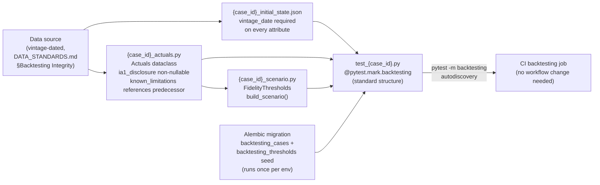

# ADR-005: Human Cost Ledger — Cohort Data Model, Multi-Framework Output, MDA Thresholds, Radar Dashboard, Backtesting Integration

## Status
Accepted

## Validity Context

**Standards Version:** 2026-04-15 (date standards documents were established)
**Valid Until:** Milestone 6 completion
**License Status:** CURRENT

**Amendment 2 applied:** 2026-05-04 — DemographicModule subscription contract
corrected. `fiscal_spending_change` and `fiscal_tax_change` removed from
subscribed events (M5, commit 495d1ee, ADR-006 constraint E1); elasticity
registry recalibrated to GDP units. Decision 1 body updated in-place.
See Amendment 2 section at end of document.

**Amendment 1 applied:** 2026-05-03 — Ecological Module M6 implementation
scope. Data sources for planetary boundary indicators added to
`docs/data-sources/approved-sources.md`. Ecological composite score scoped to
percentile rank with mandatory API note for M6; boundary-normalized scoring
deferred to M8. See Amendment 1 section at end of document.

**Last Reviewed:** 2026-05-03 — Milestone 5 exit review. No renewal triggers
fired during Milestone 5. License Status confirmed CURRENT. `MeasurementFramework`
taxonomy unchanged; `CohortSpec` segmentation axes unchanged; `MDASeverity` enum
unchanged. The `single_entity_warning: bool = False` field added to
`MultiFrameworkOutput` (Issue #193) is an additive, backward-compatible change
that surfaces a pre-existing invariant (composite_score is null when only one
entity is present) — no framework taxonomy or normalization methodology was
altered. The Argentina 2001-2002 backtesting case uses the ARG entity with
`financial` and `human_development` frameworks, confirming the existing
measurement framework is entity-neutral. License renewed for Milestone 6.
Next scheduled review at Milestone 6 completion.

**Previously reviewed:** 2026-04-26 — Milestone 4 exit review. All four ADR-005
decisions implemented and verified: Decision 1 (DemographicModule, PR #183),
Decision 2 (MultiFrameworkOutput API, PR #177), Decision 3 (MDA threshold
system, PR #181), Decision 4 (radar chart dashboard, PR #185). No renewal
triggers fired during implementation. `MeasurementFramework` taxonomy unchanged;
`CohortSpec` segmentation axes unchanged (three axes: IncomeQuintile ×5,
AgeBand ×5, EmploymentSector ×4 = 100 cohorts); `MDASeverity` enum unchanged.
API smoke test 30/30 PASS. Manual smoke test passed. License renewed for
Milestone 5. The M5 extension points flagged in this ADR (additional cohort
axes, backtesting integration for HCL outputs, snapshot performance at scale,
viewport synchronization) remain as documented deferred items.

**Previously reviewed:** 2026-04-24 — Engineering Lead accepted at M4 boundary.
ADR-005 reviewed alongside ARCH-REVIEW-003. All five decisions defined as new
architecture; no renewal triggers fired at acceptance. License Status set to
CURRENT. ARCH-REVIEW-003 findings BI3-I-01 and BI3-I-02 addressed structurally
by Decision 1 and Decision 2.

**Renewal Triggers** — any of the following fires the ACCEPTED → UNDER-REVIEW transition when Accepted:
- `MeasurementFramework` taxonomy modified in any standards document or ADR amendment (adds, removes, or renames a framework value)
- `CohortSpec` segmentation axes changed — `IncomeQuintile` count, `AgeBand` boundary definitions, or `EmploymentSector` values modified
- `MDASeverity` enum values modified or breach-detection consecutive-step logic changed
- Radar chart normalization methodology changed from percentile-based cross-entity ranking to an alternative
- Case registration protocol file structure changed (fixture naming convention, required dataclasses, or `@pytest.mark.backtesting` marking changed)
- `Quantity.measurement_framework` contract changed from optional to mandatory (forces migration of all historical attribute data in `simulation_entities.attributes`)
- `DemographicModule._SUBSCRIBED_EVENTS` changed — any addition or removal from the subscribed events list requires this ADR to be updated in the same commit (see Amendment 2 for why this trigger was absent at M5 and the drift it caused)
- Elasticity registry unit basis changed — if elasticity entries shift from GDP units to fiscal units or any other unit basis, Decision 1 body and the elasticity description must be updated in the same commit

**General principle for module behavioral contracts:** Any module whose
behavioral contract (subscription list, output event types, elasticity unit
basis) is specified in this ADR must have explicit renewal triggers covering
those contracts. Changes to a module's subscription list or output contract
require a same-commit ADR update — not a follow-up. The ADR-005 Amendment 2
root cause (fiscal subscription removal in M5 not reflected in ADR until M6
Socratic TEST) is the canonical example of what this principle prevents.

## Date
2026-04-24

## Context

ADR-001 through ADR-004 established the simulation infrastructure: the entity data
model with `Quantity` attributes (ADR-001), the input orchestration layer (ADR-002),
the PostGIS geospatial foundation (ADR-003), and the scenario engine with backtesting
infrastructure (ADR-004).

What these four ADRs collectively do not address is the simulation's primary output
contract: the **Human Cost Ledger**. `MeasurementFramework` is defined in ADR-001
(`FINANCIAL`, `HUMAN_DEVELOPMENT`, `ECOLOGICAL`, `GOVERNANCE`) and
`ResolutionLevel.DEMOGRAPHIC_COHORT` is enumerated at Level 4 — but no module
produces human development outputs, no cohort entities exist in the database, no
threshold system detects when indicators cross irreversibility floors, no API endpoint
aggregates all four frameworks into a single response, and no frontend component
visualizes them simultaneously.

ADR-004 anticipated this ADR would address the Macroeconomic Module. Milestone 4's
scope determination prioritizes the Human Cost Ledger instead: the five capabilities
addressed here complete the mission-critical output layer before adding endogenous
module dynamics. A simulation that quantifies GDP dynamics but cannot surface the
human consequences of those dynamics does not serve the finance minister this tool
exists for. The quinoa farmer's government needs the capability ledger as much as the
debt ledger.

**Milestone 4 exit criteria (CLAUDE.md):**
1. Cohort-level demographic module
2. Multi-currency measurement output (multi-framework in the architecture's terms)
3. Minimum Descent Altitude threshold system
4. Radar chart dashboard displaying all dimensions simultaneously

**Open dependencies at the time of writing:**
- **Issue #142** (Greece 2010–2015 extension) — extends the existing backtesting fixture
  to cover the unemployment peak (~27%, 2013) and capital controls episode (2015), both
  required for human cost indicator validation against a documented historical case.
  Predecessor to all HCL fidelity threshold work.
- **Issue #141** (Thailand 1997–2000) — the second backtesting case and first to follow
  a formal case registration protocol that Decision 5 of this ADR defines. Issue #141
  may not be implemented until Decision 5 is accepted.

**Relevant architectural preconditions confirmed before writing:**
- `SimulationEntity.parent_id: Optional[str]` already supports hierarchical entity
  relationships (ADR-001). Cohort entities use this without modification.
- `ResolutionLevel.DEMOGRAPHIC_COHORT = 4` is already enumerated (ADR-001).
- `MeasurementFramework` enum is already defined with four values (ADR-001,
  `backend/app/simulation/engine/models.py:31`).
- `Quantity.measurement_framework: str | None` is already an optional field
  (ADR-001 Amendment 1; `QuantitySchema` in ADR-003).
- `simulation_entities` JSONB attribute store accommodates any entity type — cohort
  entities require no new database table (ADR-003 Decision 1).
- `scenario_state_snapshots.entities_snapshot` already persists all entities per step;
  cohort entities enter this snapshot naturally once they are `SimulationEntity`
  instances (ADR-004 Decision 2).

---

## Decision 1: Cohort-Level Demographic Data Model

### Cohorts as child SimulationEntities — no new table

Population cohorts are represented as `SimulationEntity` instances with
`entity_type='cohort'` and `parent_id` pointing to their parent country entity. The
five-table PostGIS schema from ADR-003 accommodates cohort entities in
`simulation_entities` without modification. No new table is introduced.

Three constraints motivate this design:

1. The propagation engine operates uniformly on all `SimulationEntity` instances.
   Cohort entities receive Events and produce state transitions through the same
   mechanism as countries. No parallel propagation path.

2. The JSONB attribute store handles heterogeneous attribute sets naturally. Cohort
   attributes are a different set of keys from country attributes, not a different
   schema requiring separate columns or tables.

3. Hierarchical resolution is first-class in the model via `parent_id` and
   `ResolutionConfig`. Activating cohort resolution is a configuration decision, not
   an architectural extension.

### CohortSpec: the segmentation axes

Cohort segmentation at Milestone 4 uses three axes. Additional axes (gender,
urbanization, education attainment as a segment rather than an indicator) are
explicitly deferred to Milestone 5.

```python
class IncomeQuintile(int, Enum):
    Q1 = 1  # bottom 20%
    Q2 = 2
    Q3 = 3
    Q4 = 4
    Q5 = 5  # top 20%


class AgeBand(str, Enum):
    AGE_0_14    = "0-14"
    AGE_15_24   = "15-24"
    AGE_25_54   = "25-54"
    AGE_55_64   = "55-64"
    AGE_65_PLUS = "65+"


class EmploymentSector(str, Enum):
    FORMAL      = "FORMAL"
    INFORMAL    = "INFORMAL"
    AGRICULTURE = "AGRICULTURE"
    UNEMPLOYED  = "UNEMPLOYED"


@dataclass(frozen=True)
class CohortSpec:
    income_quintile: IncomeQuintile
    age_band: AgeBand
    employment_sector: EmploymentSector

    def entity_id(self, country_iso3: str) -> str:
        """Canonical cohort entity ID.

        Format: {ISO3}:CHT:{quintile}-{age_band}-{sector}
        Example: GRC:CHT:1-25-54-FORMAL
        """
        return (
            f"{country_iso3}:CHT:"
            f"{self.income_quintile.value}"
            f"-{self.age_band.value}"
            f"-{self.employment_sector.value}"
        )
```

At `ResolutionLevel.DEMOGRAPHIC_COHORT`, the scenario engine instantiates all
`IncomeQuintile × AgeBand × EmploymentSector` combinations as child entities under the
country. This yields 5 × 5 × 4 = 100 cohort entities per country. Full global cohort
resolution (177 countries × 100 = 17,700 cohort entities) is architecturally
supportable but computationally expensive at snapshot write time. Cohort resolution
is not activated globally by default — see "How cohort resolution activates per
scenario" below.

### Cohort attributes: what cohorts carry that countries do not

Country entities carry macroeconomic aggregates (`gdp`, `debt_gdp_ratio`,
`reserve_coverage_months`). Cohort entities carry distributional outcomes. The two
attribute sets are distinct — a cohort entity never carries `gdp` (a country
aggregate); a country entity never carries `capability_index` (a cohort-specific
Sen-capability composite).

**Required cohort attributes at Milestone 4:**

| Attribute key | `variable_type` | `measurement_framework` | Description |
|---|---|---|---|
| `population_share` | RATIO | HUMAN_DEVELOPMENT | Fraction of country population in this cohort |
| `income_per_capita_ppp` | FLOW | HUMAN_DEVELOPMENT | PPP-adjusted annual income per capita (`MonetaryValue`, PriceBasis.PPP) |
| `capability_index` | DIMENSIONLESS | HUMAN_DEVELOPMENT | Sen capability composite (0–1); see methodology note |
| `health_index` | DIMENSIONLESS | HUMAN_DEVELOPMENT | Composite: life expectancy, child mortality, DALYs (0–1) |
| `education_attainment_years` | DIMENSIONLESS | HUMAN_DEVELOPMENT | Mean years of schooling completed |
| `employment_rate` | RATIO | HUMAN_DEVELOPMENT | Employment-to-cohort-population ratio |
| `poverty_headcount_ratio` | RATIO | HUMAN_DEVELOPMENT | Share below $2.15/day PPP (World Bank poverty line) |
| `food_insecurity_rate` | RATIO | HUMAN_DEVELOPMENT | Share experiencing moderate or severe food insecurity (FAO FIES) |

All monetary cohort attributes use `PriceBasis.PPP` and `ExchangeRateType.PPP` per
`DATA_STANDARDS.md §PPP vs. Market Rate Assignment`: human cost ledger outputs measure
real purchasing power and living standards, not financial flows. Using market rates for
poverty comparisons is a methodological error that this attribute type contract prevents.

**Note on `capability_index` methodology:** The capability index follows Amartya Sen's
capability approach and UNDP HDI methodology, combining education attainment, health
outcomes, and income sufficiency into a 0–1 composite. The exact weighting and
sub-indicator selection is documented in `docs/methodology/demographic-module-elasticities.md`
and reviewed by the Domain Intelligence Council before M4 closes. The composite is
Tier 3 confidence (derived from Tier 1 sources via documented methodology) until
backtesting calibration upgrades it.

### DemographicModule: how cohort attributes are produced each timestep

The `DemographicModule` is a `SimulationModule` (ADR-001 interface) that:

1. **Subscribes to** events of type `gdp_growth_change`, `imf_program_acceptance`,
   `capital_controls_imposition`, and `emergency_declaration`. Direct fiscal event
   subscriptions (`fiscal_spending_change`, `fiscal_tax_change`) were removed in M5 —
   see Amendment 2. All fiscal policy effects now reach cohorts exclusively through
   the GDP channel: `FiscalPolicyInput` → `MacroeconomicModule` → `gdp_growth_change`
   → `DemographicModule`.

2. **Each timestep**, applies an elasticity matrix to translate country-level event
   deltas into cohort-level attribute changes. The elasticity encodes the empirical
   relationship: "when GDP falls by 1% in Greece, the Q1 cohort's
   `poverty_headcount_ratio` rises by approximately X percentage points."

3. **Returns** `Event` objects targeting cohort entities with `affected_attributes`
   specifying the Quantity delta per affected cohort attribute, carrying the same
   `confidence_tier` as the underlying elasticity estimate (Tier 3 minimum until
   calibrated).

**Module dependency (enforced from M7):** `DemographicModule` requires
`MacroeconomicModule` to be active whenever cohort resolution is enabled. A
scenario that activates cohort resolution without `MacroeconomicModule` will
produce silently empty cohort outputs from fiscal policy — no exception, no
warning, no change in the Human Cost Ledger. Issue #211 (M7 Technical
Foundation) tracks adding a `SimulationConfigurationError` at startup to
enforce this dependency explicitly.

**Elasticity matrix structure:**

```python
@dataclass(frozen=True)
class CohortElasticity:
    """One row of the elasticity matrix.

    Encodes: when event_type fires on the parent country entity, this cohort's
    attribute_key changes by (event_magnitude * elasticity).
    """
    event_type: str           # e.g., "gdp_growth_change"
    cohort_spec: CohortSpec   # which cohort
    attribute_key: str        # which cohort attribute changes
    elasticity: Decimal       # delta per unit of country-level event magnitude
    source: str               # literature citation — must be a registered SourceRegistration
    source_registry_id: str   # must exist in source_registry table
    confidence_tier: int      # tier of the underlying empirical evidence (1–5)
```

The elasticity registry lives at
`backend/app/simulation/modules/demographic/elasticities.py`. Each entry must have
a `source_registry_id` pointing to a registered data source in `source_registry` —
the prohibition on unregistered data sources from `DATA_STANDARDS.md §Data Provenance
Requirements` applies to elasticity parameters as it does to entity attribute data.

The module lives at `backend/app/simulation/modules/demographic/module.py`, following
the package pattern established by the existing `modules/` directory.

### How cohort resolution activates per scenario

`ScenarioConfig.modules_config` (ADR-004 Decision 1) is already a JSONB field that
accepts per-module configuration. The `DemographicModule` reads:

```json
{
  "demographic": {
    "enabled": true,
    "cohort_resolution_entity_ids": ["GRC"],
    "age_bands": ["0-14", "25-54"],
    "income_quintiles": [1, 2, 3],
    "employment_sectors": ["FORMAL", "INFORMAL", "UNEMPLOYED"]
  }
}
```

Only the specified `cohort_resolution_entity_ids` activate cohort entities. All other
entities continue at Level 1 resolution. This preserves the "variable resolution
simulation" principle from CLAUDE.md: cohort resolution for Saudi Arabia, Level 1
for the rest of the world.

The Greece 2010–2015 fixture (Issue #142) uses `cohort_resolution_entity_ids: ["GRC"]`
with all quintiles, age bands, and sectors — the canonical validation case.

---

## Decision 2: Multi-Framework Measurement Output

### How all four frameworks are produced simultaneously

Each `Quantity` attribute already carries an optional `measurement_framework` tag.
The `DemographicModule` ensures all cohort attributes carry explicit
`HUMAN_DEVELOPMENT` tags. Existing country-level attributes (`gdp`, `debt_gdp_ratio`,
`reserve_coverage_months`) carry `FINANCIAL`. Future modules (Climate, Institutional
Cognition) will tag their outputs `ECOLOGICAL` and `GOVERNANCE` respectively.

**Classification rule for untagged attributes:** Attributes without a
`measurement_framework` tag are classified as `FINANCIAL` by the aggregation layer.
This is a backward-compatibility assumption for the M1–M3 attribute data. All
attributes produced by new modules at M4 and later must carry an explicit tag — this
is a CODING_STANDARDS.md requirement that the compliance scan must enforce.

### MultiFrameworkOutput: the aggregation structure

The API layer aggregates a `scenario_state_snapshots.entities_snapshot` into a
`MultiFrameworkOutput` by grouping each entity's attributes by `measurement_framework`
tag. This aggregation runs at query time — it is not pre-computed. See "Alternatives
Considered §2" for why pre-computation was rejected.

```python
@dataclass
class MDAAlert:
    """A single Minimum Descent Altitude threshold breach or approach."""
    mda_id: str
    entity_id: str
    indicator_key: str
    severity: MDASeverity
    floor_value: Decimal
    current_value: Decimal
    approach_pct_remaining: Decimal  # negative when breached
    consecutive_breach_steps: int    # 0 if CRITICAL, ≥2 if TERMINAL


@dataclass
class FrameworkOutput:
    framework: MeasurementFramework
    entity_id: str
    timestep: datetime
    indicators: dict[str, Quantity]      # all attributes tagged to this framework
    composite_score: Decimal | None      # 0.0–1.0 normalized; None if framework unimplemented
    mda_alerts: list[MDAAlert]           # active MDA breaches in this framework
    has_below_floor_indicator: bool      # True if any indicator is below its MDA floor
    note: str | None                     # set when composite_score is None


@dataclass
class MultiFrameworkOutput:
    entity_id: str
    entity_name: str
    timestep: datetime
    scenario_id: str
    step_index: int
    outputs: dict[str, FrameworkOutput]  # key: MeasurementFramework.value
    ia1_disclosure: str                  # non-nullable; carries IA-1 limitation text always
```

`ia1_disclosure` is a required constructor argument with no default. It must carry
the IA-1 text from `DATA_STANDARDS.md §Known Limitation (IA-1)`. This extends the
Issue #69 enforcement pattern from `backtesting_runs.ia1_disclosure` (ADR-004 Decision
3) to all HCL outputs. No code path may produce a `MultiFrameworkOutput` without it.

### Composite score normalization

The composite score for each framework is the **mean percentile rank** of that
entity's framework indicators across all country-type entities in the current
simulation state at step N.

**Why percentile-based:** Absolute thresholds for composite scores require knowing
what "good" means for heterogeneous indicator scales (HDI, years of schooling,
capability index 0–1). Percentile ranking makes no claim about absolute levels — only
relative position. A 0.2 composite score means the entity is in the bottom 20% of the
simulation's current entity distribution on that framework.

**Known limitation (documented, not hidden):** If all entities are deteriorating
simultaneously (e.g., a global shock scenario), percentile scores remain stable while
all absolute values decline. The `mda_alerts` list corrects for this: it fires when
any indicator crosses an absolute floor, regardless of percentile position. The two
outputs are deliberately complementary — composite score for relative comparison,
MDA alerts for absolute deterioration. This limitation is stated in the API response
in the `ia1_disclosure` field.

### Unimplemented frameworks

At M4 entry, ECOLOGICAL and GOVERNANCE indicators are absent — the Climate Module and
Institutional Cognition Module are not yet implemented. The API response for these
frameworks returns:
- `composite_score: null`
- `indicators: {}` (empty)
- `mda_alerts: []` (empty)
- `note: "Ecological module not yet implemented — tracked in module-capability-registry.md"`

The API does not fabricate values for absent modules. An empty framework output is
honest output.

### New API endpoint

```
GET /api/v1/scenarios/{scenario_id}/measurement-output
    ?step={N}&entity_id={ISO3}
```

Returns `MultiFrameworkOutput` as JSON. All four frameworks are present in the
response; unimplemented frameworks have `composite_score: null` and a `note` field.
If cohort resolution is enabled for the entity, cohort-level indicators appear nested
under `human_development.indicators` keyed by full cohort entity ID.

**Response wire format (partial example — Greece step 2, 2012):**

```json
{
  "entity_id": "GRC",
  "entity_name": "Greece",
  "timestep": "2012-01-01T00:00:00Z",
  "scenario_id": "...",
  "step_index": 2,
  "ia1_disclosure": "Confidence tier does not account for projection horizon. A projection extending 2 years from the 2010 observation date retains the tier of its historical input. See DATA_STANDARDS.md §Known Limitation (IA-1).",
  "outputs": {
    "financial": {
      "framework": "financial",
      "composite_score": "0.31",
      "indicators": {
        "gdp_growth": { "value": "-0.089", "unit": "dimensionless", "variable_type": "ratio", "confidence_tier": 1 },
        "debt_gdp_ratio": { "value": "1.72", "unit": "dimensionless", "variable_type": "ratio", "confidence_tier": 1 }
      },
      "mda_alerts": [],
      "has_below_floor_indicator": false,
      "note": null
    },
    "human_development": {
      "framework": "human_development",
      "composite_score": "0.18",
      "indicators": {
        "GRC:CHT:1-25-54-UNEMPLOYED": {
          "employment_rate":        { "value": "0.27", "unit": "dimensionless", "variable_type": "ratio", "confidence_tier": 3 },
          "poverty_headcount_ratio": { "value": "0.31", "unit": "dimensionless", "variable_type": "ratio", "confidence_tier": 3 }
        }
      },
      "mda_alerts": [
        {
          "mda_id": "MDA-HD-POVERTY-Q1",
          "entity_id": "GRC:CHT:1-25-54-UNEMPLOYED",
          "indicator_key": "poverty_headcount_ratio",
          "severity": "CRITICAL",
          "floor_value": "0.25",
          "current_value": "0.31",
          "approach_pct_remaining": "-0.24",
          "consecutive_breach_steps": 1
        }
      ],
      "has_below_floor_indicator": true,
      "note": null
    },
    "ecological": {
      "framework": "ecological",
      "composite_score": null,
      "indicators": {},
      "mda_alerts": [],
      "has_below_floor_indicator": false,
      "note": "Ecological module not yet implemented — tracked in module-capability-registry.md"
    },
    "governance": {
      "framework": "governance",
      "composite_score": null,
      "indicators": {},
      "mda_alerts": [],
      "has_below_floor_indicator": false,
      "note": "Governance module not yet implemented — tracked in module-capability-registry.md"
    }
  }
}
```

`composite_score` values are serialized as strings (Decimal → str), consistent with
the float prohibition applied throughout the API layer (ADR-003 Decision 2).

---

## Decision 3: Minimum Descent Altitude Threshold System

### How MDA thresholds are defined

MDA thresholds are stored in a new database table, not in code constants. Database
storage allows thresholds to be queried for trend analysis, updated as empirical
evidence evolves, and reviewed in the audit trail without code changes. The same
rationale that motivated storing backtesting thresholds in `backtesting_thresholds`
(ADR-004 Decision 3, Alternative 5) applies here.

**New table: `mda_thresholds`**

```sql
CREATE TABLE mda_thresholds (
    mda_id                TEXT PRIMARY KEY,
    indicator_key         TEXT NOT NULL,
    entity_scope          TEXT NOT NULL DEFAULT 'all',
        -- 'all' | ISO 3166-1 alpha-3 | glob pattern (e.g. 'GRC:CHT:1-*-UNEMPLOYED')
        -- MDAChecker uses fnmatch-style glob matching against entity_id values
    measurement_framework TEXT NOT NULL,
        -- MeasurementFramework enum value
    floor_value           NUMERIC NOT NULL,
    floor_unit            TEXT NOT NULL,
    approach_pct          NUMERIC NOT NULL DEFAULT 0.10,
        -- WARNING fires when current value is within approach_pct of floor
        -- e.g. 0.10 = warning fires when within 10% of the floor value
    severity_at_breach    TEXT NOT NULL,
        -- MDASeverity: WARNING | CRITICAL | TERMINAL
    description           TEXT NOT NULL,
    historical_basis      TEXT NOT NULL,
        -- documented historical case(s) that calibrate this floor
    recovery_horizon_years INTEGER,
        -- estimated years to recover once this floor is crossed; NULL if unknown
    irreversibility_note  TEXT NOT NULL,
        -- what capability loss becomes irreversible below this floor
    created_at            TIMESTAMPTZ NOT NULL DEFAULT NOW(),
    updated_at            TIMESTAMPTZ NOT NULL DEFAULT NOW()
);

CREATE INDEX idx_mda_indicator ON mda_thresholds (indicator_key);
CREATE INDEX idx_mda_framework ON mda_thresholds (measurement_framework);
```

**`MDASeverity` enum:**

```python
class MDASeverity(str, Enum):
    WARNING  = "warning"
    # Approaching floor: current value is within approach_pct of floor_value.
    # Does not constitute a breach — signals deterioration trajectory.

    CRITICAL = "critical"
    # At or below floor_value for exactly one consecutive step.
    # The floor has been crossed. Intervention window is open.

    TERMINAL = "terminal"
    # Below floor_value for 2 or more consecutive simulation steps.
    # The simulation flags this explicitly: the recovery envelope may be closing.
```

**Minimum viable MDA seed set for M4 entry (seeded via Alembic data migration):**

| MDA ID | Indicator key | Entity scope | Floor | Approach | Historical basis |
|---|---|---|---|---|---|
| `MDA-HD-POVERTY-Q1` | `poverty_headcount_ratio` | `*:CHT:1-*-*` | 0.40 | 15% | UNDP poverty trap literature; Stuckler/Basu on austerity |
| `MDA-HD-HEALTH-CHILD` | `health_index` | `*:CHT:*-0-14-*` | 0.30 | 10% | WHO child mortality threshold; MDG/SDG floor definitions |
| `MDA-FIN-RESERVES` | `reserve_coverage_months` | all | 2.5 | 20% | IMF Article IV conventional 3-month floor; Thailand 1997 |
| `MDA-FIN-DEBT-GDP` | `debt_gdp_ratio` | all | 1.20 | 10% | IMF debt distress threshold literature; Greece 2010–2015 |
| `MDA-HD-FOOD` | `food_insecurity_rate` | all | 0.35 | 15% | FAO food crisis threshold; WFP IPC Phase 3+ classification |

These thresholds are Tier 3 confidence (calibrated from research literature, not yet
against backtesting runs). When backtesting cases provide enough historical breach
evidence, specific thresholds will be upgraded to Tier 2 and documented in
`docs/methodology/mda-calibration.md`.

### How the simulation detects threshold breaches

`MDAChecker` runs in `WebScenarioRunner` after each timestep advance, before the
snapshot is written. This ordering ensures MDA breach events appear in the same step's
`events_snapshot` where the breaching attribute value is recorded.

```python
class MDAChecker:
    """Evaluates all registered MDA thresholds against current simulation state.

    Runs unconditionally after every timestep. No configuration option disables it.
    This implements the CLAUDE.md architectural requirement: threshold alerts fire
    regardless of user weighting when any dimension crosses below a critical floor.
    """

    def check(
        self,
        state: SimulationState,
        prior_state: SimulationState | None,
        thresholds: list[MDAThresholdRecord],
    ) -> list[MDAAlert]:
        """Evaluate all thresholds against current state.

        Args:
            state: Current timestep SimulationState.
            prior_state: Previous timestep state (used to count consecutive breach
                steps for TERMINAL severity classification). None at step 0.
            thresholds: All registered MDA threshold records from mda_thresholds table.

        Returns:
            MDAAlert list — one per (entity, threshold) pair that meets
            WARNING, CRITICAL, or TERMINAL criteria.
        """
```

Entity scope matching uses Python's `fnmatch` module for glob pattern evaluation:
`fnmatch.fnmatch(entity_id, entity_scope)`. Scope `'all'` is treated as `'*'`.

`consecutive_breach_steps` is derived by comparing the current breach against the
prior state's `events_snapshot` — if a matching `mda_breach` event for the same
`mda_id` and `entity_id` appears in the prior step's events, the count increments.
TERMINAL fires at count ≥ 2 (breach present in 2 or more consecutive steps).

### How threshold breaches are stored and surfaced

MDA breaches are stored as `Event` objects in `scenario_state_snapshots.events_snapshot`
with `event_type='mda_breach'`. The `affected_attributes` dict carries:

```python
{
    "mda_severity": Quantity(
        value=Decimal("2"),         # MDASeverity ordinal: WARNING=0, CRITICAL=1, TERMINAL=2
        unit="dimensionless",
        variable_type=VariableType.DIMENSIONLESS,
        confidence_tier=1,          # MDA check is deterministic — Tier 1 by construction
        measurement_framework=framework_of_indicator,
    ),
    "mda_current_value": Quantity(  # the breaching indicator value at this step
        value=current_value,
        ...
    ),
}
```

`Event.source_entity_id` is the cohort or country entity ID that breached the floor.
`Event.event_id` encodes `f"mda-{mda_id}-{entity_id}-step{step_index}"` for
deterministic, deduplicated event IDs per scenario.

**API surfacing — two endpoints:**

1. `GET /api/v1/scenarios/{scenario_id}/measurement-output?step={N}&entity_id={id}`
   (Decision 2) — includes `mda_alerts` per framework in the response.

2. `GET /api/v1/scenarios/{scenario_id}/mda-alerts?step={N}`
   — Returns all active MDA breaches across all entities and frameworks at step N,
   sorted by severity (TERMINAL first) then by `approach_pct_remaining`. This is
   the "terrain ahead" panel that surfaces the most dangerous active conditions.

**Frontend surfacing:**
- The `RadarChart.tsx` component (Decision 4) highlights framework axes with active
  CRITICAL or TERMINAL breaches in red, with a breach count badge.
- The `MDAAlertPanel.tsx` component lists all active breaches for the selected entity,
  sorted by severity, with `irreversibility_note` visible on expand.

**Architectural enforcement:** The `MDAChecker` is invoked unconditionally in
`WebScenarioRunner` after each `ScenarioRunner.advance_timestep()` call. It is not
gated on any module configuration flag. The CLAUDE.md requirement — "threshold alerts
fire regardless of user weighting when any dimension crosses below a critical floor" —
is implemented as a structural invariant in the runner, not a feature toggle.

---

## Decision 4: Radar Chart Dashboard

### What the radar chart displays and requires

The radar chart (polar/spider chart) is the primary multi-framework visualization. It
displays four axes — one per `MeasurementFramework` — with each axis scaled 0–1 from
the entity's composite score (Decision 2). All four frameworks appear simultaneously;
no tab-switching is permitted by the design.

**Key design properties:**
- Four axes visible at once — financial, human development, ecological, governance
- Composite scores from Decision 2 provide the axis values
- Axes with active CRITICAL or TERMINAL MDA breaches are highlighted red with a
  breach count badge
- Axes for unimplemented frameworks (ECOLOGICAL, GOVERNANCE at M4) are grayed with a
  "not yet implemented" tooltip; they display at 0 to avoid false visual weight
- A user-configurable weighting slider adjusts the *visual area fill emphasis* of each
  axis — it does not alter the underlying composite scores or MDA alerts
- The radar chart updates when the user navigates steps via `ScenarioControls`

### TypeScript data shape

The frontend receives `MultiFrameworkOutput` from the measurement-output endpoint and
transforms it into Recharts `RadarChart` data:

```typescript
interface RadarAxisDatum {
  framework: string;         // MeasurementFramework value
  label: string;             // "Financial" | "Human Development" | "Ecological" | "Governance"
  composite_score: number;   // 0.0–1.0; unimplemented → 0 with grayed rendering
  is_implemented: boolean;   // false if composite_score is null in API response
  has_critical_breach: bool; // true if any mda_alert.severity is CRITICAL or TERMINAL
  breach_count: number;      // count of active CRITICAL/TERMINAL alerts
}

interface FrameworkWeights {
  financial: number;         // 0.0–2.0 emphasis multiplier; default 1.0
  human_development: number;
  ecological: number;
  governance: number;
}
```

Composite scores arrive as strings (Decimal serialization) from the API and are
converted to `number` only in the Recharts rendering layer — consistent with the float
prohibition boundary established in ADR-003 Decision 3 for MapLibre paint expressions.

The `useMultiFrameworkOutput(scenarioId, entityId, stepIndex)` hook fetches the
`measurement-output` endpoint and caches the response keyed by `(scenarioId, entityId,
stepIndex)`. Re-fetching occurs when any of the three keys change — same pattern as
`useChoroplethData` in the existing stack.

### Frontend component structure

New components in `frontend/src/components/`:

```
EntityDetailDrawer.tsx
  — Container panel. Slides in from the right when a country is clicked on the map.
  — Receives: scenarioId, entityId, stepIndex, weights (from localStorage).
  — Fetches measurement-output for the selected entity.

  RadarChart.tsx
  — Recharts PolarGrid + RadarChart component.
  — Props: data: RadarAxisDatum[], weights: FrameworkWeights, onAxisClick.
  — Clicking an axis calls onAxisClick(framework) to load FrameworkPanel for that framework.

  FrameworkPanel.tsx
  — Raw indicator table for one selected framework.
  — Shows Quantity values, units, confidence_tier badges, and observation dates.
  — Cohort-level indicators displayed as a nested expandable row per cohort entity.

  MDAAlertPanel.tsx
  — Sorted list of active MDA threshold breaches for the selected entity.
  — Each breach shows: severity badge, indicator key, current vs. floor, irreversibility_note.
  — TERMINAL breaches displayed with a distinct visual treatment (red background).
```

### Integration with existing MapLibre choropleth

The entity click pattern is new state in `App.tsx`:

```typescript
const [selectedEntityId, setSelectedEntityId] = useState<string | null>(null);
```

`ChoroplethMap.tsx` receives an `onEntityClick: (entityId: string) => void` prop and
calls it when the user clicks a country polygon. This sets `selectedEntityId`, which
causes `EntityDetailDrawer` to mount and fetch measurement output.

The map and radar chart are synchronized: `ScenarioControls.tsx` (existing) already
calls `onStepChange` which updates `currentStep` state in `App.tsx`. This `currentStep`
is passed to `EntityDetailDrawer`, which passes it to the `useMultiFrameworkOutput`
hook, triggering a re-fetch at the new step. Map choropleth and radar chart both update
when the step changes.

**One interaction not required for M4:** Selecting an entity in the radar chart does
not move the map to center on that entity. Map/chart synchronization is limited to
step navigation. Viewport synchronization is deferred to Milestone 5.

### User-configurable framework weighting

The weighting sliders in `EntityDetailDrawer` produce a `FrameworkWeights` object that
scales the visual area fill of each radar axis (multiplied against the composite score
in the Recharts data transform). Weights do not alter the composite scores themselves,
which are computed server-side from raw indicators. Weights also do not suppress MDA
alerts — breaches fire unconditionally.

Weights are stored in `localStorage` under `worldsim.frameworkWeights` as a JSON
object. They are a user interface preference, not simulation state. They are not stored
in the database and do not appear in backtesting run records.

---

## Decision 5: Backtesting Integration — Case Registration Standard

### Greece 2010–2015 extension (Issue #142)

The existing Greece fixture runs 2 steps (2010→2012) with 4 DIRECTION_ONLY thresholds
on FINANCIAL indicators. Extension to 6 steps (2010→2015) adds:
- Steps 3–6 covering the second bailout (2012), unemployment peak (2013),
  stabilization (2014), and capital controls episode (2015)
- HCL-specific fidelity thresholds for cohort-level human development indicators
- Rename to follow the canonical naming convention defined below

**Fixture file rename (breaking change — old files removed, not kept alongside):**

| Old path | New path |
|---|---|
| `tests/fixtures/greece_2010_2012_initial_state.json` | `tests/fixtures/GRC_2010_2015_initial_state.json` |
| `tests/fixtures/greece_2010_2012_actuals.py` | `tests/fixtures/GRC_2010_2015_actuals.py` |
| `tests/fixtures/greece_2010_2012_scenario.py` | `tests/fixtures/GRC_2010_2015_scenario.py` |
| `tests/backtesting/test_greece_2010_2012.py` | `tests/backtesting/test_GRC_2010_2015.py` |

**New scheduled inputs for steps 3–6:**

| Step | Year | Event | ControlInput type | Instrument | Historical source |
|---|---|---|---|---|---|
| 3 | 2012 | Second bailout; PSI haircut | EmergencyPolicyInput | IMF_PROGRAM_ACCEPTANCE | IMF WEO Apr 2013 |
| 4 | 2013 | Continued fiscal consolidation | FiscalPolicyInput | SPENDING_CHANGE | OECD Economic Survey GRC 2013 |
| 5 | 2014 | Primary surplus achieved | FiscalPolicyInput | DEFICIT_TARGET | IMF WEO Apr 2014 |
| 6 | 2015 | Third bailout; capital controls | EmergencyPolicyInput | CAPITAL_CONTROLS, IMF_PROGRAM_ACCEPTANCE | IMF WEO Oct 2015 |

**New HCL fidelity thresholds (all DIRECTION_ONLY; no MAGNITUDE thresholds until Issue #44):**

| Entity | Attribute | Step | Expected direction | Historical source |
|---|---|---|---|---|
| `GRC:CHT:1-25-54-UNEMPLOYED` | `employment_rate` | 4 (2013) | DOWN | Eurostat: unemployment peaked 27.5% in 2013 |
| `GRC:CHT:1-25-54-UNEMPLOYED` | `employment_rate` | 5 (2014) | STABLE | Unemployment plateau; <1pp change 2013–2014 |
| `GRC:CHT:1-0-14-FORMAL` | `health_index` | 4 (2013) | DOWN | Stuckler/Basu (2013): child health declined under Greek austerity |
| `GRC` | `reserve_coverage_months` | 6 (2015) | DOWN | ECB capital controls imposition July 2015; reserve depletion |

**`backtesting_cases` record update:** `case_id='GRC_2010_2015'`, `n_steps=6`. The
`historical_source` for initial state remains `IMF_WEO_APR2010` — the 2010 starting
conditions are unchanged. Actuals for steps 3–6 are sourced from `IMF_WEO_APR2015`
and `EUROSTAT_UE_2016` (both must be registered in `source_registry` before the
fixture runs).

### Standard case registration protocol

This protocol governs all future backtesting cases beginning with Thailand 1997–2000
(Issue #141). Issue #141 must not be implemented before this protocol is accepted.

**Naming convention:** `{ISO3}_{start_year}_{end_year}`. Examples: `GRC_2010_2015`,
`THA_1997_2000`.

**Four required files per case — all four must exist before the CI backtesting job
runs:**

**File 1 — `tests/fixtures/{case_id}_initial_state.json`**
Entity attribute values at `base_date`, seeded from vintage-dated sources only (per
`DATA_STANDARDS.md §Backtesting Integrity Rules`). Required top-level keys:
```json
{
  "case_id": "THA_1997_2000",
  "base_date": "1997-01-01",
  "vintage_cutoff_date": "1997-07-01",
  "entities": {
    "THA": {
      "gdp_growth": { "value": "0.057", "unit": "dimensionless", ... "vintage_date": "1997-09-01" },
      "reserve_coverage_months": { "value": "5.8", ... }
    }
  }
}
```
The `vintage_date` field on every attribute is mandatory. Any attribute without a
`vintage_date` is rejected by the fixture loader. This is a data integrity gate, not
a convention.

**File 2 — `tests/fixtures/{case_id}_actuals.py`**
Python module containing an `Actuals` dataclass with historical actuals and source
citations:
```python
@dataclass(frozen=True)
class Actuals:
    case_id: str                      # e.g. "THA_1997_2000"
    base_date: date
    n_steps: int
    historical_source_id: str         # source_registry_id for the actuals source
    # step → entity_id → attribute_key → historical actual value (Decimal)
    actuals_by_step: dict[int, dict[str, dict[str, Decimal]]]
    ia1_disclosure: str               # IA-1 text from DATA_STANDARDS.md; non-nullable
    known_limitations: str            # honest documentation; must reference predecessor case

THA_1997_2000_ACTUALS = Actuals(
    case_id="THA_1997_2000",
    ...
    known_limitations=(
        "Follows case registration pattern established by GRC_2010_2015. "
        "Baht devaluation date (July 1997) falls within step 1 — pre/post-devaluation "
        "dynamics within a single annual step cannot be resolved at annual timestep resolution."
    ),
)
```

The `known_limitations` field must reference the predecessor case by name. This creates
a discoverable methodological chain.

**File 3 — `tests/fixtures/{case_id}_scenario.py`**
Python module with `FidelityThresholds` dataclass and `build_scenario()` function:
```python
@dataclass(frozen=True)
class FidelityThresholds:
    case_id: str
    thresholds: list[ThresholdSpec]   # ThresholdSpec from backend/tests/backtesting/

def build_scenario() -> ScenarioCreateRequest:
    """Return the API-ready scenario configuration for this case.

    base_date, n_steps, entity_scope, modules_config, and all
    scheduled ControlInputs must be fully specified here. No dynamic
    computation at test time — the scenario is fully reproducible from
    this function.
    """
    ...
```

All thresholds are DIRECTION_ONLY unless the relevant parameter has reached
calibration tier A or B per Issue #44. A MAGNITUDE threshold added before Issue #44
is resolved is a compliance violation.

**File 4 — `tests/backtesting/test_{case_id}.py`**
pytest integration test following this structure exactly:

```python
@pytest.mark.backtesting
async def test_{case_id}_backtesting(db_pool: asyncpg.Pool) -> None:
    """Backtesting fidelity gate for {case_id}.

    Follows the standard case registration pattern (ADR-005 Decision 5).
    Predecessor case: GRC_2010_2015.
    """
    # 1. Seed initial state from fixture JSON
    # 2. Register all data sources in source_registry
    # 3. Create scenario via WebScenarioRunner
    # 4. Run scenario
    # 5. Evaluate all FidelityThresholds against scenario_state_snapshots
    # 6. Assert overall_status == "PASS"
    # 7. Write run record to backtesting_runs with non-nullable ia1_disclosure
```

**CI autodiscovery:** The CI backtesting job runs `pytest -m backtesting`. All files
matching `tests/backtesting/test_*.py` are discovered automatically. Adding a new case
requires no changes to `.github/workflows/ci.yml`. This is the explicit design
requirement from Issue #141: "CI registration without requiring a workflow change per
case."

**Case metadata registration (database):** An Alembic data migration registers the
case in `backtesting_cases` and its thresholds in `backtesting_thresholds`. The
migration runs exactly once per environment — it is the authoritative registration, not
application startup code or fixture setup. The migration file is named
`{alembic_hash}_{case_id}_registration.py`.

---

## Diagrams

### Human Cost Ledger data flow

```mermaid
flowchart TD
    subgraph scenario["Scenario Execution (WebScenarioRunner)"]
        SR["ScenarioRunner\n(in-memory, ADR-002)"]
        DM["DemographicModule\n(new, M4)\nelasticity matrix → cohort Events"]
        MDAC["MDAChecker\n(new, M4)\nruns unconditionally after each step"]
        SS["ScenarioSnapshotRepository\n(ADR-004)"]
    end

    subgraph db["PostgreSQL + PostGIS"]
        SE["simulation_entities\n(country + cohort entities\nentity_type='cohort', parent_id set)"]
        SSS["scenario_state_snapshots\nentities_snapshot: country + cohort attrs\nevents_snapshot: mda_breach events"]
        MDAT["mda_thresholds\n(new table, M4)\nminimum viable seed set"]
    end

    subgraph api["FastAPI"]
        MO["GET /measurement-output\naggregate by measurement_framework tag"]
        MDA_EP["GET /mda-alerts\nactive breaches per step"]
    end

    subgraph frontend["Frontend (MapLibre + React)"]
        MAP["ChoroplethMap\n(existing)\nentity click → selectedEntityId"]
        EDD["EntityDetailDrawer\n(new, M4)"]
        RC["RadarChart.tsx\nfour-framework axes\nbreach = red axis"]
        FP["FrameworkPanel.tsx\nraw indicator table"]
        MDAP["MDAAlertPanel.tsx\nbreach list, severity sorted"]
    end

    DM -- "cohort entity Events" --> SR
    SR -- "SimulationState + cohort entities" --> MDAC
    MDAT -- "threshold registry" --> MDAC
    MDAC -- "MDAAlert list\n(mda_breach Events)" --> SS
    SS -- "entities_snapshot\nevents_snapshot" --> SSS
    SE -- "initial cohort state" --> SR
    SSS -- "aggregate by framework tag" --> MO
    SSS -- "filter mda_breach events" --> MDA_EP
    MO --> EDD
    MDA_EP --> MDAP
    MAP -- "onClick → selectedEntityId" --> EDD
    EDD --> RC
    EDD --> FP
    EDD --> MDAP
```



### Backtesting case registration flow



---

## Alternatives Considered

### Alternative 1: Cohorts as a separate `cohort_attributes` table

A dedicated table with fixed columns for each cohort attribute (one column per
indicator) would be simpler to query with SQL aggregations.

**Rejected because:**
- The propagation engine operates on `SimulationEntity` instances. A separate table
  would require a parallel propagation path for cohort entities, duplicating the core
  machinery and splitting the unit-test surface.
- The JSONB attribute store already handles variable attribute sets without schema
  changes. A fixed-column cohort table requires an `ALTER TABLE` migration for every
  new cohort indicator — exactly the problem JSONB solves (ADR-003 Decision 1 §Why
  Not Flat Columns).
- `scenario_state_snapshots.entities_snapshot` captures all entities naturally. A
  separate table would require a second snapshot mechanism, complicating the
  step-navigation and comparative output logic that already exists.

### Alternative 2: Pre-compute composite scores and store in snapshot

Store the 0–1 composite scores in `entities_snapshot` alongside raw indicator values,
so the API returns them without recalculation at query time.

**Rejected because:**
- Composite scores require percentile ranks across all entities at the time of query.
  Pre-computing at step execution time freezes the score against the entity
  distribution as it existed at that moment. If fixtures are corrected after a run
  (Issue #127's snapshot round-trip concern), pre-computed scores become stale and
  cannot be regenerated without re-running the scenario.
- The query cost is negligible at M4 scale: 177 entities × ~9 indicators per framework
  = ~1,600 attribute lookups, each a JSONB path scan on an indexed column.

### Alternative 3: Side-by-side framework panels instead of a radar chart

Display the four frameworks as four separate panels in a dashboard layout, each
showing raw indicator values.

**Rejected because:**
- CLAUDE.md explicitly specifies: "The dashboard displays all simultaneously. A radar
  chart shows the full multi-dimensional profile. Deformation in any dimension is
  visible regardless of performance in others." This is not a design preference — it
  is an architectural requirement.
- Side-by-side panels show each framework in isolation. A radar chart where one axis
  is worsening while others are stable is immediately visible as an asymmetric polygon.
  Panels require the user to read and compare four separate displays — precisely the
  cognitive load this tool is designed to reduce for the finance minister.
- `FrameworkPanel.tsx` provides the detailed raw-indicator view within `EntityDetailDrawer`
  — the two components are complementary, not competing.

### Alternative 4: Store MDA alerts in a dedicated `mda_breach_log` table

A separate breach log table would support indexed cross-scenario queries: "all entity ×
threshold combinations that breached most frequently across all backtesting runs."

**Deferred, not rejected.** The `events_snapshot` approach is sufficient for M4 because
breach queries are scoped to a single scenario. Cross-scenario breach analytics become
valuable when the backtesting suite reaches 10+ cases. A dedicated `mda_breach_log`
table will be proposed in a Decision 3 amendment at Milestone 5 when that query
pattern is needed.

### Alternative 5: Hardcode case registration in a Python registry dict

Maintain a `BACKTESTING_CASE_REGISTRY: dict[str, CaseSpec]` in a single Python file.
New cases are added by editing this file.

**Rejected because:**
- pytest autodiscovery via `tests/backtesting/test_*.py` already provides the
  equivalent registry behavior without a dict — any conforming file is a registered
  case. A dict creates a second registration point that can fall out of sync with the
  test files.
- Case metadata (data sources, known limitations, historical event sequence) belongs in
  database records with timestamps. This is the same rationale that led ADR-004 to
  store `backtesting_thresholds` in the database rather than Python constants — it
  makes fidelity trend analysis queryable.

---

## Consequences

### Positive

- Cohort entities are first-class `SimulationEntity` instances. The propagation engine,
  snapshot repository, and comparative output endpoint handle them without modification.
  The "no new table" choice eliminates a category of schema complexity.
- `MDAChecker` enforces the CLAUDE.md architectural invariant unconditionally —
  threshold alerts cannot be silenced by user weighting configuration or module
  flags. The structural placement in `WebScenarioRunner` makes this auditable.
- `MultiFrameworkOutput.ia1_disclosure` is a required constructor argument with no
  default, enforcing Issue #69's disclosure requirement at the Python type level.
  Combined with ADR-004's `backtesting_runs.ia1_disclosure` DB constraint, the IA-1
  disclosure requirement is now enforced at two independent layers.
- The case registration protocol enables Thailand 1997–2000 and all future cases to
  enter CI without workflow changes. Adding a backtesting case is a data and fixture
  exercise.
- Unimplemented frameworks (ECOLOGICAL, GOVERNANCE) return honest null responses with
  explanatory notes — the system cannot be confused for having these capabilities when
  it does not.
- Composite scores are computed at query time from current snapshot data — no
  staleness risk when fixtures are updated after a run.

### Negative

- 100 cohort entities per country at full resolution. Snapshot writes for full global
  cohort resolution (17,700 entities) are substantially more expensive than country-
  only snapshots. The `modules_config` scoping requirement (cohort resolution per-entity
  only) is a mitigation, not a solution. Snapshot performance at scale is a Milestone 5
  concern.
- Percentile-based composite scores mask global deterioration. In a scenario where all
  entities are declining together, composite scores are stable while absolute indicators
  fall. The `mda_alerts` list partially compensates, but the known limitation must be
  surfaced in `ia1_disclosure` and in the `FrameworkPanel` notes displayed to the user.
- The elasticity matrix is Tier 3–4 confidence until backtesting calibration upgrades
  specific entries. All cohort-level outputs at M4 carry at minimum Tier 3 confidence
  (confidence_tier=3). The `capability_index` composite methodology requires a
  Domain Intelligence Council review before M4 closes — this is a dependency on
  human judgment, not a code dependency.
- The Greece 2010–2015 rename removes the M3 fixture files. Any external test runner
  or documentation referring to the old `greece_2010_2012` path will need updating.
  This is a one-time migration with no backward-compatibility obligation — the old
  fixture is superseded.
- `DemographicModule` subscribes to event types that are only produced once the
  Macroeconomic Module exists (`gdp_growth_change`). At M4 entry, the module responds
  only to `FiscalPolicyInput` and `EmergencyPolicyInput` events. GDP-mediated cohort
  effects become active in Milestone 6 (Macroeconomic Module). This gap is documented
  in `docs/scenarios/module-capability-registry.md` and in the module's docstring.

---

## Dependency Map

| Depends On | Why |
|---|---|
| ADR-001 (Simulation Core Data Model) | `SimulationEntity` with `parent_id` and `entity_type='cohort'` — the cohort entity model uses the existing contract without modification |
| ADR-001 Amendment 1 (Quantity type system) | All cohort attributes are `Quantity` instances — `variable_type`, `confidence_tier`, `measurement_framework` fields required on all new outputs |
| ADR-002 (Input Orchestration Layer) | `FiscalPolicyInput` and `EmergencyPolicyInput` events are the primary country-level signals that `DemographicModule` translates into cohort-level events via the elasticity matrix |
| ADR-003 (Geospatial Foundation) | `simulation_entities` table accommodates cohort entities (JSONB attributes, geometry column accepts NULL). FastAPI + asyncpg patterns reused for new endpoints. `QuantitySchema` serialization reused for cohort indicator wire format |
| ADR-004 (Scenario Engine) | `scenario_state_snapshots.entities_snapshot` captures cohort entities. `backtesting_cases` and `backtesting_thresholds` extended for HCL thresholds. `WebScenarioRunner` extended to invoke `DemographicModule` and `MDAChecker` per step. `ia1_disclosure` enforcement pattern extended to `MultiFrameworkOutput` |
| Issue #142 (Greece 2010–2015 extension) | GRC_2010_2015 is M4's first HCL-validated backtesting case. It must be implemented before any HCL fidelity threshold CI enforcement is possible |
| Issue #141 (Thailand 1997–2000 case registration) | Thailand is the first case to follow the standard protocol defined in Decision 5. Decision 5 must be accepted before Issue #141 implementation begins |
| Issue #69 (IA-1 time-horizon degradation) | `MultiFrameworkOutput.ia1_disclosure` is a required constructor argument — this ADR extends the IA-1 enforcement pattern from `backtesting_runs` (ADR-004) to all HCL outputs |
| Issue #44 (parameter calibration tier system) | MAGNITUDE fidelity thresholds for HCL indicators are gated on Issue #44 calibration tiers. All M4 HCL thresholds are DIRECTION_ONLY. |

---

## Diagrams

- Data flow diagram: embedded above (Human Cost Ledger system flow)
- Case registration flow: embedded above
- Class diagram: `docs/architecture/ADR-005-class-demographic-module.mmd` (to be created at implementation)
- Component diagram: `docs/architecture/ADR-005-component-radar-dashboard.mmd` (to be created at implementation)

## Next ADR

ADR-006 will address the Macroeconomic Module — the first endogenous domain module,
providing calibrated fiscal multipliers, GDP growth dynamics, debt sustainability
analysis, and monetary transmission mechanics. ADR-006 upgrades the
`DemographicModule` elasticity subscriptions from FiscalPolicyInput-only to include
`gdp_growth_change` events produced by the Macroeconomic Module, closing the gap
documented in the Negative consequences above.

---

## Amendment 1 — M6 Pre-Implementation Scope: Ecological Module Data Sources and Composite Score Scoping

**Date:** 2026-05-03
**Closes:** #120 (SA-05 ecological data sources skeleton)
**Context:** Pre-implementation assessment for Issues #204 (EcologicalModule)
and #205 (GovernanceModule), conducted before M6 implementation begins.
Assessment identified two gaps requiring amendment and four items confirmed
requiring no amendment.

---

### Confirmations — No Amendment Required

**Q1 — SimulationModule interface compatibility:**
The two-method interface (`compute(entity, state, timestep) -> list[Event]`
and `get_subscribed_events() -> list[str]`) at
`backend/app/simulation/engine/models.py:318` accommodates both
`EcologicalModule` and `GovernanceModule` without modification. Both modules
subscribe to events and compute per-entity per-timestep via the same contract
as `MacroeconomicModule` and `DemographicModule`. No new interface methods are
required at M6 minimum viable scope.

**Q2 — Governance data sources:**
V-Dem (Varieties of Democracy), Freedom House, and Transparency International
— the three primary sources for M6 minimum viable governance indicators
(rule-of-law index, institutional independence score) — are already listed in
`docs/data-sources/approved-sources.md §Geopolitical and Governance`. No
amendment to the approved sources list is required for `GovernanceModule`.

**Q3 — variable_type coverage:**
All M6 minimum viable indicators for both modules map cleanly to the four
existing `VariableType` values: `STOCK` (CO2 concentration level), `FLOW`
(annual CO2 emissions, depletion rates), `RATIO` (land-use pressure, boundary
proximity fractions), `DIMENSIONLESS` (rule-of-law index, institutional
independence score, composite governance indicators). No new `VariableType`
values are required.

**Q4 — Governance composite score normalization:**
Cross-entity percentile rank is methodologically valid for governance
indicators. Rule-of-law index and institutional independence score are
country-level measures where ranking relative to other entities is meaningful
— the percentile tells the user where a country sits in the global
distribution of governance quality. Decision 2 percentile methodology applies
without modification to `GovernanceModule`.

---

### Amendment A — Ecological Data Sources

Four ecological data sources added to `docs/data-sources/approved-sources.md`
under a new **Ecological** section. Summary:

| Source | License | Supports |
|---|---|---|
| NASA/NOAA Mauna Loa CO2 Measurements | Public domain | `co2_concentration_ppm` (STOCK) |
| Stockholm Resilience Centre Planetary Boundary Calibrations | CC BY 4.0 | `planetary_boundary_proximity` ratio denominator |
| FAO Global Forest Resources Assessment | CC BY-NC-SA 3.0 IGO | `land_use_pressure_index` (RATIO) |
| Global Carbon Project CO2 Budget Data | CC BY 4.0 | `co2_trajectory` (FLOW) |

All four sources must be registered in `source_registry` before
`EcologicalModule` writes any `Quantity` with a `source_registry_id`.

**Issue #120 disposition:** This amendment adds the planetary boundary
calibration source (Stockholm Resilience Centre), CO2 measurement source
(NASA/NOAA), forest data source (FAO GFR), and emissions attribution source
(Global Carbon Project) to `approved-sources.md`, satisfying Issue #120's
requirement to name authoritative sources for ecological indicators. Confidence
tier defaults are captured in Amendment B below. Issue #120 is closed by this
amendment.

---

### Amendment B — Ecological Module M6 Composite Score Scoping

#### The problem

ADR-005 Decision 2 defines composite scores as the mean percentile rank of an
entity's framework indicators across all country-type entities in the current
simulation state. For financial and human development indicators, cross-entity
percentile comparison is methodologically sound. For planetary boundary
indicators, this methodology is a category error: a planetary boundary is an
absolute physical threshold (e.g., 350 ppm CO2 pre-industrial for the climate
boundary), not a relative ranking criterion. If all 177 entities have CO2
trajectories above the boundary, percentile scores produce a stable
distribution while every entity is in an unsafe operating space.

#### Decision — Option 3: Scoped M6 exception with mandatory disclosure

`EcologicalModule` M6 uses the existing percentile rank methodology for
composite score computation, identical to the financial and human development
frameworks. This is a deliberate, bounded decision — not a default or an
oversight.

The following `FrameworkOutput.note` value **MUST** appear in every API
response where `measurement_framework == "ecological"`, regardless of whether
the composite score is null or non-null:

> *"Ecological composite score uses cross-entity percentile rank at M6 scope.
> Planetary boundary absolute normalization is methodologically preferred and
> is deferred to M8 when the full indicator set is defined."*

This note is not optional text. It is a mandatory disclosure, equivalent in
status to `ia1_disclosure` on `MultiFrameworkOutput`. Any code path that
returns an ecological `FrameworkOutput` without this note is non-compliant
with this amendment.

#### Why Option 3 over the alternatives

**Option 1 rejected — boundary-normalized scoring
(`1 - current_value / boundary_value`):** Requires knowing the full indicator
set before the normalization formula can be validated against all nine
planetary boundary domains. At M6 scope, only two pilot indicators are
defined. Premature normalization design risks revision when the remaining
boundaries are added at M8.

**Option 2 rejected — dual output (percentile + boundary proximity):** Adding
a `relative_rank` field to `FrameworkOutput` modifies the API wire format and
potentially fires the ADR-005 renewal trigger for "Radar chart normalization
methodology changed." The `note` field approach achieves the same epistemic
honesty without schema changes.

**Option 3 accepted:** Uses the `note` field (already present in
`FrameworkOutput` per Decision 2) to surface the limitation at the API layer;
defers the normalization decision to M8 when it can be designed for the full
nine-boundary suite; fires no renewal triggers.

#### Confidence tier defaults for M6 ecological indicators

| Indicator | Source | Default confidence_tier | Rationale |
|---|---|---|---|
| `co2_concentration_ppm` | NASA/NOAA Mauna Loa | 1 | Direct continuous measurement series |
| `co2_trajectory` | Global Carbon Project | 2 | Peer-reviewed annual budget, some attribution uncertainty |
| `land_use_pressure_index` | FAO GFR + SRC boundary | 3 | 5-year FRA data requires annual interpolation |
| `planetary_boundary_proximity` | SRC + module calculation | 3 | Boundary value Tier 2; proximity calculation adds one tier |

#### M8 obligation

An ADR-005 Amendment 2 addressing planetary boundary absolute normalization is
a **blocking prerequisite** for M8 Ecological Module completion. This
amendment explicitly names that obligation. An M8 exit that delivers ecological
composite scores without an amendment addressing normalization methodology is
non-compliant with this scoping decision.

---

### Renewal Triggers — No New Triggers Added

This amendment adds no new renewal triggers. The following existing trigger
remains the M8 gating condition for Amendment 2:

- *"Radar chart normalization methodology changed from percentile-based
  cross-entity ranking to an alternative"* — this trigger fires when Amendment
  2 introduces boundary-normalized scoring for the ecological framework at M8.

---

## Amendment 2 — M5 DemographicModule Subscription Contract: Fiscal Events Removed, GDP Channel Only

**Date:** 2026-05-04
**References:** Issue #191 (MacroeconomicModule), commit 495d1ee, ADR-006
constraint E1, Issue #211 (startup validation gap — M7 Technical Foundation)

### What Changed

During M5 implementation of `MacroeconomicModule` (Issue #191), `DemographicModule`
was refactored per ADR-006 constraint E1:

1. `fiscal_spending_change` and `fiscal_tax_change` removed from
   `_SUBSCRIBED_EVENTS` (`backend/app/simulation/modules/demographic/module.py:29`)
2. Elasticity registry recalibrated from fiscal units ("per 1% of GDP spending
   cut") to GDP units ("per 1% GDP contraction")

**Previous subscribed events:** `fiscal_spending_change`, `fiscal_tax_change`,
`gdp_growth_change`, `imf_program_acceptance`, `capital_controls_imposition`,
`emergency_declaration`

**Current subscribed events:** `gdp_growth_change`, `imf_program_acceptance`,
`capital_controls_imposition`, `emergency_declaration`

**Previous elasticity framing:** "when government spending falls by 1% of GDP
in Greece, the Q1 cohort's `poverty_headcount_ratio` rises by approximately X
percentage points."

**Current elasticity framing:** "when GDP falls by 1% in Greece, the Q1
cohort's `poverty_headcount_ratio` rises by approximately X percentage points."

Decision 1 body updated in-place to reflect current behavior. The previous
text is preserved above for audit purposes.

### Why This Change Was Made

The GDP channel is economically correct. Fiscal changes affect cohorts through
their effect on the real economy — employment, incomes, firm payrolls — not
directly. Routing through `gdp_growth_change` embeds the regime-dependent
multiplier in the full chain: the same 5% spending cut produces a 2.5% GDP
contraction in standard conditions (multiplier 0.5) and a 10% contraction in
ZLB conditions (multiplier 2.0). `DemographicModule` receives the amplified
GDP signal, not the raw fiscal impulse. Human cost outcomes are now
regime-sensitive end-to-end.

The previous direct fiscal subscriptions were a temporary workaround pending
`MacroeconomicModule` implementation. ADR-006 constraint E1 required their
removal when the GDP channel became available.

### Implicit Dependency Created

This change creates an implicit hard dependency: `DemographicModule` requires
`MacroeconomicModule` to be active when cohort resolution is enabled. If
`MacroeconomicModule` is absent, no `gdp_growth_change` events are emitted,
`DemographicModule` receives no fiscal signal, and the Human Cost Ledger
shows silently empty cohort outputs. No exception is raised.

Issue #211 (M7 Technical Foundation) tracks adding a
`SimulationConfigurationError` at `WebScenarioRunner` startup to enforce this
dependency explicitly. Until #211 is resolved, this dependency is documented
here and in `docs/scenarios/module-capability-registry.md` as an invariant
that scenario authors must observe.

### Renewal Triggers — No New Triggers Added

This amendment adds no new renewal triggers.
