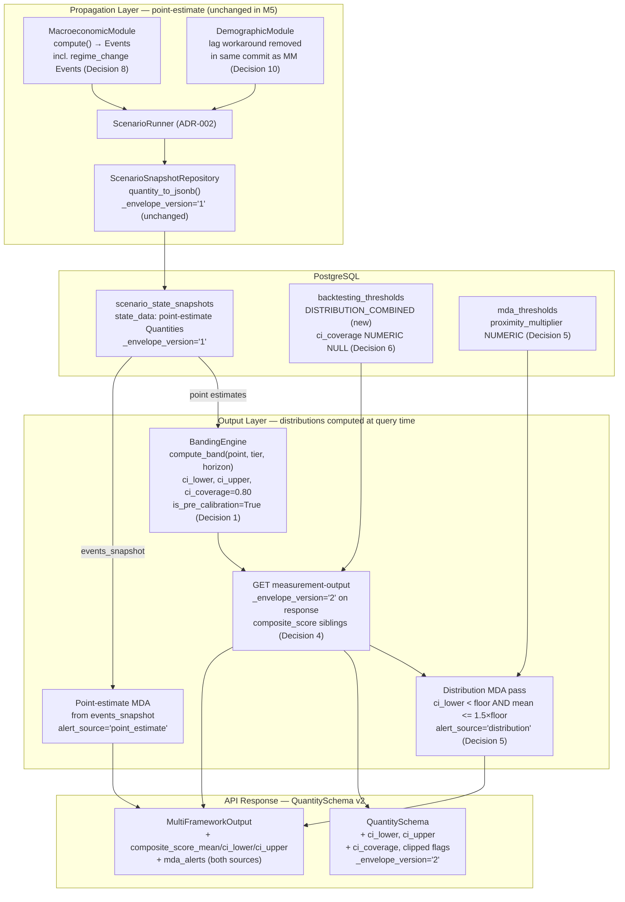
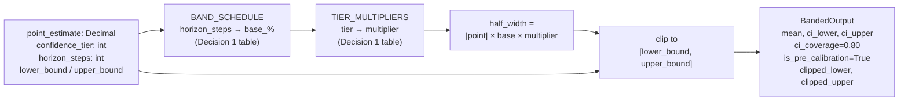

# ADR-006: Uncertainty Quantification and Distribution Outputs

## Status
Accepted

## Validity Context

**Standards Version:** 2026-04-15
**Valid Until:** Milestone 6 completion
**License Status:** CURRENT

**Engineering Lead accepted 2026-05-02.** Architecture decisions reviewed and
approved. Implementation may proceed for M5 scope.

**Last Reviewed:** 2026-05-02 — Initial acceptance at M5 entry. Chief
Methodologist validation completed 2026-05-02, covering three decisions
requiring methodological review before authoring: uncertainty propagation
approach (Decision 1), MDA comparison semantics (Decision 5), and bounded
attribute distribution family (Decision 3). Full Chief Methodologist review
on record in the session preceding ADR authoring. License renewed for
Milestone 6. Next scheduled review at Milestone 6 completion.

**Renewal Triggers** — any of the following fires the CURRENT → UNDER-REVIEW
transition:
- Pre-calibration band schedule revised (the named Monte Carlo upgrade trigger
  — MAGNITUDE_WITHIN_20PCT on both Greece and Argentina — is a mandatory
  renewal event; see Decision 1)
- `confidence_tier` propagation rule changed (ADR-001 Amendment 1 CM-1)
- MDA composite alert rule parameters changed: alert CI level (currently 80%),
  proximity multiplier default (currently 1.5), or the dual-check architecture
  (point-estimate + distribution-aware pass) replaced with a unified check
- `QuantitySchema` API envelope fields removed or made non-nullable
- `backtesting_thresholds.threshold_type` enum extended beyond
  `DIRECTION_ONLY`, `MAGNITUDE`, `DISTRIBUTION_COMBINED`
- `IA1_CANONICAL_PHRASE` revised after M5 distribution outputs ship to users
- Distribution banding computation moved from output layer to propagation
  layer (the architectural boundary decided in Decision 1 is an explicit
  renewal trigger if crossed)

## Date
2026-05-02

## Context

ADR-001 through ADR-005 established the simulation infrastructure through
Milestone 4:
- ADR-001: `Quantity` type system, event propagation engine
- ADR-002: Input orchestration, `ControlInput` types, audit log
- ADR-003: PostGIS schema, FastAPI layer
- ADR-004: Scenario engine, backtesting infrastructure
- ADR-005: Human Cost Ledger, DemographicModule, MDA threshold system,
  radar chart dashboard

Every simulation output across all five ADRs is a point estimate.
`Quantity.value` is a single `Decimal`. The Greece 2010–2012 backtesting
fixture passes DIRECTION_ONLY thresholds only. The MDA system compares
`current_value: Decimal` against `floor_value: Decimal`. The radar chart
renders a single point per axis.

The Milestone 5 commitment (CLAUDE.md) is that every simulation output
becomes a distribution with quantified uncertainty bounds. This ADR is
the architectural contract for that commitment.

**ARCH-REVIEW-004** (2026-04-26) identified 16 decisions required before
any M5 implementation begins, grouped into five dependency tiers. This ADR
resolves all 16 decisions in dependency order (Groups A through E).
**Chief Methodologist validation** (2026-05-02) reviewed three decisions —
uncertainty propagation approach, MDA comparison semantics, and bounded
attribute distribution family — and the recommendations are incorporated
verbatim in Decisions 1, 3, and 5.

**Note on ADR-005 scope discrepancy:** ADR-005 negative consequences place
the MacroeconomicModule in Milestone 6. This is superseded by CLAUDE.md M5
scope definition and by this ADR. The MacroeconomicModule is Milestone 5 scope.

**Open dependencies at the time of writing:**

- **Issue #189** (this ADR) — blocks all M5 implementation. No distribution
  output code, uncertainty propagation, MacroeconomicModule, or backtesting
  schema amendment may be merged until this ADR is accepted.
- **Issue #191** (MacroeconomicModule) — must not begin until this ADR is
  accepted. Constrained by Decisions 8 and 10.
- **Issue #192** (second backtesting case) — Argentina 2001–2002 selected per
  Decision 9. DISTRIBUTION_COMBINED thresholds require Decision 6 schema
  amendment first.
- **Issue #190** (Playwright tests) — implementation sequence mandated in
  Decision 12.
- **Issue #194** (DISTRIBUTION_COMBINED schema amendment) — implements
  Decision 6.

---

## Decision

### Decision 1: Uncertainty Propagation Approach — Epistemic Banding

*(Group A1 + A2 from ARCH-REVIEW-004)*

#### Architecture boundary

The simulation propagation engine remains **point-estimate throughout M5**.
`Quantity.value: Decimal` continues to carry a single value through the
event graph, `quantity_to_jsonb`, and `scenario_state_snapshots`. No
distribution fields are added to the Python `Quantity` dataclass or to JSONB
storage in M5.

Distributions are computed at the **output layer** — specifically, inside the
`GET /scenarios/{id}/measurement-output` endpoint — by a new `BandingEngine`
component that wraps point-estimate values with pre-calibration uncertainty
bands at query time. This is the architectural boundary that all other
decisions in this ADR assume.

#### Why not Monte Carlo ensemble at M5

A Monte Carlo ensemble generates output distributions by sampling from
parameter distributions. The quality of the output distribution is bounded
by the quality of the input distributions.

At M5 entry, fiscal multipliers, elasticity coefficients, and relationship
propagation weights are point estimates with no empirically calibrated
variance. Running Monte Carlo over assumed parameter distributions produces
precise-looking output distributions that are artifacts of those assumptions —
not calibrated uncertainty quantification. The Chief Methodologist's mandate
applies: presenting these outputs as distributions would convey more confidence
than the methodology supports. Monte Carlo is deferred, not rejected. See the
upgrade trigger below.

#### Why not analytical moment propagation at M5

Analytical moment propagation tracks mean and variance through linearized
equations. The MacroeconomicModule's regime-dependent fiscal multiplier is
a deliberate nonlinearity — the Backside of the Power Curve failure mode.
First-order Taylor linearization underestimates uncertainty near regime
boundaries. Additionally, a calibrated covariance matrix across all
simulation attributes is unavailable at M5 calibration depth.

#### Epistemic banding

Epistemic banding attaches uncertainty bands to simulation outputs at query
time based on confidence tier, projection horizon, and a declared band
schedule. The claim is narrow and honest: given the simulation's current
calibration state, here is the width of uncertainty consistent with a
conservative prior about model error at each horizon.

The band is not a confidence interval derived from a calibrated distribution.
It must be labeled as a pre-calibration default wherever it appears in the
UI or API response. See Decision 13 (IA1_CANONICAL_PHRASE update).

#### Pre-calibration band schedule

| Horizon (annual steps from baseline) | Base half-width (±% of \|point estimate\|) |
|---|---|
| 1 year | ±10% |
| 2 years | ±20% |
| 3–5 years | ±35% |
| > 5 years | ±50% |

The base half-width is modulated by the attribute's `confidence_tier`:

| Confidence tier | Band multiplier | Rationale |
|---|---|---|
| 1 (highest data quality) | 1.0× | IMF WEO Tier 1 sources; no additional widening |
| 2 | 1.2× | Minor estimation uncertainty in source |
| 3 | 1.5× | Derived or estimated parameters; meaningful additional uncertainty |
| 4 | 2.0× | Low-quality or reconstructed data |
| 5 (lowest data quality) | 3.0× | Speculative or proxy estimates |

A Tier 3 attribute at a 3-year horizon carries ±35% × 1.5 = ±52.5%.
This is intentionally wide. Understating uncertainty is the wrong failure mode
for a sovereign policy tool.

#### BandingEngine contract

```python
@dataclass(frozen=True)
class BandedOutput:
    mean: Decimal
    ci_lower: Decimal
    ci_upper: Decimal
    ci_coverage: float          # 0.80 for the standard 80% interval
    is_pre_calibration: bool    # True throughout M5
    horizon_steps: int
    clipped_lower: bool         # True if natural lower boundary applied
    clipped_upper: bool         # True if natural upper boundary applied


def compute_band(
    point_estimate: Decimal,
    confidence_tier: int,
    horizon_steps: int,
    lower_bound: Decimal | None = None,   # None for (-∞, ∞)
    upper_bound: Decimal | None = None,   # None for (-∞, ∞)
) -> BandedOutput:
    base_pct = BAND_SCHEDULE[horizon_steps]       # from table above
    multiplier = TIER_MULTIPLIERS[confidence_tier]
    half_width = abs(point_estimate) * Decimal(str(base_pct * multiplier))
    raw_lower = point_estimate - half_width
    raw_upper = point_estimate + half_width
    ci_lower = max(raw_lower, lower_bound) if lower_bound is not None else raw_lower
    ci_upper = min(raw_upper, upper_bound) if upper_bound is not None else raw_upper
    return BandedOutput(
        mean=point_estimate,
        ci_lower=ci_lower,
        ci_upper=ci_upper,
        ci_coverage=0.80,
        is_pre_calibration=True,
        horizon_steps=horizon_steps,
        clipped_lower=(ci_lower > raw_lower),
        clipped_upper=(ci_upper < raw_upper),
    )
```

`horizon_steps = 0` produces zero-width bands (`ci_lower = ci_upper = mean`).
Initial-state (step 0) outputs are point estimates by definition — see
Decision 11.

#### Named upgrade trigger to Monte Carlo

When MAGNITUDE_WITHIN_20PCT backtesting validation exists for **both** Greece
2010–2012 and Argentina 2001–2002, the calibration record is sufficient to
begin constructing empirical parameter uncertainty estimates. This condition
is a **mandatory renewal trigger** for this ADR. At that point, the
pre-calibration band schedule must be reviewed and Monte Carlo ensemble
generation must be evaluated as the production propagation approach.

This trigger must be evaluated at Milestone 6 exit. It does not guarantee
that Monte Carlo will be adopted — it mandates the evaluation.

---

### Decision 2: Distribution Output Fields and Envelope Versioning

*(Group A3 + A4 + A5 from ARCH-REVIEW-004)*

#### What does NOT change in M5

`quantity_to_jsonb` and `quantity_from_jsonb` in
`backend/app/simulation/repositories/quantity_serde.py` are **unchanged**.
The JSONB storage format in `scenario_state_snapshots.state_data` continues
to carry `value`, `unit`, `variable_type`, `confidence_tier`,
`observation_date`, `source_registry_id`, `measurement_framework`, and
`_envelope_version: "1"` only.

The Greece 2010–2012 fixture at
`tests/fixtures/backtesting/greece_2010_initial_state.json` is **unchanged**
and requires no migration.

#### QuantitySchema extension (API response type)

The Pydantic `QuantitySchema` response model gains six optional fields.
These are computed by the BandingEngine at query time and are absent on
direct attribute reads that do not invoke banding:

```python
class QuantitySchema(BaseModel):
    # Existing fields — unchanged
    value: str                          # Decimal serialised as string
    unit: str
    variable_type: str
    confidence_tier: int
    observation_date: str | None
    source_registry_id: str | None
    measurement_framework: str | None
    _envelope_version: str              # "1" point-only; "2" banded
    note: str | None = None

    # New optional distribution fields (M5 addition)
    ci_lower: str | None = None         # Decimal serialised as string
    ci_upper: str | None = None         # Decimal serialised as string
    ci_coverage: float | None = None    # 0.80
    is_pre_calibration: bool | None = None
    clipped_lower: bool | None = None
    clipped_upper: bool | None = None
```

`_envelope_version` is set to `"2"` by the measurement-output endpoint when
banding fields are populated. It remains `"1"` on all other endpoints
(`GET /choropleth/{attribute}`, etc.) that do not invoke the BandingEngine.

`docs/schema/api_contracts.yml` must be updated to reflect these new fields
on the measurement-output response in the same commit as implementation.

#### Separation of confidence_tier from distribution width

These are categorically distinct and must never share a field:

- `confidence_tier` — **data quality** signal. How reliably is the underlying
  value known from source data? Originates at data ingestion. Propagates via
  `max()` (ADR-001 Amendment 1). A property of the *observation*.

- `ci_lower` / `ci_upper` / `ci_coverage` — **model uncertainty** signals.
  How uncertain is the projection given the model's calibration state?
  Computed by the BandingEngine at query time. A property of the *projection*.

`confidence_tier` modulates the band width (Decision 1 multiplier table) but
is not the band width. A Tier 1 attribute (high data quality) at a long
projection horizon carries wide bands. A Tier 5 attribute at a short horizon
carries bands that are wide for a different reason. Both dimensions of
uncertainty are independently visible in the API response.

#### Backward compatibility

Distribution fields are `None`-defaulted on `QuantitySchema`. Pre-M5 snapshot
reads through the measurement-output endpoint receive `ci_lower: None` until
the BandingEngine populates them. No version-dispatch is required in
`quantity_from_jsonb` for M5 — the storage layer remains version "1"
throughout this milestone.

The `_envelope_version: "1"` field in JSONB storage is the future dispatch
gate if distribution fields move into the storage layer in a later milestone.
The gate mechanism is architecturally in place; it is not activated in M5.

---

### Decision 3: Bounded Attribute Distribution Constraints

*(Group B3 from ARCH-REVIEW-004)*

Symmetric epistemic bands on bounded attributes can produce values outside
the attribute's natural domain — negative poverty headcounts, debt ratios
outside plausible ranges. The `BandingEngine` applies natural boundary
clipping via the `lower_bound` and `upper_bound` parameters in `compute_band()`
(Decision 1).

#### Attribute boundary classification

Every attribute processed by the BandingEngine must be classified by natural
domain. This classification is declared by the module introducing the
attribute in its attribute specification table.

| Attribute class | Natural lower | Natural upper | Examples |
|---|---|---|---|
| Bounded proportion | 0 | 1 | `poverty_headcount_ratio`, `employment_rate`, `food_insecurity_rate` |
| Non-negative stock | 0 | None | `gdp_level_usd`, `fx_reserves`, `population_total` |
| Non-negative ratio (unbounded upper) | 0 | None | `debt_gdp_ratio`, `reserve_coverage_months` |
| Signed flow / rate | None | None | `gdp_growth_rate`, `fiscal_balance_pct_gdp`, `inflation_rate` |
| Bounded index | Declared minimum | Declared maximum | `capability_index` [0, 1], Freedom House [1, 7] |

When clipping occurs, `clipped_lower: True` or `clipped_upper: True` is set
on `BandedOutput` and propagated to `QuantitySchema`. The endpoint adds a
note to the affected indicator:

```python
if banded.clipped_lower or banded.clipped_upper:
    schema.note = (
        "Uncertainty band clipped at natural boundary "
        f"({'lower' if banded.clipped_lower else 'upper'}). "
        "Probability mass at boundary represents probability "
        "of extreme values in that direction."
    )
```

This note must be visible in `FrameworkPanel.tsx` indicator rows without
frontend changes — the `note` field already renders.

#### Deferral of calibrated distribution families

Beta distributions (proportions), log-normal (strictly positive stocks), and
calibrated truncated normals require empirically estimated parameters.
At M5 calibration depth these parameters are not available. Their use would
imply more knowledge about distribution tails than the model possesses.
Deferral to M6 on the same upgrade trigger as Decision 1. See Known
Limitation EW-4.

---

### Decision 4: composite_score Distribution Representation

*(Group B2 from ARCH-REVIEW-004)*

`MultiFrameworkOutput.FrameworkOutput.composite_score` (ADR-005 Decision 2)
is currently `str | None`. Distribution representation uses **sibling fields**
to avoid breaking existing component code:

```python
class FrameworkOutput(BaseModel):
    framework: str
    composite_score: str | None           # preserved; equals composite_score_mean
    note: str | None = None

    # New distribution sibling fields (M5 addition)
    composite_score_mean: str | None = None         # same value as composite_score
    composite_score_ci_lower: str | None = None     # Decimal as string
    composite_score_ci_upper: str | None = None     # Decimal as string
    composite_score_ci_coverage: float | None = None
    composite_score_is_pre_calibration: bool | None = None

    indicators: list[...]                 # unchanged
```

`composite_score` is retained and populated with the same value as
`composite_score_mean`. Existing TypeScript consumers (`RadarChart.tsx` reads
it via `parseFloat`; `EntityDetailDrawer.tsx` derives `RadarAxisDatum[]`;
`FrameworkPanel.tsx` renders it) require no structural changes in M5.

The TypeScript type definitions in `types.ts` require only additive optional
field additions. This is a non-breaking M5 change.

**Why not a nested distribution object:**
`composite_score: {mean, ci_lower, ci_upper}` would require structural changes
to every component that reads `composite_score` as a plain string today.
Sibling fields are additive; nested objects are breaking.

#### RadarAxisDatum extension for uncertainty bands

`RadarChart.tsx` displays uncertainty bands via multiple overlapping
`<Radar>` traces (mean, ci_lower, ci_upper at different fill opacities) when
`uncertaintyVisible = true` (Decision 7). This requires extending
`RadarAxisDatum`:

```typescript
interface RadarAxisDatum {
  axis: string;
  value: number;           // mean
  ci_lower?: number;       // optional; present when uncertaintyVisible
  ci_upper?: number;
  is_pre_calibration?: boolean;
}
```

The extension is additive. When `uncertaintyVisible = false` (default),
`ci_lower` and `ci_upper` are not passed to the `<Radar>` components and
rendering is unchanged from M4.

---

### Decision 5: MDA Comparison Semantics Under Distributions

*(Group B1 from ARCH-REVIEW-004)*

ADR-005 Decision 3 defines `MDAChecker` as a point-to-point comparison:
`current_value < floor_value`. With distribution outputs this semantics is
extended by a **composite alert rule**.

#### Composite alert rule

An MDA alert fires when **both** conditions are satisfied:

**Condition 1 — CI breach:** `ci_lower < floor_value`
The lower bound of the 80% CI is below the MDA floor. This fires when there
is material probability (>10% under the 80% interval convention) that the
indicator has already crossed the irreversibility threshold.

**Condition 2 — Mean proximity:** `mean <= proximity_multiplier × floor_value`
The point estimate is within a declared proximity of the floor.
Default `proximity_multiplier = 1.5` (mean must be at most 50% above the
floor to fire). This condition prevents nuisance alerts from wide pre-calibration
bands on indicators that are not genuinely near their floors.

`proximity_multiplier` is a **configurable parameter** stored in the
`mda_thresholds` table as a new column:

```sql
ALTER TABLE mda_thresholds
    ADD COLUMN proximity_multiplier NUMERIC NOT NULL DEFAULT 1.5;
```

It may be overridden per threshold. When the pre-calibration bands narrow
through calibration, the proximity condition becomes less binding. It is a
declared parameter, not a magic constant.

**Alert schema extension:**

```python
@dataclass
class MDAAlert:
    # Existing fields — unchanged
    mda_id: str
    severity: MDASeverity
    indicator_key: str
    current_value: Decimal
    floor_value: Decimal
    # New fields
    alert_source: str       # "point_estimate" | "distribution"
    ci_lower: Decimal | None
    proximity_multiplier: Decimal | None
```

#### Implementation architecture

Because distribution bands are computed at query time (Decision 1), and
the existing `MDAChecker` runs during step execution inside
`WebScenarioRunner`, the composite check runs in two layers:

**Layer 1 — execution time (unchanged):** The existing point-estimate
`MDAChecker` continues to fire when `current_value < floor_value`.
`events_snapshot` continues to record point-estimate breaches.
`alert_source = "point_estimate"`.

**Layer 2 — query time (new):** The `GET /scenarios/{id}/measurement-output`
endpoint runs a distribution-aware pass against banded outputs.
`alert_source = "distribution"`. This layer applies the composite rule.

The response `mda_alerts` list contains alerts from both layers.
`MDAAlertPanel.tsx` must display `alert_source` context to prevent user
confusion when both layers fire for the same threshold.

#### Rationale for lower CI semantics

The MDA floors represent irreversibility thresholds. Alerting when the mean
falls below the floor means alerting after the expected outcome has already
crossed the line — too late for a protective tool. The lower CI semantics
alert when there is material probability of crossing: before the event is
expected, not after. This is the "defense not offense" principle applied
to the alerting system.

---

### Decision 6: DISTRIBUTION_COMBINED Backtesting Threshold Type

*(Groups C1 + C2 from ARCH-REVIEW-004)*

ADR-004 Decision 3 defines `threshold_type` values `DIRECTION_ONLY` and
`MAGNITUDE`. `MAGNITUDE` compares a point simulated value to a point
historical actual. With distribution outputs a new type is required.

#### DISTRIBUTION_COMBINED pass conditions

Both conditions must pass:

1. **Mean proximity:** `|distribution_mean - expected_value| / |expected_value|
   ≤ tolerance_pct`. Prevents a wide distribution centred far from the
   historical actual from passing on interval inclusion alone.

2. **CI inclusion:** `expected_value` falls within the `[ci_lower, ci_upper]`
   interval of the simulated distribution at `ci_coverage` level (e.g.,
   0.80 = 80% CI).

The combined requirement is stricter than either condition alone. A wide
distribution centred on the right mean passes Condition 1 but fails Condition
2 if the actual falls in the extreme tail. A tight distribution containing
the actual fails Condition 1 if the mean is biased.

#### Schema amendment

```sql
ALTER TABLE backtesting_thresholds
    ADD COLUMN ci_coverage NUMERIC NULL;
```

- `NULL` for existing `DIRECTION_ONLY` and `MAGNITUDE` thresholds
- `0.80` for `DISTRIBUTION_COMBINED` thresholds

The `threshold_type` CHECK constraint is amended to permit
`'DISTRIBUTION_COMBINED'`.

`docs/schema/database.yml` `backtesting_thresholds` section must be updated
in the same commit as the Alembic migration (Issue #194).

#### Application to M5 backtesting

Existing Greece DIRECTION_ONLY thresholds are unchanged. M5 adds
DISTRIBUTION_COMBINED thresholds for GDP growth and fiscal balance against
Greece once MacroeconomicModule calibration is stable. Argentina 2001–2002
thresholds (Decision 9) are seeded as DISTRIBUTION_COMBINED from the start.

---

### Decision 7: uncertaintyVisible Toggle Location

*(Group C3 from ARCH-REVIEW-004)*

`uncertaintyVisible: boolean` is a `useState` variable in `App.tsx` for M5.
It is added alongside the existing cross-component state variables
(`selectedScenarioId`, `currentStep`, etc.).

Default: `false`. Distribution rendering components (`RadarChart` uncertainty
bands, CI ranges in `FrameworkPanel` indicator rows) render point-estimate
output when `false` and banded output when `true`.

`ScenarioViewContext` introduction is deferred to no earlier than Milestone 7
per `modularization-strategy.md`. Introducing it as part of M5 distribution
work would conflate two independent architectural changes.

Defaulting to `false` allows the Playwright test suite (Issue #190) to be
written against the simpler point-estimate display first, per the
sequencing mandate in Decision 12.

---

### Decision 8: Regime Change as Endogenous Event Type

*(Group D1 from ARCH-REVIEW-004)*

Fiscal multiplier regime changes (standard → depressed, depressed → recovery)
are endogenous simulation dynamics, not policy decisions. They must **not** be
implemented using `ContingentInput` (ADR-002). `ContingentInput` records human
decisions in `control_input_audit_log`. Recording a model state transition as
a `ControlInput` would pollute the audit log with model dynamics, making it
unreadable as a policy decision record.

#### New event type: `regime_change`

`MacroeconomicModule.compute()` returns `Event` objects with
`event_type = "regime_change"` when a regime transition is detected. The
`Event.metadata` dict carries:

```python
{
    "regime_previous": "standard",     # "standard" | "depressed" | "recovery"
    "regime_new": "depressed",
    "trigger_attribute": "gdp_growth_rate",
    "trigger_value": "-0.085",         # Decimal serialised as string
    "threshold": "-0.03",              # bifurcation threshold used
}
```

`regime_change` events are stored in `events_snapshot`. They do not carry
`PropagationRule` entries and do not propagate through the relationship graph.
Other modules may subscribe to `"regime_change"` via `get_subscribed_events()`
to react on the following step.

`docs/schema/simulation_state.yml` must be updated to add `"regime_change"`
to the documented `event_type` values in the `Event` type section.

---

### Decision 9: Argentina 2001–2002 as Second Backtesting Case

*(Group D2 from ARCH-REVIEW-004)*

Argentina 2001–2002 is confirmed as the second historical backtesting case
for Milestone 5.

**Selection rationale:**
- GDP contraction of −10.9% in 2002 — extreme outcome testing
  MacroeconomicModule downside dynamics
- Four documented IMF programs (1998–2001) provide a clean `ControlInput`
  sequence using existing `FiscalPolicyInput`, `StructuralPolicyInput`, and
  `EmergencyPolicyInput` types
- `EmergencyPolicyInput` `DEFAULT_DECLARATION` type already exists for the
  December 2001 sovereign default
- Crisis driven by fiscal dynamics and currency peg collapse — within
  MacroeconomicModule scope without requiring Trade or Capital Flow modules
- IMF WEO vintages archived; actuals available in IMF WEO 2003; Tier 2

**Cases not selected:**
- Thailand 1997: requires Trade and Capital Flow modules (M6 scope)
- Lebanon 2019–2020: Tier 3–4 data quality; no clean IMF program ControlInput
  sequence
- Iceland 2008: banking sector collapse — not in M5 module scope

The Argentina case follows the ADR-005 Decision 5 case registration protocol:

```
tests/fixtures/backtesting/argentina_2001_initial_state.json
tests/backtesting/actuals/argentina_2001_actuals.py
tests/backtesting/scenarios/argentina_2001_scenario.py
tests/backtesting/test_argentina_2001.py
```

Initial thresholds: `DIRECTION_ONLY` for GDP growth direction and fiscal
balance direction. `DISTRIBUTION_COMBINED` thresholds added when
MacroeconomicModule calibration produces stable outputs.

---

### Decision 10: DemographicModule Lag Workaround Removal

*(Group E1 from ARCH-REVIEW-004)*

ADR-005 negative consequences document a one-step lag workaround:
`DemographicModule` reads previous-step GDP growth directly from entity state
(a legacy path) because `gdp_growth_change` events are not produced at M4.
When `MacroeconomicModule` begins producing these events at M5, two paths
become active simultaneously unless the legacy path is explicitly removed.

**If both paths are active, demographic elasticities are applied twice per
step** — once from the `gdp_growth_change` event and once from the legacy
state read. This is a silent double-count; it does not raise an exception.

**Implementation constraint:** Removal of the legacy state-read path from
`DemographicModule` must be in the **same commit** as the `MacroeconomicModule`
wire-up that produces `gdp_growth_change` events. The PR for Issue #191 must
include both changes. A PR that adds `MacroeconomicModule` without removing
the legacy path fails the acceptance criteria for Issue #191.

`docs/schema/simulation_state.yml` `DemographicModule` section must be updated
to remove the lag workaround note when the PR merges.

---

### Decision 11: Initial-State Step 0 as Point-Estimate

*(Group E2 from ARCH-REVIEW-004)*

`scenario_state_snapshots` at step 0 carry seeded baseline values from
`simulation_entities.attributes`. These are historical observations with
measurement uncertainty captured by `confidence_tier` but no model
uncertainty — they are not projections.

**Step 0 attributes remain point-estimates.** When `BandingEngine` processes
step 0, `horizon_steps = 0` produces zero-width bands:
`ci_lower = ci_upper = point_estimate`. This is epistemically correct — an
observed baseline value has measurement uncertainty (expressed by
`confidence_tier` modulating confidence in the value) but no projection
uncertainty.

The Greece 2010–2012 backtesting fixture is a step 0 fixture by definition
and requires no migration under this decision.

---

### Decision 12: Playwright Test Implementation Sequence

*(Group E3 from ARCH-REVIEW-004)*

Issue #190 (Playwright test suite) is a hard gate for M5 exit. The following
implementation sequence is **mandatory**:

**Phase 1 — Playwright against point-estimate UI (must merge before Phase 3):**
Write and merge the three required Playwright flows from the M4 retrospective
against the M4 point-estimate display:
1. Create → advance to completion → click entity → drawer shows output
2. Re-select completed scenario → drawer shows output immediately
3. Partial advance → click entity → drawer shows step output

**Phase 2 — TypeScript type upgrades (no rendering change):**
Update `types.ts` with optional distribution sibling fields
(`ci_lower`, `ci_upper`, `composite_score_mean`, etc.).
Components receive the new optional fields as `undefined`; display unchanged.

**Phase 3 — Distribution rendering behind `uncertaintyVisible = false`:**
Add uncertainty band traces to `RadarChart`, CI ranges to `FrameworkPanel`
indicator rows, and the `uncertaintyVisible` toggle to `App.tsx`.
These components render point-estimate output by default until toggle is true.

**Phase 4 — Playwright tests for uncertainty toggle:**
Test that toggling `uncertaintyVisible` correctly shows/hides bands.

A PR that includes distribution rendering components alongside the initial
Phase 1 Playwright flows violates this sequence and may not be merged.
The Phase 1 flows must exist as a standalone merged PR before Phase 3 begins.

**Why this sequence matters:** Writing E2E assertions against plain text
values (Phase 1 UI) is simpler and less flaky than asserting against
uncertainty band positioning or numeric ranges. The Phase 1 suite also
establishes the baseline the Phase 4 tests extend.

---

### Decision 13: IA1_CANONICAL_PHRASE Update for Epistemic Banding

*(Additional from M5 scope)*

`IA1_CANONICAL_PHRASE` (enforced in ADR-004, extended in ADR-005) is the
required disclosure phrase on every `MultiFrameworkOutput` and
`backtesting_runs` record. The current phrase was written for a point-estimate
tool and does not describe epistemic banding.

**The phrase must be updated before any M5 distribution output is presented
to users.** The update must:
1. State that uncertainty bands are pre-calibration defaults, not calibrated
   confidence intervals.
2. State the upgrade trigger condition.
3. Preserve the existing guidance that outputs are reasoning tools, not
   predictions.

**Proposed updated phrase** (Engineering Lead must approve final text before
implementation):

> "This simulation produces distributions using pre-calibration uncertainty
> bands. Intervals shown are NOT confidence intervals derived from calibrated
> parameter distributions — they are conservative defaults that widen with
> projection horizon and data quality. Bands will be revised when
> MAGNITUDE_WITHIN_20PCT validation exists for at least two independent
> historical cases. All outputs should be interpreted as structured reasoning
> tools, not predictions. Verify against current data before consequential
> use."

The Engineering Lead must approve and merge the `IA1_CANONICAL_PHRASE`
constant update before any PR that adds distribution fields to the
measurement-output response is merged.

Existing backtesting records carrying the previous phrase are grandfathered.
They reflect the disclosure standard at the time of their creation.

---

## Alternatives Considered

### Alternative 1: Monte Carlo ensemble at M5

**Deferred, not rejected.** Decision 1's named upgrade trigger explicitly
identifies Monte Carlo as the target approach when calibration depth is
sufficient. It is deferred because empirical parameter distributions are
unavailable at M5, not because it is architecturally inappropriate.

### Alternative 2: Analytical moment propagation

**Rejected for M5.** First-order Taylor linearization of a deliberately
nonlinear model (regime-dependent multipliers) underestimates uncertainty
at regime boundaries — exactly where the simulation must be most honest.

### Alternative 3: Distribution fields in the Quantity propagation envelope

Adding `ci_lower`, `ci_upper`, `ci_coverage` directly to the Python `Quantity`
type.

**Rejected for M5.** Under epistemic banding, distribution fields are computed
at the output layer, not propagated through the graph. Adding them to
`Quantity` would imply propagated distributions (Monte Carlo or analytical
moment architecture). The epistemic banding choice and the point-estimate
propagation envelope are a coherent pair. Storing distribution fields in
`Quantity` while computing them only at the output layer would be
architecturally misleading and create confusion for any agent reading
`simulation_state.yml`.

### Alternative 4: MDA alert on mean-below-floor only

**Rejected.** Mean-below-floor semantics alert after the expected outcome
has already crossed the irreversibility threshold. The composite rule
(Decision 5) fires when there is material probability of crossing — before
the event is expected. The "defense not offense" principle requires early
alerting; mean semantics provide the opposite.

### Alternative 5: composite_score as a nested distribution object

Replacing `composite_score: str | None` with a nested
`{mean, ci_lower, ci_upper}` object.

**Rejected.** A nested object requires structural changes to `RadarChart.tsx`,
`EntityDetailDrawer.tsx`, and `FrameworkPanel.tsx`. Sibling fields are
additive and require only optional type additions in `types.ts`.

### Alternative 6: ScenarioViewContext for uncertaintyVisible toggle at M5

**Deferred to M7** per `modularization-strategy.md`. Introducing context at
M5 would conflate uncertainty display with the broader state management
refactor. `App.tsx` state is sufficient for M5.

---

## Consequences

### Positive

- The propagation engine, JSONB storage, and all existing backtesting
  fixtures require zero changes in M5. The BandingEngine is a new component
  in the output layer with no dependencies on engine internals.
- The explicit `is_pre_calibration: True` label on every banded output is
  methodologically honest. Wide bands at long horizons communicate accurate
  information about the model's current epistemic state.
- The named upgrade trigger (Monte Carlo when both Greece and Argentina pass
  MAGNITUDE_WITHIN_20PCT) ties methodology improvement directly to calibration
  progress. Bands will narrow as the tool improves.
- The composite MDA rule eliminates nuisance alerts from wide pre-calibration
  bands on indicators nowhere near their floors, while preserving protective
  early alerting semantics when floor proximity is genuine.
- Argentina 2001–2002 tests extreme fiscal crisis dynamics (−10.9% GDP
  contraction) that Greece alone cannot validate. The two cases together cover
  a debt overhang crisis and an acute liquidity/default crisis.
- The DemographicModule lag workaround removal constraint makes the
  silent double-count impossible to introduce accidentally — it is a
  PR acceptance criterion, not a code-level guard.
- Sibling fields for `composite_score` require only additive TypeScript type
  changes in M5. No breaking changes to M4 frontend components.

### Negative

- Epistemic banding is not calibrated uncertainty quantification. Wide
  pre-calibration bands at 3+ year horizons (±35–52% for Tier 3 attributes)
  may cause users to dismiss the uncertainty display as uninformative noise.
  The IA1_CANONICAL_PHRASE update (Decision 13) partially compensates but
  does not eliminate this risk. The upgrade trigger is the structural remedy.
- The dual MDA check architecture (point-estimate at execution time +
  distribution-aware at query time) produces two alert sources in one response.
  A single threshold crossing may generate both a `"point_estimate"` alert
  and a `"distribution"` alert. `MDAAlertPanel.tsx` must communicate this
  distinction; the current panel has no `alert_source` display logic.
- Sibling field proliferation: `FrameworkOutput` gains five new fields
  per framework. The API response grows wider. This is acceptable for M5;
  if unwieldy, a consolidated distribution sub-object should be considered
  at M7 alongside ScenarioViewContext.
- The `proximity_multiplier = 1.5` default means distribution MDA alerts
  fire when the mean is below 60% of a 40% poverty headcount floor.
  This may feel aggressive without clear UI explanation of the parameter.
- The Playwright test sequence (Decision 12) cannot be automatically enforced
  by CI. It is a PR review discipline requirement.

---

## Dependency Map

| Depends On | Why |
|---|---|
| ADR-001 | `Quantity` type contract unchanged. `confidence_tier` semantics preserved (data quality, not model uncertainty). `VariableType` classification drives natural boundary assignment (Decision 3) |
| ADR-001 Amendment 1 | `confidence_tier` (1–5) is the band multiplier input (Decision 1). `propagate_confidence()` unchanged. `variable_type` STOCK/FLOW/RATIO/DIMENSIONLESS semantics unchanged |
| ADR-002 | `ContingentInput` explicitly NOT used for regime change events (Decision 8). `control_input_audit_log` semantics preserved |
| ADR-003 | `QuantitySchema` Pydantic model extended with distribution sibling fields (Decision 2). No changes to M2 database tables |
| ADR-004 | `backtesting_thresholds` extended with `ci_coverage` column (Decision 6). `ia1_disclosure` enforcement contract extended to cover epistemic banding (Decision 13). `events_snapshot` continues to record point-estimate MDA breaches |
| ADR-005 | `FrameworkOutput` extended with `composite_score` sibling fields (Decision 4). `MDAChecker` extended with distribution-aware pass at endpoint layer (Decision 5). DemographicModule lag workaround removal mandated (Decision 10). Note: ADR-005 incorrectly placed MacroeconomicModule in M6 — superseded by CLAUDE.md and this ADR |
| Issue #189 | This ADR. Blocks Issues #190, #191, #192, #194 |
| Issue #190 | Playwright sequencing mandated (Decision 12). Phase 1 flows must merge before distribution rendering begins |
| Issue #191 | Must implement Decision 8 (regime_change Event type) and Decision 10 (lag workaround removal in same commit). Must not begin until this ADR is accepted |
| Issue #192 | Argentina confirmed (Decision 9). DISTRIBUTION_COMBINED thresholds require Issue #194 schema amendment first |
| Issue #193 | No ADR dependency. Uses existing `note` field. Can proceed independently after this ADR merges |
| Issue #194 | Implements Decision 6 Alembic migration. Must update `docs/schema/database.yml` in same commit |

---

## Diagrams

### M5 uncertainty output architecture



### BandingEngine computation



---

## Known Limitations

**EW-1: Epistemic banding is not a calibrated confidence interval.**
The pre-calibration band schedule is a conservative default based on
rough IMF forecast error benchmarks, not derived from empirical parameter
distributions. Users must not interpret the 80% CI as having true 80%
empirical coverage for this simulation's outputs. The `is_pre_calibration:
True` flag and the updated IA1_CANONICAL_PHRASE (Decision 13) must be
visible wherever distribution outputs appear. The upgrade trigger in
Decision 1 is the structural path to calibrated confidence intervals.

**EW-2: Pre-calibration band widths may appear discouraging.**
Wide bands at 3+ year horizons (±35–52% for Tier 3 attributes) correctly
reflect the simulation's current epistemic limitations, but may cause users
to dismiss the uncertainty display as uninformative. This is the correct
failure mode — the alternative (falsely narrow bands) would produce dangerous
false confidence in a tool making consequential policy recommendations.

**EW-3: Relationship weight uncertainty deferred to Milestone 6.**
`Relationship.weight` is a float point estimate (ARCH-4 exception, ADR-001
Amendment 1). Under epistemic banding, weight uncertainty is not included —
only output-layer bands represent uncertainty. Under Monte Carlo (post upgrade
trigger), relationship weight uncertainty must be included in the parameter
perturbation scheme. This must be addressed in an ADR-006 amendment or
ADR-007 at M6 entry.

**EW-4: Bounded attribute distribution families deferred to Milestone 6.**
Beta distributions (bounded proportions) and log-normal distributions
(strictly positive stocks) are epistemically superior to clipped symmetric
bands but require calibrated parameters unavailable at M5 depth. Symmetric
clipping is the honest choice at current calibration depth. The upgrade
trigger is the same as EW-1: MAGNITUDE_WITHIN_20PCT on both Greece and
Argentina.

**EW-5: Dual MDA alert sources require frontend display logic.**
A single threshold crossing may produce both a `"point_estimate"` and a
`"distribution"` alert in the same response. `MDAAlertPanel.tsx` must display
the `alert_source` context to prevent user confusion. The panel's current
implementation (ADR-005) has no `alert_source` display logic and must be
updated in the same PR as the distribution-aware MDA pass.

---

## Next ADR

ADR-006 establishes the uncertainty architecture for Milestone 5.
Implementation decisions specific to the MacroeconomicModule not covered
here (full GDP dynamics specification, monetary transmission mechanics,
precise regime threshold calibration) may be documented in an ADR-006
amendment during Issue #191 implementation if they materially affect the
architectural contracts above.

ADR-007 will address the Ecological Module initial implementation
(Milestone 6 scope per `docs/roadmap/milestone-roadmap-m6-m8.md`), covering
planetary boundary proximity, agricultural stress mechanics, and ERA5
reanalysis data integration. ADR-007 will also evaluate the Decision 1
Monte Carlo upgrade trigger if the M6 backtesting calibration record
(Greece + Argentina MAGNITUDE_WITHIN_20PCT) warrants it.
