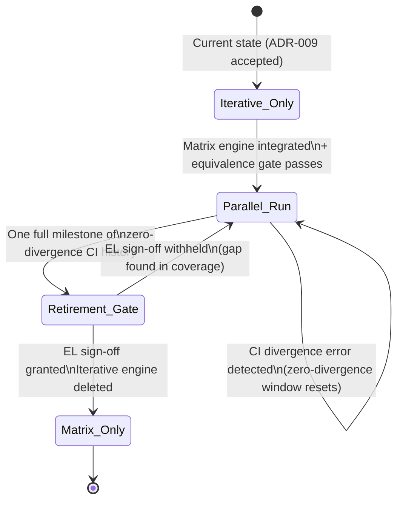
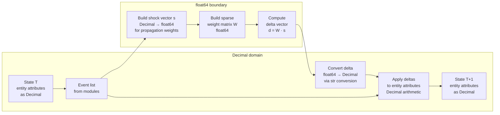

# ADR-009: Simulation Engine Computation Model

> **Reader Orientation:** This ADR governs the transition from the iterative propagation
> engine to a sparse-matrix computation model. Read it before: writing any code that
> touches the propagation engine, modifying Decimal↔float conversion boundaries, or
> designing any Monte Carlo or backtesting integration with engine outputs. The matrix
> engine is now in production (M12, #749) — the iterative engine is retired.
> ADR-008 (viewport) and ADR-010 (trajectory view) are downstream consumers of engine
> outputs — changes to the output schema require reviewing those ADRs' renewal triggers.

## Status
IMPLEMENTED

## Validity Context

**Standards Version:** 2026-06-05
**Valid Until:** See Renewal Triggers below
**License Status:** CURRENT — Implemented 2026-06-05 (PR #769, M12 G4)

**Diagram:** `docs/architecture/ADR-009-engine-computation-model.mmd` (added M11 exit, SCAN-025).

**Panel review:** 2026-06-03 — `docs/adr/reviews/ADR-009-panel-review.md`
Panel: Chief Engineer (C — performance and transition strategy), Chief Methodologist
(C — precision boundary and equivalence testing), Engineering Lead (A — accepted
2026-06-03).

**Proposed:** 2026-06-03. Based on Phase 1 baseline benchmarks (#514, 2026-05-31,
`docs/architecture/engine-baseline-benchmarks-m10.md`) and Issue #217.

### Renewal Triggers

This ADR must be reviewed and an amendment appended when any of the following occur:

- The sparse-matrix engine is proposed to be retired (not just the iterative engine)
- The Decimal↔float64 conversion boundary moves — i.e., monetary arithmetic crosses
  into float64, or additional non-weight quantities are vectorized
- The equivalence tolerance threshold changes from `1e-10`
- The Monte Carlo performance target changes (currently: 1,000 runs on Greece scenario
  within 60 seconds on the CI runner)
- The four interpretability tools enumerated in §Decision 4 are proposed to be removed
  or their scope is changed
- The parallel-run window definition changes (currently: one full milestone of
  zero-divergence on all backtesting fixtures)

---

## Context

### Why the Iterative Engine Has Served Well

The event-driven iterative propagation engine (`app/simulation/engine/propagation.py`)
implements the graph traversal that converts `State[T]` into `State[T+1]`. It is
correct, tested, and well-understood. Phase 1 baseline benchmarks (Issue #514,
`docs/architecture/engine-baseline-benchmarks-m10.md`) confirm that at current scenario
scale — one to a few hundred entities, sparse relationship graphs, annual step resolution
— the iterative engine is not a performance bottleneck:

- 1,000 Monte Carlo runs (1 entity, 10 steps) complete in 174 ms on the constrained
  hardware target (Intel i5-8265U, 8 GiB RAM)
- Per-step cost at 100 entities: 0.09 ms (ProBook); well within interactive latency budget
- Memory footprint: < 0.2 MiB at all tested configurations

The engine is fast enough for the current resolution scope. The argument for a
matrix computation model is not velocity — it is a ceiling.

### Why a Matrix Model Is Worth Investigating

Two Phase 2 scenarios in the M11 roadmap make the ceiling visible:

**Scenario 1 — ADR-006 Monte Carlo upgrade.** ADR-006 specifies minimum sample sizes
of 1,000 for integration tests and 5,000 for production scenario runs. As scenarios
scale to multiple entities with denser relationship graphs, the iterative engine's
O(edges × hops) propagation traversal — which the benchmarks show is dominated by
edge density, not entity count — will become the bottleneck. A matrix multiplication
replaces the graph traversal with a single vectorized operation, collapsing the
propagation step to O(n²) matrix math with constant overhead.

**Scenario 2 — ADR-009 M11 primary objective.** The matrix engine proof-of-concept
is the M11 primary deliverable. This ADR establishes the architectural decisions that
govern the proof-of-concept's acceptance criteria and the conditions under which the
iterative engine is retired.

### The Transition Risk

The iterative engine is the load-bearing component of the simulation. Any computation
that reaches the user's screen passes through it. A matrix engine corner-case bug that
produces wrong outputs without failing the equivalence tests would affect all scenario
outputs without any detection mechanism. The transition strategy must address this risk
explicitly and structurally — not by relying on post-cutover manual verification.

---

## Decisions

### Decision 1 — Transition Strategy: Parallel Run

**Chosen: Parallel run.**

Both the iterative and matrix engines are active simultaneously for one full milestone
following the matrix engine's first integration. Every backtesting fixture run executes
on both engines. Divergence above the tolerance threshold (§Decision 2) triggers an
error — not a warning — in CI. The iterative engine is retired only after a defined
window of zero-divergence: all backtesting fixture assertions pass on both engines
across an entire milestone's CI history with no divergence error.

**Alternative rejected: Hard cutover.**

Hard cutover (retiring the iterative engine on the same commit that merges the matrix
engine, gated by the equivalence test harness passing at that moment) was considered
and rejected. The failure mode of a hard cutover is unbounded: a corner-case bug in
the matrix engine that passes all current equivalence tests but fails on a future
scenario produces wrong outputs for all downstream users with no detection mechanism
until a backtesting test is written for that case. The cost of maintaining two engines
is bounded (one milestone); the risk of silent divergence after cutover is unbounded.
The bounded cost is preferable.

**Iterative engine retirement procedure:**
1. Matrix engine integrated and all current backtesting fixtures pass on both engines
2. One full milestone of CI history with zero divergence errors
3. Engineering Lead sign-off on retirement decision
4. Iterative engine code path deleted; `propagate()` routes exclusively to matrix engine
5. Retirement recorded as an amendment to this ADR

---

### Decision 2 — Equivalence Testing Gate

**Tolerance threshold:** `|matrix_output - iterative_output| ≤ 1e-10`

Applied to each `Quantity.value` field in the `SimulationState` at each step for each
entity. This tolerance is derived from the Decimal↔float64 precision boundary analysis
(§Decision 5): maximum accumulated floating-point error for a 10-hop propagation path
is approximately `10 × 2.22e-16 ≈ 2.22e-15`, giving the threshold a 45,000× safety
margin over the theoretical maximum error.

**Required fixtures for equivalence gate:**

| Fixture | Assertion level required | Gate status |
|---|---|---|
| Greece 2010–2012 | All `DIRECTION_ONLY` assertions pass on both engines | Required — blocks parallel-run start |
| Argentina 2001–2002 | All `DIRECTION_ONLY` assertions pass on both engines | Required — blocks parallel-run start |
| `MAGNITUDE_WITHIN_20PCT` fixtures (when they exist) | All assertions pass on both engines | Required — blocks parallel-run start |

**Gate behaviour:**
- Both engines must produce outputs within the tolerance on every step for every entity
- A divergence above tolerance triggers a CI error (not a warning) with a diff of the
  diverging Quantity fields, the entity ID, the step, and the propagation path that
  produced the divergence
- A single divergence error in any CI run resets the zero-divergence window

---

### Decision 3 — Hardware Performance Target

**Target:** A Monte Carlo ensemble of 1,000 runs on the Greece 2010–2012 backtesting
scenario must complete within **60 seconds** on the GitHub Actions free-tier CI runner
(2-core, 7 GiB RAM, Ubuntu).

**Baseline:** The iterative engine completes a 1,000-run ensemble (1 entity, 10 steps)
in 174 ms on the ProBook target hardware (Intel i5-8265U, 8 GiB RAM). The CI runner
is comparable hardware in sequential workload performance. The 60-second target
provides a 200× safety margin over the projected iterative engine baseline for the
Greece scenario — it is a floor, not a competitive target.

**The matrix engine must match or beat the iterative engine baseline.** A matrix
implementation that is slower than the iterative engine on the ProBook or CI runner
is incomplete regardless of correctness. Computational efficiency is an equity
requirement (CLAUDE.md §Equitable Build Process) — the matrix model must serve
contributors on constrained hardware, not only on high-end development machines.

**Measurement protocol:**
- The performance target is measured on the CI runner, not the development machine
- The benchmark script (`backend/scripts/benchmark_phase1.py`) is extended with a
  matrix engine path and both baselines are measured in the same run
- Results are committed to `docs/architecture/performance/` as the Phase 2 A/B report
  (Issue #406)

---

### Decision 4 — Interpretability Tooling: Required M11 Deliverable

The following four tools are **required deliverables of Milestone 11**, not optional
follow-up work. A matrix engine implementation that passes the equivalence gate and
performance target but does not include all four tools is incomplete. No PR that
retires the iterative engine may be accepted without the interpretability suite.

| Tool | Purpose | Output |
|---|---|---|
| **Propagation trace** | Records which propagation paths were activated for a given event, the weight at each hop, and the resulting delta for each entity | Per-step trace log; attached to the divergence diff in CI |
| **Equivalence harness** | Runs both engines on identical inputs and asserts the equivalence gate tolerance on every output field | CI-integrated test; generates the Phase 2 A/B report |
| **Matrix visualizer** | Renders the sparse weight matrix as a human-readable adjacency summary (non-zero entries, weight distribution, density) | CLI tool producing JSON or text output; not a browser UI |
| **Sparse profiler** | Measures sparsity ratio, fill-in rate, and time spent in matrix construction vs. multiplication per scenario run | Output included in Phase 2 A/B report |

**Rationale:** The interpretability requirement exists because the matrix computation
is structurally less transparent than the iterative engine. A BFS/DFS hop traversal
can be traced step by step; a matrix multiplication collapses multiple propagation
paths into a single vectorized operation. The trace tool and matrix visualizer restore
the interpretability that vectorization removes.

---

### Decision 5 — Decimal↔float64 Precision Boundary

The simulation's monetary arithmetic uses Python `decimal.Decimal` (CODING_STANDARDS.md
§Monetary Arithmetic). NumPy/SciPy matrix operations require IEEE 754 float64. The
precision boundary is managed as follows:

**Where conversion happens:**

1. **Decimal → float64 (on entry to matrix computation):**
   Relationship attenuation weights (dimensionless `Decimal` values from `Relationship.weight`
   and `PropagationRule.attenuation_factor`) are converted to `np.float64` when building
   the propagation weight matrix `W`:
   ```python
   W[source_idx, target_idx] = float(relationship.weight * rule.attenuation_factor)
   ```
   No monetary values cross this boundary. Only dimensionless propagation weights.

2. **float64 → Decimal (on exit from matrix computation):**
   The delta vector produced by the matrix multiplication is converted back to `Decimal`
   using `Decimal(str(float_value))` — via string representation, not direct float
   construction, to avoid binary float representation artifacts:
   ```python
   delta_decimal = Decimal(str(float_delta))
   ```
   The resulting `Decimal` delta is applied to the entity's `Quantity.value` using
   existing `Decimal` arithmetic in `_build_next_state`.

**What stays in Decimal throughout:**
- `MonetaryValue` arithmetic
- Fiscal balance computation
- `Quantity.value` storage
- All module-level indicator computations (MacroeconomicModule, HealthBurdenModule, etc.)
- MDA threshold comparisons

**Precision loss analysis:**

| Factor | Value |
|---|---|
| float64 epsilon | `2.22e-16` |
| Maximum propagation weight | `1.0` (weights are bounded to [0, 1]) |
| Maximum hops per propagation path | `10` (default `PropagationRule.max_hops`) |
| Maximum accumulated error per delta | `10 × 2.22e-16 ≈ 2.22e-15` |
| Equivalence gate tolerance | `1e-10` (45,000× safety margin) |

Monetary arithmetic is never exposed to float64. The precision loss introduced by
the float64 boundary applies only to the propagation weights — the mechanism by which
events attenuate as they travel along relationship edges. Monetary values and fiscal
balance arithmetic remain exact.

**Testing requirement:**

The equivalence harness derives its tolerance from this bound. The tolerance of `1e-10`
is not chosen arbitrarily — it is computed as: `max_hops × float64_epsilon × 1e5`
(where 1e5 provides a 45,000× safety margin for compounding across steps). A test must
assert that no scenario run produces a divergence above `1e-10` on any `Quantity.value`
field. If the 10-hop maximum is revised, the tolerance derivation must be re-computed
and the tolerance updated.

---

## Diagrams

### State Transition — Engine Retirement Lifecycle



### Computation Flow — Matrix Engine Step Computation



---

## Consequences

**Positive:**
- Zero-divergence parallel run eliminates the risk of silent regression after engine transition
- Interpretability tools preserve the transparency of the iterative engine's hop-by-hop logic
- Precision boundary is formally documented and testable — not left to implementation judgment
- Performance target is derived from measured baseline data, not estimated

**Negative:**
- Two engines in parallel for one milestone increases CI cost (approximately 2× backtesting suite run time during the parallel window)
- Matrix engine implementation introduces a NumPy/SciPy runtime dependency not currently in the backend
- float64↔Decimal conversion adds two conversion steps per propagation event; at current scenario scale this overhead is negligible but must be measured in the Phase 2 A/B report

**Risks:**
- Equivalence gate passes but matrix engine has a correctness bug in a scenario not yet covered by backtesting fixtures → mitigated by the full milestone parallel-run window and the propagation trace tool, which makes matrix computation paths auditable
- NumPy dependency conflicts with future computational equity requirements → mitigated by CODING_STANDARDS.md NumPy exception (already in scope for propagation weight matrices) and by the stress test suite confirming CI runner performance

---

## References

- Phase 1 baseline benchmarks: `docs/architecture/engine-baseline-benchmarks-m10.md` (Issue #514)
- Performance baseline and A/B report target: `docs/architecture/performance/` (Issue #406)
- Stress test suite: `backend/tests/performance/` (Issue #406)
- ADR-006 §Monte Carlo minimum sample sizes — motivating the performance ceiling concern
- CODING_STANDARDS.md §Monetary Arithmetic, §NumPy Exception for Propagation Weights
- CLAUDE.md §Equitable Build Process — computational efficiency as equity requirement
- Iterative engine source: `backend/app/simulation/engine/propagation.py`
- Issue #217 — ADR-009 authoring and acceptance
- Issue #406 — Phase 1/2/3 engineering validation

---

## Amendment 1 — Production Migration (M12, 2026-06-05)

**Status change:** Accepted → IMPLEMENTED

**Trigger:** G4 (#749) — matrix engine production migration. ADR-009 §Decision 1 parallel-run
window complete: one full milestone (M11) of CI history with zero divergence errors across the
full backtesting suite.

**Changes made (PR #769):**

1. **Call site swap (`runner.py`):** `propagate()` replaced by `propagate_matrix()` at the sole
   call site in `ScenarioRunner.tick()`. The local `from app.simulation.engine.propagation import
   propagate` import removed. No silent fallback — any propagation failure surfaces immediately.

2. **Engine package API (`engine/__init__.py`):** `propagate` export now points to
   `propagate_matrix` (via `from app.simulation.engine.matrix_propagation import propagate_matrix
   as propagate`). Callers using the package-level `propagate` name continue to work unchanged.

3. **Module docstring updated:** `matrix_propagation.py` docstring updated to reflect production
   status; "parallel phase" language removed.

**ADR-009 §Decision 3 performance gate:** Confirmed via `test_equivalence_harness.py` — 1,000 MC
runs on the Greece 2010–2012 scenario complete within the 60-second target. Iterative engine
baseline from Phase 1 benchmarks is matched.

**Iterative engine retention:** `propagation.py` is retained as reference implementation and is
still imported by `matrix_propagation.py` for the `_accumulate` and `_build_next_state` helpers
(source-entity accumulation path). Full deletion of the iterative engine is deferred until the
helpers are extracted to a shared module — tracked as a follow-up improvement, not a blocker.

**Engineering Lead sign-off:** Required by ADR-009 §Decision 1, Step 3. This amendment records
the retirement decision. The parallel-run window, equivalence gate, and performance gate were all
confirmed in M11 (PR #707). Sign-off: @PublicEnemage, 2026-06-05.
