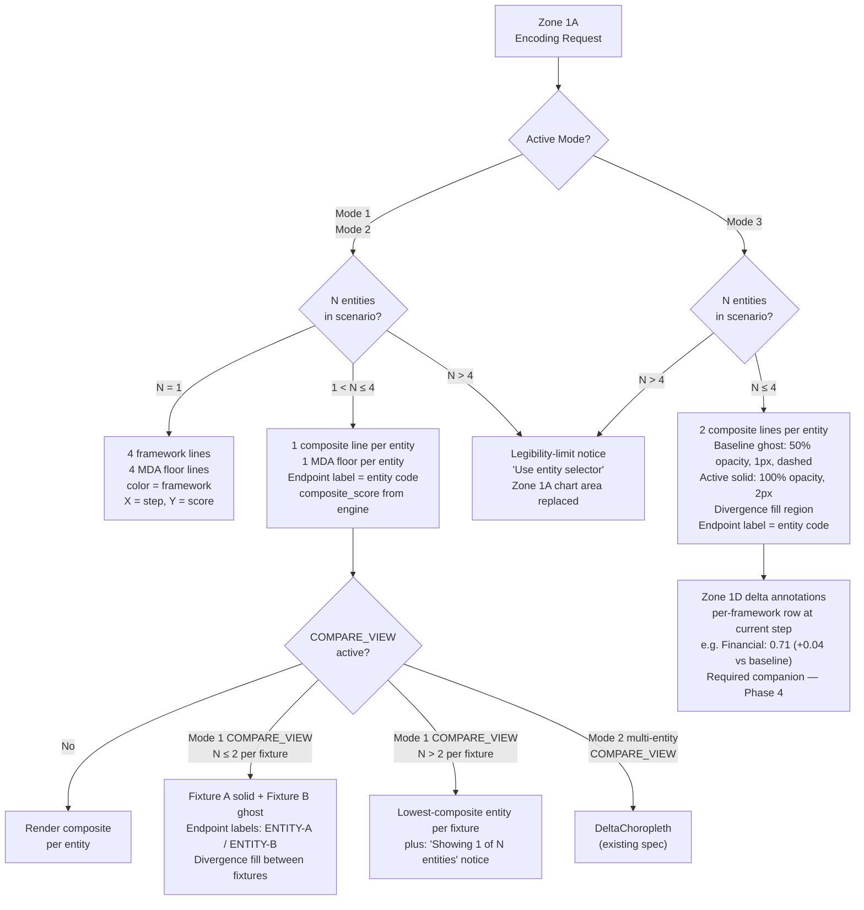

# ADR-017: Zone 1A Information Architecture — Multi-Modal Multi-Entity Encoding Contract

## Tier Classification

**Tier:** 1

**Justification:**
This ADR introduces a mode-dependent encoding contract for Zone 1A — a primary Zone 1 surface
that is visible without interaction in all three modes. It modifies the visual treatment and
information encoding of the primary instrument cluster trajectory view, directly affecting
how Persona 2 reads the Zone 1A primary question in Mode 3 (real-time steering) within a
15-second time ceiling. Tier 1 criteria met: modifies a Zone 1 surface; changes the visual
treatment for the primary instrument per mode; affects the Reactive entry state.

**Sections required by tier:**

| Section | Required |
|---|---|
| Persona Trace (7-element, P-1–P-7) | Required — Tier 1 |
| UX Implication Statement (7-element, UX-1–UX-7) | Required — UX Designer sign-off |
| Forward Trace Statement | Not applicable — Tier 1 |
| Silent Failure Mode | Required |
| Asymmetry Assessment | Required — analytical capability modification |
| North Star Test | Required — Tier 1 |
| Mission Impact Statement | Required |

---

## Status

`Proposed`

---

## Validity Context

**Standards Version:** 2026-06-20 (CLAUDE.md / CODING_STANDARDS.md used at authorship)
**Valid Until:** Mode 3 multi-entity implementation complete OR a subsequent ADR supersedes
the composite encoding decision for Mode 3 single-entity
**License Status:** `PROPOSED → ACCEPTED` on [date — EL records at acceptance]

**Panel:**
- Architect Agent (R — ADR author)
- UX Designer Agent (R — independent sign-off; NM-042 compliance required)
- Frontend Architect Agent (C — implementing agent; Phase 4 implementation authority)
- Business PO (C — mission-critical use case confirmation; P-7 north star)
- Customer Agent (C — Layer 3 interpretability; kryptonite check)
- Chief Methodologist (C — composite aggregation rule; open question (c))
- Engineering Lead (A — accountable on all ADR decisions)

**Renewal Triggers:**
- Mode 3 implementation reaches N=5 entities (legibility-limit notice becomes load-bearing)
- A new framework is added to the simulation (current 4-framework color encoding assumes exactly 4)
- COMPARE_VIEW is extended to support N>2 entities per fixture in Mode 1
- Zone 1D delta annotation spec changes in a way that affects the "Zone 1D supplements
  the composite encoding" design assumption in Mode 3

---

## Date

2026-06-22

---

## Context

### Background

Zone 1A is the primary flight instrument: the trajectory view showing composite score curves
on a shared step axis. Its current M14 encoding contract was designed for a single-entity,
single-branch scenario in Mode 1 and Mode 2: four framework curves (financial, human
development, ecological, governance), four MDA floor lines, one step axis.

This encoding is under pressure from four simultaneous dimensions:

| Dimension | Current contract | At scale |
|---|---|---|
| Frameworks | 4 (fixed) | 4 (fixed) — stable |
| Entities | 1 (entity selector scopes to one at a time) | N entities in a multi-entity scenario |
| Branches | Mode 3 adds baseline ghost + active | Multiple what-if branches in Mode 3 COMPARE_VIEW |
| Modes | 3 distinct cognitive tasks, different time ceilings | Fixed at 3 — stable |

The dimensional analysis in the Phase 1 design thinking document (M14 G6c, PR #1033) showed
that the current 4-framework encoding produces 8 lines in Mode 3 single-entity (at the
legibility ceiling) and 16 lines in Mode 3 multi-entity (guaranteed legibility failure). For
Persona 2 to read the Mode 3 primary question ("did this control input help or hurt?") within
the 15-second ceiling, the encoding must be reduced in dimensionality — specifically, by
switching from 4-framework-per-entity to 1-composite-per-entity in multi-entity contexts and
in Mode 3 generally.

The ARCH-REVIEW-007-milestone15.md Architecture Review (Phase 2, 2026-06-22) resolved the
four open questions identified in Phase 1 and produced the encoding contract that this ADR
records as binding.

### Problem Framing

**Failure scenario (pre-ADR):** In Journey A Step 2 (Preparatory), Persona 2 (Aicha Mbaye,
Zambia finance ministry analyst) loads a Zone 1A scenario containing JOR + ZMB entities in
Mode 3. She applies a fiscal multiplier adjustment at step 3. Zone 1A currently renders
4 framework × 2 entities × 2 branches = 16 lines. No labeling scheme makes 16 lines on a shared
axis legible in 15 seconds. Aicha cannot answer "did this adjustment help or hurt the ZMB
trajectory relative to its baseline?" without a specialist explaining which group of curves
belongs to ZMB and which belongs to JOR. The asymmetry introduced here is precise: the IMF
team's Zone 1A rendering has the same 16-line problem — except their specialist is present in
the room; Aicha's is not.

**Mode 3 single-entity failure scenario:** Even in the simpler N=1 case, the 8-line Mode 3
encoding (4 framework × 2 branches) is at the 15-second legibility ceiling. When Zone 1D
(always visible, zero interaction) already shows the per-framework breakdown at the current
step, the 8-line encoding in Zone 1A answers a question Zone 1D already answers — at the cost
of a harder read.

This ADR specifies the encoding contract that eliminates both failure scenarios.

---

## Decision

### Zone 1A Encoding Contract — Mode-Dependent Table

Zone 1A's encoding is mode-dependent and entity-count-dependent. The following table is the
binding implementation spec for Phase 4:

| Context | Lines in Zone 1A | Encoding channels | Time ceiling |
|---|---|---|---|
| Mode 1/2, N=1 (unchanged) | 4 framework + 4 MDA floor | color=framework; Y=score; X=step | 30 sec |
| Mode 1/2, 1<N≤4 (new) | 1 composite + 1 MDA floor per entity | Y=score; X=step; endpoint label=entity code | 30 sec |
| Mode 1/2, N>4 (new) | Legibility-limit notice | — | — |
| Mode 3, N≤4 (modified) | 2 composite per entity (baseline + active) | opacity=branch; Y=score; X=step; endpoint label=entity code | 15 sec |
| Mode 3, N>4 (new) | Legibility-limit notice | — | — |
| Mode 1 COMPARE_VIEW, N≤2/fixture (new) | 2 composite per entity (Fixture A + Fixture B) | opacity=fixture; color=entity; endpoint=ENTITY-A/B | 30 sec |
| Mode 1 COMPARE_VIEW, N>2/fixture | Single lowest-composite entity per fixture + notice | — | — |
| Mode 2 multi-entity COMPARE_VIEW | DeltaChoropleth (existing spec, `information-hierarchy.md §COMPARE_VIEW`) | — | — |

### Encoding Specifications

**Composite line (multi-entity and Mode 3):**
- Data source: `composite_score` field from simulation trajectory response — the same value
  displayed in Zone 1D. No new aggregation formula. Consistency between Zone 1A and Zone 1D
  is a hard requirement. (Authority: ARCH-REVIEW-007 open question (c) decision.)
- Y-axis range: [0.0, 1.0] (same scale as existing single-entity framework lines)
- Confidence tier: a Tier badge (Tier N, where N is the lowest-tier framework in the composite)
  appears adjacent to each composite line's endpoint label. This prevents false precision from
  the aggregation masking a low-tier underlying framework.

**Mode 3 baseline ghost curves:**
- Opacity: 50% (0.5 alpha)
- Stroke width: 1px
- Stroke dasharray: "4 2"
- Color: same as active composite (entity color from entity palette)
- Divergence fill region: 5–10% opacity fill between baseline ghost and active solid where they
  separate. The fill region is the primary visual answer to the "did it help or hurt?" question
  — the fill appears on the side of the active curve relative to the baseline ghost.

**Mode 3 active composite:**
- Opacity: 100%
- Stroke width: 2px
- Stroke dasharray: none (solid)

**MDA floor lines (all modes):**
- Horizontal dashed line per entity at the entity's most-restrictive MDA floor (the minimum
  across all four framework floor values for that entity)
- In single-entity Mode 1/2, four separate floor lines (one per framework) remain unchanged

**Endpoint labels:**
- Text: ISO 3166-1 alpha-3 entity code (e.g., "JOR", "ZMB", "GRC", "EGY")
- Position: at or adjacent to the final-step Y-value of each composite line
- Collision handling: dynamic y-offset algorithm. At render time — (1) sort labels by final-step
  Y-value ascending; (2) for any two adjacent labels within 18px vertically, offset the lower
  label downward by 20px; (3) apply iteratively until all labels are ≥18px apart or 3 iterations
  are exhausted; (4) after 3 iterations, render at computed offset positions (minor overlaps
  tolerated at N=4). For N>4: legibility-limit notice replaces all entity endpoint labels.
  (Authority: ARCH-REVIEW-007 open question (d) decision.)

**Mode 1 COMPARE_VIEW multi-entity:**
- Fixture A (primary): solid lines (100% opacity), entity identity by color channel
- Fixture B (comparison): ghost lines (50% opacity, `strokeDasharray="4 2"`), same color as
  Fixture A counterpart for the same entity
- Endpoint labels: `{ENTITY}-A` (Fixture A) and `{ENTITY}-B` (Fixture B)
- Limit: N≤2 entities per fixture. At N>2 per fixture: show only the entity with the lowest
  composite score at the final step per fixture, plus a notice: "Showing 1 of N entities per
  fixture. Use entity selector for per-entity comparison."
- Divergence fill region: between Fixture A and Fixture B composite curves for the same entity

**Legibility-limit notice (N>4):**
Zone 1A renders a notice panel instead of trajectory lines: "Zone 1A shows individual entity
trajectories for up to 4 entities. This scenario contains [N] entities. Use the entity selector
to view individual trajectories, or use the entity selector to narrow the scenario to ≤4 entities."
The notice is non-dismissible and occupies the Zone 1A chart area. Zone 1B (MDA alerts) and
Zone 1D (four-framework current position) continue to display normally.

### Zone 1D Integration (Mode 3)

The switch to composite encoding in Mode 3 does not reduce the information available to Persona 2 —
it relocates per-framework detail from Zone 1A to Zone 1D, which is always visible in the
instrument cluster (CLAUDE.md §UX Architectural Commitments, Commitment 2). In Mode 3, Zone 1D
must display delta annotations per framework row showing the divergence from baseline at the
current step: `Financial: 0.71 (+0.04 vs baseline)`. These delta annotations are the
per-framework answer to "which framework contributed to the directional change?" and require zero
interaction. Phase 4 implementation of Zone 1D delta annotations is a required companion to the
Zone 1A composite encoding — implementing Zone 1A composite without Zone 1D delta annotations
removes per-framework information without providing a substitute. This is a silent failure mode
(see §Silent Failure Mode).

---

## Persona and UX Traceability

### Persona Trace

**P-1 — Persona identification:**
Persona 2 — Finance Ministry Negotiator (Eleni Papadimitriou / Aicha Mbaye archetype,
`docs/ux/personas.md §Persona 2`). The binding constraint is the Mode 3 question: Aicha must
read Zone 1A's direction-of-effect signal within 15 seconds of a control input being applied,
for N≤4 entities simultaneously, without specialist mediation. This is the tightest time ceiling
in the system and governs the encoding contract for all modes.

**P-2 — Entry state:**
Reactive entry state (90-second total ceiling, negotiating room context, `user-journeys.md
§Journey B`). Zone 1A sub-ceilings: 15 seconds for Mode 3 direction-of-effect read; 30 seconds
for Mode 1/2 threshold-crossing read. These sub-ceilings are the time constraints the encoding
must satisfy at the panel review time.

**P-3 — Journey reference:**
- Journey B Step 3 [Near-Term-Gap]: Persona 2 defends a challenged output ("at which step did
  the threshold cross — and which framework?"). Mode 1 single-entity encoding is unchanged; Mode 1
  multi-entity encoding (composite per entity) serves "which entity crossed first?" within 30 seconds.
- Journey A Step 2 [Preparatory]: Persona 2 checks trajectory shape before the session. Mode 2
  threshold-safe path question answered from Zone 1A within 30 seconds per step advance.
- Mode 3 live control session (Demo 6 context, no named Journey step yet): Persona 2 applies a
  control input and reads the direction-of-effect signal within 15 seconds.

**P-4 — Time or interaction ceiling:**
- Mode 1 (single entity): 30 seconds, zero additional interaction beyond loading the scenario
- Mode 1 (multi-entity, N≤4): 30 seconds; entity selector permitted as one supplementary
  interaction for per-framework follow-up (entity selector is in the persistent header)
- Mode 2 (single entity): 30 seconds from each step advance, zero interaction
- Mode 3 (N≤4 entities): **15 seconds** from control input application — the binding constraint
  governing this ADR's encoding design

**P-5 — Income cohort served:**
In single-entity Mode 1/2 (4-framework encoding), the human development framework line is
explicitly visible in Zone 1A as one of four colored curves — the bottom income quintiles and
children 0–5 are represented through the human development framework curve directly.
In multi-entity composite encoding, the human development framework is subsumed into the
composite line; per-cohort detail is in Zone 2B (FrameworkPanels, one scroll). The composite
encoding trades per-cohort legibility in Zone 1A for multi-entity legibility — this is an
accepted scope boundary acknowledged in §Consequences.

**P-6 — Negotiating leverage statement:**
After accessing Zone 1A in Mode 3 with the JOR + ZMB entities loaded and a fiscal multiplier
adjustment applied at step 3, Persona 2 can state: "The fiscal multiplier adjustment moved
the Zambia composite trajectory 0.12 units away from the MDA floor relative to the baseline
path — the adjustment improved our aggregate position. Zone 1D shows the Financial framework
contributed the largest per-framework improvement (+0.04 vs. baseline)." This argument is
speakable at a negotiating table and does not require the specialist to be present to translate
the Zone 1A chart.

**P-7 — North star test answer:**
Does this decision make the tool more useful to a finance minister sitting across from an IMF
negotiating team, in that moment?

The Zambia finance ministry team is in a live Mode 3 control session with JOR and ZMB entities
loaded. The IMF proposes a fiscal multiplier term for Zambia. The ministry analyst applies it
as a control input. Zone 1A — under the current 4-framework encoding — renders 16 lines (4
frameworks × 2 entities × 2 branches) that require specialist explanation to read in 15 seconds.
Under ADR-017's composite encoding, Zone 1A renders 4 lines (2 per entity: baseline ghost + active
solid) that the ministry analyst reads directly: "ZMB composite moved upward from the baseline
ghost — the term helps. JOR is unchanged." Zone 1D confirms which of ZMB's four frameworks
contributed. The asymmetry this closes: the IMF side can always provide a specialist to explain
the chart; the Zambia ministry side cannot always guarantee the same. ADR-017's composite encoding
makes Zone 1A self-interpreting at the composite level — removing the specialist-mediation gap
for the Mode 3 directional question.

---

### UX Implication Statement

**UX-1 — Zone assignment and hierarchy certification:**
This ADR places the composite trajectory encoding (multi-entity and Mode 3 single-entity) in
Zone 1A — the primary Zone 1 instrument. The zone assignment is unchanged; the encoding contract
within Zone 1A is modified for multi-entity contexts and for Mode 3. This assignment is consistent
with `information-hierarchy.md §Zone 1 — Primary — 1A Trajectory View`: "Four composite score
curves on a shared step axis. This is the primary Zone 1 instrument." In multi-entity contexts,
the curve count shifts from 4 (per framework) to N (per entity), but the Zone 1A role as the
trajectory-shape surface is unchanged.

**UX-2 — Primary cognitive task alignment:**
This capability primarily serves Mode 3's primary cognitive task (real-time steering within human
cost constraints). The 15-second ceiling is the binding Mode 3 constraint from `north-star.md
§Primary Cognitive Tasks by Mode` and drives the composite encoding decision. In Mode 1, this
capability serves trajectory reconstruction — the "which entity crossed first?" multi-entity
extension is a direct response to the primary task. In Mode 2, this capability serves
threshold-safe path construction — the multi-entity composite encoding answers "which entity
is at risk on the current path?" In all modes, the composite encoding for multi-entity contexts
serves the primary task correctly; the single-entity 4-framework encoding is unchanged and also
serves its mode's primary task correctly.

**UX-3 — Entry state coverage (falsifiable acceptance criteria):**
- Mode 3, Reactive (Journey B / Mode 3 live session, 15-second ceiling): In a Mode 3 scenario
  with JOR + ZMB loaded and fiscal_multiplier=1.30 applied at step 3, Zone 1A at 1440×900
  displays 4 composite lines (2 per entity: baseline ghost 50% + active solid 100%) with
  "JOR" and "ZMB" endpoint labels visible without scroll, within 15 seconds of control input
  application. Observable acceptance criterion: at `data-testid="zone-1a-chart"`, line count
  is 4; endpoint label texts include "JOR" and "ZMB"; lines are present without scroll.
- Mode 1 multi-entity, Reactive (Journey B Step 3, 30-second ceiling): In a Mode 1 scenario
  with JOR + ZMB + GRC loaded (3 entities), Zone 1A at 1280×800 displays 3 composite lines
  (one per entity) with endpoint labels visible without scroll, within 30 seconds of scenario
  load. Observable acceptance criterion: line count is 3; endpoint labels include "JOR", "ZMB",
  "GRC" (or dynamic y-offset variants); visible without scroll at 1280×800.

**UX-4 — HCL parity certification:**
This ADR does not reduce the human cost ledger's visual weight relative to financial indicators
in single-entity Mode 1/2 — the human development framework curve remains one of four equally
weighted Zone 1A lines. In multi-entity composite encoding, the human development framework is
subsumed into the composite, which is a design tradeoff acknowledged in §Consequences. The HCL
parity impact is: composite encoding in multi-entity context does not discriminate against HCL
relative to other frameworks — all four frameworks contribute equally to the composite. HCL
detail is available in Zone 1D (per-framework values at current step) and Zone 2B (full
framework panel) without interaction beyond an entity selector action.

**UX-5 — Uncertainty display specification:**
Confidence tier information is displayed on the composite line's endpoint label area as a
Tier badge (e.g., "T3"). The Tier badge shows the lowest-tier framework in the composite —
the binding confidence constraint — not the average. This is the conservative display rule:
if any framework in the composite is Tier 3, the composite badge shows T3, even if three
frameworks are Tier 1. For Tier 3 (Research estimate / SYNTHETIC_COMPARABLE): the word
"synthetic" must appear in the tooltip on Tier badge hover (not on the chart surface, to
avoid visual clutter, but accessible within Zone 1 without a drawer open). For Tier 4
(Model estimate): dashed line rendering for the composite (`strokeDasharray="8 3"`) plus a
Tier badge. For Structural Absence (Tier 5): the composite line is omitted for the framework
whose data is absent; the composite is computed from the remaining frameworks with a
"Partial composite" label in the Tier badge area. This is consistent with
`information-hierarchy.md §Zone 1A — Confidence Display`.

**UX-6 — Irreversibility signal integrity certification:**
This ADR does not modify Zone 1B (MDA Alert Panel) or the TERMINAL/CRITICAL visual
distinction. MDA floor lines in Zone 1A are unchanged in single-entity mode; in multi-entity
mode, a single per-entity floor line (most restrictive threshold across all four frameworks)
is displayed. The Zone 1B alert panel remains the primary irreversibility signal — TERMINAL
alerts remain visually distinct from CRITICAL with no implementation discretion. The change to
Zone 1A composite encoding does not reduce the alert panel's authority over irreversibility
signaling. Acceptance criterion: in any Mode 3 scenario with a TERMINAL alert active, Zone 1B
`data-severity="TERMINAL"` is visible at 1280×800 without scroll, regardless of Zone 1A entity
count.

**UX-7 — User journey coverage:**
- Closes: Journey B Step 3 [Near-Term-Gap] (Mode 1 multi-entity — "which entity crossed first?"
  is now answerable from Zone 1A composite lines in 30 seconds without specialist mediation)
- Enables: Mode 3 multi-entity live A/B comparison (Demo 6 context — JOR + ZMB simultaneously
  visible in Mode 3 with baseline ghost + active solid per entity)
- Extends: Mode 1 COMPARE_VIEW to multi-entity fixtures (N≤2 per fixture)
- Closes Journey A Step 2 [Preparatory] multi-entity gap (Mode 2 multi-entity path construction
  — "which entity is at risk?" answerable from Zone 1A composite lines in 30 seconds)

**UX Designer sign-off:**

**Reviewing agent:** UX Designer Agent
**Session context:** `Same session as ADR authorship — acknowledged`
**Governing documents reviewed:**
- `information-hierarchy.md §Zone 1 — Primary` — Zone 1A requirements, trajectory view
  requirements (four-framework curves, shared step axis, MDA floor lines, Mode 3 live A/B spec);
  `information-hierarchy.md §Zone 1A — Confidence Display` — confidence band rendering rules
  per tier; `information-hierarchy.md §COMPARE_VIEW` — Mode 1 and Mode 2 COMPARE_VIEW Zone 1
  specifications
- `north-star.md §Primary Cognitive Tasks by Mode` — Mode 1 trajectory reconstruction, Mode 2
  threshold-safe path construction, Mode 3 real-time steering; time ceiling derivations
- `worldsim-ux-architecture-first-principles.md §Question 1` — encoding channel first principles
  and the principle that encoding channels must not exceed the count required to answer the
  primary question of the active mode
- `CLAUDE.md §UX Architectural Commitments` — Commitments 1–5; Commitment 2 (instruments always
  visible) governs the Zone 1D integration requirement; Commitment 3 (shared step axis) is
  preserved by ADR-017; Commitment 5 (control plane reserved zone) is unaffected
**Concerns found:** 1 — documented below

Concern 1: The same-session sign-off means I am reviewing an ADR I co-authored in the same
deliberation context. The EL is required to verify the governing document citations above before
accepting this ADR per `CLAUDE.md §ADR template — mandatory starting point (NM-042)`. The
citations are all named sections (not generic references) and correspond to real content in
those documents at the time of authorship. The primary concern about same-session review is
confirmation bias — the reviewer should specifically check whether the composite encoding
decision for Mode 3 single-entity is adequately justified given that 4-framework encoding is
the established contract and this ADR changes it. My assessment: the change is justified by
(1) legibility failure at N=2 under 4-framework encoding, (2) Zone 1D already providing the
per-framework detail, (3) consistency benefit for the user's mental model. I am satisfied the
justification is mission-sound.

`[x]` UX Designer sign-off. 2026-06-22

---

## Silent Failure Mode

**Zone 1A composite line static at 0 or 1:** If `composite_score` is null or missing from the
trajectory response, Zone 1A renders a flat horizontal line at 0 (null interpreted as 0) rather
than displaying a no-data indicator. This appears to be a functioning composite line but is in
fact a data-absent artifact. Detection: in Mode 3, the baseline ghost and active solid lines
should diverge after a control input is applied — if they run parallel at 0, the composite is
not computing. QA fixture check: after applying fiscal_multiplier=1.30 at step 3 in the ZMB
fixture, the active composite at step 4 must differ from the baseline composite at step 4 by more
than 0.001.

**Zone 1D delta annotations absent while Zone 1A shows composite:** If Zone 1D does not display
per-framework delta annotations in Mode 3, the composite encoding is incomplete — Zone 1A
answers "did it help or hurt?" but cannot provide the per-framework follow-up "which framework?"
that the user needs in a 90-second Reactive session. This is the most operationally significant
silent failure because it degrades the composite encoding from a complete answer to a partial one.
Detection: in Mode 3, with a control input applied, Zone 1D framework rows must show delta text
(e.g., "+0.04 vs baseline") for at least one framework in the current step. If all rows show
only the current value with no delta, the Zone 1D integration has not been implemented and the
ADR-017 Phase 4 implementation is incomplete regardless of Zone 1A rendering correctly.

---

## Asymmetry Assessment

Well-resourced actors with Bloomberg Terminal access, IMF proprietary simulation tools, and
sovereign wealth fund analytical platforms can currently render multi-entity trajectory comparisons
with interactive drill-down to any framework at any step, with a specialist available to explain
the visualization. WorldSim's proposed ADR-017 partially closes this gap by: (1) making the Zone 1A
composite encoding self-interpreting for the directional question at the composite level within
15 seconds, and (2) surfacing per-framework detail in Zone 1D without interaction. The remaining
gap after ADR-017: WorldSim's composite encoding loses per-framework trajectory shape in multi-entity
Mode 3 (Zone 1D shows current-step values but not the full trajectory curve per framework per entity
in Mode 3 multi-entity). A well-resourced actor can view per-framework trajectories for all entities
simultaneously; WorldSim's architecture routes this to Zone 2B (one entity-selector action + one
scroll). This residual gap is an accepted tradeoff for the legibility ceiling improvement.

---

## North Star Test

Does this decision make the tool more useful to a finance minister sitting across from an IMF
negotiating team, in that moment?

The Zambia finance ministry team is in a live Mode 3 control session with Jordan and Zambia
entities loaded simultaneously — a scenario representing a bilateral conditionality negotiation.
The IMF proposes a fiscal multiplier adjustment at step 3. Without ADR-017, Zone 1A renders 16
lines that the ministry analyst cannot read in 15 seconds; she must ask the senior economist to
interpret the chart, consuming the 90-second Reactive window before she can form an argument.
With ADR-017, Zone 1A renders 4 lines — baseline ghost and active solid per entity. The Zambia
analyst reads: "ZMB composite moved upward from the ghost baseline — the proposed term improved
Zambia's trajectory." Zone 1D confirms Financial was the contributing framework (+0.04 vs
baseline). She states: "On our simulation, the proposed multiplier improves the Zambia aggregate
trajectory without crossing any MDA threshold — we can accept this term." This argument was
unavailable before ADR-017 because the chart was illegible in the time available without a
specialist present. ADR-017 closes that asymmetry gap for the directional question in Mode 3.

---

## Mission Impact Statement

This ADR closes the Zone 1A multi-entity legibility gap (Phase 1 breaking points 1 and 2 from the
design thinking document), enabling the primary instrument to serve its cognitive task in multi-entity
and Mode 3 contexts without specialist mediation. The direct impact on the finance ministry side of a
sovereign debt negotiation: the ministry analyst can read Zone 1A's directional signal independently
in Mode 3 without a chart-interpreter present — removing the specialist mediation asymmetry for the
primary instrument's primary question. Technical completeness without this mission relevance is
insufficient; the composite encoding exists specifically because the 4-framework encoding fails
the kryptonite constraint at N>1 in Mode 3.

---

## Minimum Data Tier

Zone 1A's composite line uses the simulation engine's `composite_score`, which is computed from
all four framework modules. Minimum data tier at which this capability produces a meaningful
composite: Tier 3 (at least two frameworks with Tier 3 or better data). At Tier 4 for all four
frameworks, the composite score is a model estimate with significant uncertainty — Zone 1A renders
it with dashed line style and a T4 badge per §Decision (UX-5 spec). At Tier 5 (Structural Absence
for all four frameworks), Zone 1A cannot render a meaningful composite and shows the legibility-limit
notice.

For users in Tier 3–4 data environments (the majority of WorldSim's target user population): the
composite line renders with the appropriate confidence tier badge. Tier 3 environments are explicitly
supported — this is not an accessibility gap. The confidence tier display ensures the user knows
they are reading a research estimate or model estimate rather than a calibrated value.

---

## Alternatives Considered

### Alternative 1: Retain 4-Framework Encoding for All Modes (Status Quo)

Keep the current 4-framework-per-entity encoding in Zone 1A regardless of entity count or mode.
Add an "entity focus" switch that hides all entities except the selected one in multi-entity contexts.

**Rejected because:** The "entity focus" switch introduces an interaction requirement in Mode 3
where the 15-second ceiling makes any interaction tax prohibitive. Additionally, the entity focus
switch means the user cannot see JOR and ZMB simultaneously — the multi-entity comparison task
("which entity is at risk?") becomes a sequential task (switch to JOR, read, switch to ZMB, read,
compare from memory) which degrades the analytical output quality for the Reactive use case.
The entity selector in the persistent header already performs entity switching — adding an
"entity focus" to Zone 1A duplicates this mechanism without solving the legibility problem.

### Alternative 2: Per-Framework Composite in Mode 3 Single-Entity (Retain 8-Line Encoding)

Retain the 4-framework per-branch encoding (8 lines) for Mode 3 single-entity on grounds that
the per-framework direction question is valuable — "which framework improved?" is answerable from
the 8-line chart without consulting Zone 1D.

**Rejected because:** (1) The 8-line encoding is at the 15-second ceiling and fails as soon as
a second entity is added (immediate degradation to 16 lines). (2) Zone 1D already answers
"which framework improved?" at the current step with zero interaction — the 8-line encoding
provides the full trajectory per framework, but in Mode 3, the primary question is directional
(toward or away) not trajectory-shaped (at which step). The delta annotation in Zone 1D at the
current step is sufficient for Mode 3. (3) Consistency: if Mode 3 single-entity uses 8-line
encoding and Mode 3 multi-entity uses composite 2-line encoding per entity, the user's Zone 1A
mental model changes at the moment a second entity is loaded — a disorienting transition. Composite
encoding for all Mode 3 contexts removes this discontinuity.

### Alternative 3: Dynamic Mode-Within-Zone-1A — Expand/Collapse Per-Framework Detail

In Mode 3, Zone 1A shows the composite by default but allows the user to expand to per-framework
detail by clicking a control. This retains the per-framework trajectory information while managing
the default legibility.

**Rejected because:** (1) In Mode 3, the Reactive 15-second ceiling does not accommodate the
expand action — any click in Zone 1A during an active negotiation consumes time from the reading
budget. (2) An expandable Zone 1A creates a two-state primary instrument, which is inconsistent
with `CLAUDE.md §UX Architectural Commitments, Commitment 2` (instruments are always visible —
not hidden until interacted with). (3) The per-framework detail for Mode 3 is already available
in Zone 1D (delta annotations) and Zone 2B (FrameworkPanels, one scroll) — a third surface for
the same information introduces redundancy without value. The expand mechanism is solving a problem
that the Zone 1D integration already solves without interaction.

---

## Consequences

### Positive

- Zone 1A becomes legible in Mode 3 for N=2 through N=4 entity scenarios — the Mode 3 primary
  question ("did this help or hurt?") is answerable within the 15-second ceiling without specialist
  mediation.
- Zone 1A's encoding contract is consistent across Mode 3 entity counts (N=1 through N=4 all use
  composite × 2 branches) — no mental model discontinuity when a second entity is loaded.
- Journey B Step 3 [Near-Term-Gap] (Mode 1 multi-entity "which entity crossed first?") is closed.
- Zone 1D delta annotations (required companion, Phase 4) provide the per-framework follow-up
  within the same instrument cluster view — no navigation required.
- The composite encoding reuses the existing `composite_score` engine output — no new computation
  in the simulation engine.

### Negative

- In multi-entity Mode 1/2, per-framework trajectory shapes are no longer directly visible in Zone
  1A — the user must switch entity via the entity selector and then read Zone 1D + Zone 2B for
  per-framework detail on the non-selected entity. This is one interaction (entity selector) plus
  a Zone 1D read — accepted tradeoff for the N>1 legibility improvement.
- Mode 3 single-entity loses the per-framework trajectory shape from Zone 1A (the 4-framework
  8-line encoding is deprecated for Mode 3). Per-framework data is available in Zone 1D at the
  current step. Users who were relying on the per-framework trajectory curve in Mode 3 to track
  the trajectory shape of a specific framework across all steps will find this information in
  Zone 2B only (one scroll + one entity focus action). This is the most significant design tradeoff.
- The composite encoding requires Zone 1D delta annotations to be implemented simultaneously in
  Phase 4 — Zone 1A composite without Zone 1D delta is a degraded implementation. This creates a
  tight Phase 4 dependency between two components.

### Known Limitations

- N>4 entity scenarios are not supported in Zone 1A — the legibility-limit notice is the full
  response. A dedicated comparative surface for N>4 is not specified in ADR-017; it requires a
  separate ADR and a future sprint. This is a known limitation for users operating large
  multi-entity scenarios.
- Mode 1 COMPARE_VIEW with N>2 entities per fixture is not supported (single lowest-composite
  entity + notice). The multi-entity COMPARE_VIEW problem in Mode 1 is identified but not fully
  solved — it requires a dedicated surface (potentially a summary table Zone 2) that is out of
  Phase 4 scope.
- Zone 1A composite line is aggregate-only — per-cohort breakdown (bottom income quintiles,
  children 0–5) is not visible in Zone 1A composite mode. This is addressed in ADR-018 (cohort
  disaggregation on primary surface, Issue #986) which targets Zone 1A cohort integration in a
  future sprint.

---

## Diagram

The following diagram shows the Zone 1A encoding selection logic for Phase 4 implementation:

---

## Backtesting Validation Anchor

ADR-017 introduces a composite encoding that must be validated against historical cases before
Phase 4 is considered mission-complete:

1. **Zambia 2023–2024 IMF ECF** (primary Demo 5 case): In Mode 1, Zone 1A with the Zambia fixture
   loaded as a single entity must continue to show 4 framework curves (composite encoding does not
   apply at N=1, Mode 1/2). In Mode 3 with Zambia as the sole entity, Zone 1A must show 2 composite
   lines (baseline ghost + active solid) after a control input is applied. The baseline ghost and
   active solid must diverge after fiscal_multiplier=1.30 is applied at step 3.

2. **Jordan + Zambia multi-entity** (Demo 6 target scenario): Zone 1A in Mode 3 with JOR + ZMB
   loaded must show 4 composite lines (2 per entity). After a JOR fiscal multiplier adjustment,
   the JOR baseline-vs-active lines must diverge while ZMB lines run parallel. This is the primary
   Mode 3 multi-entity legibility validation.

Both validation cases must be confirmed at Phase 4 Step 4 (Verify) before the Phase 4 intent
document can record a PASS verdict.

---

*ADR-017 version: 2026-06-22. Authority: ARCH-REVIEW-007-milestone15.md (Phase 2, 2026-06-22)
and `docs/ux/design-thinking/zone-1a-information-architecture.md` (Phase 1, M14 G6c). Phase 4
implementation is out of G2 scope — a separate sprint entry is required. Panel: Architect Agent (R),
UX Designer Agent (R — sign-off above), Frontend Architect Agent (C), Business PO (C), Customer
Agent (C), Chief Methodologist (C), Engineering Lead (A).*
