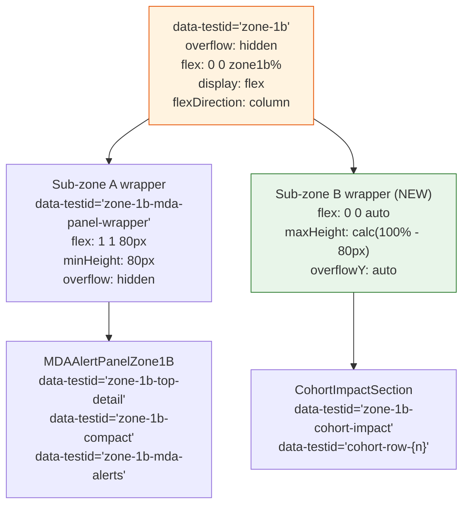

# ADR-018: Zone 1B Proportional Allocation — MDA Alert Panel and CohortImpactSection Sub-zones

## Tier Classification

**Tier:** 2

**Justification:**
This ADR restores reliable visibility of an existing Zone 1B primary instrument (MDA alert panel) under high cohort load. It corrects a layout failure mode without introducing new information architecture, new display surfaces, or new data presentation primitives. The proportional allocation model ensures the MDA panel is unconditionally visible — a correction to implementation behavior, not a new UX concept.

**Sections required by tier:**

| Section | Status |
|---|---|
| Persona Trace (P-1–P-5, P-6 if Persona 2) | ✓ Completed below |
| UX Designer review | ✓ Sign-off below |
| Silent Failure Mode | ✓ Completed below |
| Asymmetry Assessment | N/A — layout correction, not analytical capability |
| North Star Test | Completed (recommended for Tier 2) |
| Mission Impact Statement | ✓ Completed below |

---

## Status

`Accepted`

---

## Validity Context

**Standards Version:** 2026-06-25 (CLAUDE.md / CODING_STANDARDS.md)
**Valid Until:** M19, or when Zone 1B proportions (ZONE_PROPORTIONS in InstrumentCluster.tsx) change by more than 10% at any breakpoint, or when Zone 1B gains a third occupant.
**License Status:** `PROPOSED → ACCEPTED` on 2026-06-25

**Panel:**
- Architect Agent (R — author, ADR determination and sub-zone specification)
- Frontend Architect Agent (C — implementation feasibility and G2 compatibility confirmation)
- UX Designer Agent (sign-off — Tier 2 required per CLAUDE.md §UX Designer sign-off)
- Engineering Lead (A — accountable on all ADR decisions)

**Renewal Triggers:**
1. Zone 1B ZONE_PROPORTIONS change by >10% at any breakpoint — re-measure Sub-zone B heights
2. Zone 1B gains a third occupant — allocation model must be extended
3. CohortImpactSection max-display count is introduced (#future) — Sub-zone B scroll model may need revision
4. Mode 3 Zone 1B control input surface is defined (M18+) — this ADR covers Modes 1 and 2 only

---

## Date

2026-06-25

---

## Context

### Background

Zone 1B hosts two occupants:

1. **MDA alert panel** (Sub-zone A) — primary instrument. Renders severity chip, indicator name, current value, floor distance, threshold-approach status, and trajectory sentence. Established by ADR-014 (ARCH-008) as the Zone 1B master-detail instrument.

2. **CohortImpactSection** (Sub-zone B) — distributional evidence. Renders cohort threshold crossing rows (indicator + cohort + floor distance), added in M16-G2 (#986) after ADR-014 was authored.

ADR-014's "Valid Until" clause reads: "M14 close, or when Zone 1B height allocation changes by more than 10%." The addition of CohortImpactSection as a second Zone 1B occupant constitutes a structural change beyond ADR-014's single-occupant model. ADR-014 does not address multi-occupant height negotiation.

**Current implementation (pre-G3):**

Zone 1B (`data-testid="zone-1b"`) is a flex column with `overflow: auto`. Sub-zone A (MDA panel wrapper, line 143 in InstrumentCluster.tsx) has `flex: 1 1 80px, minHeight: 80`. Zone1bCohortSection is rendered at natural height (`flex: 0 0 auto` by default). When the combined height of both occupants exceeds Zone 1B's allocated height, Zone 1B scrolls as a unit.

**M16 failure mode:** With 8 or more cohort crossing entries, CohortImpactSection grows to natural height, Zone 1B overflows, and `overflow: auto` causes Zone 1B to scroll. The scroll origin displaces the MDA panel, which may have zero bounding box height visible to Aicha in the initial viewport.

PR #1235 applied a temporary `minHeight: 80px` guarantee (filed in sprint entry §2.2 as "not treated as accepted architecture — to be superseded by G3 ADR"). The guarantee reduced displacement frequency but did not eliminate the outer-scroll failure mode.

### Problem Framing

In Journey B Step 3 (Reactive entry state, 90-second ceiling), Persona 5 (Aicha — Finance Minister) reads Zone 1B's MDA alert panel headline to determine the breach severity before responding at the negotiating table. In a Zambian sovereign debt session where 8+ cohort indicators have crossed their MDAs, the Zone 1B cohort section grows to natural height, Zone 1B scrolls as a unit, and Aicha cannot read the MDA headline without the analyst scrolling Zone 1B — breaking the 90-second Reactive ceiling. This is a mission-critical failure for the tool's primary user-facing purpose.

---

## Decision

Three changes to Zone 1B layout in `frontend/src/components/InstrumentCluster.tsx`:

### Change 1 — Zone 1B outer container

```
// BEFORE
overflow: "auto"

// AFTER
overflow: "hidden"
```

Zone 1B no longer scrolls as a unit. All overflow handling is delegated to Sub-zone B's internal scroll.

### Change 2 — Sub-zone A (MDA panel wrapper)

```jsx
// BEFORE (line 143)
<div style={{ flex: "1 1 80px", minHeight: 80, overflow: "hidden" }}>
  {mdaPanel ?? ...}
</div>

// AFTER
<div
  data-testid="zone-1b-mda-panel-wrapper"
  style={{ flex: "1 1 80px", minHeight: 80, overflow: "hidden" }}
>
  {mdaPanel ?? ...}
</div>
```

**No flex change** — `flex: 1 1 80px, minHeight: 80` is retained. This ensures:
- Sub-zone A is guaranteed at least 80px (the **[ADR-VALUE] = 80px** permanent floor, superseding the temporary PR #1235 guarantee)
- Sub-zone A grows to fill Zone 1B when Sub-zone B is absent or has zero height (empty-state Case A from §3.3 of the G3 intent document)
- The `minHeight: 80` is now enforced reliably because Zone 1B `overflow: hidden` prevents outer scroll from bypassing the flex minimum

Only change: `data-testid="zone-1b-mda-panel-wrapper"` is added. QA assertions in AC-A1, AC-A2, and AC-A3 target this testid.

### Change 3 — Sub-zone B (CohortImpactSection wrapper)

```jsx
// BEFORE (line 150)
{zone1bCohortSection}

// AFTER
{zone1bCohortSection && (
  <div
    style={{
      flex: "0 0 auto",
      maxHeight: "calc(100% - 80px)",
      overflowY: "auto",
    }}
  >
    {zone1bCohortSection}
  </div>
)}
```

Sub-zone B receives a wrapper div with:
- `flex: 0 0 auto` — takes natural height up to the max-height cap
- `maxHeight: calc(100% - 80px)` — never exceeds Zone 1B height minus 80px (the Sub-zone A floor), ensuring Sub-zone A always has ≥80px
- `overflowY: auto` — CohortImpactSection entries scroll within Sub-zone B; Zone 1B outer container does not scroll

**Relation to Phase 1 brief §3.1:** The intent document §3.1 described Sub-zone A as `flex: 0 0 [ADR-VALUE]px` (fixed) with a JS toggle for empty-state. This ADR supersedes that implementation mechanism with a CSS-only approach (`flex: 1 1 80px, minHeight: 80` on Sub-zone A + `maxHeight: calc(100% - 80px)` on Sub-zone B wrapper) that achieves identical observable states without conditional render logic. The observable application states in §4 of the intent document are satisfied by this ADR-specified implementation.

### Sub-zone height reference table (computed, not measured)

The following values are derived from `LAYOUT × ZONE_PROPORTIONS + estimated cohortPanel height (~75px)`. The implementing engineer must confirm at runtime using browser developer tools at each breakpoint before final QA thresholds are set.

| Breakpoint | Co-primary height | Zone 1B height | Sub-zone A floor | Sub-zone B available |
|---|---|---|---|---|
| 1024×768 | ~375px | ~185px (50%) | 80px | ~105px (~4 rows) |
| 1280×800 | ~395px | ~138px (35%) | 80px | ~58px (~2 rows) |
| 1440×900 | ~455px | ~182px (40%) | 80px | ~102px (~3–4 rows) |
| 768px (tablet) | ~375px | ~185px (50%) | 80px | ~105px (~4 rows) |

Row height reference from ADR-014: ~26px per cohort crossing row.

### minHeight: 80px supersession

The `minHeight: 80` in InstrumentCluster.tsx line 143 is retained as a CSS property but is no longer the primary mechanism preventing MDA panel displacement. Under the G3 architecture:
- Primary mechanism: Zone 1B `overflow: hidden` + Sub-zone B `maxHeight: calc(100% - 80px)` — prevents Sub-zone B from ever consuming more than Zone 1B − 80px, leaving Sub-zone A always ≥80px.
- Secondary mechanism: `minHeight: 80` flex hint — secondary guard if the primary mechanism fails.

The PR #1235 temporary guarantee is superseded. The permanent architectural contract is this ADR.

### G2 Phase 3 compatibility

G2 Phase 3 (#394) will extend CohortImpactSection to show per-scenario threshold crossing rows in comparison mode. These rows render within Sub-zone B (CohortImpactSection). The Sub-zone B `maxHeight: calc(100% - 80px)` + `overflowY: auto` model accommodates additional per-scenario rows via internal scroll without modification. G2 Phase 3 does not require a further ADR amendment for Zone 1B layout — it inherits the Sub-zone B scroll model.

**Confirmed compatible.** G2 Phase 3 must ensure its per-scenario rows are rendered inside the existing `zone1bCohortSection` prop passed to InstrumentCluster — not as a separate Zone 1B occupant.

---

## Persona and UX Traceability

### [Tier 2] Persona Trace and UX Review

**P-1 — Persona identification:**
Primary: Persona 5 — Finance Ministry Senior Official (Finance Minister / Aicha archetype, `docs/ux/personas.md §Persona 5`).
Secondary: Persona 1 — Programme Analyst / Ministry Analyst (Lucas Ferreira archetype, `docs/ux/personas.md §Persona 1`).

**P-2 — Entry state:**
Persona 5: Reactive entry state (90-second total ceiling, negotiation room context). Zone 1B MDA panel must be readable without any scroll event on Zone 1B.
Persona 1: Preparatory entry state (no fixed ceiling). Zone 1B CohortImpactSection must be scrollable internally to reveal all cohort crossing rows.

**P-3 — Journey reference:**
Journey B Step 3 [Near-Term-Gap GA-B3] — Reactive defence of distributional output. The MDA panel headline in Zone 1B is the breach severity summary Aicha reads at a glance before the conditionality argument. Closes the layout failure mode identified in the M16 retrospective as a GA-B3 prerequisite gap.

**P-4 — Time or interaction ceiling:**
Persona 5: 90 seconds (Reactive ceiling). MDA panel headline (`data-testid="zone-1b-top-detail"`) must be visible without any scroll event on `data-testid="zone-1b"` within the initial viewport load.
Persona 1: No fixed ceiling. CohortImpactSection internal scroll is acceptable for Preparatory use.

**P-5 — Income cohort served:**
Bottom income quintiles (Q1). Zone 1B CohortImpactSection's primary content is Q1 cohort threshold crossing entries. The proportional allocation ensures Q1 crossing rows are visible (in Sub-zone B) and the breach summary for those crossings is immediately readable (in Sub-zone A) without interaction.

**P-6 — Negotiating leverage statement:**
After G3, Persona 5 (Aicha) can state at the table: "Q1 informal sector poverty headcount has crossed CRITICAL — 3.5% below the humanitarian safety floor — and has been there for two steps." This sentence is read from the MDA panel top-detail area (`data-testid="zone-1b-top-detail"`) at the initial viewport, without any scroll event on Zone 1B, under any cohort crossing load including 8+ rows.

---

**UX Designer review:**

**Reviewing agent:** UX Designer Agent
**Session context:** Same session as ADR authorship — acknowledged
**Governing documents reviewed:** `information-hierarchy.md §1B` (Zone 1B as co-primary alert instrument, reading-order constraint); `north-star.md §Primary Cognitive Tasks` (Mode 1 trajectory reconstruction, Mode 2 threshold-safe path — both require MDA alert legibility without scroll); `user-journeys.md §Journey B Step 3` (Reactive entry state 90-second ceiling, Zone 1B as primary breach evidence zone)
**Concerns found:** None

Persona trace P-1 through P-5 confirmed present and adequate. P-6 negotiating leverage statement is specific and references the correct data-testid. UX Architectural Commitment Premise 2 ("Instruments are always visible; no primary instrument lives behind a click or scroll") is satisfied by the Sub-zone A floor at 80px + Zone 1B `overflow: hidden`. The 1280×800 Sub-zone B at ~58px (~2 visible cohort rows) is a known constraint — adequate for Reactive use (Aicha does not read Sub-zone B); Sub-zone B internal scroll serves Lucas in Preparatory mode. No governing premise violated.

`[x]` UX Designer: Elements P-1–P-5 (and P-6) confirmed present and adequate. 2026-06-25

---

## Silent Failure Mode

**Silent failure — Zone 1B overflow not changed:**
If Zone 1B outer container retains `overflow: auto` after G3 merges, Zone 1B will continue to scroll as a unit when Sub-zone B content exceeds Zone 1B height. This is identical to the M16 failure mode. Detection: AC-A2 requires an 8+ cohort crossing row fixture and must fail (assert `zone-1b-mda-panel-wrapper` height ≥ 80px) before G3 is applied. A test that passes before and after implementation does not confirm the fix.

**Silent failure — Sub-zone B wrapper added but Zone 1B overflow unchanged:**
If the Sub-zone B wrapper (`maxHeight: calc(100% - 80px)`) is added without changing Zone 1B `overflow` to `hidden`, Zone 1B will still scroll when Sub-zone B natural height exceeds Zone 1B. Sub-zone B will be internally scrollable AND Zone 1B will scroll externally. Detection: assert `data-testid="zone-1b"` scrollTop = 0 after loading 8+ cohort rows (AC-A1, AC-A2).

**Silent failure — empty-state shows dead space:**
If Sub-zone A uses `flex: 0 0 80px` (fixed, not growable) instead of `flex: 1 1 80px, minHeight: 80`, Zone 1B will show dead space below the MDA panel in the empty-state (Case A). Detection: AC-A4 asserts cohort-empty-state visible AND `zone-1b-top-detail` visible; if dead space exists, the MDA panel bounding box will be limited to 80px rather than filling Zone 1B height. A visual inspection of the empty-state viewport confirms whether Sub-zone A fills Zone 1B.

---

## North Star Test

A Zambia finance ministry analyst is preparing for a day-4 debt restructuring session at which the IMF conditionality team is expected to challenge the distributional impact projections. The analyst opens the Senegal T3 conditionality scenario (the closest structural analogue), steps to step 4 where 9 cohort indicators have crossed their MDA floors, and turns the screen toward Aicha. Before G3, Zone 1B scrolls to show cohort rows, and Aicha cannot see the CRITICAL MDA headline without the analyst scrolling back — requiring verbal mediation in the 90-second window. After G3, the MDA headline is visible at the initial viewport, Sub-zone B shows the first 2 cohort rows internally, and Aicha can read "Q1 informal sector poverty headcount: CRITICAL — 3.5% below floor" without the analyst's intervention. This closes the specific layout failure mode that prevented Zone 1B from delivering its Reactive-state value.

---

## Mission Impact Statement

G3 closes the Zone 1B layout failure mode that prevents Zone 1B's primary instrument (MDA alert headline) from being visible to Aicha in the Reactive entry state under high cohort load. The direct impact on the finance ministry side of a sovereign debt negotiation: the analyst can display the breach severity summary without scrolling Zone 1B before handing the screen to the minister, regardless of how many cohort indicators have crossed their MDAs. This is prerequisite infrastructure for Journey B Step 3 to deliver reliable situational awareness to Persona 5. Without this fix, the tool's Zone 1B output is unreliable under realistic load conditions (8+ cohort crossings are common in advanced conditionality scenarios).

---

## Alternatives Considered

### Alternative 1: ADR-017 amendment (Path A)

ADR-017 governs Zone 1A information architecture. Zone 1B is mentioned only in passing in ADR-017 ("Zone 1B remains the primary irreversibility signal"). The overflow contract, sub-zone allocation, and multi-occupant layout are Zone 1B decisions that are not derivable from ADR-017's Zone 1A premises. Amendment rejected — wrong topical anchor.

### Alternative 2: Amendment to ADR-014

ADR-014 (ARCH-008) governs Zone 1B master-detail architecture for the MDA alert panel as a single occupant. Its "Valid Until" clause fires when "Zone 1B height allocation changes by more than 10%." The addition of CohortImpactSection is precisely the change that fires this clause. The multi-occupant allocation model is a new architectural decision not representable as an ADR-014 amendment. Amendment rejected — ADR-014's "Valid Until" clause explicitly anticipates a new ADR for this condition.

### Alternative 3: JavaScript toggle between fixed and growable Sub-zone A

The Phase 1 brief §3.1 described toggling Sub-zone A between `flex: 0 0 [ADR-VALUE]px` (dual-occupant) and `flex: 1 1 0` (single-occupant). This approach requires reading CohortImpactSection content state in InstrumentCluster.tsx. Rejected in favor of the CSS-only approach (`flex: 1 1 80px, minHeight: 80` + Sub-zone B `maxHeight: calc(100% - 80px)`) which achieves identical observable states without conditional render logic. The ADR supersedes the Phase 1 brief's implementation mechanism while preserving all observable application states from §4 of the intent document.

### Alternative 4: Increase Zone 1B proportion at 1280 from 35% to 45%

DD-016 (M16-G2) set Zone 1B to 35% at 1280 specifically to provide Zone 1D with 50% for the political risk sub-section. Increasing Zone 1B at 1280 would reduce Zone 1D from 50% to 40%, undermining the political risk content legibility that DD-016 was explicitly designed to protect. Rejected — scope conflict with DD-016 rationale.

---

## Consequences

### Positive

- Zone 1B outer container never scrolls under any cohort load — `overflow: hidden` enforces this unconditionally.
- MDA alert panel headline is visible at the initial viewport in Journey B Step 3 (Reactive entry state) regardless of cohort crossing count. Closes the M16 retrospective layout failure mode.
- Sub-zone A floor of 80px is now architecturally grounded (permanent ADR contract replaces temporary PR #1235 guarantee).
- Sub-zone B internal scroll allows Lucas (Persona 1, Preparatory state) to read all cohort crossing rows within Sub-zone B without Zone 1B outer scroll.
- G2 Phase 3 per-scenario threshold rows are accommodated by Sub-zone B internal scroll without further ADR amendment.
- Empty-state (Case A — MDA alerts without cohort crossings): Sub-zone A grows to fill Zone 1B height (`flex: 1 1 80px` + no Sub-zone B), showing the MDA panel at full Zone 1B width without dead space.
- The CSS-only implementation approach (no JS state toggle) reduces implementation complexity and eliminates flash-of-incorrect-layout risk.

### Negative

- At 1280×800, Sub-zone B is approximately 58px tall (~2 visible cohort rows before internal scroll). For scenarios with many cohort crossings, Lucas must scroll Sub-zone B to read rows 3+. This is a known constraint of the Zone 1B proportion at 1280 (35%) and is preferable to the alternative of reducing Zone 1D.
- Zone 1B `overflow: hidden` means any overflow within Sub-zone A (MDA panel) is clipped, not scrollable. The MDA panel must not render content that requires its own scroll. This is an implementation constraint on any future MDA panel content additions.
- The Sub-zone B `maxHeight: calc(100% - 80px)` requires Zone 1B to have a definite computed height for the `100%` to resolve. This is satisfied by Zone 1B's `flex: 0 0 ${zoneProportions.zone1b}` against the co-primary column's definite height in the CSS Grid row. Any future layout change that removes the definite height on Zone 1B would break this calculation.

### Known Limitations

- **Sub-zone B row count at 1280:** ~2 visible rows before internal scroll. For heavy conditionality scenarios (10+ crossing rows), Lucas must scroll Sub-zone B. This is acceptable for Preparatory use; it is not acceptable for Reactive use — but Aicha (Persona 5) does not need to read Sub-zone B in Reactive mode.
- **Mode 3 not covered:** This ADR specifies Modes 1 and 2 only. Mode 3 Zone 1B control input surface (M18+) will require a separate ADR amendment when Mode 3 layout is defined.
- **CohortImpactSection height estimate uncertainty:** The Zone 1B height values in the reference table above are derived from LAYOUT × ZONE_PROPORTIONS + estimated cohortPanel height (~75px). The CohortIndicatorsPanel renders 5 indicators in a 2-column grid (~80px total). The implementing engineer must measure actual Zone 1B heights at each breakpoint before finalizing QA numeric thresholds.

---

## Diagram

`docs/architecture/ADR-018-zone-1b-sub-zone-layout.mmd`



The diagram source is also maintained as a standalone file at `docs/architecture/ADR-018-zone-1b-sub-zone-layout.mmd` per CODING_STANDARDS.md §Diagram Standards.

---

## Backtesting Validation Anchor

Not applicable — this ADR is a layout correction with no analytical model, composite score, or measurement methodology. No backtesting validation is required.

---

*ADR-018 authored 2026-06-25 by Architect Agent. ARCH-012 entry in `docs/architecture/backlog.md`. Supersedes PR #1235 temporary minHeight:80px guarantee. Governing ADR for G3 Phase 3 implementation sprint (sprint entry: `docs/process/sprint-plans/m17-g3-sprint-entry.md`). Intent document: `docs/process/intents/M17-G3-2026-06-25-zone-1b-proportional-allocation.md`. Panel review: `docs/adr/reviews/ADR-018-panel-review.md`. Template version: 2026-06-09 (phase0-encoded).*
