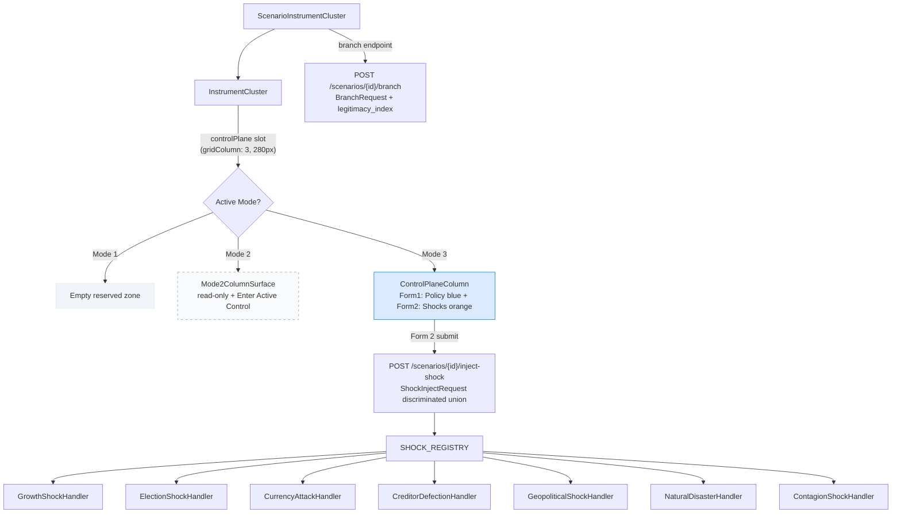

# ADR-019: Control Plane Column — Mode 2 and Mode 3 Architecture

## Tier Classification

**Tier:** 1

**Justification:**
This ADR introduces the content and behavior of the Zone 1 control plane column (280px,
`gridColumn: 3` of `InstrumentCluster`) in Mode 2 and Mode 3. The column is a Zone 1
surface — it occupies the primary viewport without any navigation action and is visible
at all supported viewports. The Mode 3 content (policy instruments form, scenario shocks
form) is the primary interactive surface for real-time steering. The Mode 2 content (read-
only scenario summary, mode transition affordance) is a Zone 1 orientation surface. Both
surfaces affect the primary cognitive task of their respective modes.

**Sections required by tier:** All Tier 1 sections required: Persona Trace (7-element),
UX Implication Statement (7-element) + independent UX Designer sign-off, Silent Failure
Mode, Asymmetry Assessment, North Star Test, Mission Impact Statement.

---

## Status

`Accepted` — UX Designer sign-off filed 2026-06-27 (separate EL-triggered session,
NM-042 compliant). GA-02 UX-7 correction applied in same PR as sign-off (PR #1393);
no unresolved concerns. EL acceptance required on merge.

---

## Validity Context

**Standards Version:** 2026-06-27 (CLAUDE.md revision, M17 close)
**Valid Until:** M19 entry — review if Mode 3 active control scope expands beyond the
seven shock types and two policy instrument types specified in this ADR, or if a new
mode is introduced.

**Panel:**
- Architect Agent (R — lead author, owns this document)
- UX Designer Agent (independent sign-off — separate session, EL-triggered)
- Frontend Architect Agent (C — Dimensions 1, 2, 4; component contracts)
- Business PO (C — north star test, mission impact)
- Customer Agent (C — Layer 3 on record, Artifact 3 #1357, 2026-06-26)
- Engineering Lead (A — accountable on all ADR decisions)

**Renewal Triggers:**
- New shock type added to the taxonomy
- New policy instrument type added beyond FiscalMultiplier / LegitimacyConstraint
- Mode 4 or additional mode introduced that requires column content specification
- BranchRequest schema changes beyond the extension specified here
- EX-001 resolution at G4 exit produces a result that requires CI gate changes beyond
  what Decision 3 specified

---

## Date

2026-06-27

---

## Context

### Background

The WorldSim instrument cluster (`InstrumentCluster.tsx`) renders a three-column CSS grid:
Zone 1A (trajectory view), Zone 1B (alert panel + MDA), Zone-control-plane (280px reserved
column, `gridColumn: 3`). The reserved column has existed since M9 per governing premise 5
(`information-hierarchy.md §UX Architectural Commitments`): the control plane zone is
reserved before the control plane is built.

At M18 entry, the column is empty in Mode 1 and Mode 2. In Mode 3, a `ControlPlane`
component renders as a full-width **horizontal bar below** the `InstrumentCluster` — outside
the column entirely. This placement violates the simultaneous-visibility requirement: on
1280×800, the trajectory view and the control plane are not simultaneously visible without
scroll (Customer Agent Q5 verdict: **CURRENTLY FAILING** — Artifact 3 §Question 5).

The M18 G4 sprint delivers the column content for both Mode 2 and Mode 3, relocating
`ControlPlane` content into the 280px column and adding the Mode 2 read-only surface. This
ADR specifies the architecture that G4 implements.

### Problem Framing

In Journey C Step 2 (Reactive state, Eleni Papadimitriou, 90-second ceiling), Persona 2
cannot simultaneously see the trajectory view and apply a control input — she must scroll
between the `ControlPlane` bar and the instrument cluster. This means she cannot observe
the live A/B divergence while the control input propagates: the trajectory view scrolls out
of view when she focuses on the control inputs. The product claim ("apply a control input
and observe the instrument response simultaneously") is structurally unmet.

In Journey C Step 1, there is no visible affordance for the Mode 3 transition within the
instrument cluster. The mode transition requires navigating to a mode indicator in the
header, not a prominent in-cluster affordance. For a Demo 7 presenter, this transition
must be explainable by pointing at the instrument cluster — the affordance must live there.

---

## Decision

### D-1: Two-Component Architecture (EL Decision 1, Artifact 5 panel condition)

`Mode2ColumnSurface` and `ControlPlaneColumn` are **separate components**. They are not
conditional rendering branches within a single component (`isMode3 ? <A/> : <B/>`). This
is required for two reasons:

1. **Lazy-mount optimization (#1217):** `ControlPlaneColumn` must be lazy-mounted when
   Mode 3 is entered and unmounted when Mode 3 is exited. A unified conditional component
   would defeat this optimization because React re-renders the whole component on mode
   change rather than mounting/unmounting the Mode 3 component cold.
2. **Independent development in G4:** Mode 2 and Mode 3 column content can be built on
   separate feature branches within G4 after `InstrumentCluster` column slot is merged.

`ScenarioInstrumentCluster.tsx` manages the slot:
```tsx
// Mode 1: no controlPlane prop — empty column renders
// Mode 2: Mode2ColumnSurface — read-only orientation surface
// Mode 3: ControlPlaneColumn — interactive policy and shock forms
<InstrumentCluster
  controlPlane={
    mode === "MODE_2" ? <Mode2ColumnSurface ... /> :
    mode === "MODE_3" ? <ControlPlaneColumn ... /> :
    undefined
  }
>
```

`InstrumentCluster.tsx` receives a `controlPlane?: React.ReactNode` prop and renders it
inside the `data-testid="zone-control-plane"` div. The column width (`minWidth: 280px`)
is unchanged — it is set by the container, not the content.

---

### D-2: Mode 2 Column Surface (Mode2ColumnSurface)

New component: `frontend/src/components/Mode2ColumnSurface.tsx`

**Content:**
1. **Scenario identity block** (read-only):
   - Scenario name
   - Entity (country)
   - Loaded calibration vintage
   - Run horizon: "Step 1 → Step N"
   - Pre-populated from `activeScenarioDetail` on mount; no edit affordance

2. **"Enter Active Control" button:**
   - Label: `"Enter Active Control"` — not "Enter Mode 3" (Customer Agent kryptonite finding;
     jargon-free label required per Artifact 5 §Decision 1 panel condition)
   - `data-testid="enter-active-control-btn"`
   - Color: subdued slate-400 — the pre-active state is visually distinct from the active
     Mode 3 surface to signal readiness without urgency
   - On click: triggers mode transition handler in `ScenarioInstrumentCluster`

**Visual treatment:** `background: '#f8fafc'` (slate-50), `border: '1px dashed #94a3b8'`
(slate-400 dashed) — the dashed border signals "this zone activates in Mode 3" without
competing with Zone 1A or Zone 1B content. Reduced-opacity treatment aligns with
`information-hierarchy.md §Control Plane Reserved Zone` (pre-active state specification).

**No form state:** `Mode2ColumnSurface` has no `useState` calls for form parameters. It is
a pure display + navigation component. This enforces the design constraint: Mode 2 column
is read-only preparation context, not a configuration editor.

**Props:**
```tsx
interface Mode2ColumnSurfaceProps {
  scenarioName: string;
  entityName: string;
  calibrationVintage: string;
  startStep: number;
  endStep: number;
  onEnterActiveControl: () => void;
}
```

---

### D-3: Mode 3 Column — ControlPlaneColumn

Rename `ControlPlane.tsx` → `ControlPlaneColumn.tsx`. Remove `borderTop: "2px solid #8b5cf6"` — the column container provides the border. The existing JSX is the starting point.

**Form 1 — Policy Instruments (blue `#0284c7`):**

1. `policyInputType` state: `"FiscalMultiplier" | "LegitimacyConstraint"`
   - `data-testid="policy-input-type-selector"` on the select element
2. Type-driven parameter state:
   - FiscalMultiplier: slider 0.1–3.0 step 0.05
   - LegitimacyConstraint: slider 0.0–1.0 step 0.05
   - `data-testid="policy-param-slider"` on both
3. `policyStep` state: "Apply at step" selector (1–maxStep)
   - `data-testid="policy-step-selector"`
4. "Apply policy input" button (renamed from "Apply Change"), blue `#0284c7`
   - `data-testid="apply-policy-input"`
5. `appliedInputs` history list: `Array<{step: number, type: string, value: number}>`
   - `data-testid="policy-inputs-history"`

**Mode3Params interface (exported from ControlPlaneColumn.tsx):**
```ts
export interface Mode3Params {
  input_type: "FiscalMultiplier" | "LegitimacyConstraint";
  fiscal_multiplier: number;
  legitimacy_index: number | null;
  apply_at_step: number;
  branch_from_step: number;
}
```

**Form 2 — Scenario Shocks (orange `#ea580c`):**

1. `shockType` state: `ShockType` enum value — all 7 types in the selector
2. Type-driven parameter inputs — shown/hidden based on selected type (see §D-6 schema)
3. `shockStep` state: "Inject at step" selector (1–maxStep)
   - `data-testid="shock-step-selector"`
4. "Inject scenario shock" button, orange `#ea580c`
   - `data-testid="inject-scenario-shock"`
5. `injectedShocks` history list: `Array<{step: number, type: string}>`
   - `data-testid="shock-events-history"`

**Layout constraint (Artifact 3 Q3):** Both form *headers* must be visible without scroll
at 1280×800 (Aicha's observational orientation requirement). History lists may scroll within
their section. Scrollable sections must have `data-testid="policy-history-scroll"` and
`data-testid="shock-history-scroll"` for AC-014 viewport coverage assertions.

**Color correction:** Replace all `#8b5cf6` with `#0284c7` in PANEL_STYLE, APPLY_BTN_STYLE,
VALUE_STYLE, label constants. All policy instrument affordances are blue; all shock
affordances are orange. Zero logic changes required for color correction.

---

### D-4: BranchRequest Extension

`backend/app/schemas.py` — extend `BranchRequest` and `RebranchRequest`:

```python
class BranchRequest(BaseModel):
    fiscal_multiplier: float = Field(default=1.0, ge=0.1, le=3.0,
        description="Fiscal multiplier override for the branch scenario")
    legitimacy_index: float | None = Field(default=None, ge=0.0, le=1.0,
        description="Legitimacy index override. None = use scenario baseline value.")
    branch_from_step: int = Field(ge=0,
        description="Step from which the branch recomputes")
```

`RebranchRequest` receives the same `legitimacy_index: float | None` field.

The branch endpoint (`POST /scenarios/{id}/branch`) applies `legitimacy_index` to the
`ScenarioConfigSchema` when provided. The `WebScenarioRunner` already reads
`ScenarioConfigSchema.legitimacy_index` (line 294). This is a non-breaking extension:
existing clients that omit `legitimacy_index` receive `None`, which preserves current behavior.

---

### D-5: Inject-Shock Endpoint

New endpoint: `POST /scenarios/{scenario_id}/inject-shock`

This endpoint is distinct from the branch endpoint:
- The branch endpoint applies policy instruments (fiscal/legitimacy overrides) and recomputes
  from `branch_from_step`
- The inject-shock endpoint applies an exogenous shock to an **already-branched scenario** and
  recomputes from `inject_at_step` forward

**Request body:** `ShockInjectRequest` (full discriminated union schema — see §D-6)

**Response:** Updated `TrajectoryResponse` — same shape as the branch endpoint response.
The trajectory reflects the shock applied at `inject_at_step`. `shock_events` is populated
at the injected step: `[{"step": inject_at_step, "shock_type": shock_type, "parameters": {...}}]`.

**Endpoint URL:** `POST /scenarios/{scenario_id}/inject-shock`
**Auth:** Same token requirement as existing scenario endpoints.

---

### D-6: Shock Type Taxonomy — Full Discriminated Union Schema

**Python schema** (`backend/app/schemas.py`):

```python
class ShockType(str, Enum):
    GrowthShock = "GrowthShock"
    ElectionShock = "ElectionShock"
    CurrencyAttack = "CurrencyAttack"
    CreditorDefection = "CreditorDefection"
    GeopoliticalShock = "GeopoliticalShock"
    NaturalDisaster = "NaturalDisaster"
    ContagionShock = "ContagionShock"


class CreditorClass(str, Enum):
    bilateral = "bilateral"         # government-to-government (Paris Club taxonomy)
    multilateral = "multilateral"   # IMF, World Bank, regional development banks
    commercial = "commercial"       # private bondholders, commercial banks


class ShockInjectRequest(BaseModel):
    shock_type: ShockType
    inject_at_step: int = Field(ge=1)

    # --- GrowthShock parameters ---
    growth_rate_delta: float | None = Field(default=None,
        description="Departure from baseline GDP growth rate. Positive = optimistic.")
    duration_steps: int | None = Field(default=None, ge=1,
        description="Steps the growth rate departure persists.")
    distribution_asymmetry: float | None = Field(default=None, ge=-1.0, le=1.0,
        description="Cohort skew on growth landing. 0=proportional; positive=upper-cohort skew.")

    # --- ElectionShock / GeopoliticalShock parameters ---
    severity: float | None = Field(default=None, ge=0.0, le=1.0)
    political_uncertainty: float | None = Field(default=None, ge=0.0, le=1.0)

    # --- CurrencyAttack parameters ---
    attack_magnitude: float | None = Field(default=None,
        description="FX rate shock magnitude (fractional, e.g. 0.15 = 15% depreciation).")

    # --- CreditorDefection parameters ---
    creditor_class: CreditorClass | None = Field(default=None)
    share_affected: float | None = Field(default=None, ge=0.0, le=1.0,
        description="Fraction of the creditor class's exposure that defects.")
    regime_change_probability: float | None = Field(default=None, ge=0.0, le=1.0)

    # --- ContagionShock parameters ---
    source_country: str | None = Field(default=None,
        description="ISO 3166-1 alpha-3 of the originating country.")
    transmission_rate: float | None = Field(default=None, ge=0.0, le=1.0,
        description="Fraction of originating shock that propagates to this entity.")
    regional_contagion: bool | None = Field(default=None,
        description="True: trigger regional module contagion propagation.")
    affected_sectors: list[str] | None = Field(default=None,
        description="Sector codes affected by the shock (empty = all sectors).")

    # --- NaturalDisaster parameters ---
    gdp_impact: float | None = Field(default=None,
        description="GDP impact as a negative fraction (e.g. -0.05 = -5% of GDP).")

    @model_validator(mode="after")
    def validate_type_params(self) -> "ShockInjectRequest":
        required: dict[ShockType, list[str]] = {
            ShockType.GrowthShock: ["growth_rate_delta", "duration_steps"],
            ShockType.ElectionShock: ["severity"],
            ShockType.CurrencyAttack: ["attack_magnitude"],
            ShockType.CreditorDefection: ["creditor_class", "share_affected"],
            ShockType.GeopoliticalShock: ["severity"],
            ShockType.NaturalDisaster: ["gdp_impact"],
            ShockType.ContagionShock: ["source_country", "transmission_rate"],
        }
        missing = [
            f for f in required.get(self.shock_type, [])
            if getattr(self, f) is None
        ]
        if missing:
            raise ValueError(
                f"{self.shock_type} requires: {missing}"
            )
        return self
```

**CreditorClass taxonomy rationale:** The `bilateral / multilateral / commercial` taxonomy
aligns with the Paris Club / non-Paris Club / commercial creditor classification used in
the G20 Common Framework for Debt Treatments and IMF-World Bank Debt Sustainability
Analysis. This is the standard classification used in sovereign debt restructuring
negotiations — the primary use case of this feature.

**ContagionShock linkage approach — simplified model (not pre-populated table):**
The analyst specifies `source_country`, `transmission_rate`, `affected_sectors`, and
`regional_contagion`. The engine applies the transmission rate as a scalar multiplier on
the source entity's shock magnitude to the target entity. This is a simplified first-order
model. A pre-populated bilateral financial linkage table (trade exposure, banking system
cross-holdings) is a future milestone enhancement — it would allow the analyst to select
a source country and have the transmission rate filled in from data rather than specified
manually. The simplified model is chosen for M18 because: (a) the data infrastructure for
a bilateral linkage table is significant new scope; (b) the analyst-specified transmission
rate allows the tool to be used without that data for a wider range of country pairs; (c)
the platform principle favors data-configurable models over hardcoded relationships.

---

### D-7: ShockEffect Protocol and Registry

All seven shock handlers must implement a common protocol. This is the architectural
constraint that EL Decision 6 enforces: building all 7 handlers simultaneously forces
the protocol to be correct for the general case.

**Python protocol** (`backend/app/simulation/shocks/protocol.py`):

```python
from typing import Protocol
from app.schemas import ShockInjectRequest
from app.simulation.state import SimulationState


class ShockEffect(Protocol):
    """
    A shock handler applies an exogenous event to the simulation state
    starting from inject_at_step. It returns the modified state for
    subsequent step computation.
    """
    def apply(
        self,
        state: SimulationState,
        request: ShockInjectRequest,
    ) -> SimulationState: ...
```

**Registry** (`backend/app/simulation/shocks/registry.py`):

```python
from app.schemas import ShockType
from app.simulation.shocks.handlers import (
    GrowthShockHandler,
    ElectionShockHandler,
    CurrencyAttackHandler,
    CreditorDefectionHandler,
    GeopoliticalShockHandler,
    NaturalDisasterHandler,
    ContagionShockHandler,
)

SHOCK_REGISTRY: dict[ShockType, type[ShockEffect]] = {
    ShockType.GrowthShock: GrowthShockHandler,
    ShockType.ElectionShock: ElectionShockHandler,
    ShockType.CurrencyAttack: CurrencyAttackHandler,
    ShockType.CreditorDefection: CreditorDefectionHandler,
    ShockType.GeopoliticalShock: GeopoliticalShockHandler,
    ShockType.NaturalDisaster: NaturalDisasterHandler,
    ShockType.ContagionShock: ContagionShockHandler,
}
```

**Handler module per type** (`backend/app/simulation/shocks/handlers/`):
One module per handler: `growth_shock.py`, `election_shock.py`, `currency_attack.py`,
`creditor_defection.py`, `geopolitical_shock.py`, `natural_disaster.py`, `contagion_shock.py`.

Adding a new type requires: (1) new enum value, (2) new handler module, (3) one entry in
`SHOCK_REGISTRY`. No changes to the protocol or the inject-shock endpoint.

---

### D-8: Engine Effect Mappings

Each handler implements the following simulation state modifications. These mappings are
architectural commitments — the implementing engineer must not deviate without an ADR amendment.

| Shock type | Engine effect |
|---|---|
| `GrowthShock` | Scale GDP growth rate at `inject_at_step` by `(1 + growth_rate_delta)`; persist for `duration_steps`; apply `distribution_asymmetry` to cohort-level income growth distribution at affected steps |
| `ElectionShock` | Apply `severity` as a step-function drop to `legitimacy_index` at `inject_at_step`; propagate `political_uncertainty` as a governance volatility modifier for `duration_steps = 2` (default) |
| `GeopoliticalShock` | Same engine effect as `ElectionShock` (severity + political_uncertainty); distinct shock type for causal attribution: MDA alert shows "Caused by: geopolitical shock" vs. "Caused by: political transition" |
| `CurrencyAttack` | Apply `attack_magnitude` as a fractional depreciation to the FX rate parameter in the fiscal module at `inject_at_step`; propagate through debt service calculation for foreign-denominated obligations |
| `CreditorDefection` | Remove `share_affected` fraction of `creditor_class` disbursement from the financing gap calculation at `inject_at_step`; apply `regime_change_probability` as a probability-weighted governance uncertainty for `duration_steps = 3` (default) |
| `ContagionShock` | Apply `transmission_rate` × (source entity's GDP impact) to this entity's GDP at `inject_at_step`; apply to `affected_sectors` (or all sectors if empty); trigger regional module if `regional_contagion = True` |
| `NaturalDisaster` | Apply `gdp_impact` (negative fraction) to GDP at `inject_at_step`; distribute across `affected_sectors` proportionally if specified |

**Note on source entity for ContagionShock:** The inject-shock endpoint for ContagionShock
uses `source_country` as a label for causal attribution; the `transmission_rate` and
`gdp_impact` are specified by the analyst. A future milestone can replace the manual
`transmission_rate` with a lookup from a bilateral linkage table when the data
infrastructure is in place.

---

### D-9: TrajectoryStep.shock_events Population

The `GET /scenarios/{id}/trajectory` trajectory endpoint must populate `shock_events` at
steps where a shock was injected. Current implementation returns `[]` always (stub).

After shock injection, the trajectory response must include, at `inject_at_step`:
```json
"shock_events": [
  {
    "step": 2,
    "shock_type": "GrowthShock",
    "parameters": {"growth_rate_delta": 0.02, "duration_steps": 2, "distribution_asymmetry": 0.3}
  }
]
```

This populates the orange vertical `<ReferenceLine>` markers in `TrajectoryView.tsx` at
the correct step.

---

### D-10: EX-001 Resolution at G4 Exit (EL Decision 3)

The G4 sprint entry must name EX-001 resolution as an explicit deliverable. The G4
implementing agent must:

1. Implement Issue #1217 (Recharts memoization + lazy `ControlPlaneColumn` mounting) in
   the same PR as the column layout move (Dimension 1), sequenced **before** adding the
   form content (Dimensions 2 and 3). This establishes the correct optimized baseline.
2. At G4 implementation PR submission, run MV-002 profiling gate (local, unthrottled
   ProBook hardware) and record the measurement. If ≤ 100ms: proceed. If > 100ms:
   investigate before merging.
3. After G4 CI merge: CI AC-009 `test.fixme()` behavior observed — CI runner is
   4× throttled. If ≤ 200ms on CI: restore AC-009 from `test.fixme()` to `test()` at the
   100ms threshold. Close EX-001 as **Resolved**.
4. If CI measurement remains above 200ms (KI-006 infrastructure limitation persists):
   close EX-001 via option (a): remove AC-009 from the Playwright CI suite permanently;
   replace with documented local developer gate (`npm run test:perf`). EX-001 closes as
   **Won't Fix**.

AC-009 `test.fixme()` is removed from CI permanently regardless of the EX-001 resolution
label. The test structure is preserved with a comment referencing the EX-001 closure record.

---

## Persona and UX Traceability

### [Tier 1] Persona Trace

**P-1 — Persona identification:**
Primary: Persona 2 — Finance Ministry Negotiator (Eleni Papadimitriou archetype).
Secondary: Persona 5 — Multilateral Observer (Aicha Mbaye archetype, observational role
in Journey D Demonstrative state).

**P-2 — Entry state:**
Reactive entry state (Journey C, 90-second total ceiling for Steps 1–3, negotiation room
context). Mode 3 is the Reactive mode for Persona 2. Step 4 extends the ceiling to
approximately 120 seconds (shock injection adds ~10 seconds of computation time).

**P-3 — Journey reference:**
Journey C Step 1 (Switch to Mode 3 — control plane column populates).
Journey C Step 2 (Apply policy input — live A/B comparison, divergence fill).
Journey C Step 3 (Read causal attribution — cite finding verbatim).
Journey C Step 4 (Inject GrowthShock — test Troika GDP rebuttal claim).

**P-4 — Time or interaction ceiling:**
- Journey C Step 1: Mode switch completes in ≤ 3 seconds; column visible without scroll.
- Journey C Step 2: Control input propagation ≤ 10 seconds (branch endpoint); live A/B
  divergence fill appears on computation complete, no additional interaction required.
- Journey C Step 3: Alert text readable at tablet font sizes without expanding the drawer;
  causal attribution speakable verbatim.
- Journey C Step 4: Shock injection propagation ≤ 10 seconds; orange marker visible at
  injected step; alert panel updated without any navigation.

**P-5 — Income cohort served:**
Bottom two income quintiles — the Demo 7 Act 1 finding is a CRITICAL poverty_headcount
crossing at the bottom quintile. The primary analytical output of the shock injection step
is whether the GDP rebound protects or fails to protect the bottom quintile.

**P-6 — Negotiating leverage statement:**
After accessing this capability (Journey C Steps 1–4 complete), Persona 2 can make
the following specific argument verbatim from the screen: "Under the proposed timing,
poverty headcount crosses the critical threshold in month 6 of the programme, specifically
for the bottom income quintile. We just tested the rebound claim: injecting a positive
GDP shock at month 6 with your growth assumption does not eliminate the crossing. The
CRITICAL alert persists for the bottom quintile even under your most optimistic GDP
scenario."

**P-7 — North Star test answer:**
Scenario: Senegal Ministry of Economy, Article IV consultation session, 2024. IMF team
across the table. The IMF analyst asserts: "Even without the delay, the GDP rebound
in year 2 will protect the bottom quintile — our fiscal adjustment path is acceptable."

Without this ADR's implementation, the Senegal ministry specialist can cite from her
Mode 2 preparation analysis that the adjustment causes a CRITICAL crossing — but she
cannot immediately test the IMF's rebuttal claim. She must say "our preparation analysis
suggests otherwise" — a prepared position, not a live rebuttal.

With this ADR's implementation, she selects `GrowthShock` in the scenario shocks form,
enters `growth_rate_delta = 0.02` (matching the IMF's own GDP rebound projection),
`duration_steps = 2`, `distribution_asymmetry = 0.3` (upper-cohort skew assumption),
and clicks "Inject scenario shock." In under 10 seconds, the trajectory updates: the
CRITICAL poverty_headcount alert persists. The IMF's growth assumption does not protect
the bottom quintile because the growth is concentrated in upper cohorts under the
conditionality structure.

She reads from the screen: "The alert persists even under your growth assumption." This
is the qualitative shift: from a better-prepared ministry (Mode 2) to a ministry that
can disprove an opposing claim in real time, in the room, with live evidence. This closes
the asymmetry gap between a ministry specialist and a sophisticated opposing analyst.

---

### [Tier 1] UX Implication Statement

**UX-1 — Zone assignment and hierarchy certification:**
This ADR places Mode 3 policy instruments and shock injection forms in Zone 1 (control
plane column, `gridColumn: 3` of `InstrumentCluster`). This assignment is consistent with
`information-hierarchy.md §Control Plane Reserved Zone` — the column is the Zone 1 home
for control inputs per governing premise 5. Mode 2 read-only surface is also placed in
Zone 1 (same column), consistent with Decision 1 (Artifact 5 §Decision 1): column 3
carries minimal read-only content in Mode 2 from M18 onward. The prior `ControlPlane`
bottom-bar placement is removed — it was never Zone 1 (it required scroll at 1280×800).

**UX-2 — Primary cognitive task alignment:**
Mode 3 content serves Mode 3's primary cognitive task directly: real-time steering within
human cost constraints. The policy instruments form and shock form are the steering
mechanisms; the trajectory view (Zone 1A) and alert panel (Zone 1B) are the gauges. The
column layout places the steering mechanisms alongside the gauges without scroll — this is
the cognitive task structure.

Mode 2 content (`Mode2ColumnSurface`) serves Mode 2's primary cognitive task (threshold-
safe path construction) in a supporting role: it orients the analyst to what scenario is
loaded (the baseline for Mode 3 steering) and provides the intentional transition
affordance to Mode 3. It does not impede Mode 2 task completion — it does not add editable
elements that could cause accidental configuration changes during the preparation phase.

Mode 1: column remains empty. Mode 1's primary cognitive task is trajectory reconstruction,
which is served by Zone 1A–1C. The empty column in Mode 1 is not a gap — it is correct
information hierarchy (no control plane present in Replay mode).

**UX-3 — Entry state coverage (falsifiable acceptance criteria):**

- Journey C Step 1 (Reactive, Persona 2, 90-second ceiling): After clicking "Enter Active
  Control" in Mode 2, the Mode 3 column populates with both form headers visible without
  scroll, the trajectory view remains visible without any navigation, and the mode indicator
  confirms Mode 3. Acceptance criterion: observable in the live application — the trajectory
  view and the control plane column top (both form headers) are visible simultaneously
  without scroll on a 1280×800 viewport. CI: AC-014 extended to assert both form headers
  visible at 1280×800 in Mode 3.

- Journey C Step 2 (Reactive, Persona 2, 10-second propagation ceiling): After clicking
  "Apply policy input" (FiscalMultiplier or LegitimacyConstraint at a selected step), the
  trajectory view updates with baseline ghost curves (50% opacity) and active curves
  (100% opacity, 2px) and divergence fill region. The applied input appears in the policy
  inputs history list below Form 1. The MDA alert panel shows a causal attribution. 
  Acceptance criterion: live A/B divergence fill visible within 10 seconds of the button
  click without any additional navigation action.

- Journey C Step 4 (Reactive, Persona 2 + Persona 5 observer): After clicking
  "Inject scenario shock" (GrowthShock at step 2), an orange vertical marker appears
  at step 2 across all trajectory curves, the MDA alert panel refreshes with shock-caused
  attribution coloring, and the injected shock appears in the shock events history list.
  Acceptance criterion: orange marker visible at inject_at_step without any additional
  navigation; alert panel attribution shows shock cause in orange (#ea580c).

**UX-4 — HCL parity certification:**
This ADR does not affect HCL visual weight relative to financial indicators. The control
plane column is an input surface, not an output instrument. The HCL output — poverty
headcount crossings, cohort-level severity, human development trajectory — appears in
Zone 1A (trajectory) and Zone 1B (MDA alert panel), both of which are unchanged by this
ADR. HCL parity is maintained. The `distribution_asymmetry` parameter in GrowthShock
directly models distributional questions (bottom-quintile income growth vs. upper-cohort
growth) — the analytical output from that parameter is a human cost finding surfaced in
Zone 1B (alert text naming the bottom quintile specifically).

**UX-5 — Uncertainty display specification:**
The control plane column is an input surface. Uncertainty display is not applicable to
the inputs themselves. The trajectory recomputation that results from a control input
or shock injection carries the existing confidence tier display through the standard
trajectory display path (ADR-006, ADR-017). The shock injection does not change the
confidence tier of the scenario — it modifies the simulation state at a step; the
trajectory confidence tier system is applied by the engine as usual. No new confidence
tier display is introduced by this ADR. For Tier 3 SYNTHETIC_COMPARABLE scenarios: the
word "synthetic" appears in the trajectory view tier indicator per ADR-006 — unchanged
by this ADR.

**UX-6 — Irreversibility signal integrity certification:**
This ADR does not modify the alert panel severity display logic. TERMINAL alerts remain
visually distinct from CRITICAL per ADR-014. TERMINAL + CRITICAL alerts are visible
without scroll at 1280×800 and 1024×768 per ADR-014's Zone 1B specification. The column
layout move does not affect alert panel positioning — Zone 1B occupies `gridColumn: 2` in
`InstrumentCluster`; this ADR operates on `gridColumn: 3`. No regression risk to
irreversibility signal integrity.

Acceptance criterion: AC-014 alert panel assertions continue to pass at all supported
viewports post-G4 implementation. The G4 PR must confirm this before merge.

**UX-7 — User journey coverage:**
- Journey C Steps 1–4 enabled in full by this ADR. Before this ADR: Step 1 lacks an
  in-cluster Mode 3 affordance; Steps 2–3 fail the simultaneous-visibility requirement
  on 1280×800; Step 4 is entirely absent (shock injection not implemented). After this
  ADR: all four steps executable within their time ceilings.
- `Mode2ColumnSurface` addresses the scenario orientation concern independently:
  the analyst can confirm the loaded scenario configuration (name, entity, calibration
  vintage, step range) without navigating away from the instrument cluster before
  entering Mode 3. This is not a GA-02 resolution. GA-02 (Journey A §Gap GA-02) is
  retired on principle — Path 2 (ministry-owned proprietary data upload) conflicts with
  the open-source-as-strategy governance constraint; it is not sequenced for a future
  milestone. A governance exception is required to revisit (CLAUDE.md §Guiding
  Principles §Open Source as Strategy; `docs/ux/user-journeys.md §GA-02 retirement note`).
- Journey D Demonstrative (Aicha Mbaye, observer): legible per Customer Agent Q3 verdict
  ("conditional — legible with one driver sentence per form; both form headers visible
  without scroll"). Both form headers visible in the 280px column at 1280×800 satisfies
  the Aicha legibility requirement.

**UX Designer sign-off:**

**Reviewing agent:** UX Designer Agent
**Session context:** Separate session, EL-triggered 2026-06-27 — EL identified
GA-02 / open-source-as-strategy principle conflict and directed correction;
this review validates that ADR-019 UX implications are consistent with the
corrected journey artifact.
**Governing documents reviewed:**
- `docs/ux/information-hierarchy.md §UX Architectural Commitments` — UX premises 1 and 2
  (primary viewport is instrument cluster; instruments always visible without navigation).
  `Mode2ColumnSurface` and `ControlPlaneColumn` both satisfy: neither requires
  navigating away from the cluster.
- `docs/ux/north-star.md §Primary Cognitive Tasks by Mode` — Mode 2 task is trajectory
  reconstruction (read-only orientation); Mode 3 task is threshold-safe path construction
  (active control). Two-component architecture (D-1) maps cleanly to these distinct tasks.
- `docs/ux/user-journeys.md §Journey C Steps 1–4` — all four steps now have M18
  acceptance criteria keyed to ADR-019 decisions; step 1 references "Enter Active Control"
  (not "Enter Mode 3" — Customer Agent kryptonite finding from Artifact 3 honoured).
- `docs/ux/user-journeys.md §Gap GA-02 retirement note` — GA-02 is retired on principle;
  UX-7 correctly states that `Mode2ColumnSurface` addresses scenario orientation
  independently, not as a GA-02 resolution. No UX implication created by GA-02 retirement.
**Concerns found:** None. Prior concern (UX-7 claiming GA-02 partial resolution) is resolved
by the corrections in this PR — the GA-02 framing in UX-7 and the Known Limitations section
now correctly describe Mode2ColumnSurface's independent rationale.

`[x]` UX Designer sign-off. 2026-06-27

---

## Silent Failure Mode

**Backend shock handler produces no trajectory modification:**
The `inject-shock` endpoint processes the request, the engine calls the shock handler, and
the handler returns without modifying the simulation state (e.g., a bug causes the handler
to return the input state unchanged). The endpoint returns 200; the frontend receives a
trajectory response with an orange marker at the injected step. The trajectory curves do
not change, no new MDA alerts fire. The display appears correct (marker present, no error)
but the analytical output is wrong (no trajectory effect from the shock).

Detection mechanism: the QA reviewer observes that the orange marker at `inject_at_step`
does not correlate with any trajectory divergence from the pre-shock curves, and that the
alert panel shows no new or changed alerts after the injection. For `GrowthShock` with a
materially large `growth_rate_delta` (e.g., ±0.05), zero divergence is implausible.

Mitigation: AC-015 (new acceptance criterion in G4) — "After GrowthShock injection with
`growth_rate_delta = -0.03` at step 2 in a Senegal scenario, the GDP composite score curve
diverges from the pre-injection curve by > 0.005 at step 3." This tests that the handler
modifies the state, not merely that the endpoint returns 200.

**Mode2ColumnSurface shows stale scenario data:**
If `activeScenarioDetail` is cached and the user switches scenarios before entering Mode 3,
`Mode2ColumnSurface` may show the previous scenario's identity block while the trajectory
view shows the new scenario. Detection: the scenario name in `Mode2ColumnSurface` does not
match the scenario name displayed elsewhere in the header.

Mitigation: `Mode2ColumnSurface` must receive `activeScenarioDetail` as a prop (not from
a stale local state). The parent `ScenarioInstrumentCluster` owns the data flow and passes
the current `activeScenarioDetail` on every render.

---

## Asymmetry Assessment

Well-resourced actors — IMF internal systems, sovereign wealth fund analytical platforms,
creditor syndicate analytics teams — can run scenario shock analysis before and during
negotiations, testing counter-claims against their own models. A creditor team can enter a
negotiation room having already tested "what happens to the debtor's fiscal position if our
growth assumption doesn't materialize" and having a prepared rebuttal to any counter-model
the debtor team presents.

WorldSim's implementation of shock injection (ADR-019) closes this gap for the debtor-
side finance ministry team: they can now test the opposing analyst's empirical claims in
real time at the negotiating table — not as prepared scenarios, but as live responses to
claims made during the session. The `distribution_asymmetry` parameter in `GrowthShock`
specifically addresses the distributional argument that a sophisticated opposing analyst
can use: "even if your growth assumption is wrong, the growth that does occur will protect
the lower cohorts." This is a claim that WorldSim can now disprove in real time.

Remaining gap after this ADR: real-time market data feeds (FX rates, CDS spreads, commodity
prices) that some sophisticated actor platforms incorporate for scenario calibration. WorldSim
uses scenario-loaded data specified at scenario creation. A future milestone can address
this gap via the External Sector Module (ADR-012) extension — not in scope for M18.

---

## North Star Test

*(This is the sprint-level North Star Test artifact per CLAUDE.md §North Star Test (Process Gate).
Business PO authored with Customer Agent input. Architect records here per the Tier 1 ADR
requirement — P-7 above contains the detailed version.)*

Scenario: Senegal Article IV consultation, 2024. The IMF analyst asserts that GDP rebound
will protect the bottom quintile under the proposed conditionality timeline. The Senegal
ministry specialist uses WorldSim Mode 3 to inject a `GrowthShock` matching the IMF's
own GDP projections, with upper-cohort `distribution_asymmetry`, and shows in under 10
seconds that the CRITICAL poverty_headcount alert persists. The ministry team can now say
"we tested your assumption" — not "our model suggests otherwise." This changes what the
ministry team can argue at the table.

**Does this decision make the tool more useful to that person in that moment?**
Yes. It converts the tool from a preparation instrument to a live-rebuttal instrument.
The Senegal specialist does not need to have anticipated the IMF's specific rebuttal
in preparation — she can test it in the room. This is the Mode 3 product claim made
operational.

---

## Mission Impact Statement

This ADR closes the Mode 3 active-control capability gap — ranked as the primary
M18 deliverable in the WorldSim roadmap. The direct impact on the finance ministry
side of a sovereign debt negotiation is the ability to disprove a creditor's empirical
claim in real time, using live simulation output, without returning to preparation mode.
The tool's power in a negotiation room increases qualitatively when the ministry team
can respond to an unanticipated rebuttal with live evidence rather than prepared
assertion. This closes the most significant asymmetry between debtor ministry teams
and sophisticated creditor analytics.

---

## Minimum Data Tier

The shock injection capability operates on the scenario's loaded simulation state. No
additional data is required beyond what loads with the scenario. The minimum data tier
is Tier 2 (country-specific data with standard quality); the capability is also available
at Tier 3 (SYNTHETIC_COMPARABLE) because the scenario data already loaded produces the
simulation state that the shock modifies.

For ContagionShock: `source_country` is a free-text ISO 3166-1 alpha-3 code used for
causal attribution only — it does not require bilateral linkage data at M18. The
`transmission_rate` is analyst-specified. This means ContagionShock is available at Tier 3.

All seven shock types are available at Tier 3 and above. This is an accessibility design
choice: shock injection must be available to finance ministries operating with synthetic
data, not only to those with high-quality country-specific data.

---

## Alternatives Considered

### Alternative 1: Single ControlPlane Component with Conditional Rendering

Implement one `ControlPlane` component that conditionally renders Mode 2 or Mode 3 content
based on the active mode.

**Rejected because:** (a) Defeats the lazy-mount optimization in Issue #1217 — React would
re-render the whole component on mode change rather than mounting the Mode 3 component cold.
(b) Creates a coupling between Mode 2 and Mode 3 development — changes to one branch risk
breaking the other in G4 parallel development. (c) EL Decision 1 panel condition explicitly
requires the two-component architecture (Frontend Architect panel finding).

### Alternative 2: Incremental Shock Handler Rollout (4 Types for Demo 7, 3 Deferred)

Build GrowthShock, ElectionShock, GeopoliticalShock, CurrencyAttack in G4 (Demo 7 MVP).
Defer CreditorDefection, NaturalDisaster, ContagionShock to a future sprint.

**Rejected because:** EL Decision 6 (Artifact 5 §Decision 6, 2026-06-27) explicitly
supersedes this approach. The forcing-function argument: building all 7 handlers
simultaneously requires the ShockEffect protocol and registry to be correct for the general
case. Building 4 types creates shortcuts valid for a subset that would require re-
architecture when the remaining 3 types are added. The risk of misinterpretation across
agent boundaries on a partial implementation is higher than the implementation cost of
completing the taxonomy in one sprint.

### Alternative 3: ContagionShock via Pre-Populated Bilateral Linkage Table

A database table of bilateral trade and financial linkage scores by country pair. The
analyst selects a source country; the transmission rate is populated from the table.

**Deferred (not rejected):** The data infrastructure required is significant new scope
for M18. The simplified model (analyst-specified transmission rate) achieves the same
demo-7 capability and is available at Tier 3 data environments. The pre-populated linkage
table is a future milestone enhancement that does not require ADR amendment — it is a
data addition within the existing simplified model endpoint. Deferred to post-M18.

### Alternative 4: Keep ControlPlane as Bottom Bar, Fix Viewport with CSS

Instead of moving the control plane into the column, use CSS to keep the bottom bar and
make both the trajectory view and the bottom bar simultaneously visible.

**Rejected because:** (a) The 280px column is reserved in `InstrumentCluster.tsx` from
M9 — it is the architectural home for control inputs. Keeping the bottom bar contradicts
governing premise 5. (b) At 1280×800, making both the full instrument cluster AND a bottom
bar visible simultaneously is a layout constraint that requires the instrument cluster to
shrink vertically, reducing chart height and degrading the trajectory view's legibility.
(c) Customer Agent Q5 verdict: the current bottom-bar placement is CURRENTLY FAILING the
simultaneous-visibility requirement — this alternative does not resolve the root cause.

---

## Consequences

### Positive

- Journey C Steps 1–4 become executable within their time ceilings for the first time in
  the codebase
- `ControlPlaneColumn` lazy-mount via two-component architecture addresses Issue #1217
  render performance concern
- All 7 shock types implemented simultaneously ensure the ShockEffect protocol is
  architecturally complete — no future re-architecture required to add new types
- `Mode2ColumnSurface` provides visible Mode 3 transition affordance in the instrument
  cluster — presenter can point at the column during Demo 7
- EX-001 has a clear, bounded resolution path at G4 exit (no longer in expired-but-active
  limbo)
- BranchRequest extension (legitimacy_index) completes the LegitimacyConstraint policy
  instrument end-to-end

### Negative

- G4 is the largest engineering sprint in M18 — 7 shock handler modules + 2 new
  frontend components + API endpoint + BranchRequest extension + EX-001 resolution.
  Sprint planning must acknowledge this scope.
- Two-component architecture means Mode 2 and Mode 3 column development must coordinate
  on the `InstrumentCluster` column slot prop interface — a shared dependency in G4.
- ContagionShock simplified model (analyst-specified transmission rate) requires the
  presenter to know or estimate the transmission rate for Demo 7 purposes. This is a
  usability gap for analysts without financial contagion expertise. Mitigation: the
  Demo 7 script specifies default values for the Zambia scenario; the control helps.

### Known Limitations

- **Mode 2 parameter editing deferred:** The Mode 2 column is read-only in M18. Analysts
  who want to adjust fiscal multiplier or legitimacy parameters must navigate away from
  the instrument cluster in Mode 2. Note: this is not GA-02. Journey A Gap GA-02 concerns
  proprietary ministry data upload (Path 2), which is retired on principle
  (open-source-as-strategy). The parameter-editing limitation is a separate EL Decision 1
  scope boundary for M18 — not a gap requiring future resolution.
- **External data feeds not in scope:** ContagionShock transmission rates are analyst-
  specified, not populated from external bilateral linkage data. This is an accepted
  limitation for M18 (simplified model decision in §D-6).
- **Commodity price and FX rate shocks deferred:** The taxonomy covers 7 types;
  commodity price shock and pure exchange rate shock (distinct from CurrencyAttack) are
  not in the taxonomy. These are acceptable roadmap answers per Customer Agent Q4 verdict.
- **Cohort-level shock distribution is modeled, not measured:** `distribution_asymmetry`
  for GrowthShock is an analyst-specified parameter, not derived from sectoral employment
  data. The parameter is transparent and auditable but introduces analyst judgment into
  the distributional finding. This must be visible to Persona 2 as a parameter she chose,
  not a model output.

---

## Diagram

`docs/architecture/ADR-019-component-diagram.mmd`



---

## Backtesting Validation Anchor

Not required. This ADR introduces a control plane interface (input surface) and shock
injection engine. The shock handlers themselves compute trajectory modifications but
do not introduce a new composite score or measurement methodology — they modify
existing simulation state parameters. Backtesting the shock handlers is a G4
implementation obligation, not an ADR acceptance precondition.

G4 testing obligation: each handler has a test fixture asserting that a known shock
input produces a trajectory modification within the expected range. The GrowthShock
handler test: `growth_rate_delta = -0.03` at step 2 on a Senegal fixture produces GDP
composite score divergence > 0.005 at step 3 vs. the pre-shock trajectory. This is
the AC-015 assertion referenced in §Silent Failure Mode.

---

*ADR-019. Authored by Architect Agent, 2026-06-27. Prerequisite artifacts: Artifacts 1–5 of GD Design Package (#1354). Status: Proposed — pending UX Designer independent sign-off (separate EL-triggered session, NM-042 compliance).*
