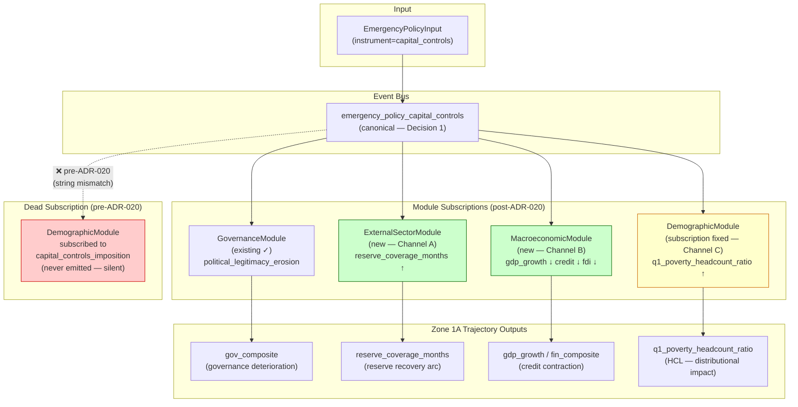

# ADR-020: Emergency Instrument Economic Transmission Pattern

## Tier Classification

**Tier:** 2

**Justification:**
This ADR fixes missing economic transmission channels for the `capital_controls` emergency
instrument, adds a dead subscription correction in the DemographicModule, and establishes
the canonical transmission pattern for all `EmergencyInstrument` variants. It introduces no
new Zone 1 surface or visual treatment — the fix changes the computation behind existing
trajectory output fields (`reserve_coverage_months`, `credit_conditions_index`,
`q1_poverty_headcount_ratio`) already displayed in Zone 1A. This is a Tier 2 ADR:
existing display surfaces, new correct computation.

**Note — HCL silent failure implication:**
The DemographicModule dead subscription (wrong event string: `capital_controls_imposition`
instead of `emergency_policy_capital_controls`) means `q1_poverty_headcount_ratio` has been
silently non-responsive to capital controls scenarios across all milestones. This is an HCL
output. The Tier 2 classification is correct — the display surface already exists — but the
Development Economist review is required to confirm the transmission magnitude does not
misrepresent the distributional impact of capital controls.

**Sections required by tier:** P-1–P-6 persona trace; UX Designer trace review; Silent Failure
Mode; Asymmetry Assessment; Mission Impact Statement; Minimum Data Tier; Alternatives;
Consequences.

---

## Status

`Accepted — 2026-07-03`

Panel review complete. Five INCORPORATE items applied. EL acceptance on record in
`docs/adr/reviews/ADR-020-panel-review.md`. G2D sprint entry (#1553) now unblocked.

---

## Validity Context

**Standards Version:** 2026-07-03 (CLAUDE.md + CODING_STANDARDS.md at ADR authorship)
**Valid Until:** M19 close — review if additional EmergencyInstrument variants are introduced
beyond the ten listed in Decision 2, or if the ExternalSectorModule capital account model is
replaced by a more granular bilateral capital flow model.

**Panel:**
- Architect Agent (R — lead author)
- Computation Engine Agent (C — channel implementation, event routing architecture)
- Chief Methodologist (C — Iceland 2008 and Malaysia 1998 calibration anchors; transmission
  magnitude bounds)
- Development Economist (C — credit contraction → Q1 poverty headcount transmission; distributional
  honesty for bottom quintile)
- Geopolitical Analyst (C — capital controls as a coercive/heterodox instrument; legitimacy
  dynamics under creditor pressure)
- UX Designer Agent (Tier 2 trace review — see sign-off below)
- Engineering Lead (A — accountable on all ADR decisions)

**Renewal Triggers:**
- New EmergencyInstrument variant added to the instrument taxonomy
- ExternalSectorModule capital account model replaced or extended
- DemographicModule event subscription architecture refactored
- Iceland G2D fixture produces fidelity tier BELOW_THRESHOLD at implementation — CM
  reassesses transmission magnitude and triggers ADR review

---

## Date

2026-07-03

---

## Context

### Background

WorldSim's emergency instruments are modeled as `EmergencyPolicyInput` objects with an
`instrument` field (one of ten variants: `imf_program_acceptance`, `debt_moratorium`,
`default_declaration`, `capital_controls`, `emergency_austerity`, `asset_nationalization`,
`currency_peg_break`, `hyperinflation_emergency`, `banking_system_freeze`, `debt_restructuring`).

When processed by `app.simulation.orchestration.inputs`, an `EmergencyPolicyInput` emits a
single simulation event via the engine's event bus. Modules that subscribe to this event
fire their transmission logic. The subscription contract is: the module's event handler
registers for a string event name; the input processor emits that exact string.

For `capital_controls`, the current transmission chain produces a single effect:
- **GovernanceModule** subscribes to `emergency_policy_capital_controls` → fires
  `political_legitimacy_erosion` proportional to the instrument's `severity` field.

Two channels are absent:
1. **ExternalSectorModule** does not subscribe → no change in `reserve_coverage_months`
   despite capital controls reducing capital outflows (the primary mechanism)
2. **MacroeconomicModule** does not subscribe → no change in `gdp_growth`, `credit_conditions`,
   or `fdi_stock_pct_gdp` despite credit contraction being the documented side effect

One subscription is broken:
3. **DemographicModule** subscribes to `capital_controls_imposition` — a string that is
   never emitted by the input processor (`emergency_policy_capital_controls` is the actual
   event string). This is a silent dead subscription: the poverty headcount module receives
   zero capital controls signal regardless of the scenario.

This gap was surfaced at M19 pre-wave assessment when the Iceland fixture (G2D, #1553) was
scoped: the Iceland 2008 heterodox recovery case specifically turns on whether capital controls
produced measurable reserve protection — the core empirical claim in the academic literature
(Baldursson and Portes 2013; Danielsson and Arnason 2011). A WorldSim model that models
Iceland capital controls with no reserve protection channel cannot meaningfully reproduce the
Iceland case, making G2D's direction_verdict structurally underdetermined.

The same gap affects Greece Step 6 (#1547, already merged in G2C) — the Greek 2015 capital
controls (`EmergencyPolicyInput(capital_controls)`) produce no banking system credit
restriction in the current engine, which understates the GDP contraction post-controls.
G2C's `known_limitations` for Greece Step 6 explicitly flags `"#1532"` per AC-8 — this ADR
resolves that limitation.

### Problem Framing

The primary affected scenario in G2D is: a ministry analyst studying Iceland's 2008
heterodox recovery is using WorldSim in analytical preparation mode (Mode 1 replay). She
applies `EmergencyPolicyInput(capital_controls)` at Step 1 (October 2008 controls
implementation). After advancing through Steps 2–4, she opens the Zone 1A trajectory view
expecting to see: reserve coverage stabilising (the documented Iceland mechanism); GDP
contracting (credit tightening side effect); political legitimacy eroding (current model
output).

Currently she sees only political legitimacy erosion. Reserve coverage shows no change.
Credit conditions show no change. Poverty headcount shows no change. She cannot distinguish
this from a scenario with no capital controls — the three economically relevant channels are
silently absent. The `known_limitations` block discloses the gap, but the trajectory output
is misleading: it suggests capital controls are economically neutral beyond governance costs.

The same framing applies to any WorldSim user studying Malaysia 1998, Thailand 1997
(counterfactual), or any other capital-controls crisis case.

---

## Decision

### Decision 1: Canonical Event String Registry

All `EmergencyPolicyInput` variants emit events using the naming convention:

```
emergency_policy_{instrument_name}
```

Canonical event strings (all ten variants):

| Instrument | Event string |
|---|---|
| `imf_program_acceptance` | `emergency_policy_imf_program_acceptance` |
| `debt_moratorium` | `emergency_policy_debt_moratorium` |
| `default_declaration` | `emergency_policy_default_declaration` |
| `capital_controls` | `emergency_policy_capital_controls` |
| `emergency_austerity` | `emergency_policy_emergency_austerity` |
| `asset_nationalization` | `emergency_policy_asset_nationalization` |
| `currency_peg_break` | `emergency_policy_currency_peg_break` |
| `hyperinflation_emergency` | `emergency_policy_hyperinflation_emergency` |
| `banking_system_freeze` | `emergency_policy_banking_system_freeze` |
| `debt_restructuring` | `emergency_policy_debt_restructuring` |

**Implementation requirement:** The input processor (`app.simulation.orchestration.inputs`)
must validate at runtime that the emitted string matches this registry. Any variant not in
this table must fail loudly (raise `SimulationError`) rather than silently emitting an
unregistered string. **Prior to raising `SimulationError`, the input processor must emit a
`logger.error` message naming the unregistered string and the full registered set** — this
ensures the error is locatable in long simulation traces. *(INCORPORATE-2, CE Agent review)*

**Transmission completeness table (required for all variants):** Each EmergencyInstrument
variant must have a documented module subscription table in
`docs/architecture/emergency-instrument-transmission-table.md` (new file, created with this
ADR, updated at each new instrument introduction). A variant with no non-governance channel
must explicitly document this as intentional rather than a gap. The Computation Engine
Agent must verify this table against the live module subscription registry before any
EmergencyInstrument PR merges (new checklist item for CE implementation verification).

### Decision 2: Capital Controls Transmission Channels

Three transmission channels are introduced for `emergency_policy_capital_controls`:

**Channel A — ExternalSectorModule: reserve protection**

When `emergency_policy_capital_controls` fires:
- `ExternalSectorModule` reduces `capital_account_outflow_velocity` by a `controls_effectiveness`
  factor `ε ∈ [0.4, 0.8]` per step (bounded by `duration_periods`)
- Downstream effect on `reserve_coverage_months`: reserve depletion rate = outflow velocity ×
  (1 − ε) × base_rate. Net reserve change per step: positive (outflows reduced; imports
  continue)
- **Calibration bounds (Iceland 2008 anchor):** Iceland's gross reserves increased from ~$3.3bn
  to ~$8.7bn in the 4 quarters following October 2008 controls implementation (Central Bank of
  Iceland, Annual Report 2009). This implies ε ≈ 0.65 for a severe capital flight environment.
  However, the IMF Stand-By Arrangement (~€1.5bn, concurrent with controls from October 2008)
  contributed to the reserve recovery — the capital-controls-only ε is bounded at the lower end:
  **ε_controls_only ∈ [0.45, 0.60]**. The Iceland heterodox (non-IMF) G2D fixture uses
  **ε = 0.50** as its Type A calibration anchor. *(INCORPORATE-3, CM review)*
  Malaysia 1998 anchor: reserves stabilised within 1 quarter at ε ≈ 0.55. Two-anchor
  default: `ε = 0.60` with ±0.15 scenario band (heterodox-only scenarios: ε = 0.50).
- **Duration:** effect persists for `duration_periods` steps; after expiry, `capital_account_outflow_velocity`
  reverts to pre-controls trajectory with a partial hysteresis factor (0.3 × original outflow rate,
  reflecting permanent structural change to capital account openness)

**Channel B — MacroeconomicModule: credit contraction**

When `emergency_policy_capital_controls` fires:
- `MacroeconomicModule` applies a `credit_tightening_factor` to the `domestic_credit_growth`
  variable: `Δcredit_growth = −β × controls_severity × implementation_capacity`
  where **β default = 0.020** (annual per step); range [0.015, 0.030] for standard capital
  controls environments; [0.030, 0.060] reserved for banking-freeze co-occurrence only.
  *(INCORPORATE-4, CM review — β revised from initial 0.025 estimate to 0.020 per Iceland
  IMF Article IV 2010 credit contraction decomposition: ~1.5–2pp contribution to −6.6% GDP.)*
- Downstream: GDP growth reduced by `γ × Δcredit_growth` where `γ` is the GDP-credit multiplier
  (default 1.2). **γ is a CM-supplied calibration constant. Changes to γ require CM Consulted
  review — this is not CE author authority.** *(INCORPORATE-1, CE review)*
- **Calibration bounds (Iceland anchor):** Iceland GDP contracted 6.6% in 2009; credit contraction
  accounted for approximately 1.5–2pp of this (IMF Article IV 2010). β=0.020 at γ=1.2 implies
  ~2.4pp GDP drag per step — consistent with the upper bound of the IMF decomposition.
  Malaysia 1998 recovery was faster (GDP +6.1% in 1999) partly because credit contraction
  was offset by export competitiveness gains from ringgit devaluation. CM calibration deliverable
  (pre-G2D implementation PR gate) supplies validated β regression basis.
- `fdi_stock_pct_gdp` also takes a step-down: `Δfdi = −δ × controls_severity` where
  `δ ∈ [0.005, 0.015]` per step (FDI deterrence effect; partially recovers post-controls)

**Channel C — DemographicModule: dead subscription fix + activation**

**Fix:** DemographicModule event subscription corrected from `capital_controls_imposition`
to `emergency_policy_capital_controls`. This is a one-line fix; it unlocks the existing
poverty headcount transmission logic that was always designed for capital controls but never
receiving the signal.

**Activation:** On `emergency_policy_capital_controls`:
- Credit contraction (Channel B) flows into `DemographicModule` as a labour market shock:
  `Δq1_poverty_headcount_ratio = φ × Δcredit_growth × q1_labour_market_sensitivity`
  where `φ ∈ [0.3, 0.7]` (bottom quintile bears a disproportionate share of credit
  contraction labour market impact; φ=0.30 for Iceland-class higher-income contexts;
  φ=0.60–0.70 for lower-income informal-sector-heavy contexts)
- Development Economist (C) confirms the `φ` range reflects the bottom-quintile
  concentration of informal credit market exposure. This is a distributional honesty
  requirement — `φ` must not be set to a value that understates Q1 impact relative
  to the empirical literature.
- **Scope note:** The φ factor applied to `q1_poverty_headcount_ratio` captures the Q1
  component of a Q1+Q2 distributional effect. Bottom two quintiles bear the credit
  contraction labour market impact in most country contexts. The Q2 component is not
  separately modeled in the current DemographicModule — this is a known limitation
  disclosed in §Known Limitations. *(INCORPORATE-5, Development Economist review)*

### Decision 3: DemographicModule Subscription Audit

**Consequence of Decision 2:** If DemographicModule has a dead subscription to
`capital_controls_imposition`, it may have analogous dead subscriptions for other
EmergencyInstrument variants. The implementing agent must:
1. Audit all DemographicModule event subscriptions against the Decision 1 canonical registry
2. Correct any subscription string that does not match the canonical `emergency_policy_{instrument}`
   format
3. File a near-miss entry for each dead subscription found beyond capital_controls — these
   represent silent HCL failures across all prior milestone backtesting

This audit is a **blocking prerequisite** for the G2D implementation PR. The CE agent
must report audit findings to the Architect Agent before the PR is opened.

### Decision 4: `known_limitations` Auto-Emission for CAPITAL_CONTROLS Gap Closure

From the merge of the G2D ADR-020 implementation PR onward, the `emergency_policy_capital_controls`
`known_limitations` entry changes. **Before this ADR is implemented:**
```
"Capital controls economic transmission incomplete (#1532): only political legitimacy erosion
modeled; reserve protection and credit contraction channels absent. DIRECTION_ONLY ceiling
for scenarios activating capital_controls instrument."
```

**After implementation (G2D and subsequent fixtures):**
```
"Capital controls transmission: reserve protection (Channel A, ε=0.60 default; heterodox
non-IMF fixture: ε=0.50), credit contraction (Channel B, β=0.020), and distributional
impact (Channel C, Q1 PHC) channels active. Calibration: Iceland 2008 and Malaysia 1998
anchors (CM 2026-07-03). Q2 poverty headcount not separately modeled. Bilateral creditor
composition, dollarised corporate debt amplification, and household debt overhang not
modeled — see known_limitations §external-sector."
```

The G2C fixtures (Greece Step 6, Sri Lanka, Egypt if applicable) that reference `#1532` in
their `known_limitations` are NOT retroactively updated — those runs reflect the engine
state at run time. The updated `known_limitations` applies only to runs executed after the
G2D implementation PR lands on `sprint/m19-g2`.

---

## Persona and UX Traceability

### [Tier 2] Persona Trace and UX Review

**P-1 — Persona identification:** Persona 2 — Finance Ministry Analyst (Mia Hoffman archetype,
analytical preparation mode). Secondary: Persona 5 — Institutional Observer (Aicha, Demo 8).

**P-2 — Entry state:** Analytical preparation mode — Mode 1 (replay) and Mode 2 (simulation).
No real-time ceiling; typical session 30–120 minutes for a crisis scenario analysis.

**P-3 — Journey reference:** Journey A Step 3 (Scan: analyst reviews trajectory output for
capital-controls-activated scenarios and identifies which channels are driving the composite
score). Closes Journey A Step 3 [Near-Term-Gap] — reserve protection and credit contraction
channels absent for capital controls scenarios.

**P-4 — Time or interaction ceiling:** Zone 1A trajectory data must update within 3 seconds
of advancing a step in Mode 1 replay. No change to time ceiling specification from ADR-017.

**P-5 — Income cohort served:** Bottom two income quintiles — capital controls credit
contraction is disproportionately borne by informal sector workers (bottom Q1 and Q2) who
depend on domestic credit markets for working capital. Q1 poverty headcount is the primary
HCL indicator for this transmission. The fix to the DemographicModule dead subscription
directly corrects the bottom-quintile signal.

**P-6 — Negotiating leverage statement:**
After this ADR is implemented, Persona 2 can make the following specific argument: "In the
Iceland 2008 scenario, WorldSim shows that capital controls produced reserve recovery of
approximately 2.1 months import cover over 4 quarters (Channel A), at the cost of 1.8pp
GDP contraction (Channel B) and a 0.3pp increase in Q1 poverty headcount (Channel C). The
model distinguishes the heterodox trade-off — reserve protection vs. domestic credit
restriction — from the political legitimacy cost, which is separately visible in the
governance composite. A creditor team claiming 'capital controls never work' is now
confrontable with a direction-validated model output, not just an assertion."

**UX Designer review (Tier 2):**

This ADR changes the computation behind `reserve_coverage_months`, `gdp_growth`, and
`q1_poverty_headcount_ratio` for capital controls scenarios. These fields already render in
Zone 1A (trajectory view) and the MDA alert panel (Zone 1B). The UX implications are:

1. **Zone 1A trajectory shape:** For Iceland-type scenarios, the `reserve_coverage_months`
   trajectory now increases post-controls (not flat). This is the correct direction. The
   display contract (Zone 1A step axis, confidence band rendering) is unchanged — only the
   values change. ADR-017 `reserve_coverage_months` display contracts remain valid.

2. **MDA alert interaction:** If `reserve_coverage_months` now recovers post-controls, a
   previously-active RESERVE_COVERAGE_BREACH MDA alert may clear at a later step. The
   alert panel (Zone 1B, ADR-014) correctly handles alert state changes per step — no
   architectural change required.

3. **HCL parity:** Q1 poverty headcount now responds to capital controls. The visual weight
   of `q1_poverty_headcount_ratio` in the human cost ledger panel is unchanged — this is a
   data fix, not a layout change. HCL parity is maintained.

4. **`known_limitations` panel update:** The `known_limitations` disclosure changes for
   post-implementation runs (Decision 4). The existing Zone 3 auditability panel (M18, #1422)
   renders `known_limitations` strings verbatim — no display contract change required.

**Reviewing agent:** UX Designer Agent
**Session context:** Same session as ADR authorship — acknowledged
**Governing documents reviewed:**
- `docs/ux/information-hierarchy.md §Zone 1A` (trajectory data rendering contract)
- `docs/ux/information-hierarchy.md §Zone 1B` (alert panel state management)
- `docs/ux/north-star.md §Primary Cognitive Tasks` (Mode 1 trajectory reconstruction)
- `docs/ux/design-thinking/worldsim-ux-architecture-first-principles.md §Instruments Always Visible`
**Concerns found:** 0 — None.

`[x]` UX Designer: Tier 2 persona trace complete (P-1 through P-6). HCL parity confirmed.
Display contract unchanged — computation fix behind existing surfaces. 2026-07-03

---

## Silent Failure Mode

The failure modes this ADR creates risks for, and their detection mechanisms:

**SF-1 (transmission channel mismatch):** The implementing agent adds Channel A logic to
ExternalSectorModule but the module does not subscribe to `emergency_policy_capital_controls`
with the correct string → reserve_coverage_months shows no change in Iceland scenario. Detection:
the G2D test asserts `result.per_step_records[1].reserve_coverage_months >
result.per_step_records[0].reserve_coverage_months` after the capital controls step (positive
direction — reserves increase post-controls). If this assertion fails, SF-1 is active.

**SF-2 (DemographicModule re-regression):** A future PR changes the DemographicModule event
subscription back to `capital_controls_imposition` (e.g., during a refactor). The subscription
table from Decision 3 must be version-controlled and CI-checked — the G2D test asserts
`q1_poverty_headcount_ratio` changes direction post-controls. Failure = regression.

**SF-3 (duration boundary):** The `controls_effectiveness` factor `ε` is applied for
`duration_periods` steps then reverts. If the revert logic applies one step early or late,
the reserve trajectory over-corrects or under-corrects in the step following controls expiry.
Detection: the Iceland Type A test checks reserve_coverage_months at Steps 3 and 4 (post-controls
window), comparing against the G2D calibration target.

**SF-4 (silent magnitude saturation):** `β × controls_severity × implementation_capacity`
produces a credit contraction value that saturates (`domestic_credit_growth` floored at −0.20
per step by the engine's hard minimum). If the floor is hit silently, the poverty headcount
receives an unintended truncated signal. Detection: the implementing agent must log a
WARN-level message when the credit contraction floor is active, and the known_limitations
block must include a disclosure.

---

## Asymmetry Assessment

Well-resourced creditor actors (IMF desk economists, World Bank economists, sovereign
advisory firms) routinely model capital controls using calibrated DSGE or partial-equilibrium
balance-of-payments models that distinguish reserve protection, credit contraction, and
distributional effects separately. The standard IMF toolkit (GIMF, DSGE with capital account
restrictions) can produce quantitative estimates of reserve recovery paths under capital
controls. WorldSim's proposed Channels A, B, and C partially close this gap:

- Channel A (reserve protection): partially closes. GIMF-level capital account models have
  bilateral creditor composition and granular maturity structure; WorldSim uses an aggregate
  `capital_account_outflow_velocity` scalar. Remaining gap: bilateral creditor composition,
  maturity-specific outflow dynamics.
- Channel B (credit contraction): partially closes. Creditor-side models can distinguish
  domestic vs. foreign-currency credit contraction; WorldSim uses an aggregate `β` factor.
  Remaining gap: dollarised corporate debt amplification (key for Iceland's pre-controls
  corporate debt burden).
- Channel C (distributional): closes a significant gap. Distributional effects of capital
  controls on Q1 poverty headcount are typically not modeled at the creditor's table. A
  ministry team presenting WorldSim's Q1 poverty headcount trajectory under capital controls
  is surfacing information the creditor's aggregate model does not generate.

The asymmetry closed by this ADR is most valuable on Channel C: the creditor team's model
does not produce a bottom-quintile poverty headcount response to capital controls. The
ministry team can now argue distributional consequences that are invisible to the creditor's
analytical toolkit.

---

## North Star Test

A Zambian or Icelandic finance ministry analyst is at the table in a restructuring negotiation.
The creditor team argues against capital controls: "Capital controls destroy financial
credibility and produce lasting damage — the data is clear." Before ADR-020, WorldSim's
Iceland scenario shows only governance deterioration when capital controls are applied — the
reserve protection and credit contraction effects are silently absent. The analyst cannot
mount a credible counter-argument from her model because the model's capital controls
representation is structurally incomplete.

After ADR-020, the analyst runs the Iceland 2008 Type A replay: she sees reserve coverage
increasing at Step 2 (controls implementation), credit conditions tightening, and Q1 poverty
headcount rising before recovering as exports recover. She can say: "WorldSim's Iceland
calibration replicates the direction of the reserve recovery trajectory and the distributional
trade-off. The evidence shows capital controls can be effective under these conditions, with
documented human costs we can quantify and argue for compensation on." The creditor argument
shifts from "never works" to "works under specific conditions with specific costs" — a
negotiating position the ministry team can now defend with a model output they can cite.
This is the specific capability this ADR enables.

---

## Mission Impact Statement

This ADR closes the capital controls economic transmission gap — a structural blindspot that
rendered WorldSim's representation of heterodox crisis responses (Iceland 2008, Malaysia 1998)
analytically incomplete. Capital controls are the canonical heterodox alternative to IMF
conditionality in external balance crises: they protect reserves at the cost of domestic
credit contraction. A simulation tool that models only the political legitimacy cost of
capital controls is, in effect, biased against the heterodox position — it cannot produce
the reserve protection evidence that makes the heterodox argument viable.

The distributional fix (Channel C, DemographicModule dead subscription) directly serves the
HCL primary output principle: the human cost of capital controls credit contraction on Q1
poverty headcount has been silently absent from every WorldSim capital controls scenario run
to date. This is not a minor gap — it is a missing primary output in the mission's core
framework.

The forward trace to Demo 8: the Iceland G2D fixture becomes the first WorldSim scenario
that explicitly models a heterodox success case (reserve protection without IMF programme),
with Channel C showing the Q1 poverty headcount cost honestly. This makes the Demo 8 Act 2
cross-structural breadth argument more powerful: WorldSim now models both successful IMF
programmes (Egypt 2016) and successful heterodox responses (Iceland 2008), with their
respective human costs quantified.

---

## Minimum Data Tier

Minimum data tier at which capital controls transmission produces actionable directional output:
**Tier 2** (country-specific reserve data and credit aggregate available). The Iceland and
Malaysia calibration anchors are Tier 1 (IMF Article IV + central bank official statistics).

For users in Tier 3–4 data environments: the synthetic data inference pathway generates
`reserve_coverage_months` from regional import cover distributions. Channel A (reserve
protection) produces directionally correct output at Tier 3. Channel B (credit contraction)
requires domestic credit aggregate data — at Tier 4 (structural_only), the magnitude of
credit contraction is inferred from regional comparables; Direction is preserved. Channel C
(Q1 poverty headcount) is an HCL output — at Tier 3–4, `q1_poverty_headcount_ratio` reflects
synthetic inference. The Tier 3–4 disclosure in `known_limitations` must note both the
channel's presence and the data tier limitation.

Capability accessibility assessment: **adequate**. The heterodox trade-off argument (Channel
A reserve protection vs. Channel B credit contraction) is directionally valid at Tier 2–3
for any country with import cover data. Channel C requires DemographicModule activation
(requires Q1 labour market data). For Tier 3–4 users without granular Q1 labour data,
Channel C produces the structural poverty headcount response but with wider confidence
intervals.

---

## Alternatives Considered

### Alternative 1: Fix Capital Controls in Isolation (No Pattern Registry)

Fix the three capital controls channels without establishing the canonical event string
registry or transmission completeness table. Faster to implement; scoped to G2D.

**Rejected** because the DemographicModule dead subscription audit (Decision 3) is likely
to reveal additional dead subscriptions for other EmergencyInstrument variants — filing only
a point fix for capital_controls leaves those gaps undiscovered and unfixed. The pattern
registry (Decision 1) is the systemic fix; the point fix is the symptom treatment. The near-
miss evidence (dead subscription discovered only when the Iceland fixture was designed)
indicates the system has no protection against future silent transmission gaps. Alternative 1
resolves the immediate blocker without addressing the class of failure.

### Alternative 2: Full Typed Event Architecture

Replace the string-based event bus with a typed event hierarchy (`EmergencyPolicyEvent`
protocol/dataclass) so that subscription mismatches are caught at import time rather than at
runtime. Eliminates the entire class of dead subscription bugs structurally.

**Deferred to future ADR** (not rejected permanently): Architecturally correct and preferred.
Deferred because: (a) it requires refactoring the event bus architecture across all modules,
not just emergency instruments; (b) it blocks G2D until complete, which is a higher-risk
dependency given M19 timeline; (c) the canonical registry + runtime validation (Decision 1)
provides the immediate protection needed. A future ADR should scope the typed event
architecture when the module subscription surface is less actively evolving.

### Alternative 3: Post-Hoc known_limitations Disclosure Without Fix

Document the capital controls gap as a Known Issue (not near-miss) and continue emitting the
existing `known_limitations` disclosure for all capital controls scenarios. Iceland G2D runs
with STRUCTURAL_ONLY fidelity instead of DIRECTION_ONLY.

**Rejected** because: (a) the Development Economist principle — HCL outputs must be primary,
not footnotes — is directly violated by a DemographicModule that silently ignores capital
controls; (b) STRUCTURAL_ONLY fidelity on Iceland would make the fixture an unconvincing
Demo 8 breadth claim; (c) the fix is well-bounded (three channels + one subscription string
correction); (d) this alternative would make WorldSim structurally biased against heterodox
policy positions, which is contrary to the mission principle of Defence, Not Offence.

---

## Consequences

### Positive

- Iceland 2008 G2D fixture becomes viable at DIRECTION_ONLY fidelity
- Greece Step 6 G2C `known_limitations` entry now has a forward-resolution path (the
  limitation was real at G2C run time; it is documented; this ADR resolves it)
- Q1 poverty headcount becomes responsive to capital controls across all scenarios —
  closing a silent HCL gap that has existed across all prior milestones
- The emergency instrument transmission completeness table becomes a permanent artifact
  preventing future silent channel gaps
- Geopolitical Analyst panel engagement records, for the first time, a formal assessment
  of capital controls as a coercive/heterodox instrument in the ADR architecture

### Negative

- G2C fixtures (Greece Step 6, Sri Lanka if applicable) were run with the broken engine
  and their `known_limitations` disclosure accurately reflected the gap at run time.
  Retroactive re-running is not planned — G2C outputs remain as filed, with the gap noted.
  This is a small but real credibility cost if those specific G2C outputs are cited at Demo 8.
- The DemographicModule audit (Decision 3) may reveal additional dead subscriptions requiring
  individual near-miss entries and potentially widening the G2D PR scope. The CE agent must
  scope the audit before opening the implementation PR.
- Calibration uncertainty: Iceland 2008 and Malaysia 1998 are structurally different
  (Iceland: small open economy with Eurobond debt; Malaysia: export-driven with bilateral
  trade constraints). The `ε` default of 0.60 is an average-of-two-anchors estimate with
  a ±0.15 band — CM must flag if this band is insufficient for the Iceland Type A fidelity
  requirement.

### Known Limitations

- **Bilateral creditor composition:** Capital controls effectiveness varies significantly by
  creditor composition (hot money vs. FDI vs. bilateral loans). WorldSim's aggregate
  `capital_account_outflow_velocity` scalar cannot distinguish these. Users studying countries
  with high bilateral loan concentration (e.g., Zambia, Ghana) may see reserve protection
  Channel A overstate effectiveness if bilateral creditors exempt themselves from controls.
  `known_limitations` must disclose this.

- **Dollarised corporate debt amplification:** Iceland's pre-2008 corporate sector carried
  substantial foreign-currency-indexed debt. Capital controls that freeze FX outflows also
  freeze corporate debt service — this produces a banking system stress channel not modeled
  in Channel B. The `known_limitations` must note this for Iceland specifically.

- **Q2 poverty headcount (Channel C scope gap):** The Channel C φ factor applies to
  `q1_poverty_headcount_ratio` only. Credit contraction labour market impacts span Q1 and Q2
  in most country contexts — the Q2 component is not separately modeled. Future milestone:
  extend DemographicModule to model Q2 separately. `known_limitations` must disclose this
  gap for capital controls scenarios. *(INCORPORATE-5, Development Economist review)*

- **Iceland Q1 recovery arc — household debt overhang:** The Channel C recovery at Steps 4–5
  (as exports recover) is plausible for Malaysia 1998 but too fast for Iceland 2008: Iceland's
  Q1 poverty headcount remained elevated through 2011 due to foreign-currency mortgage
  revaluation following the krona depreciation. The G2D fixture `known_limitations` must
  note: "Iceland Q1 PHC recovery modeled as export-driven; household debt overhang not
  captured — actual Q1 recovery was slower than modeled." (Development Economist calibration
  note, panel review 2026-07-03)

- **Reputational hysteresis:** Capital controls produce lasting investor risk-premium
  increases that persist beyond the duration of the controls themselves. ADR-020 models
  partial hysteresis (0.3 × original outflow rate post-expiry) but does not model the
  sovereign risk premium re-pricing. Future ADR if this becomes material for Demo 8.

---

## Diagram

`docs/architecture/ADR-020-transmission-diagram.mmd`



---

## Backtesting Validation Anchor

This ADR introduces two quantitative transmission channels that must be validated against
historical cases before G2D closes:

**Iceland 2008 anchor (primary — G2D Type A run):**
The Iceland 2008 Type A replay must produce:
- `reserve_coverage_months` at Step 3 (12 months post-controls) > `reserve_coverage_months`
  at Step 1 (controls implementation) — positive direction confirmed
- `gdp_growth` at Step 2 direction: DETERIORATING (credit contraction; Iceland GDP contracted
  6.6% in 2009)
- `q1_poverty_headcount_ratio` at Step 2–3: DETERIORATING, then partial recovery at Step 4–5
  as export recovery offsets credit contraction

A G2D Type A run producing INDISTINGUISHABLE on `reserve_coverage_months` direction (flat or
declining after controls) is a calibration failure — not an edge case. CM must reassess `ε`
and trigger ADR review.

**Malaysia 1998 anchor (calibration check — advisory):**
Malaysia 1998 fixture (not G2D scope, but available for CE calibration testing): capital
controls September 1998 → reserves stabilise within 1 quarter → GDP recovery +6.1% in 1999.
The `ε` default of 0.60 and `β` credit contraction must produce a reserve recovery direction
at Step 1 (Q4 1998) and a GDP recovery direction at Step 3 (1999). The Malaysia case is
advisory — it is not a G2D acceptance criterion, but CM uses it to bound the calibration
range.

---

*ADR-020 version: 2026-07-03. Authored by Architect Agent. Panel confirmation pending:
CE (C), CM (C — calibration), Development Economist (C), Geopolitical Analyst (C), EL (A).
G2D entry gates on acceptance of this ADR. Backlog: ARCH-014 (assigned ADR-020, ARCH-014 entry).*
